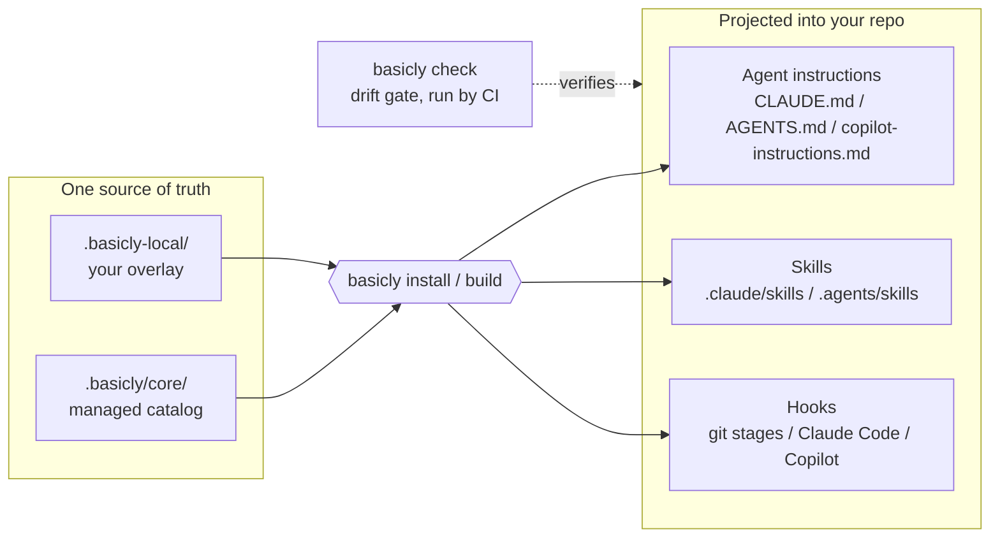

<div align="center">


# basicly

**One command installs a complete coding-agent harness — instructions, skills, and gates — projected from a single catalog.**

[](https://github.com/niksavis/basicly/releases/latest)
[](https://github.com/niksavis/basicly/actions/workflows/quality-gates.yml)
[](https://github.com/niksavis/basicly/actions/workflows/basicly.yml)
[](pyproject.toml)
[](LICENSE)

</div>

## What is basicly?

Coding agents read guidance from many places — `CLAUDE.md`, `AGENTS.md`,
`.github/copilot-instructions.md`, skill folders, hook configs — and keeping
them consistent by hand does not scale. `basicly` fixes that with one catalog
and a projector:

- **Suggestive guidance** — instructions, skills, and policy fragments a model
  reads. Authored once as YAML, projected into every format your agents expect.
- **Deterministic gates** — git hook scripts that mechanically block a bad
  commit or push, whether or not the guidance was followed.
- **Projection tooling** — the `basicly` CLI that generates, verifies, and
  upgrades all of the above in any consumer repo.

Think of it as Lego bricks for agent enablement: pick the blocks, install them
with one command, and let `basicly check` keep them from drifting.

## Quick start

### Install

Into any git repo, with [uv](https://docs.astral.sh/uv/) already on the machine:

```sh
uvx --from git+https://github.com/niksavis/basicly@v0.1.3 basicly install
```

No `uv` or Python yet? The bootstrap shim installs `uv` first, then runs the
same command:

```sh
curl -fsSL https://raw.githubusercontent.com/niksavis/basicly/main/.scripts/bootstrap.sh | sh
```

Windows (PowerShell):

```powershell
powershell -ExecutionPolicy Bypass -Command "irm https://raw.githubusercontent.com/niksavis/basicly/main/.scripts/bootstrap.ps1 | iex"
```

Pin `@v0.1.3` for reproducible installs, or track `@main` for the latest. To
pin through the shim, append `-s -- --ref v0.1.3` (POSIX) or download the
script and pass `-Ref v0.1.3` (PowerShell).

### Upgrade

Re-run the install command with the new pin — install is idempotent and
converges the repo to the selected version. There is no separate `update`
command.

### Uninstall

One command removes everything basicly manages; your overlay and
`basicly.toml` survive:

```sh
uvx --from git+https://github.com/niksavis/basicly@v0.1.3 basicly uninstall
```

Add `--purge` to also remove the user overlay, `basicly.toml`, and the
scaffolded VS Code tasks/CI workflow (only when still unedited).

## What install gives you

- The managed core catalog under `.basicly/` (fragments, skills, hook scripts).
- Generated agent instruction files (`CLAUDE.md`, `AGENTS.md`,
  `.github/copilot-instructions.md`) rendered from shared fragments.
- Projected skills at `.claude/skills/` and `.agents/skills/`.
- Activated hooks across three surfaces: git stages (pre-commit, commit-msg,
  pre-push — wired through the [pre-commit framework](https://pre-commit.com),
  whose config file is fixed at `.pre-commit-config.yaml`; the *tool* is named
  pre-commit, the file is not limited to that stage), Claude Code agent hooks,
  and Copilot agent hooks.
- A beads issue-tracker workspace, VS Code tasks, and a CI gates workflow.

Customize via YAML fragments in `.basicly-local/fragments/user/` — install
never touches them. Scope the catalog to your stack with
`--technologies` (for example `--technologies python,zsh`).

## How it works



The full design — directory contract, catalog model, verification pipeline —
lives in [`docs/architecture.md`](docs/architecture.md).

## Everyday commands

Day-to-day use needs nothing beyond `install` above. The scaffolded VS Code
tasks wrap the same pinned commands. To inspect or re-sync by hand, run these
from the consumer repo root with the same pin used to install:

```sh
uvx --from git+https://github.com/niksavis/basicly@v0.1.3 basicly check   # exit non-zero when generated files drifted
uvx --from git+https://github.com/niksavis/basicly@v0.1.3 basicly build   # regenerate agent instruction files
```

## Contributing to this repo

All commands run through `uv` in a checkout; the `basicly` entry point resolves
from the workspace, so no `PYTHONPATH` prefix is needed:

```sh
uv sync --group dev   # one-time: create the dev environment
uv run pre-commit install --install-hooks -t pre-commit -t commit-msg -t pre-push   # activate the git gates for all three stages
```

Core projector commands (fragments → agent instruction files):

```sh
uv run basicly list    # table of active fragments: id, category, priority, scope
uv run basicly build   # render generated files; --target <name> builds one target, --verify runs the catalog gate first and writes nothing on failure
uv run basicly check   # fail when generated files or the manifest drifted (what CI runs)
```

Skill projection commands (`skill.yaml` sources → `SKILL.md` at target roots):

```sh
uv run basicly skills-list    # table of skills in the catalog
uv run basicly skills-build   # project skills; --all-default-roots covers .claude/skills and .agents/skills, --root <dir> adds a custom root (repeatable)
uv run basicly skills-check   # fail when a projected SKILL.md is missing or stale
```

## License

[MIT](LICENSE).
