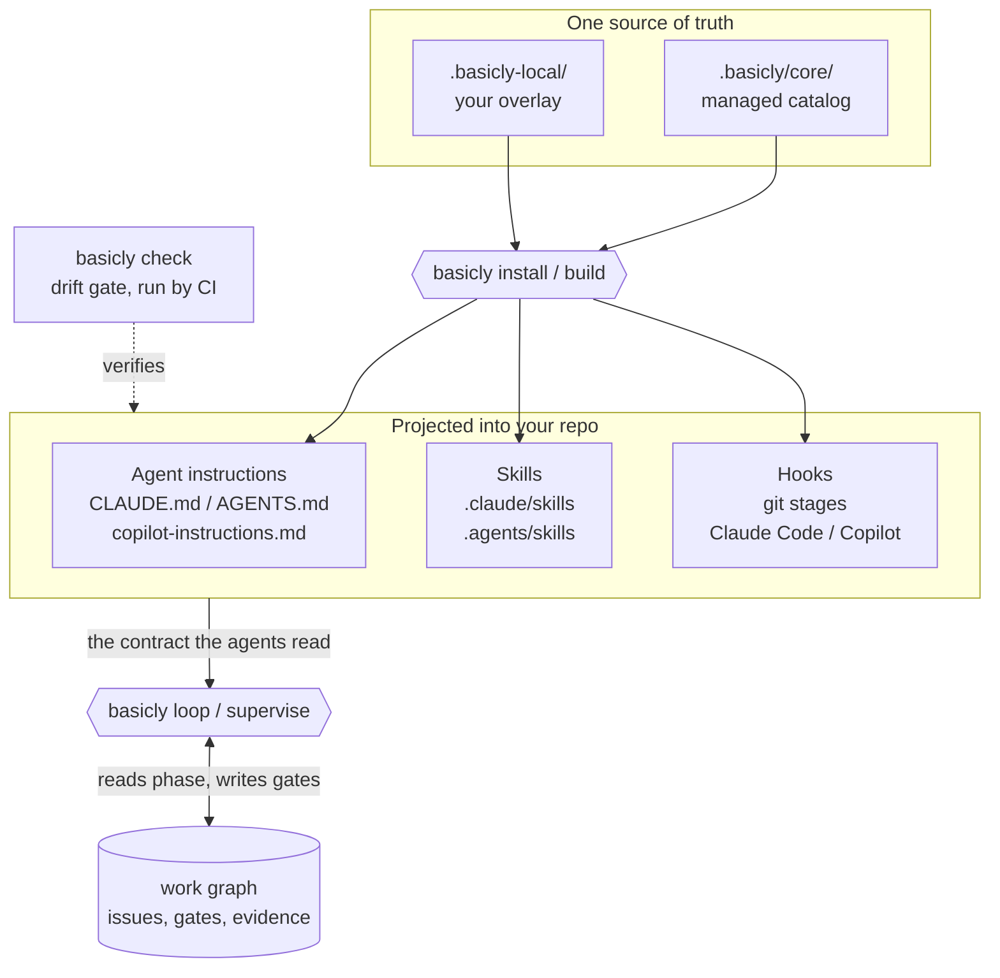

<div align="center">


# basicly

**A coding-agent harness that ships the workflow and the state, not just the instructions — one catalog projected into every agent's config, a deterministic loop that runs on it, and gates at commit time.**

[](https://github.com/niksavis/basicly/releases/latest)
[](https://github.com/niksavis/basicly/actions/workflows/quality-gates.yml)
[](https://github.com/niksavis/basicly/actions/workflows/basicly.yml)
[](pyproject.toml)
[](LICENSE)

</div>

## What is basicly?

Most agent harnesses ship instructions and skills. `basicly` also ships the
**workflow** and the **state** — a deterministic development loop, the work
graph it derives progress from, and git gates that hold whether or not the model
read the guidance.

Four pillars:

- **01 Guidance** — one versioned YAML catalog, projected into what each tool
  natively reads: `CLAUDE.md`, `AGENTS.md`, `.github/copilot-instructions.md`,
  skills, subagents, permissions. Edit one fragment and every target regenerates
  consistently. Your overrides live in an overlay that upgrades never touch.
- **02 Gates** — git hooks across pre-commit, commit-msg and pre-push, plus
  agent hooks and a verify pipeline. **Enforcement is at commit time, not only in
  CI**: a hook that refuses the commit is a different guarantee from a check that
  fails the build afterwards.
- **03 The loop** — one way to drive work, shipped as commands: intake, classify,
  decompose, build, verify, validate, ship — driven the same way under Claude,
  Codex or Copilot, and not the only way work gets done here. Work builds in an
  isolated worktree; run one track at a time, or fan out parallel lanes behind a
  serial merge queue.
- **04 The work graph** — issues, dependencies, gate results, checkpoints and
  evidence live in a tracked graph. The loop keeps no side-state: the phase a
  track sits in is *derived* from that graph, so a session can crash, compact, or
  hand over to a different agent family mid-track and the next command picks it
  up by re-reading it.

**The pillars are not a bundle of files.** The loop, and every headless agent it
dispatches, reads the artifacts pillar 01 emits — so the config layer's output
*is* the orchestrator's contract. That is why the same track can start on one
agent and finish on another, and it is what a projector alone or an orchestrator
alone cannot offer.

## Quick start

### Install

basicly requires **Python 3.14+** — for the CLI and for the projected hook
scripts that run inside your repo; older interpreters are not supported.
Into any git repo, with [uv](https://docs.astral.sh/uv/) already on the machine:

```sh
uvx --from git+https://github.com/niksavis/basicly@v0.11.0 basicly install
```

`uvx` is one of three ways to reach the same verb, not the command itself:
`uv run basicly install` works inside a checkout of basicly itself, and a bare
`basicly install` works once the executable is on `PATH` (put it there with
`uv tool install`). Install syncs the catalog into your repo; it never puts
`basicly` on `PATH`.

No `uv` or Python yet? The bootstrap shim installs `uv` first, then runs the
same command:

```sh
curl -fsSL https://raw.githubusercontent.com/niksavis/basicly/main/.scripts/bootstrap.sh | sh
```

Windows (PowerShell):

```powershell
powershell -ExecutionPolicy Bypass -Command "irm https://raw.githubusercontent.com/niksavis/basicly/main/.scripts/bootstrap.ps1 | iex"
```

Pin `@v0.11.0` for reproducible installs, or track `@main` for the latest. To
pin through the shim, append `-s -- --ref v0.11.0` (POSIX) or download the
script and pass `-Ref v0.11.0` (PowerShell). Where `git` is unavailable
(proxied or air-gapped environments), every
[release](https://github.com/niksavis/basicly/releases) attaches a built
wheel: download it and run `uvx --from ./basicly-*.whl basicly install`.

### Upgrade

Re-run the install command with the new pin — install is idempotent and
converges the repo to the selected version. There is no separate `update`
command.

### Uninstall

One command removes everything basicly manages; your overlay and
`basicly.toml` survive:

```sh
uvx --from git+https://github.com/niksavis/basicly@v0.11.0 basicly uninstall
```

Add `--purge` to also remove the user overlay, `basicly.toml`, and the
scaffolded VS Code tasks/CI workflow (only when still unedited).

## What install gives you

- The managed core catalog under `.basicly/` (fragments, skills, subagents, hook
  scripts).
- A model map at `.basicly/core/models/` — a subagent source declares a portable
  model tier (`low`, `medium`, `high`, `maximum`) rather than a provider model id,
  and the map records which concrete model that tier is per vendor and per
  surface, with that surface's own published cost and token limits. Plain JSON
  beside its schema, so any tool can read it.
- Generated agent instruction files (`CLAUDE.md`, `AGENTS.md`,
  `.github/copilot-instructions.md`) rendered from shared fragments.
- Projected skills at `.claude/skills/` and `.agents/skills/`, and subagents at
  `.claude/agents/` and `.github/agents/`.
- Activated hooks across three surfaces: git stages (pre-commit, commit-msg,
  pre-push — wired through the [pre-commit framework](https://pre-commit.com),
  whose config file is fixed at `.pre-commit-config.yaml`; the *tool* is named
  pre-commit, the file is not limited to that stage), Claude Code agent hooks,
  and Copilot agent hooks.
- An owned work tracker — an append-only event ledger under `.basicly/ledger/`, read
  and written by `basicly tracker` — plus VS Code tasks and a CI gates workflow.

Customize via YAML fragments in `.basicly-local/fragments/user/` — install
never touches them. Scope the catalog to your stack with
`--technologies` (for example `--technologies python,zsh`).

### Committer requirements

The projected git hooks run `uv run python ...`, so **every committer** to a
basicly-managed repo needs [uv](https://docs.astral.sh/uv/) on `PATH` and
Python 3.14+ — not just the person who ran install. `basicly hooks-check`
diagnoses a missing uv before it bites at commit time. The harness loop
(`basicly loop`) needs nothing further: the work tracker is an append-only event
ledger this repository owns and commits, so there is no binary to install and no
version to pin.

## How it works


```mermaid
flowchart TB
    subgraph sources["One source of truth"]
        core[".basicly/core/<br>managed catalog"]
        local[".basicly-local/<br>your overlay"]
    end
    cli{{"basicly install / build"}}
    core --> cli
    local --> cli
    subgraph outputs["Projected into your repo"]
        agents["Agent instructions<br>CLAUDE.md / AGENTS.md<br>copilot-instructions.md"]
        skills["Skills<br>.claude/skills<br>.agents/skills"]
        hooks["Hooks<br>git stages<br>Claude Code / Copilot"]
    end
    cli --> agents
    cli --> skills
    cli --> hooks
    gate["basicly check<br>drift gate, run by CI"] -. verifies .-> outputs
    loop{{"basicly loop / supervise"}}
    outputs -- "the contract the agents read" --> loop
    tracker[("work graph<br>issues, gates, evidence")]
    loop <-- "reads phase, writes gates" --> tracker
```

The edge from the projected outputs into `basicly loop` is the part that is easy
to miss, and it is drawn solid because it is load-bearing rather than advisory:
the loop does not carry its own copy of the rules. It dispatches headless agents
that read the same projected artifacts, so **the projection is the contract** —
and because the loop stores no side-state, phase is always re-derived from the
work graph.

The full design — directory contract, catalog model, verification pipeline —
lives in [`docs/architecture/architecture.md`](docs/architecture/architecture.md).

## Documentation

Start with the tutorial if you have just installed; it is the only page that
assumes nothing:

- **[Tutorial — from install to your first shipped bead](docs/tutorial/first-loop.md)**
  — a walkthrough on a scratch repo, no agent spend: file a bead, build it in its
  own worktree, land it, close it.

Task-focused guides for the recurring operations:

| How to | Covers |
| --- | --- |
| [Customize the guidance your agents read](docs/how-to/customize-the-catalog.md) | overlay fragments, path-scoped rules, what never to hand-edit |
| [Wire up the verify gate](docs/how-to/wire-up-the-verify-gate.md) | declare your checks; an empty gate passes vacuously |
| [Unblock a commit a hook refused](docs/how-to/unblock-a-commit.md) | the refusals you will actually meet, and the one-line fixes |
| [Upgrade, check drift, uninstall](docs/how-to/upgrade-and-check-drift.md) | re-running install *is* the upgrade |
| [Run several lanes in parallel](docs/how-to/run-parallel-lanes.md) | decompose, preflight, grants, the serial merge queue |
| [Resume or hand over a track](docs/how-to/resume-a-track.md) | after a crash, or onto a different agent family |

Reference: [`docs/architecture/architecture.md`](docs/architecture/architecture.md)
for the system, [`CONTRIBUTING.md`](CONTRIBUTING.md) for developing basicly
itself.

## Everyday commands

Day-to-day use needs nothing beyond `install` above. The scaffolded VS Code
tasks wrap the same pinned commands. To inspect or re-sync by hand, run these
from the consumer repo root with the same pin used to install:

```sh
uvx --from git+https://github.com/niksavis/basicly@v0.11.0 basicly check   # exit non-zero when generated files drifted
uvx --from git+https://github.com/niksavis/basicly@v0.11.0 basicly build   # regenerate agent instruction files
```

## Roadmap

There are no dates here on purpose — this is a status map, not a schedule. Every
capability sits under the pillar it belongs to, grouped by what it currently is:

- `✓` **shipped** — running code in the current release, exercised on this repo's
  own development.
- `▶` **building** — sequenced into a phase being worked now, with an open work
  package and written exit criteria.
- `◐` **partial** — code exists and nothing reaches it, or it covers only part of
  what it claims. A closed work item proves the code was written; it is not evidence
  that anything calls it.
- `◇` **designed** — settled in a design document but sequenced behind a later
  phase, and **nothing is built**; a recorded decision is not evidence that anything
  enforces it.
- `?` **researching** — the deliverable is a number, not a capability: a measurement
  whose result is allowed to cancel the work.

| Pillar | `✓` shipped | `▶` building | `◐` partial · `◇` designed · `?` researching |
| --- | --- | --- | --- |
| **01 · guidance** | one catalog → 3 agent families<br>drift gate in CI<br>path-scoped rules tier<br>invocation axis per entry<br>model tiers · committed model map<br>lexical routing evals · rank-1 floor<br>tutorial and how-to layer | an eval case per entry<br>always-on baseline relief | `?` do entries change behaviour |
| **02 · gates** | git hooks · commit · push<br>agent hooks · Claude · Copilot<br>verify pipeline · 3 modes<br>severity on judged output<br>rework convergence check | gate taxonomy by type<br>install reports its tier | `◇` enforcement at the tool-call boundary<br>`◇` a plan gate that runs its demonstration |
| **03 · the loop** | single-track loop<br>worktree isolation<br>parallel lanes · merge queue<br>autonomy grants · spend cap<br>release automation<br>scope sized by what a lane reads<br>measured context per dispatch<br>a named role per judgment step | per-model spend forecast<br>unattended multi-lane run | `◇` the judged-output contract<br>`?` cost per landed package<br>`?` deterministic AST localisation |
| **04 · the work graph** | issues · deps · gates<br>phase derived from state<br>atomic shared-export publish<br>dispatch score and rank recorded | owned in-process event log | `◐` provenance on every edge<br>`◐` fsck and rebuild |

Some things are **not planned**, so absence here is not an oversight: an LLM
orchestrator in control of the tracker, an agent-writable catalog, a maintained TUI,
an external database or daemon, and agent-to-agent messaging. The reasons are in
[architecture — non-goals](docs/architecture/architecture.md#non-goals).

The authoritative copy of this table — with the evidence each status requires — is
[`docs/architecture/status.md`](docs/architecture/status.md), and it is updated in the
change that lands a capability. The order the unbuilt rows get built in is the work
tracker: `uv run basicly session start` prints it, and the ledger it reads is committed
with the code.

## Contributing

Bug reports and ideas are welcome as GitHub issues. For development setup,
contributor commands, commit conventions, and the quality gates a change must
pass, see [`CONTRIBUTING.md`](CONTRIBUTING.md).

## License

Released under the [MIT License](LICENSE).
