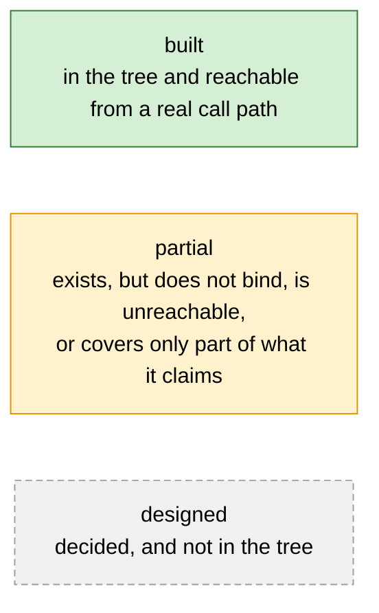
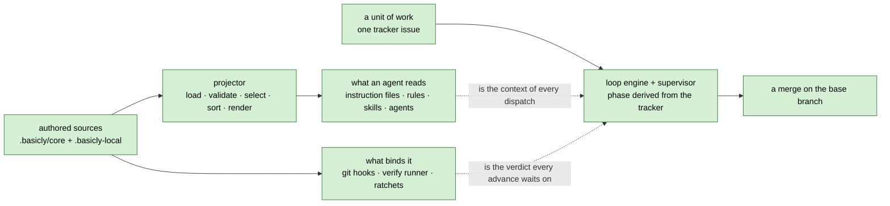
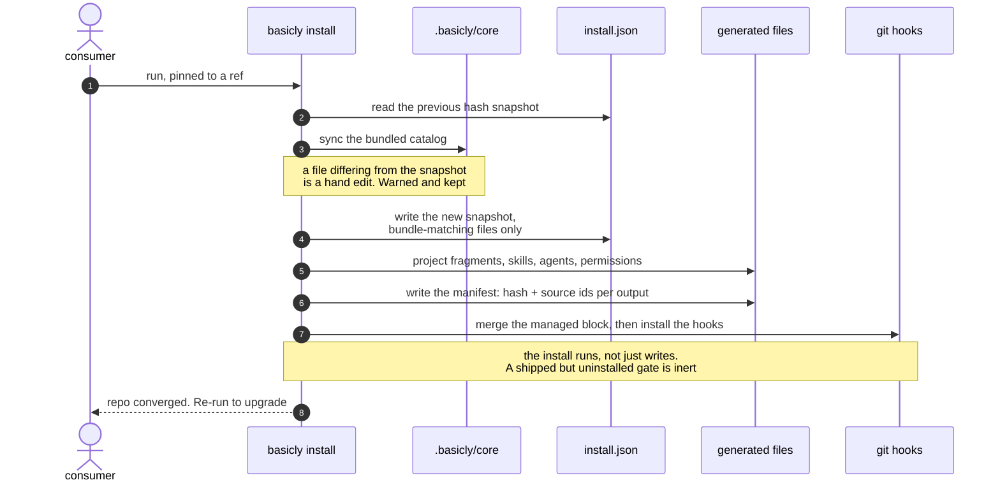
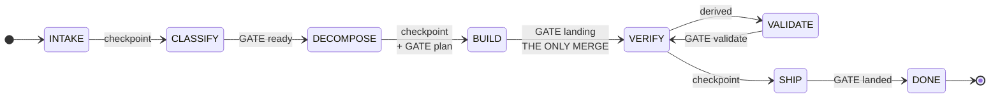
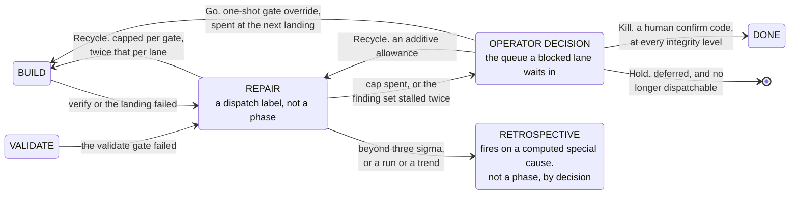
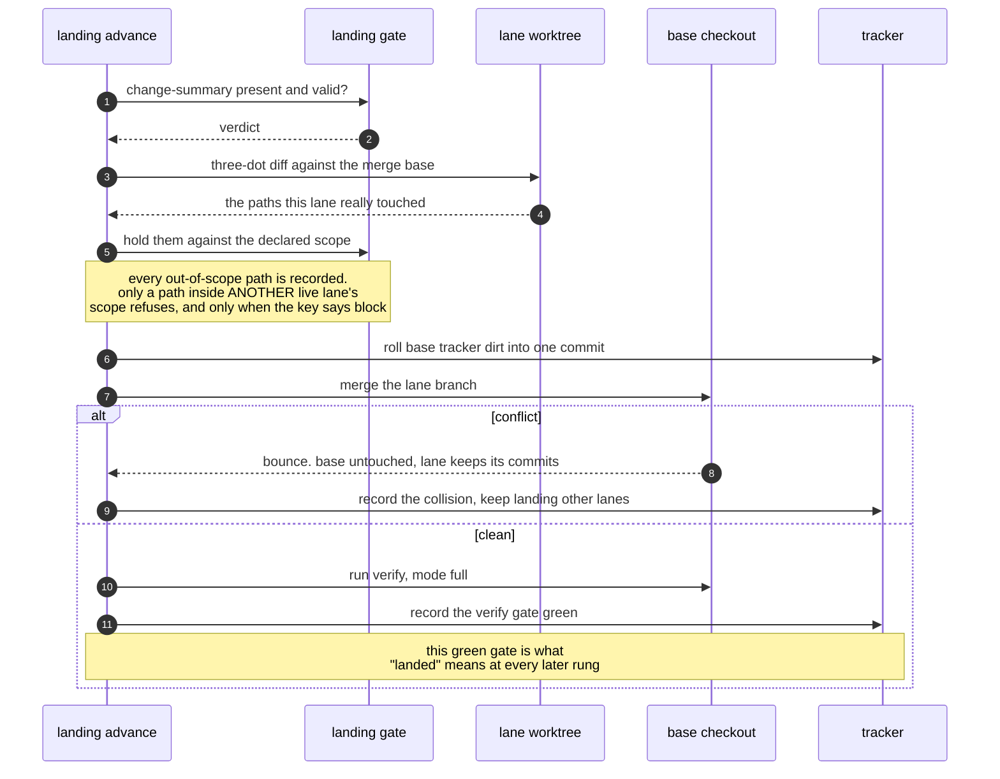
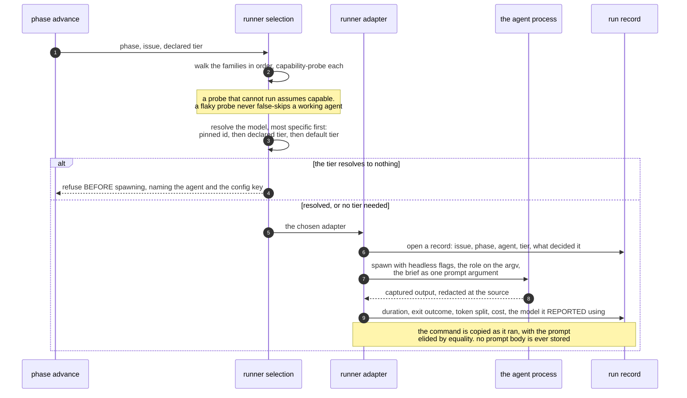
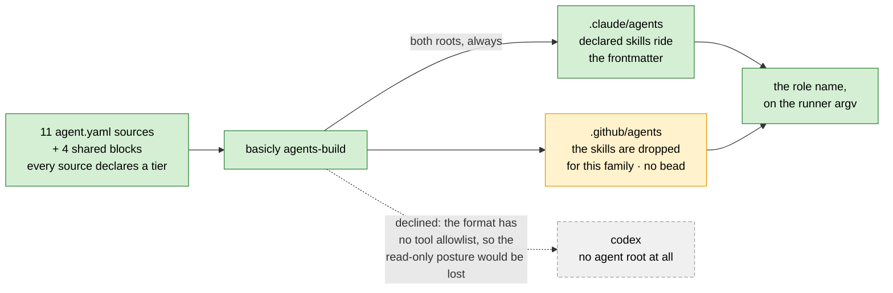
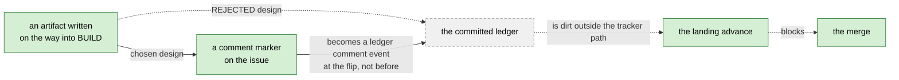
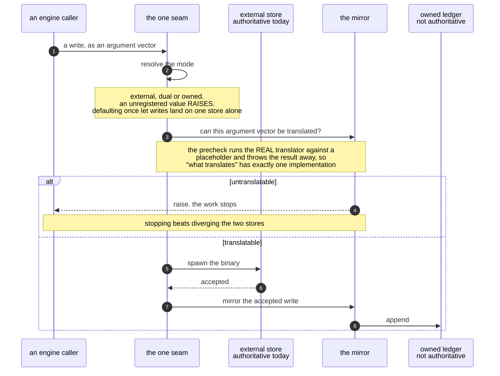

# basicly Architecture

`basicly` **ships a development process to coding agents and then enforces it.** A
repository installs it and gets three things it did not have.

1. Guidance projected into the file each coding agent actually reads.
2. Deterministic gates that block bad work whether or not a model read the guidance.
3. A workflow engine that drives a unit of work from an idea to a merge, over a tracked
   graph of state.

This file is the authority on the **design**. It is the one document to read first.

## What to call this thing

**Correction first: this project is not an agent harness, and this document said it
was.** An earlier revision opened with "a harness for coding agents" and closed with
"the field has converged on a name for what this repository is — harness engineering".
Both claims fail against the definitions below. They are removed rather than softened.

### The two terms, defined from their sources

| Term | Definition | Source | Fetched | Evidence rung |
| --- | --- | --- | --- | --- |
| **agent harness** | "The tools, context management, and execution environment that turn a language model into a capable coding agent. Claude Code is the harness; Claude is the model inside it." | Anthropic, Claude Code glossary, `code.claude.com/docs/en/glossary` | 2026-08-16 | vendor primary |
| **agent harness**, formal test | A system is a harness only if it instantiates all four at runtime: an agent loop of reason, act and observe; a tool interface that lets the model *alter* the environment; content-driven context management; and a control the model cannot decline. | Macedo, *What makes a harness a harness*, arXiv 2606.10106, dated 2026-06-10 | 2026-08-16 | single-author preprint, not peer-reviewed |
| **software factory**, first definition | A programming environment on a computer, in which construction and checkout happen entirely. It "has measures and controls for productivity and quality. Financial records are kept for costing and scheduling. Thus management is able to estimate from previous data." | R. W. Bemer 1969, quoted in Cusumano, MIT Japan Program MITJP 91-10 | 2026-08-16 | author's own primary, quoting a primary |
| **software factory**, synthesis | Moving beyond a craft mode to "standardization of development methods and tools, systematic reuse of program components or designs, some divisions of labor and functional departments, and disciplined project management as well as product quality control". | Cusumano, MITJP 91-10 | 2026-08-16 | author primary |
| **Software Factory**, product-line sense | "a model-driven product line", capturing how to produce the members of one product family as reusable assets. | Greenfield and Short, OOPSLA'03, DOI `10.1145/949344.949348` | 2026-08-16 | author paper |
| **software factory**, defence sense | A multi-tenant *platform* running many pipelines, with people and processes, not a tool. | US Department of Defense CIO, *DevSecOps Fundamentals Playbook* v2.0, March 2021 | 2026-08-16 | authority primary |

### The verdict, against the four-part harness test

| Condition | `basicly` | Evidence |
| --- | --- | --- |
| a reason-act-observe loop at runtime | **fails** | `basicly` runs no model loop. Its runner spawns `claude -p`, `codex exec` and `copilot -p` as subprocesses. The inner loop belongs to those binaries. `basicly`'s own loop iterates work items and phases |
| a tool interface that lets the model alter the environment | **fails** | The model's whole interface from `basicly` is one prompt string on the argument vector, and captured output read back. File access and shell execution come from the spawned tool |
| content-driven context management | **partial** | It decides what enters a dispatch, and projects what the host loads. It does not decide what leaves a window mid-run |
| a control the model cannot decline | **passes, strongly** | Git hook floor, verify pipeline, ratchets, plan and validate and landing gates, serial merge queue, spend ceiling, the engine-disposes invariant |

Two of four fail. **The whole product is therefore not an agent harness.**

### The decision

**Neither term names the whole product. Each names one plane, and this document uses
each only at its own scope.**

| Plane | Term this document uses | Why |
| --- | --- | --- |
| distribution | **harness configuration** | It authors and installs the parts a harness is made of, into a harness it does not own. Permission gating and memory loading are named as harness components by the vendor definition above |
| execution | **software factory** | It matches Bemer's definition on five of six clauses, including the one nobody expects a tool to satisfy: it keeps cost records and estimates future work from them |
| the whole product | neither, alone | It fails two of the four harness conditions, and it produces no family of applications |

**The one clause the execution plane misses**, stated so the claim is falsifiable:
Cusumano requires "systematic reuse of program components or designs". `basicly` reuses
*process* assets, meaning fragments, skills, hooks and roles. It reuses no application
code and produces none.

**The risk in the word "software factory", stated rather than buried.** No source
reached uses it for a repository-installable tool. Bemer 1969 and Greenfield 2003 scope
it to an environment. Every 2026 usage found scopes it to an *organizational programme*.
Using the word on a consumer surface may therefore import a reading the product cannot
satisfy.

**Corroboration from outside this repository.** A peer project in the same position,
housed in this workspace, drives the same three headless tools and calls itself a server
that "orchestrates agent harnesses rather than reimplementing them". It declines the word
for itself. A second peer calls itself a "Portable Multi-Agent Harness" while its code is
a per-vendor configuration installer. Loose usage is the community norm. It is what the
formal test above exists to correct.

**What is not settled.** Which single noun belongs on the README and the repository
description is a positioning decision, not a research finding. Those surfaces still say
"harness". Changing them is outside this document.

## How to read this document

**Two audiences, one file.** A human wants to see how the factory, the projected
guidance, the tracker, the state machine, the agents and the skills fit together, and
what is built against what is only decided. An agent building context at the start of a
session wants the same picture, plus the invariants it may not violate.

**The survival rule that shaped every editing call here.** This document must stand alone
if the code and every other document disappeared. It must be enough to rebuild the system
from scratch.

| Content | Noise, and cut |
| --- | --- |
| a decision and the reason behind it | a line number |
| an invariant | a work-item id used as an argument |
| a constraint | the status of one lane last Tuesday |
| a data shape | a restatement of what a diagram already shows |

**Authority order, when two sources disagree.**

1. **The code wins.** It is the only thing that runs. Every claim here was checked against
   the tree. Where a number is cheap to re-derive, the command is given instead of the
   number, because a copied figure goes stale silently.
2. **This document wins over every other document.** That covers the requirements
   documents, the implementation plan, the README, the landing page, the tutorial and the
   how-to pages. Those are renderings, arguments or sequences. This is the specification.
3. **A claim about an external interface is never settled from recall.** That covers a CLI
   flag, a model id and a vendor limit. Read this repository's own adapter first, then
   fetch the vendor's live documentation.

**What this document is not.**

| It is not | That is |
| --- | --- |
| the entry point for a consumer running `basicly install` for the first time | the tutorial |
| the order the unbuilt parts get built in | the implementation plan |
| a backlog | the tracker |

**A note on measured numbers.** Where a figure is stated it carries the date it was
measured, and wherever possible the command that re-derives it. A figure with neither is a
claim nobody can check, and this document has already carried several.

### Diagrams: the convention, and why mermaid

Every diagram uses three node colours. Every node carries exactly one.



**`built` is the strongest claim in the vocabulary, and it is still narrow.** It means
code exists and something calls it. It does not mean the thing has been exercised in
anger. It does not mean a gate binds. A closed work item proves code exists. Only running
the gate on a real input proves the gate refuses anything.

A node reading **`no bead`** is a gap nothing tracks. That is a finding, not an omission
in the drawing.

**Mermaid is the diagram language here, and it was chosen against alternatives** [verified
2026-08-16]. Three constraints decided it.

1. This document is read by coding agents as text. A committed binary image is invisible
   to that reader.
2. It must render where it is read.
3. A build step costs a dependency, a gate and continuous-integration time.

| Candidate | Readable as text | Renders on GitHub | Build step |
| --- | --- | --- | --- |
| **mermaid** in a fenced block | ✓ | ✓ | none |
| Graphviz DOT | ✓ | ✗ | `dot` binary |
| PlantUML | ✓ | ✗, only through a per-reader browser extension | Java plus Graphviz |
| D2 | ✓ | ✗ | `d2` binary |
| inline SVG | coordinates, not meaning | ✗, the sanitizer strips the element | yes |
| linked SVG file | the markdown shows only a link | ✓, as an image | yes |
| ASCII box drawing | ✓ | ✓ | none, but no reflow and it breaks on every edit |

GitHub's own documentation names exactly four renderable diagram syntaxes: mermaid,
geoJSON, topoJSON and ASCII STL. Mermaid is the only graph language among them. GitHub
served mermaid 11.16.1 on the date above.

**Where mermaid is weak, so a reader knows what they are getting.**

| Weakness | Consequence here |
| --- | --- |
| no layout control for a flowchart. Node placement is the algorithm's | a large flowchart drifts into unreadable arrow crossings. Every diagram here is kept small for that reason |
| edge labels are placed poorly, and the bugs are open upstream | an edge label says what the edge *means* and never repeats the node names, so a misplaced one still reads |
| a hard ceiling of 500 edges, unliftable from inside the block | far above anything here. The readable ceiling is much lower |
| a hard ceiling of 50000 characters, which fails by substituting a red box rather than an error | far above anything here |
| a wide diagram shrinks to the container rather than scrolling | prefer top-to-bottom for a wide graph |
| the theme follows the reader's colour mode | every `classDef` here sets an explicit text colour, so contrast holds in both modes |

**Only three diagram types are used**: `flowchart`, `sequenceDiagram` and
`stateDiagram-v2`. All three are long-stable. `C4Context`, `block-beta` and
`architecture-beta` render on GitHub but are experimental or carry `beta` in the keyword
itself, so a syntax change upstream would break a committed block. They are declined.

**No gate checks that these blocks parse.** That is a real gap, not an oversight. See
[Validate every mermaid block](#backlog-validate-every-mermaid-block).

## Contents

- [What to call this thing](#what-to-call-this-thing)
- [The problem](#the-problem)
- [Core invariants](#core-invariants)
- [Two ladders and the names for their levels](#two-ladders-and-the-names-for-their-levels)
- [System overview](#system-overview)
- [The distribution model](#the-distribution-model)
- [The fragment model](#the-fragment-model)
- [Skills](#skills)
- [Subagent definitions](#subagent-definitions)
- [Hooks](#hooks)
- [Model tiers](#model-tiers)
- [Configuration](#configuration)
- [Catalog verification](#catalog-verification)
- [The always-on files](#the-always-on-files)
- [Installation and upgrade](#installation-and-upgrade)
- [The CLI surface](#the-cli-surface)
- [The loop](#the-loop)
- [Work isolation and merging](#work-isolation-and-merging)
- [Parallel lanes and the supervisor](#parallel-lanes-and-the-supervisor)
- [Dispatch and the agent-agnostic runner](#dispatch-and-the-agent-agnostic-runner)
- [Cost, forecasting and autonomy](#cost-forecasting-and-autonomy)
- [Roles at dispatch](#roles-at-dispatch)
- [Handoff artifacts](#handoff-artifacts)
- [Gates and enforcement](#gates-and-enforcement)
- [The work tracker](#the-work-tracker)
- [Status: built, partial, designed](#status-built-partial-designed)
- [Decisions and their reasoning](#decisions-and-their-reasoning)
- [Non-goals](#non-goals)
- [Backlog this document emits](#backlog-this-document-emits)
- [The rest of the documentation](#the-rest-of-the-documentation)

## The problem

A coding agent is a capable worker with two defects. It does not remember the last
session. It does not know this repository's rules.

Four failures follow. Each needs a different remedy. No remedy substitutes for another.

| Failure | Why it happens | Remedy | State |
| --- | --- | --- | --- |
| The agent does not know the local rules | Every repository has conventions a model cannot infer. Each agent family reads a different file | Write the rule once. Project it into every file an agent reads | built |
| The agent ignores a rule it read | Guidance is a suggestion | A gate. A script that runs whether or not anyone asked, and refuses | built |
| A session ends and work is redone | A crash, a compaction, a rate limit or a change of agent family loses the thread | Derive the current position from durable state. Resuming is a read | built |
| Nobody knows whether any of it works | A rule the model ignores and a skill that never fires both cost context and return nothing | Measure it | barely started |

Guidance and gating are the classic bargain. Most tools of this kind stop there. Rows
three and four are the difference. This project owns the process and the state, and
enforces both in code.

## Core invariants

These hold everywhere. A change that violates one is wrong even if every gate passes.

**The engine disposes. Agents propose.** No model holds authority over the tracker, the
schedule or a required gate. This holds at every autonomy level. An agent's output is a
proposal. Engine code validates it against policy before it becomes state.

**State is derived, never remembered.** The loop phase is a pure function of tracker
state. The engine keeps no durable side-state of its own. A crashed, compacted or
swapped session resumes by re-reading the tracker. Re-dispatching completed work is
therefore structurally impossible rather than merely unlikely.

**Enforcement is code, not a request.** Where a hook can enforce a rule, the rule is a
hook. The prose only points at it. A model that chooses to run a formatter is not the
same thing as a formatter that runs.

**Deterministic first, judged second.** Only a deterministic check may pass a required
gate. Judged output is advisory, or it routes a decision to a human. It is never a green
light.

**Every deterministic step is one command.** An agent that must perform a *sequence* of
mechanical steps proves the engine is missing a command. The tokens, the latency and the
chance of a mechanical mistake are all waste.

**Nothing generated is ever hand-edited. Nothing authored is ever generated.** Users edit
catalog sources. The projector writes outputs. A tool-time guard and a commit-time
backstop defend the one-way street. Convention does not.

**Extension is addition or explicit override, never silent replacement.** There is no
third mechanism and no last-one-wins. An unexplained conflict is an error.

**No committed artifact carries a machine-specific path, username or hostname.**
Redaction runs at the write seam of both stores. A pre-commit hook is the floor under it.

**Evidence over assertion.** A claim in this document, in a release note or on a README
is backed by something a reader can re-run. An unmeasured claim about behaviour buys
confidence nobody earned.

## Two ladders and the names for their levels

Two different scales in this system used the letter `L`. Autonomy ran `L0` to `L3`.
Integrity ran `L1` to `L3`. A reader could not tell them apart, and the code cannot tell
you which one a bare `L2` means either.

Both are renamed here. The code's current identifier sits beside each new name in the
tables below. That mapping appears once. Every later section uses the new name.

| Ladder | Question it answers | Set by | Levels |
| --- | --- | --- | --- |
| Autonomy | How much may the engine approve while no human watches? | A human, at grant time | 4 |
| Integrity | How far does a defect in this change reach? | A deterministic rule over declared paths | 3 |

The two are independent. A typo fix in the tutorial, run under a grant that needs no
human, is `docs-and-tests` integrity at `unattended` autonomy.

### Autonomy: how much the engine may approve alone

| Name | Code today | The engine may approve | A human must still approve |
| --- | --- | --- | --- |
| `attended` | `L0` | nothing | classify, decompose, ship |
| `assisted` | `L1` | decompose | classify, ship |
| `supervised` | `L2` | classify, decompose | ship |
| `unattended` | `L3` | classify, decompose, ship | a kill, at every level |

Source: `policy.GRANT_COVERAGE`.

**Originating a proposal is one level stricter than approving one.** Only `supervised`
and above may originate a work type or a child set. Source:
`policy.PROPOSAL_COVERAGE`.

**`attended` is the default.** A repository that configures nothing cannot run an
unattended pass at all. Raising the ceiling is an edit to `basicly.toml`, so opting in
leaves a diff.

**The names describe how much a human watches.** They do not reuse a phase name, a
command name or a gate name, because a level named `ship` and a phase named `ship` would
be one word with two meanings.

### Integrity: how far a defect reaches

| Name | Code today | Paths it claims | Verify mode | Extra gates | Model tier | Rework | Ship |
| --- | --- | --- | --- | --- | --- | --- | --- |
| `docs-and-tests` | `L1` | documentation, tests, the site, changelog fragments, every `.md` file | fast | — | medium | 1 | may be delegated |
| `engine` | `L2` | engine code, the scripts, and every path no clause claims | full | — | high | 2 | may be delegated |
| `consumer-surface` | `L3` | the five frozen consumer surfaces | full | validate-as-consumer, evidence-binding | maximum | 2 | human only |

Sources: `integrity.LEVELS`, `integrity._RULES`, `integrity._SELECTIONS`.

**Each name is the rule clause that assigns the level.** The code already calls them
`docs-and-tests`, `engine-internal` and the five `*-surface` clauses. The names are read
off the tree rather than invented, so a verdict a reader sees printed and a name they
read here are the same word.

**The three names widen outward.** A `docs-and-tests` defect stops inside this
repository. An `engine` defect changes how the tool behaves. A `consumer-surface` defect
breaks something a consumer's own code or configuration is pinned to.

### Names that were rejected

| Rejected | For which ladder | Why |
| --- | --- | --- |
| `full` / `partial` / `none` | autonomy | Three names for four levels. `assisted` and `supervised` are two different partials and would collapse into one word |
| `none` / `decompose` / `classify` / `ship` | autonomy | Every name after the first is already a loop phase. A cumulative level named only for its newest power also misleads: `ship` covers classify and decompose too |
| `low` / `medium` / `high` | both | An ordinal with a new spelling. The reader still needs the lookup table, which is the defect being removed |
| `manual` / `semi-auto` / `auto` | autonomy | `auto` does not say what is automatic, and the top level still stops for a kill |
| `fast` / `full` / `full-plus` | integrity | Those are the three verify **mode** names. A level named for the gate set it selects makes one word mean two things |
| `routine` / `internal` / `breaking` | integrity | `breaking` is wrong. A `consumer-surface` change is one that *can* break a consumer, not one that does |
| `local` / `engine` / `contract` | integrity | `local` already names the per-machine overlay, `.basicly-local` and `basicly.local.toml` |

### The code still says `L1`

This document is ahead of the tree. The engine writes `L1`, `L2`, `L3` into the
classification marker, the plan gate's vocabulary check, `basicly.toml` and every
`--autonomy` flag value. Renaming those is a change to a frozen consumer surface, so it
is a work item and not an edit made here. See
[Rename the two ladders in code](#backlog-rename-the-two-ladders-in-code).

## System overview

The system has two planes.

| Plane | Turns | Into |
| --- | --- | --- |
| Distribution | authored catalog sources | the files agents read, and the hooks that bind them |
| Execution | a unit of work | a merge, over a tracked graph of state |

They meet at two points and nowhere else.

1. The loop dispatches an agent whose context is the projected guidance.
2. The loop's verify step runs the same checks the git hooks run.



**Three roles. One repository may hold all three, as this one does.**

| Role | Where it lives | What it is |
| --- | --- | --- |
| engine | `src/basicly/` | normal installable Python |
| catalog | `.basicly/core/` | data, never code |
| consumer | any repository that ran the install | the tree everything is projected into |

Neither tree depends on the other's location. `.basicly/` never holds engine code.
`src/basicly/` never holds catalog data.

### The engine's real dependency direction

The engine is 98 modules in 36 tiers [measured 2026-08-16, `.importlinter`]. A higher
tier may import a lower one. The reverse breaks the build and names both modules.
Siblings inside a tier may not import each other either, which is what makes a tier a
tier rather than a bucket.

The contract is **exhaustive**. A new module cannot join the package without a
maintainer placing it in a tier.

The 36 tiers group into nine bands. The stack is strictly linear, so it is a table and not
a diagram. Every band may import every band below it, and nothing above it.

| Band | Modules | Examples |
| --- | --- | --- |
| 1 · entry | 1 | `cli` |
| 2 · drivers | 4 | `supervise`, `loop`, `release`, `usage_report` |
| 3 · loop mechanics | 29 | `merge`, `decompose`, `policy`, `verify`, `decisions`, `handoff`, `plan_gate` |
| 4 · configuration and isolation | 2 | `config`, `worktree` |
| 5 · agent runtime | 5 | `runner`, `lane_log`, `lane_split`, `context_window`, `claude_settings` |
| 6 · projection | 12 | `loader`, `planner`, `renderers`, `skills`, `agents`, `hooks`, `permissions` |
| 7 · records and telemetry | 11 | `run_record`, `artifact_record`, `lens_review`, `spend_calibration` |
| 8 · tracker seam | 7 | `br`, `mirror`, `owned_store`, `br_argv`, `dispatch_phase` |
| 9 · leaf data and pure helpers | 27 | `integrity`, `schema`, `redact`, `roles`, `read_cost`, `ui`, `stemmer` |

`integrity` sits in the bottom band on purpose. It imports nothing from `basicly`, so it
stays testable with no repository, no tracker and no configuration file, and every
consumer above it can reach it.

Two cycles survive as function-level imports: `loop` to `supervise`, and `policy` to
`decisions`. Both are declared as exemptions rather than hidden. Removing one turns the
contract red until the exemption goes with it.

## The distribution model

Everything a coding agent or a human reads is **generated**. Everything a user edits is a
**source**. Three trees, three write-owners, and the separation is a mechanism rather
than a convention.

| Tree | Who writes here |
| --- | --- |
| `src/basicly/` — engine: loader, planner, renderers, CLI, loop | basicly maintainers; ships with the tool |
| `.basicly/core/` — managed catalog: fragments, skills, agents, hooks, targets, templates, schemas, models, permissions, kit | `basicly install` only |
| `.basicly/state/install.json` — install provenance: version, timestamp, per-file hashes | `basicly install` only |
| `.basicly-local/` — user overlay, path-configurable | the consumer repo's users |
| `basicly.toml`, `basicly.d/*.toml`, `basicly.local.toml` — configuration | the consumer repo |
| Generated artifacts: `AGENTS.md`, `.claude/CLAUDE.md`, `.github/copilot-instructions.md`, scoped rules, skill and agent roots | `basicly build` and its siblings only |
| `.basicly/generated-manifest.json` | `basicly build` only |

### The catalog

```text
.basicly/
  core/
    fragments/<category>/<id>.fragment.yaml
    skills/<skill-name>/skill.yaml        # plus references/, scripts/, assets/
    agents/<slug>/agent.yaml              # plus agents/blocks/<id>.block.yaml
    hooks/*.py + hooks.yaml               # git-stage and agent hook scripts, and their manifest
    models/{anchors.yaml,model-map.json,model-map.schema.json}
    permissions/permissions.yaml
    rubrics/*.rubric.yaml
    schemas/*.schema.json
    targets/{claude,copilot,codex}.yaml
    templates/{claude,copilot,codex}/*.j2
    kit/{tracker,tier}/*.py               # portable modules deployed into a consumer
  generated-manifest.json
```

**Every catalog source is YAML and deliberately not Markdown.** Some coding agents
auto-discover skills by scanning broadly for `SKILL.md`. A `SKILL.md` *source* would risk
an agent loading the catalog copy and the projected copy at once. Fragments follow the
same rule for consistency. YAML beats Python here because it needs no code execution and
keeps prose lossless in block scalars. `basicly catalog lint` refuses a Markdown-named
source, and refuses a second YAML extension.

### The projection pipeline


**Determinism is a property, not an accident.** The sort is total: priority descending,
then category, then id. Two builds on identical sources produce byte-identical output. A
diff therefore only ever shows a real change.

**Selection has exactly four axes.** Every output declares which of them it uses.

| Axis | Declared on | Effect |
| --- | --- | --- |
| `applies_to` | the fragment | names the target families it is for, or `all` |
| `filter.applies_to` | the output | names which of those values the output accepts |
| `has_scope` / `exclude_scoped` | the output | restricts an output to path-scoped fragments, or drops them from a baseline |
| `technologies` | the source | gates the whole source on the consumer's declared stack |

The third axis is why one fragment set yields both an always-on file and a set of
path-gated rules. For a target that scopes, no fragment appears in both.

**The manifest is the memory of the projection.** It records a content hash and the
ordered fragment ids per output. Three things read it.

1. `basicly check` recomputes it to detect a hand edit.
2. The sweep deletes an output that dropped out of the plan. That is how a retired output
   reaches a consumer.
3. The generated-file commit hook uses it to decide whether a staged generated file still
   matches its sources.

**Path interpolation is checked, not trusted.** An output path that resolves outside the
repository root is refused. A fragment id holding a path separator or a pure-dot value is
refused before it can reach a path template.

### Targets

Three targets ship, all enabled.

| Target | Output | Filter | Soft cap |
| --- | --- | --- | --- |
| claude | `.claude/CLAUDE.md` | `all` plus `claude`, scoped excluded | 9000 chars |
| claude | `.claude/rules/<id>.md`, one per scoped fragment, carrying a `paths:` frontmatter key | `all` plus `claude`, scoped only | — |
| codex | `AGENTS.md` | `all`, scoped **inlined** | 16000 chars |
| copilot | `.github/copilot-instructions.md` | `all` plus `copilot`, scoped excluded | 9000 chars |

**Codex inlines scoped fragments because it has nowhere to put them.** Codex is not short
of steering files. It supports nested `AGENTS.md`, an override file, fallback filenames,
repository-checked-in Agent Skills, project subagents and a sandbox policy. What it lacks
is a **type**. No glob-based or pattern-based instruction scoping exists anywhere in its
discovery, its configuration reference or its skill frontmatter. Directory placement is
its only scoping axis. This project's scopes are globs.

A nested `AGENTS.md` **below the current directory is never loaded**. Codex walks from the
project root down to the current directory and stops. A file at `src/foo/AGENTS.md`
therefore contributes nothing when Codex runs from the repository root. Inlining is the
correctness-preserving choice. Offloading to nested files is rejected, not deferred.

**Two naming traps on the Codex surface have each misled a reader here.**

| Trap | What it actually is | The wrong turn it causes |
| --- | --- | --- |
| Codex "Rules" (`.codex/rules/`, a Starlark prefix rule) | a sandbox command-execution policy | reading that page and concluding Codex has no instruction rules |
| File-based custom prompts | deprecated in favour of skills, and user-scope only | planning to ship them inside a repository, which is impossible |

**Copilot gets no path-scoped twin, by decision.** One editor loads the Claude rules root
and the Copilot instructions root together, with no deduplication. A twin therefore
double-loaded every path-scoped rule for every consumer of that editor. Scoped rules are
single-sourced to the Claude rules root instead. The accepted cost is that the
server-side Copilot surfaces, meaning pull-request review and the cloud agent, keep only
the root instructions file.

## The fragment model

One fragment is one policy, practice or decision: a YAML source with a body written as a
block scalar, projected to Markdown.

| Field | Required | Values | Notes |
| --- | --- | --- | --- |
| `id` | yes | kebab-case, unique | a duplicate across core and overlay is a hard error |
| `description` | yes | one line | |
| `category` | yes | `boundaries`, `code-style`, `commands`, `decisions`, `design`, `hooks`, `project`, `security`, `skills`, `testing`, `tools`, `ci-cd`, `quirks` | a closed vocabulary; unknown values are refused at load |
| `applies_to` | yes | target names or `all` | |
| `priority` | no | `critical` (4), `high` (3), `medium` (2, default), `low` (1) | sorts descending |
| `scope.paths` | no | glob list, default `["**"]` | a non-default value makes the fragment scoped |
| `status` | no | `active` (default), `draft`, `deprecated` | only `active` is projected |
| `technologies` | no | controlled list | untagged means universal |
| `source` | no | `core` (default) or `user` | inferred from the load root when omitted |
| `override` | no | bool, default false | must be true to replace a core fragment |
| `replaces` | no | list of fragment ids | those core fragments are removed when this one is active |
| `extends` | no | list of fragment ids | declared and validated; nothing consumes it today |
| `enforced_by` | no | list of commands | each must be cited in the body, see below |

**The extension mechanism is two rules and no exceptions.**

1. The planner removes every core fragment named in an active user fragment's `replaces`.
2. The loader raises on every load when any of three conditions fails. A fragment that
   declares `replaces` must set `override: true`. Every replaced id must exist in the
   merged set. Two user fragments may not replace each other.

**`enforced_by` closes the loop on the context-minimalism rule.** A fragment that claims a
command enforces its rule must cite that command in its body. `catalog lint` refuses one
that does not. That turns "point at enforcement instead of restating it" from advice into
a check.

**On disk today** [measured 2026-08-16, `basicly catalog list fragment`]:

| Measure | Count |
| --- | --- |
| core fragments | 21 |
| overlay fragments | 3 |
| category directories in use, of 13 declared | 8 |
| path-scoped fragments, each becoming its own rules file | 4 |
| target-specific defaults, one per family that takes them | 2 |

Core fragments by category: `boundaries` 1, `commands` 1, `decisions` 3, `design` 1,
`project` 11, `security` 1, `testing` 1, `tools` 2. The five empty categories are
`code-style`, `hooks`, `skills`, `ci-cd` and `quirks`.

**The category `hooks` labels a fragment that *describes* hook usage.** It is not the
mechanism that ships a hook script. That mechanism is [Hooks](#hooks).

## Skills

A skill is on-demand guidance. It is a directory the agent loads when it decides the skill
is relevant, or when a path glob triggers it. Until then it costs only the line that
advertises it.

**Two projection roots. Both mandatory. Both always written.**

| Root | Who reads it |
| --- | --- |
| `.claude/skills/` | one family's only project skill root |
| `.agents/skills/` | the open-standard root the other families discover |

Neither root is optional. A root that only some commands write is how a second root
drifts unnoticed.

**A skill source directory projects whole.** A skill may bundle references, scripts and
assets beside `skill.yaml`. The projector renders the discoverable `SKILL.md` with a
generated marker. It copies every other file verbatim, bytes and mode. A skill can
therefore ship a long reference guide or a fixer script.

**The invocation axis is declared, not inferred.** It is required, and it is one of two
values.

| Value | Carries a description | Costs context | When it loads |
| --- | --- | --- | --- |
| model-invoked | yes | on every turn, in the listing | when the model judges it relevant |
| user-invoked | no, and lint enforces the empty pairing | nothing | when a human types its name |

The axis is declared rather than guessed because "does this entry route correctly" is not
a well-posed question until the entry says whether routing applies to it. That makes the
axis a prerequisite for the routing evals rather than bookkeeping.

**One root requires a description and the other does not.** A user-invoked skill
therefore emits a synthesized description on the standard root. That family rejects a
description-less file outright.

**The projected directory is mirrored and the root itself is owned.** A rebuild prunes a
resource dropped from the source. Deselecting a technology prunes the whole directory.
The check also reports any entry in the root that no source accounts for: a hand-authored
skill file, a loose README, a projection whose source was deleted. Without that report a
skill the projector never knew about passes every gate while reaching only one agent. The
check reports and never prunes those. Nothing describes them, and the projected copy is
the only one there is.

**Technology scoping is the core-versus-optional axis.** An untagged skill is universal
and always ships. A tagged skill ships only when the consumer selects that tag in
configuration. Technology-specific and situational guidance belongs in an optional skill
and never in an always-on file. Enforcement stays in the deterministic hooks. A skill
carries the judgment and the pointers a linter cannot.

**A skill is not free, and the cost sits in the listing rather than the body.** The whole
skill listing is budgeted against a fraction of the context window. On overflow the host
drops descriptions **starting with the least-invoked skills**. That is a feedback loop
rather than a flat cost: a rarely-invoked skill is truncated first, which makes it harder
to invoke. Both the per-entry cap and the listing budget are gated.

**A skill's frontmatter can take a path glob.** The glob both limits the skill and
triggers automatic activation. It buys always-loads-on-a-matching-file behaviour at
**zero** always-on characters. The key is not in the portable subset, so it is declared
under a per-target vendor fence and emitted only into the root that understands it. The
general rule this settles: a host-specific capability is expressible without the portable
artifact absorbing it.

**Skill scope precedence is the inverse of agent scope precedence.** For a distribution
tool that asymmetry is load-bearing.

| Artifact | Precedence, strongest first | Where `basicly install` writes |
| --- | --- | --- |
| agents | managed → project → user | project, the middle scope |
| skills | enterprise → **personal** → **project** | project, the **weakest** writable scope |

A developer's personal skill of the same name therefore silently overrides one we
shipped. An identically named agent would not. Nothing we ship makes that visible to the
consumer.

**Lint enforces the specification's naming rules.** The name must match the directory. It
must be 1 to 64 lowercase alphanumeric-or-hyphen characters, with no leading, trailing or
consecutive hyphen. Lint warns when a body runs long, and when a file reference reaches
more than one level deep. Both warnings follow the specification's progressive-disclosure
guidance.

**On disk today** [measured 2026-08-16]:

| Measure | Count |
| --- | --- |
| skill sources | 41 |
| projected into each of the two roots, after the technology filter | 36 |

## Subagent definitions

Subagent definition files are the fourth catalog kind. They are generated and never
hand-edited.

**Composition.** Every agent fills five ordered body slots: role, startup, process, output
contract, constraints. Each slot is a list of references to shared building blocks, or
inline Markdown. The skeleton is the structure that the vendor's own subagent examples and
the best files in a community corpus converge on. Four shared blocks exist, under a
reserved slug.

**The description is authored as four fields.** They are purpose, triggers, returns and
posture. The projector joins them, so no part of a delegation-quality description can be
forgotten.

**The tool list is a mandatory explicit allowlist.** An agent never silently inherits
every tool. A posture that declares read-only may not grant a write tool. Lint refuses one
that does.

**Tool names are not translated.** The second family's published alias table accepts the
first family's PascalCase names as first-class, and matches case-insensitively. One
declared name therefore resolves on both. The table is pinned as reviewed data for two
reasons. It drives the read-only posture check. And it lets lint refuse a name that
resolves to nothing, which matters because one family drops an unrecognised entry with no
error where the other refuses to launch and says so. An unrecognised entry therefore fails
**safe**. The residual risk is a useless agent, not a lost guarantee.

**A tier names a portable model tier**: low, medium, high or maximum. It is single-sourced
from the engine into an enum on the agent schema. A tripwire test keeps the two in step.
Lint refuses a source that declares none.

**No projected agent file carries a provider model id.** That is a decision, not an
omission, and it rests on two independent reasons.

1. A provider id is not portable across agent families. The same model is spelled
   differently on two surfaces.
2. Decisively: the tier-injection mechanism leaves a definition that pins its own model
   alone. A projected model line would therefore **disable** tier injection rather than
   implement it.

The deprecation of the old key is engineered rather than documented. The key is retained
as a deprecated property purely so lint owns the actionable message, instead of the schema
emitting a bare "additional properties are not allowed". It stays on the
reserved-frontmatter list so the per-family passthrough cannot smuggle an id back in.

**Two roots, both written and both checked**, one per family that has an agent root. The
second root exists for two reasons. That family's *cloud* agent reads only its own root,
while its command-line tool's discovery of the first root is real but undocumented. And
its custom agents do support a tool allowlist, so the read-only posture survives the
crossing.

Double loading does not happen. The deduplication key is the file name without its
extension, so the two files collapse to one agent. Only the first root receives the
per-family passthrough.

**A third native root is declined, not overlooked.** Codex's subagent format has no tool
allowlist equivalent. A Codex copy would therefore silently drop the mandatory allowlist
the read-only posture check depends on. That is a lost guarantee, not a format cost, and
it would also fork the renderer, the drift check and the generated marker. Codex receives
the same guidance through `AGENTS.md` and the standard skills root.

**No agent root costs always-on budget, and the saving is structural.** Four facts, all
verified against a live host rather than taken from vendor guidance.

1. Only an agent's name and description load at session start.
2. The body never enters the parent's context.
3. Only the final message returns.
4. A subagent runs in an isolated context window, so a dispatch's working set is never
   charged to the session that spawned it.

**A projected agent definition does not reach a running session's subagent registry**
[measured 2026-08-16, in this session]. A role was given write tools in the catalog.
`basicly agents-build` wrote both roots. A dispatch immediately afterwards reported its
live tools as the pre-change set. A requirements document claims agent definitions
hot-reload, citing an earlier measurement. **That claim does not hold for this path.**
Treat a definition change as taking effect at the next process start, and say so to
consumers. Clearing the conversation is the lever a consumer reaches for first, and it is
the wrong one.

**On disk today** [measured 2026-08-16]:

| Measure | Count |
| --- | --- |
| agent sources | 11 |
| shared blocks | 4 |
| files projected into each root | 11 |

## Hooks

Hook scripts are first-class catalog artifacts. They are the deterministic, gating
counterpart to fragments and skills. A manifest describes each one tool-agnostically.
Every script is standalone Python with no runner interface, so the manifest could drive a
different runner without a script changing.

**Each entry declares** an id, a script and a stage. It may also declare whether filenames
are passed, whether it always runs, its technologies, a matcher and a manager. The manager
routes the hook to one of three surfaces.

| Manager | Surface it writes | Stages in use | Hooks today |
| --- | --- | --- | --- |
| git | a managed local block in the pre-commit configuration, foreign hooks preserved | pre-commit, commit-msg, pre-push | 11 |
| claude | the agent-hook section of that family's settings file | pre-tool-use, post-tool-use | 3 |
| copilot | one managed JSON file per hook under that family's hooks directory | pre-tool-use, post-tool-use | 1 |

**What ships today** [measured 2026-08-16, `.basicly/core/hooks/hooks.yaml`]: 15 declared
specs.

| Stage | Count | Hooks |
| --- | --- | --- |
| pre-commit | 8 | identity guard · fast-check runner · catalog lint · secret scanner · tracker path scanner · internal-info scanner · kit boundary check · generated-file backstop |
| commit-msg | 2 | conventional-commit check · tracker-id check |
| pre-push | 1 | full-check runner |
| pre-tool-use | 2 | generated-file guard · shell-footgun guard |
| post-tool-use | 2 | tool-usage counter, which rides both agent managers |

**A gate that is shipped but never installed is inert.** That is the exact failure that
once let unguarded commits through. So `basicly hooks-build` projects the manifest **and
then runs the installer** for every managed stage. It does not only write the
configuration.

**Two scanners deserve their reasoning stated.**

The secret scanner blocks a commit whose staged added lines carry a likely credential. An
inline allowlist escapes a reviewed false positive.

Its sibling scans for internal-only identifiers: a company domain, an internal host, a
machine username, a private repository name. Those publish silently, because they read as
ordinary text to anyone who does not already know they are internal. **Its denylist is
deliberately not in the script.** A gate that hard-codes the strings it suppresses would
publish them into this repository, and into every consumer that installs the catalog.
Pre-commit also runs in a continuous-integration job whose logs are public. The tokens
live in the gitignored per-machine configuration as named rules. The report prints only
the rule name. The scanner is inert until configured, so a consumer is never blocked by a
list they did not write.

**The identity guard blocks a commit whose git identity is unset or a hostname fallback.**
It is generic and holds no personal data. It validates the **effective** identity git will
stamp, resolving author and committer with the environment taking precedence over
configuration. A runner may overlay identity environment variables, and validating
configuration alone would miss the override.

**The tool-usage counter is token-free telemetry.** It tallies every shell command's
pipeline head into a self-ignored file. It resolves the head *past* a wrapper: the runner,
the package executor, the environment setter, and their subcommands, flags, flag values
and variable prefixes. The wrapped tool is therefore credited and not only the wrapper.
The file is the input for culling idle tools and skills from the catalog with real data.

**Why pre-commit and not a compiled runner.** The hooks are already runner-agnostic, so
the only runner-specific code is the projection layer. The decisive fact is that **every
projected hook shells out to the Python runtime**. A committer needs that runtime whatever
orchestrates the hooks. A static binary's headline advantage is no runtime dependency, and
that advantage buys this project nothing. It would add a binary-acquisition problem with
no native answer.

Reopen the decision on any one of four triggers.

1. Consumers stop reliably having the runtime on `PATH`.
2. The project drops the runtime requirement for the checks themselves.
3. Hook execution speed becomes a **measured** complaint that parallelism would fix.
4. The provisioning seam regresses beyond what the fallback covers.

The manager field and the interface-free scripts are kept precisely so this stays cheap to
reopen.

**A consumer's own hooks survive.** The projector merges its managed block into an existing
configuration. Foreign repositories and hooks are preserved, and the merge is idempotent.
This repository dogfoods the catalog directly. Its own pre-commit configuration points
straight at the catalog scripts. One hook in it, the Markdown linter, is a hand-maintained
consumer block that the projector preserves rather than owns.

## Model tiers

A catalog source declares a **portable tier**. A concrete model id is resolved at dispatch
from committed data.

An anchors file is the reviewed input. It holds one anchor model per tier and vendor, plus
a surface table and a capability rule. A generator resolves it into a committed map,
validated against a published schema.

**The map is indexed on three axes, because all three change the answer.**

| Axis | Why it is separate |
| --- | --- |
| tier | the whole point of the abstraction |
| vendor | each vendor names and prices its own models |
| surface | the same model can cost several times more through one surface than another, and one surface may cap a model's input where the vendor's own publishes no cap |

**An unavailable cell records a status and a reason, and deliberately carries no model
key.** A consumer reading it therefore fails loudly, rather than being silently demoted
onto another tier's model. Resolution refuses the dispatch. It never substitutes.

**Two constraints keep the whole mechanism offline.**

1. The generator fetches upstream data at authoring time and check time only, never in the
   dispatch path. There is deliberately no verify-check entry for it. Nothing that
   dispatches an agent depends on the network.
2. The drift check **reports** and never writes. A community-contributed upstream edit must
   surface as a red check. It must not silently change which model runs someone's code.

The committed map's shape is gated offline by a test.

**Two independent resolvers exist, and the difference is deliberate.**

| Resolver | On an unavailable cell | Why |
| --- | --- | --- |
| in-harness | raises | a dispatch that cannot honour its tier is a bug |
| portable kit — no dependencies, no imports, no `PATH`, no network, no subprocess | fails closed and quiet, leaving the spawn untouched | it runs on machines that may hold no map at all |

**The tier reaches no spawn today.** Nothing projects a model id, by decision. The
injection that would resolve one at spawn is a hook that exists in the kit and is not
installed. The tier is therefore declared, gated by lint, and inert.

On one family the installer **declines with a nonzero exit**. Across repeated probes no
tool-boundary hook fired for an agent spawn on that family. Even where one does fire, the
documented contract is approve-or-deny rather than rewrite.

## Configuration

Three files, layered lowest to highest, with a fourth layer for the current process.

| File | Committed | What belongs here |
| --- | --- | --- |
| `basicly.toml` | yes | the repository's declaration; the **only** source for projection config |
| `basicly.d/<id>.toml` | yes | one lane's additions, so two lanes never write one file |
| `basicly.local.toml` | no, gitignored | per-machine harness choices, and the internal-identifier denylist |
| session overrides | no | this process only |

**The merge is a key-level shallow replace, with exactly one documented exception.** A key
set in a later layer replaces the earlier value wholesale. A per-machine list is therefore
taken as-is rather than concatenated. That is the machine saying *instead*.

The one exception is the verify check list. The drop-in layer **appends** to it in filename
order, because a drop-in fragment is one lane's *addition*. The per-machine layer still
replaces the whole list.

**Projection configuration is repository-level only.** The path and catalog sections shape
repository-committed outputs. They are read from the committed file alone, never from the
per-machine overlay.

**Every ratchet number in a drop-in is a delta, never a total.** Two lanes each adding one
suppression would both record the same total, while the merged tree holds one more.
Addition composes in any landing order. A total does not. Raising a frozen baseline through
a delta is refused. The escape is an explicit rebaseline key carrying a non-empty reason,
and those are counted and printed.

**Both files are schema-checked on every load, and the schema is an allowlist over the
whole configuration surface.** An unrecognised section or key raises. The message names the
file, the containing section, what that section accepts, and which sections accept a name
like it.

The reason is that a key the engine ignores leaves the file stating one behaviour and the
engine performing another. In a gitignored overlay there is no diff to review and no other
gate. The only symptom is the default the key was written to replace. The allowlist covers
the surface rather than this module's readers: two entries have no reader in the
configuration loader at all, and are still declared.

**Which schema does the checking is a property of the tree, not of the process.** A
repository that ships its own engine source is checked against the schema declared in
*that* file, read statically on every validation. This repository is such a tree, and so is
each of its lane worktrees.

Without that rule a landing could not admit a lane that adds a key. The landing runs from
the base checkout, so the engine validating the lane's configuration is the pre-merge one.
It refused a name the lane's own code introduces one commit later.

Reading it statically is deliberate. The tree under test has not merged. Importing it would
run a second engine inside the process that is landing it, and the question is a set of
names rather than a behaviour. It fails closed: a schema the reader cannot model falls back
to the running engine's, and the refusal then names the ordering rule instead of reading as
a typo.

**The refusal is unconditional. Forward compatibility is the accepted cost.** There is no
warn-then-error staging and no narrowing to near-misses of a known key. A repository pinned
to an older engine whose configuration carries a newer key fails until it upgrades or
removes the key.

| Softer option | Why it was rejected |
| --- | --- |
| warn, then error in a later release | The engine ships from the trunk, so a warn phase has no graduation point. It would also go unread |
| refuse only a near-miss of a known key | A genuinely novel key stays silent. That is the same hole, one generation on |

The cost is bounded by the message. It names the engine's version and says upgrading is one
of the two fixes.

## Catalog verification

Two layers, deterministic always first.

| Check | Where it runs |
| --- | --- |
| Required fields, known category, priority, status and target; extension-field types | the loader, on every list, build and check |
| Duplicate fragment id across every root | the loader, on every load |
| Replacement integrity: the target exists, the override flag is set, no mutual user-to-user replace | the loader, on every list, build and check |
| Source format: schema validity, no Markdown-named source, a single YAML extension | `basicly catalog lint`, wired as a pre-commit hook and a CI step |
| Composition rules: block references resolve, every tool resolves, a read-only posture grants no write tool, the composed body stays under the strictest reader's prompt ceiling | `basicly catalog lint` |
| Routing: positive top-k, pairwise negatives, a description-collision ceiling, a ratcheting rank-1 floor | `basicly catalog lint` |
| Duplicate or near-duplicate bodies, contradictions from a curated pair dictionary, vague phrases, scope overlaps | `basicly catalog verify` |
| Semantic review: an agent reads the rendered files for contradiction and ambiguity | `basicly catalog review`, advisory, always exits zero |

**Deterministic checks catch a large class cheaply** — duplicate ids, missing fields,
unknown vocabulary. Semantic problems — a contradiction that parses fine but reads badly to
a model — need a capable reader. Both layers run against the same merged fragment set, and
the judged layer is never a merge gate.

**The routing gate is the deterministic, lexical, free tier of the evidence layer**, and the
reason it works is a detail worth keeping: it asserts that the declared owner must
**outrank** the entry, because a bare "must not rank first" passes vacuously on a prompt
that matches nothing. It reports a rank-1 rate against a floor that ratchets and cannot be
lowered.

## The always-on files

`AGENTS.md`, `.claude/CLAUDE.md` and `.github/copilot-instructions.md` are the foundation
every other artifact builds on. If they are noisy or ambiguous, everything downstream
inherits that failure.

**Six properties they must keep.**

1. **Point at enforcement; do not restate it.** If a rule is mechanically enforced, the
   always-on file references the command that enforces it. Prose is reserved for what a
   linter cannot check: judgment calls, escalation policy, when to ask instead of guess.
   Duplicating what a linter already enforces measurably hurts agent task success and
   inflates cost.
2. **Enforced rules are one line; judgment rules are prose**, and the judgment section
   should be the shorter of the two.
3. **No duplication across the three files.** The shared always-applicable set feeds all
   three; each family's file adds only genuinely different content.
4. **Each file is self-contained.** Two of the three families do not reliably import a
   shared file, so the shared content is inlined into each rather than referenced. An agent
   should never need a second file to understand the baseline.
5. **Scoped fragments stay out of the baseline** for the two families that can scope, so a
   language-specific rule does not cost every task its context budget.
6. **Stable ordering**, so diffs stay minimal.

**The caps are a discipline choice, not a platform limit.** Measured against the vendors:
one host's own degradation warning is far above these numbers, one vendor removed its former
hard character limit and now only advises shortening, and the third reads its file up to a
configurable byte cap. **A cap warning means split into a scoped rule, not shrink the
prose.** The cap counts **characters**, not bytes, so a byte count overstates a UTF-8
baseline by its multi-byte characters.

Measured from the projected files themselves, and regenerated and gated on every commit:

<!-- docs-claims:begin always-on-sizes -->

| Surface | chars | cap | headroom |
| --- | --- | --- | --- |
| `.claude/CLAUDE.md` (claude) | 8895 | 9000 | 105 |
| `AGENTS.md` (codex) | 14343 | 16000 | 1657 |
| `.github/copilot-instructions.md` (copilot) | 8994 | 9000 | 6 |

<!-- docs-claims:end always-on-sizes -->

**Which surface binds depends on the tier.** The tightest always-on surface binds for an
always-on fragment. `AGENTS.md` binds for the **path-scoped** tier, because a scoped
fragment costs it around a thousand characters and costs the other two nothing.

**Scoping's cost effect is asymmetric, not a blanket improvement.** It removes a fragment
from the two baselines that can scope and **adds** it to the one that inlines. The codex cap
was raised rather than lowered after an audit of an overrun found the excess *was* the
scoped tier: evicting always-on lines would have charged all three families to fix one and
left the cause standing. What that trade gave up is stated where it was made — the old cap
also stood proxy for the vendor's claim that adherence degrades with length, which this
repository has never measured.

**What is known and what is not.** Measured against both families that were tested, each
reproduces the overwhelming majority of its baseline's rules when asked, against a small
no-guidance control. So the "cliff already crossed" reading is **refuted**: the content is
not invisible at this size. What that does **not** settle is the operational question —
nothing measures which baseline rules *bind* while an agent works. Recall under a direct cue
is an upper bound and confirms mechanism only. The cap policy is therefore asymmetric:
**lowering it is ordinary housekeeping; raising it still has no evidence behind it.**

## Installation and upgrade

**`install` and `uninstall` are ordinary CLI verbs** [measured 2026-08-16, `basicly
--help`]. They are not special bootstrap commands. `uvx` in the lines below is only how
you reach a `basicly` executable when your machine has none. It is not part of the verb.

Three ways to reach the same two verbs.

| How you invoke it | When to use it | Verified |
| --- | --- | --- |
| `uvx --from git+https://github.com/niksavis/basicly@<ref> basicly install` | first install, and every upgrade of a pinned ref. Nothing is added to `PATH` | yes |
| `uv run basicly install` | inside a checkout of this repository, where `basicly` is the project | yes, this is how every command in this document was run |
| `basicly install` | when a `basicly` executable is already on `PATH` | the verb exists; putting it on `PATH` is the consumer's own step |

**`basicly install` does not put `basicly` on `PATH`.** It syncs the catalog into the
repository and projects every artifact. Nothing in it installs the Python package. A bare
`basicly install` therefore works only after a consumer has separately made the executable
reachable, for example with `uv tool install`. On this machine `command -v basicly` returns
nothing [measured 2026-08-16].

**Uninstall follows the same rule.** `basicly uninstall` and `uvx ... basicly uninstall`
are the same verb reached two ways.

**One idempotent converge command.** An earlier design staged an init, then a build, then
each projector, plus a separate update command. The finding that collapsed them: init was
never a technical prerequisite, because everything it does is idempotent and skips what
exists. One command therefore serves both cases.

Its contract, in order:

1. Materialize or sync the bundled core.
2. Migrate and prune legacy layouts.
3. Scaffold the overlay and the configuration, **only if missing**.
4. Keep the authoring-repository guard.
5. Rebuild every artifact and install the hooks.

**The catalog is versioned as a whole and pinned as a whole.** That is the same way a hook
configuration pins a revision. Re-running the install from a newer pinned ref is the only
action that moves a consumer to a newer catalog version. It is explicit and reviewable.

**Provenance is what makes an upgrade safe.** Install records a per-file hash snapshot of
the core as materialized. On a later install the sync overwrites changed files and deletes
upstream-removed ones. The snapshot is what distinguishes an upstream change from a user's
hand edit.

| File state | What the sync does |
| --- | --- |
| matches the snapshot | upstream-owned. Overwritten |
| differs from the snapshot | a hand edit. Warned and kept, unless `--force` |
| unknown to both bundle and snapshot | always kept |

The post-sync snapshot records only bundle-matching files, so a kept edit stays protected on
the next run.

**Install writes the managed core and the state only.** It creates the overlay directory
when missing, and never writes fragment content there. It never overwrites an existing
configuration file. When an existing file lacks a section the shipped default now carries,
install names the section in a hint instead of editing.

**An install into a consumer repository, drawn in order.**



**Uninstall removes everything managed** — core, state, manifest-listed generated files,
projected skills and agents that carry the generated marker, and the managed hook block,
deleting the config and uninstalling the git hooks when nothing else remains. It preserves the
overlay and the config unless purging, and it refuses to run in the authoring repository,
where the core *is* the catalog source.

**Technology scoping applies at projection time, not at sync time.** The core sync stays full,
which keeps provenance simple; the projectors and their checks skip non-overlapping sources.
Narrowing the selection converges on rebuild rather than stranding: fragment outputs recompose
and are swept via the manifest, excluded skills and agents are pruned if they carry the
generated marker, and excluded managed hooks are stripped from the configuration files.

**The managed catalog ships inside the distribution.** The build projects the dogfooded source
tree into the wheel and the source distribution carries it, so a direct-from-git install
resolves it; the locator prefers a source checkout and falls back to the packaged copy.

**A bootstrap shim exists for a consumer with no runtime**: a POSIX shell script and a
PowerShell script that install the runtime from its vendor when absent, then run the same
pinned install in the current repository. Both fail fast outside a git repository.

**Everything lives in plain, git-tracked files.** No daemon, no hidden state, no network calls
at build time. `git diff` and `git blame` are the audit trail, and `basicly check` is the
offline staleness gate.

## The CLI surface

**28 top-level commands. Nine of them are subcommand groups** [measured 2026-08-16; count
`subparsers(cli._build_parser()).choices`]. An earlier revision of this document said 27
and eight. Both were wrong.

They fall into three surfaces.

| Surface | For | Commands |
| --- | --- | --- |
| lifecycle | a consumer repository | install, uninstall, status, health, brief |
| catalog | an author of catalog sources | build, check, the four build/check pairs, usage, catalog, rubric |
| harness | the development loop, in either repository | worktree, verify, policy, decompose, loop, commit, runner, tracker, board, release |

**Lifecycle.**

| Command | Behaviour |
| --- | --- |
| `basicly install` | Idempotent converge: materialize or sync the core, migrate legacy layouts, scaffold overlay and config without overwriting, then build, skills-build across all default roots, agents-build, hooks-build with activation. First install and every upgrade |
| `basicly uninstall [--purge]` | Remove everything managed, preserve the overlay and config unless purging, refuse in the authoring repo |
| `basicly status [--json] [--fleet]` | Read-only snapshot: installed catalog version against running engine version, drift summary, per-manager hook state, technology selection, overlay counts. Never writes, always exits zero. The fleet flag rolls it across the housed repositories as one JSON payload |
| `basicly health [--json] [--window N] [--fleet]` | Read-only per-agent health scoring and behavioural drift from the run-record log: dispatch failure rate, a rework signal, a bounded score, and a rolling-baseline drift flag. Never writes, always exits zero |
| `basicly brief <issue-id>` | Print the brief the loop would dispatch for one issue, without dispatching it. Shares the dispatch renderer rather than re-rendering, because a preview that differs from the dispatch is worse than none |

**Catalog.**

| Command | Behaviour |
| --- | --- |
| `basicly build [--target NAME] [--verify]` | Render enabled targets, write only changed bytes, update the manifest, warn on cap overrun. The verify flag runs the content checks first and writes nothing on failure |
| `basicly check` | Byte-for-byte staleness check of generated files and the manifest; exit 1 on mismatch, no auto-fix |
| `basicly skills-build [--root ...\|--all-default-roots]` / `skills-check` | The same build and check contract for the skill catalog, mirrored per root |
| `basicly agents-build` / `agents-check` | The same contract for the agent catalog, always both roots, with no root-selection flag |
| `basicly hooks-build [--no-install]` / `hooks-check` | Materialize hook scripts, merge a managed block into the hook config preserving foreign hooks, then install the git hooks so the gates are active. The check reports projection drift and warns when the git hooks are not installed |
| `basicly permissions-build` / `permissions-check` | Project the agent-permissions deny-list into the co-owned settings file: ensure-present, consumer entries preserved, nothing pruned, with a semantic subset drift check |
| `basicly usage report` | The tool and skill counts the telemetry hook recorded, and the catalog skills never used: the culling input |
| `basicly usage forecast` | Forecast error per dispatch, over local run records and committed markers. Refuses to compute an error for a record missing either half and reports those as unpaired, so an empty report explains itself |
| `basicly usage tuning` | Advise every governed factory parameter from the recorded dispatches: the value in force, the outcome distribution under it, and a recommendation labelled measured or seeded. Advisory only; it writes nothing |
| `basicly usage lane-split` | Split each persisted lane transcript into a context-acquisition share and an implementation share |
| `basicly usage outcomes` | How every recorded dispatch ended, with the failure share as an explicit rate |
| `basicly usage tracker [--promote] [--refresh-surface] [--as-json]` | The measured external-tracker surface the replacement scope is frozen from |
| `basicly catalog list [fragment\|skill\|agent]` | Table of catalog sources of the given kind |
| `basicly catalog new <fragment\|skill\|agent> NAME [--category C] [--description D]` | Scaffold a new source in the correct format |
| `basicly catalog lint` | Source-format and composition gate; wired as a pre-commit hook and a CI step |
| `basicly catalog verify` | Deterministic content checks beyond the load path: duplicate bodies, contradictions, ambiguity, scope overlaps |
| `basicly catalog review [--runner NAME] [--dry-run]` | Advisory agent-assisted semantic review; always exits zero |
| `basicly rubric eval <issue> [--runner NAME] [--dry-run]` | Evaluate the issue's work-type behavioural rubric: deterministic checks through the verify runner, judged checks through one agent prompt. Reports an advisory gate, promotable by naming it in the required set |

The names above are the whole authoring surface. Two formerly planned reporting views for
conflicts and overrides were cut from scope; `basicly catalog verify` output covers the need.

**Harness.**

| Command | Behaviour |
| --- | --- |
| `basicly worktree create\|list\|cleanup` | Sibling worktree lifecycle: create provisions dependencies and installs the gates; cleanup removes the worktree and its merged branch |
| `basicly worktree merge\|merge-queue\|bg-isolation` | Land one finished worktree on its base; land several serially in a given topological order; turn off the host's own background isolation so the loop isolates itself |
| `basicly verify [--gate] [--fix]` | Run the consumer's configured checks for a mode and optionally record a tracker gate; the fix flag applies mechanical repairs first |
| `basicly policy dor\|scaffold\|gate\|rework` | Report the definition-of-ready, emit a body with every required heading, and read or record gate and rework state |
| `basicly policy checkpoint\|grant` | Approve a human checkpoint behind a terminal or a one-time confirm code; show, issue or revoke a session autonomy grant |
| `basicly decompose` | Turn a feature into child issues plus a computed dependency graph |
| `basicly loop status\|advance\|run <issue>` | Drive one issue through the loop; a blocked step exits nonzero and names the input it needs |
| `basicly loop preflight\|supervise\|stop` | The multi-lane path: preflight is read-only and reports clean base, live worktrees, runner, grant, budget and a per-lane band table; supervise dispatches ready lanes, routes their outcomes and lands green work; stop asks a running supervisor to finish the round it is in |
| `basicly loop session\|watch\|decisions\|answer\|decide\|kill` | A second session observes a live run and clears what a lane is blocked on. Answer records a human answer, decide invokes the confined decider agent, and kill closes a lane with a recorded reason behind a one-time confirm code that no grant and no terminal substitutes for |
| `basicly loop improve [--dry-run]` | The second loop shape, taking no issue: run the repository's improvement controller, which measures one declared property, selects one target deterministically and files at most one lane |
| `basicly commit <description>` | Assemble the conventional-commit envelope from engine state and commit the staged change. Only the description is authored; the commit-message hooks stay the gate |
| `basicly runner list\|dry-run\|run` | Agent-agnostic headless runner adapters; the dry run prints the exact command an adapter would execute before any live invocation |
| `basicly tracker import\|shadow\|write\|adopt` | The owned-tracker cutover surface: import folds the export into the event log; shadow compares the two stores record by record against the live binary; write puts one human tracker write through the engine seam so both stores move together; adopt reconciles a record that reached the external tracker outside that seam, marked so its own agreement is never counted as evidence |
| `basicly board validate` | Read a board snapshot and say whether this consumer can render it. A major-version mismatch refuses; an unknown key is reported and admitted |
| `basicly release <version> --issue ID [--date D] [--dry-run] [--autonomous --root ID]` | Bump the single-sourced version, regenerate version-stamped projections in a fresh interpreter, rewrite install pins on the consumer surfaces, fold the per-lane changelog fragments into a dated section, commit, and create the annotated tag. **Never pushes** |

**Two properties of the harness surface are decisions.** Anything fully deterministic is
reachable as **one command** an agent triggers and waits on. And a command that changes the
world irreversibly — publishing a release, killing a lane, approving a ship — stops for a human
even when a grant is live.

**The release command regenerates in a fresh interpreter with the target repository forced onto
the import path**, because the CLI binds the version at import and a same-process or
installed-copy rebuild would stamp the previous version. It refuses on a dirty tree, a version
that does not move forward, an existing tag, or a changelog fragment it cannot place, reporting
every reason from one run.

## The loop

The loop is the execution plane. It is the software factory of
[What to call this thing](#what-to-call-this-thing). It binds work isolation, a workflow
and hard gates into one predictable machine. Any supported agent drives it identically.

**Three names exist for this one mechanism, and only one of them is used here.** The CLI
calls it `basicly loop`. The tracker markers it writes are spelled `[harness-*]`. The
requirements document is named `factory-loop.md`. This document says **the loop**, and
nothing else.

Its thesis is **lean over substrate**. It wraps a work tracker's existing primitives: a gate
ledger, a dependency graph, readiness, and a definition-of-ready lint. It builds only the
four mechanics the tracker lacks: the worktree lifecycle, the landing order, the verify
runner and the state machine.

### The work model

A unit of work is classified into a **work class**, which is exactly a tracker issue type.
The class selects a **track**, and tracks nest.

| Work class | Track | Runs |
| --- | --- | --- |
| epic | epic track | feature tracks |
| feature | feature track | task tracks |
| task | task track | leaf work |
| bug | leaf track | leaf work |
| chore | leaf track | leaf work |

There is no separate "node" concept. A decomposed leaf is a child issue linked by a
dependency edge.

The tracker has no rework status. The rework loop is therefore modelled with gate results
and comments instead.

### The state machine

Two kinds of transition, and confusing them is the most expensive misreading of this
diagram.

| Marker | Who decides | What it takes to pass |
| --- | --- | --- |
| GATE | engine code | a computed verdict. The engine refuses on a red one |
| checkpoint | a human, or a covering autonomy grant | an approval marker exists. Nothing is computed |



**Three things the happy path is drawn to make unmissable.**

1. **The ladder is not a line.** A green validate gate moves the unit *back* to verify, and
   verify is where the ship checkpoint is taken. Validate is a detour off verify. It is not
   a rung between verify and ship.
2. **Only one advance merges.** That is the build-to-verify landing. Neither the ship
   checkpoint nor the teardown touches git history.
3. **Exactly one transition is derived.** Verify to validate is not an advance at all. It is
   the phase derivation reading an outstanding gate off the tracker.

The failure paths hang off build and validate. They are drawn apart because they are the
half a reader skips when both halves share a picture.



Each of the four operator verbs writes. None of them is advice. See
[Rework, escalation, and the four verbs](#rework-escalation-and-the-four-verbs).

### Phase is derived, not stored

The engine keeps no durable phase field anywhere. The phase is a pure function of five values
read from the tracker: the issue status, the set of approved checkpoint markers, the worktree
binding, the gate status, and whether the issue has children.

The ladder is read strongest-signal-first:

| Rung | Condition |
| --- | --- |
| done | the issue is closed |
| ship | the ship checkpoint is approved, the node has **landed**, and no validate gate is outstanding |
| validate | the node has landed and a validate gate is outstanding |
| verify | the verify gate is green and the node has a worktree binding or children |
| build | a worktree binding exists |
| decompose | the decompose checkpoint is approved, or children exist |
| classify | the classify checkpoint is approved |
| intake | otherwise |

**The word "landed" carries two incidents' worth of reasoning. Do not simplify it.**

| Naive rule | The incident it caused |
| --- | --- |
| ship is reached when the ship checkpoint is approved | A ship approved after a transient failure, before the landing, wedged the phase at ship with no route back to the merge. A bound worktree whose verify gate is red has not merged |
| a missing worktree binding proves the node landed | A leaf that never built has no binding either. Nothing enforces checkpoint ordering, so a ship approval recorded out of order on an unstarted leaf closed an issue with zero work done |

**The green required gate is the discriminator.** The build-to-verify landing records it.
Nothing a never-built node has run records it.

Both rungs read the **verify gate itself**, not the aggregate can-advance flag. Requiring a
second gate dropped a merged node back to build.

**This is why the phases are engine code and deliberately not configuration.** Most rungs
are mechanical enough to express as data. These two terms are not. In a declarative form
they become a boolean expression language, and the invariant then lives where the type
checker cannot see it, the test suite cannot easily target it, and review will not catch a
subtle edit.

The general form is worth stating once, because it applies past this decision. **Every rule
that moves from code to data leaves the type checker, the test suite and code review.**
What a consumer would plausibly want to vary is already configuration: the required gates,
the rework cap, the verify checks per mode, and the autonomy ceiling.

### Phases, checkpoints and advances

The handler set is exactly intake, classify, decompose, build, verify, validate, ship. Done is a
terminal marker with no handler and no transition out. **Repair and retrospective are not
phases**; they are dispatch labels, and the reason is given below.

**An advance re-derives the phase, then runs the one handler for it.** The engine's invariant is
that every advance must either **block** or produce a new tracker signal that moves the derived
phase. It never announces a move it did not make. Two drivers sit above a single advance: one
runs until blocked, and one additionally resolves checkpoint blocks through the approval path and
never mints more than one confirmation challenge per call.

**An advance is refused from a linked worktree for the two phases that write to the base branch.**
Git refuses to update a branch checked out in another worktree, so blocking cleanly is better than
stranding a commit.

**Three human checkpoints exist**: classify, decompose and ship. An approval is a comment
marker on the issue. It is gated on an interactive terminal. Off a terminal, as any
tool-invoked shell is, the command refuses and issues a one-time confirmation code a human
must echo back.

**This mitigates the shared-identity gap. It does not close it.** A fork and its human share
one operating-system identity and one git identity. A process that deliberately re-runs with
the code can still forge the marker. Authenticated markers would be the real fix. This is
honest mitigation, and the same acknowledged class covers a forged gate provider.

**The definition-of-ready is emitted rather than discovered.** The required section set is
derivable from the work type. A scaffold command therefore prints a body with every required
heading present and a placeholder under each. Both refusal paths name that command, typed
for this issue, instead of only listing what is missing.

One composer is the single source. The engine composes the bodies of the children it creates
through it, so a bug-typed child carries the reproduction section too. The tracker's
per-type templates are compiled into its binary and no read-only command reports them, so
the engine states the set and a test pins it against the installed binary.

### Rework, escalation, and the four verbs

**Every gate failure funnels through one function.** It runs five steps in this order.

1. Record the attempt.
2. Fire a retrospective, when the ledger shows a special cause.
3. Judge convergence.
4. Check the lane ceiling.
5. Test the cap.

**The cap is per gate.** Verify and validate each get their own, matching what the counters
already record. A **lane-wide ceiling** sits at a multiple of it, so a lane cannot grind by
alternating gates.

| Where the lane is | What happens |
| --- | --- |
| below the cap | the loop blocks and writes a **repair brief** into the lane's own worktree, carrying the gate evidence that rejected the work |
| at the cap | the loop escalates into the decision queue |

**Convergence is judged on the finding set, not the count.** A round whose findings are the
same set as the previous round is a stall, not progress. The second consecutive stall
escalates and **refunds** the attempt. Grinding on an unchanging finding set spends the cap
without changing a variable. A repeated identical merge bounce is stricter: the first repeat
escalates.

**A sub-task charges its own record.** One bad sub-task therefore cannot spend the whole
lane's budget.

**Four operator verbs, and all four write.**

| Verb | What it does | Who may issue it |
| --- | --- | --- |
| Go | a one-shot override of one named gate, spent at the next landing | operator, or a covering grant |
| Recycle | bounded rework in the lane's own worktree, or an additive rework allowance | operator, or a covering grant |
| Hold | defers the lane and records the reason, so the next supervised pass does not dispatch it | operator, or a covering grant |
| Kill | tears the worktree down and closes the issue | **a human, always** |

Hold and Kill were once words an escalation offered that no answer carried out. An operator
who answered "park" changed no status, and the next pass dispatched the lane again. Both are
writes today.

**Kill requires a human at every integrity level.** It is the only verb that removes a
requirement rather than routing work. An agent that can kill what it finds hard has an exit
from every difficulty.

### VALIDATE is a rung, not a lint

The phase is gated at `consumer-surface` integrity. It refuses its advance on a failed or
missing consumer gate. It dispatches the validator role. It prices that dispatch as a **read**
rather than a write, so a judge never enters the sample a lane's cost is calibrated from.

**A reviewer fans out beside it, once per lens**, and the lens vocabulary is pinned by a literal
tripwire rather than by a length check. Both are advisory in a specific structural sense: a
reviewer records findings under its own marker and **the validator owns the gate**, so the
no-rerank rule holds by construction rather than by instruction.

**Maintainability is deliberately not a lens.** The linter, the type checker, the dead-code
gate, the layering contract and the size ratchets bound that axis mechanically. A lens that
restates a green check is a paid dispatch on every `consumer-surface` unit.

**The validator's verdict is read off a declared line in its reply, not off its exit code**, and
**the engine writes the gate, never the agent** — the gate ledger authenticates nothing. No
verdict line at all leaves the unit in validate rather than advancing it either way.

### Declared evidence artifacts

A gate records a status, not an artifact, so a lane could reach ship having recorded a passing
verify with nothing on disk to point at. A phase may therefore **declare** a file the engine
asserts is present before that phase may report success:

```toml
[policy.evidence]
verify = ".basicly/evidence/verify.log"
```

**Opt-in, blocking where declared.** Nothing is declared by default, so the mechanism is inert
until a consumer writes the table, and deleting the line removes the requirement. Blocking every
phase was rejected as too strict; record-only as toothless.

**Presence only.** The engine stats the artifact and never opens it. Anything more would put a
parser, a schema and a verdict about content on the deterministic side of the gate contract. The
corollary is stated rather than hidden: an `echo` satisfies this, exactly as a forged provider
string satisfies a required gate. What it buys is that "verified" can no longer be claimed with an
empty disk behind it. A comparable design elsewhere lets a model's self-emitted completion signal
short-circuit the deterministic half; that disjunction is rejected and only the evidence
requirement adopted.

**The check is a precondition on leaving a phase**, decided before the handler runs, so a refusal
has spent nothing. Build is the exception in placement only: a lane's sub-task steps stay inside
build and are what produce a build artifact, so checking on entry would deadlock the lane on its
own evidence. Its check sits at the single build-to-verify funnel, before the merge, and resolves
the path against the **lane's worktree**.

**Everything fails closed.** Four inputs refuse rather than degrading to "no requirement": an
empty declaration, a path that escapes the checkout, a directory, and a misspelled phase name.
A gate the operator believes is on and that never fires is the exact failure this removes. A
typo therefore refuses *every* phase, and names the key to fix.

### RETROSPECTIVE fires on a special cause, and is deliberately not a phase

A retrospective reads the gate-failure ledger and fires only on a **computed** signal: a point
beyond three sigma, or a non-random run or trend within the limits. A single failure inside the
limits is common cause and fires nothing, because acting on it is tampering, which increases the
variation of a stable process. **This is the first mechanism in the loop that decides to
suppress work**, and it is a correction to this repository's own practice of filing an issue off
every single occurrence.

**It is not a phase because a state exists to hold three things** — an entry predicate, an exit
gate and a persona — and a conditional process over a ledger needs none of them. Adding a rung
that never blocks anything would be ceremony around a function call. The dispatch is recorded
under a retrospective label for role resolution and cost attribution only, outside the write-phase
set.

**One arithmetic trap is fixed in the implementation and is worth stating because the naive form
looks right**: a c-chart's control limit falls below one at low mean failure counts, so raw
arithmetic flags every isolated failure, at roughly thirty-six times the rate a three-sigma tail
admits. The limit is floored at two.

**The output contract is not the why-chain.** It is four things.

1. A named control that would have refused the defect.
2. That control's tier: control, warning or documentation.
3. The class of defects it covers.
4. **The branch of the analysis not taken.** Iterated-why yields one causal path, chosen by
   the asker, and it is not reproducible between analysts.

A documentation-tier outcome is recorded as a downgrade, with the reason no stronger control
was available.

**A retrospective's output is a diff against catalog YAML, never prose advice.** No autonomy
grant disposes it. An agent that can amend the catalog under a grant widens its own
constraints, and the next session inherits the widening as ground truth.

### The improvement controller

Everything above drives a *requirement* to a landed change. The second loop shape drives a
**property of the codebase** toward a set point: one sensor reading, one lane. It is the actuator
behind the ratchets, which bound a file and cannot themselves repair one.

Three properties keep it inside the engine-disposes rule. The controller is a **repo-declared
script** at a fixed path, run with this process's own interpreter and without a shell; a
repository that declares none is **refused by name**, because an absent script is the one state
otherwise indistinguishable from a run that measured everything and found nothing to do. Its exit
code passes straight through, so a schedule can branch on it. And it holds a **one-lane bound**: it
files one issue and does not file another until that one lands.

It has a caller — a workflow that runs it in dry-run mode. The trigger is **manual dispatch only**,
and the absence of a schedule is a decision rather than unfinished work: it is what keeps the
wiring non-circular, because a dead-code gate was otherwise crediting the command off the
controller's own docstring while the command ran the controller.

## Work isolation and merging

**Non-trivial work runs in a sibling git worktree** at `<repo>.worktrees/<name>`, on branch
`harness/<name>`. It is never an in-repository directory. An in-repository worktree pollutes
the tree walk and provisions no dependencies.

Creating a worktree provisions its toolchain and **installs the gates**. A worktree without
them runs *no* gates. That is the exact failure that once let unguarded commits through.

Trivial mechanical work goes straight to the source branch. Cleanup runs immediately after a
node lands.

**Zero-touch tracker state.** Every loop-provisioned worktree shares the base checkout's
tracker through a git-ignored redirect file, written at provisioning. Reads and writes from
any checkout therefore hit the one real store, and no divergent copy exists to reconcile.
The commit-message hook follows the redirect too.

A redirect-capable tracker binary is a hard requirement of this design. Provisioning
**probes** the new worktree, and aborts with upgrade guidance when the answer is not the base
store. A binary that ignored the file would silently run a divergent tracker.

**The engine owns the tracker commits at three points.**

| Point | What it commits | Why |
| --- | --- | --- |
| provisioning | the claim | a teammate who pulls sees the claim from the moment work starts |
| the landing advance | accumulated tracker dirt in base, rolled into one commit before merging | non-tracker dirt still blocks the merge |
| ship | the close | — |

An agent never stages tracker files for loop-tracked work.

**Parallel build, serial merge.** Nodes build concurrently in their worktrees. They land one
at a time in dependency order, and the engine re-verifies after each merge. The decomposer
marks nodes parallel-safe only when it can predict **file-disjoint** scopes. When it cannot,
it emits a fixed serial order. Tracker state is reconciled with the tracker's own three-way
merge, never by hand-editing conflict markers in the export.

**One landing, drawn in order.** Everything below the dashed line is what makes the landing
the only advance that touches git history.



**Two serial landing implementations exist, and they are not the same thing.**

| Implementation | Used by | What it adds |
| --- | --- | --- |
| the supervisor's own landing loop | the multi-lane pass | carried lanes, pre-emption, pause on a non-bounce failure |
| the merge-queue function | epic fan-in over child worktrees, and one CLI verb | snapshots every lane's branch head up front, so a branch that grows a commit mid-pass is refused as stale rather than landed unexamined |

Both order by the same stable topological sort.

### Declared scope is verified at the landing

The disjointness claims above rest on a scope declaration the decomposer reads once to group and
size the plan and then never looks at again. A wrong or stale declaration therefore used to surface
only later and indirectly, as a merge conflict, after two lanes had already done work that fights.

The build-to-verify funnel now diffs the lane against its merge base — three-dot, so a base that
moved on is not counted as the lane's work — and holds the result against the declaration. Two
outcomes, and only one refuses:

- **Every** out-of-scope path is recorded on the issue as a scope-violation marker: evidence about
  the *plan*, travelling with the tracker export, and written whatever the policy then decides.
- A path that also falls inside **another live lane's** declared scope is the case that actually
  produces the conflict, and a config key decides it deterministically: block, the default, refuses
  and names the lane that declared that ground; warn lands on the finding.

**Blocking the non-collision case too was rejected**, because it would turn every legitimately
incomplete agent-authored plan into a rework cycle, which costs more than the finding is worth.

**"Live" means the worktree session records on disk, not the tracker export.** The worktree binding
is written to a field that is not flushed to the export until the next tracker commit, so a freshly
provisioned lane — the one most likely to be mid-edit — would be invisible there. Engine-owned
tracker paths are never out of scope, because the engine rewrites them on every landing. An issue
with no readable scope section is not checked at all, because it contradicts no plan.

### Owned versus shared scope

Grouping is the transitive closure of scope overlap, so a single path several children declare made
every one of them overlap every other and collapsed a wholly parallel plan into one serial chain —
**worst for the most honest plan**, because a careful author is *more* likely to declare the
manifest they will touch.

A child may therefore list part of its scope as **shared**: paths it touches but does not own.
Overlap through a path **both** sides declared shared does not serialize them; one child *owning*
the path still blocks everyone who touches it.

**The escape hatch is deliberately narrow**, so no agent-authored plan can use it to hide a
real collision. Two rules bound it.

1. An entry must appear verbatim in the scope declaration. The declaration stays the whole
   truth, for read-cost sizing and for merge attribution.
2. An entry must be **one literal path, never a glob**. No subtree can be exempted behind a
   wildcard.

**Independently of the declaration, every decompose surface names the load-bearing path**: the
engine reports each declared glob whose removal would leave the plan in more groups, marking the
ones a shared declaration already defused. The original failure was silent, and a serial chain with
no stated reason is why nobody made the one-line fix.

## Parallel lanes and the supervisor

The supervisor runs many lanes and lands their work. It is **code, and it stays unnamed**,
precisely so nobody treats the thing that enforces the rules as something that can be
persuaded.

**A singleton lock, with liveness read from a modification time rather than by probing a
process id.** The lock file is created exclusively. It carries the holder's process id,
session id and root issue. A heartbeat thread refreshes its modification time. A lock older
than the stale bound is a crashed holder, and is stolen through a rename, which exactly one
contender wins. The heartbeat fences on the lock's *content*, so a holder that stalled and
then resumed raises rather than beating a lock it already lost.

**Recovery is derivation, not replay.** A session is re-adopted by reading the tracker for
children of the root that carry a worktree binding.

**Five conditions must all hold before a lane is even a candidate.**

1. It is live and dispatchable.
2. It is not blocked in the dependency graph.
3. It has no pending decision.
4. Its derived phase is build.
5. It has no sub-tasks of its own.

Ready lanes are then ordered by the owned scheduler's rank. Ties break by id.

**Admission is a chain of six gates, checked in this order before anything spawns.**

| Order | Gate | What it bounds |
| --- | --- | --- |
| 1 | readiness | the five conditions above |
| 2 | grant spend status | how much of the budget is left |
| 3 | grant coverage | whether the level delegates what this lane needs |
| 4 | downstream work-in-progress limit | finished-but-unreviewed output |
| 5 | per-lane working-set band | whether this one lane is sizeable |
| 6 | forward spend forecast for the whole pass | whether the pass as a whole fits the budget |

**Inside each worker the spend status is re-read**, because a lane that waited in the pool
queue can find the grant exhausted while it waited.

**A running dispatch is never interrupted.** Shutting the pool down cancels only lanes that
have not started.

**The downstream limit and the concurrency cap bound different quantities**, and the
difference matters. Concurrency bounds how many lanes run at once. The downstream limit
bounds how much finished work is waiting for review. A pass can exhaust the downstream limit
while well inside the concurrency cap. Lowering the downstream limit makes review, rather
than slots or tokens, the constraint that binds.

**One durable decision queue.** An item is a comment marker on the affected issue, with a
content-derived id, so enqueueing is idempotent.

| Kind | Delegable to the decider agent |
| --- | --- |
| a missing fact | no |
| a rework escalation | no |
| a checkpoint | no |
| a stall | yes |
| a validation question | yes |

Delegation needs two further conditions: a grant at or above a minimum level, and a budget
that is not spent. The decider runs serially, in a confined runner. **An agent family that
cannot be confined is not dispatched at all.** A hard cap on delegated decisions is
re-checked inside the queue lock before each one is recorded.

**Landing is serial and it does not stop at the first failure.** Order comes from a stable
topological sort restricted to the issues in hand, with carried lanes prepended so they land ahead of
freshly dispatched lanes at equal rank. A conflicted landing **bounces**: the base is untouched, the
lane keeps its commits, the collision is recorded, and the pass keeps landing the remaining green
lanes.

**Any landing failure that is not a bounce pauses the pass.** Every later green lane is held with the
reason and carried into the next pass, because landing on top of a broken base is worse than
waiting. A lane whose merge a landing *this pass* just broke is pre-empted before its doomed landing
is attempted. Couplings and bounce briefs are attributed **after** the pass, so no durable record
depends on intra-pass landing order.

**The supervisor's two bounds are a pass count and a cooperative stop.** Stopping asks a running
supervisor to finish the round it is in — every dispatched lane lands, no further lane is seeded —
rather than signalling a process whose lanes are its own subprocesses.

## Dispatch and the agent-agnostic runner

Each agent family drives the *same* loop through a thin **runner adapter**: an invocation command,
headless flags, prompt injection and output capture. The loop logic is agent-neutral; only the
adapter differs.

**Detection walks the families in order and capability-probes each.** A binary is selected only if
it is on `PATH` **and** the probe does not positively show its assumed headless flag is gone — a
dropped or renamed flag no longer gets picked and then fails at dispatch. The probe is conservative:
a probe that cannot run assumes capable, so a flaky probe never false-skips a working agent, and it
never gates an *explicit* choice.

**There is no cross-agent invocation standard, so an unknown agent's command is never
guessed.** When nothing matches, selection falls back to a **manual handoff runner**. That
runner shells out to nothing. It surfaces the exact prompt and the worktree path, and defers
to two things: the loop's block-and-resume contract, and the one thing that *is* standardized
across agents, the projected guidance. Any other agent is supported by an explicit command
template in configuration.

**Model resolution is most-specific-first**: a pinned id, then a declared tier, then a default tier.
It **refuses before spawning** when a tier resolves to nothing, naming the agent and the config key,
because silently running on another tier's model is the failure the keyless unavailable cells exist
to prevent. A tier aimed at a family that cannot pin one at all is recorded as *not honoured* rather
than as satisfied.

**The run record keeps provenance, not just an id**: the tier, which input decided it, and the model
the adapter reported it **actually** used. That last is measured per family rather than assumed,
because the families disagree about where and whether they name it — one names it three ways, one
names it in a session store and may list several for one dispatch, and one names it nowhere and is
therefore recorded as *unobserved* rather than assumed to match.

**This is model awareness at the invocation seam, not a token-level inference client.** Per-track
model choice stays out of scope.

**One dispatch, drawn in order.** This is the seam where the execution plane meets the
distribution plane, and where every cost number in this document comes from.



**Each dispatch writes a metadata-only run record**, keyed by issue. It holds the
wall-clock duration, the exit outcome, the agent, the phase, the model when one was pinned,
and token and cost telemetry. **Only metadata is persisted.** The command is stored with the
prompt argument elided. Neither the prompt body nor the captured output is kept.

**Telemetry flags are opt-in per call site**, because they wrap stdout in an envelope. A consumer
that parses the agent's answer reads it back through an inverter; the two passthrough commands that
print a reply for a human stay unflagged. When the output does not parse, the record falls back to a
transcript estimate **flagged as estimated**, so calibration can down-weight it.

**One family is metered out of band** because it reports nothing usable on stdout: the per-model
token split and credit spend land on the terminating event of its own session store, so a metered
dispatch supplies the new session's identifier and the reader joins on it. That measures real tokens
**and** leaves stdout plain text, so it is the one arm an answer-parsing consumer needs no inversion
on.

**The streaming envelope is the default for the family that has one**, because it is the only one
carrying per-turn usage: the context-occupancy meter reads the last assistant turn, while the
terminating result event still supplies the cumulative cost view. Pinning the non-streaming form
keeps exact cost telemetry and an inert ceiling.

**Token counts are recorded both ways**: the summed total every consumer already reads, and, where
an adapter reports it, a provider-neutral input, output, cache-read, cache-write and reasoning split.
Credits get their own field rather than being folded into a currency amount.

**Output is redacted at the source, before it enters a result object.** High-signal secret shapes
are replaced with a labelled placeholder, so no surface leaks a credential an agent echoed.
**Network egress is not sandboxed by this project** — it cannot portably restrict a generic
subprocess — and is delegated to the agent-layer sandbox.

**Attribution rides the audit trail.** At landing the loop reads the issue's latest run record and
stamps the dispatched runner into the merge commit as a trailer, with the model when one was pinned,
and records the agent as the gate result's actor. So history and the gate ledger distinguish which
agent produced a landing instead of collapsing onto one human identity. It is best-effort and
non-fatal.

**A runner may go further and commit as a bot.** An adapter entry may pin a name and email — both
keys or neither, and the parser rejects a lone half — which the dispatch seam overlays on the child
environment for both author and committer. **This relaxes no gate**: the identity guard validates
the *effective* identity, so a bot email must satisfy the allowlist exactly as a human's would. The
tamper-evidence model is the layering of existing controls rather than new enforcement: the identity
guard bounds who a commit may claim to be, optional commit signing makes each commit tamper-evident,
and the permissions deny-list forbids bypassing either. The project does not *force* signing, because
key management is per-machine and out of a portable catalog's reach; it documents enabling it and
guarantees that once enabled it cannot be bypassed through the loop.

### Block, do not guess

When a dispatched headless agent cannot resolve a required fact it writes a small sentinel file into
its worktree — a JSON object naming the missing fact and what was tried — and stops **without
committing a guess**.

After a clean dispatch the loop reads the sentinel, records a durable marker on the issue, enqueues a
decision, and **does not land**. The missing fact is surfaced like any other block.

**Four properties make this work.** The sentinel is **consumed on read**, valid or malformed, so a
re-dispatch starts clean and a garbled file cannot re-fire. A **file** rather than a stdout marker
carries the signal, so it survives output redaction and truncation and needs no cross-agent output
convention. It lives under a self-ignored directory, so it can never enter a commit. And the protocol
is projected into the dispatch prompt, so agents know the contract rather than inferring it.

This turns a stop-instead-of-guess *policy* the model could ignore into a first-class loop outcome.

## Cost, forecasting and autonomy

**An autonomy grant is a marker on the session's root issue.** It records a level. Above
`assisted` it also records a token budget, a spend baseline and an unmetered count.

Four rules govern a marker's life.

1. The last grant or revocation marker in comment order wins.
2. A revocation is another marker, not a deletion.
3. A grant whose root issue is closed is not live.
4. A marker at a level that requires a budget, carrying none, does not parse as a grant at
   all. A sloppy hand-written marker must never be more powerful than a correct one.

The four levels and their coverage are in
[Autonomy: how much the engine may approve alone](#autonomy-how-much-the-engine-may-approve-alone).

**What no grant can delegate.** Each is enforced by code, not by policy prose.

| Refusal | Reason |
| --- | --- |
| a checkpoint above the level's coverage | the coverage table is the whole grant |
| a checkpoint on an issue outside the grant's own session tree | the grant root is caller-supplied, so a grant must never authorize an approval on a tree it does not own |
| anything once the token budget is spent | the budget is the ceiling, not a suggestion |
| **ship, whenever any session-wide wrinkle exists** | a required gate not green on the shipping node, an unresolved missing-fact marker, or an unanswered rework escalation, **anywhere in the session** |
| a **kill**, at every level | no grant is consulted. A terminal is no substitute. A one-time confirm code is always required |

**A refusal says which kind it is.** A grant that was consulted and declined threads its
reason through the confirmation challenge, the advance and the decision queue. An operator
can therefore tell *no grant* from *a covering grant that refused*. A bare confirmation
request made the two indistinguishable. Five decline reasons carry a message: an uncovered
checkpoint, an issue outside the tree, a spent budget, a ceiling that cannot be metered, and
a ship whose preconditions do not hold.

### Forecasting spend, and the rules that keep the numbers honest

**A dispatch records its forecast on the same record its actual lands on.** Working-set forecast,
task class and forecast source sit beside the scope read-cost the issue already froze. Before this
they were written to disjoint classes of record, so the forecast error — the entire learning signal
the calibration feeds on — had never once been computable.

**Eight rules govern the arithmetic, and each exists because breaking it produced a false number.**

- **A frozen estimate beats a re-derived one, and the record says which it was.** An estimate frozen
  for this content is evidence of prediction skill; the same formula applied at dispatch is not. The
  distinction is recorded rather than averaged away.
- **An issue with no readable scope gets no forecast**, because a forecast against an unknown scope
  is an invented number.
- **The unit is the issue, not the dispatch.** The forecast derives from the issue's scope, so every
  dispatch of one issue records the identical number, and each attempt after the first would
  otherwise be scored against a forecast covering work an earlier attempt already did. Attempts are
  summed and the count reported — which is also the unit a grant is minted in.
- **A record the band itself would refuse is named, not skipped.** A population quietly shrunk by a
  filter is how this repository once committed a false claim.
- **Both denominations are kept.** Forecast working set against measured occupancy, and forecast
  whole-lane spend against measured spend. Each has an actual of its own, and the turn multiplier —
  which nothing models — is measured from the ratio between them. Mixing them is the error the
  report guards against by naming its units: the accuracy band is one order of magnitude either
  way, and the summary is a **median**, because the measured misses span orders of magnitude and one
  such sample would drag a mean somewhere no dispatch has ever been.
- **One named write-phase set, read by both consumers.** The interactive build and the supervised
  lane are the same kind of work, so the unsizeable-lane bound counts a write dispatch from either
  path and the calibration samples only write dispatches. A judge or a decider can therefore never
  contribute a helper's spend to a lane's ratio. The two filtered oppositely before this, which
  measured a bound against a fraction of the real population. A record whose phase was never
  written is excluded from both: unknown provenance fails closed.
- **Nothing measures a working-set factor, and the record admits it.** The calibration that appeared
  to was measuring whole-lane spend, a different quantity, and was removed. Every forecast is a
  declared constant times a scope read-cost, and preflight reports whether any factor is anything
  but a seed — so an operator minting a budget learns it rests on a prior **before** the money is
  granted, rather than by reading source.
- **A forecast with no actual, or an actual with no forecast, is reported as unpaired rather than
  scored.** An empty report then says why it is empty instead of looking like a passing calibration.

### Metering honestly, and halting when you cannot

**An estimated sample is good enough to calibrate against and not good enough to meter a grant
with**, so the two are kept apart.

The fallback estimate counts the captured output only — never the prompt, the system prompt, the
tool definitions or cache writes, which is where nearly all of an agentic dispatch's tokens are. It
is therefore a **floor far below reality** rather than the conservative over-count a ceiling needs:
on a live probe it read more than an order of magnitude under the real input count, and with
plain-text output the captured answer was two characters. Counted at face value it *bought* budget.

**There is no honest multiplier to inflate it by**, so the ceiling errs the only way a ceiling may:
a session that took a dispatch its adapter could not meter is **halted** with the reason surfaced,
and the remaining budget reads zero because what is left is unknown rather than free. The count of
unmeterable dispatches is baselined on the grant marker exactly as spend is, so re-granting — the
human seeing the reason and accepting it — clears the halt, and any adapter with no usage format
inherits the refusal rather than a silent under-count.

### Tuning: the parameters in force, held against the outcomes they produced

Almost every number governing the factory is set by judgment and then never revisited. The tuning
report reads the dispatch ledger from both corpora — local run records and committed markers,
deduplicated so a dispatch recorded in both is one sample — and reports, per governed parameter, the
value in force for the dispatches it summarises, the outcome distribution under that value, and a
recommendation with its sample size.

**Four rules keep it from becoming another declared number.**

- **It writes nothing.** A tuner proposes a config change and a human or a gate applies it.
- **A seed never reads as a measurement.** At or above the minimum sample count the recommendation
  is the statistic over the newest window, labelled measured. Below it the **declared prior** stands,
  labelled seeded, and the row names the in-force value it would displace — deliberately not a
  number fitted to three samples, which would still be read as a measurement whatever the label
  said. The prior is read from the config loader's own fallback rather than copied, so it cannot
  drift from the value actually in force.
- **A parameter nothing measures still prints**, with a sample size of zero, no recommendation and
  the reason it has none. A bound nothing records is a bound nobody can tighten, and omitting the
  row makes "no evidence exists" look exactly like "this is fine".
- **A session override forms its own cohort.** It is the one per-dispatch record of a parameter's
  value; pooling those dispatches would report outcomes under a value that never governed half of
  them.

**The statistic depends on what being wrong costs.** A **backstop** fires on work already in
progress and destroys it, so it is read from the worst observed run with headroom rather than from a
quantile — calibrating a timeout against the work distribution is what had it killing working lanes.
A **band** refuses a package, and both refusals are recoverable (merge with a sibling, or split into
more packages), so it is read at the quantiles of what really happened.

### The acquisition and implementation split

A claim that a lane's multi-million-token floor is bought by the dispatch instruction rather than by
the work had **no instrument behind it**, so its remedy could not have been judged. The lane-split
report is that instrument, and the ordering is deliberate: record the tools, derive the split, brief
the lane, measure — and only the last is a claim.

**The pairing rule is the whole arithmetic, and two naive versions measure the wrong thing.** A
tool-call turn's usage is the cost of *emitting* the call; the tool's result lands in the **next turn
that carries usage**. So summing tokens on the calling turns counts the request and misses the
answer, and pairing against the immediately preceding *line* fails too, because a real transcript
forwards the tool result as an event carrying no usage, which sits between the call and its answer.
That second version was written first here and attributed a real captured lane **entirely to
unattributed** — a confident figure measuring nothing, caught by the demonstration and not by the
unit tests. A turn's tokens are attributed to the last tools emitted before it, and a turn with none
is unattributed rather than guessed at.

**Three things it refuses to guess.** A tool that is neither read nor write is *unclassified*, not
bucketed, because a general shell tool runs a status command and a move alike and a majority rule
over a mixed turn would put a guess inside the number the remedy is judged by. A transcript written
before the tool field existed is **unclassifiable** rather than fully implementation, because absent
is unknown and empty is "called nothing". And a lane with no transcript is reported as missing
rather than as a zero split.

**Shares lead, tokens follow, and the report says why.** Per-turn stream usage over-reports against
the run record, so a stream-derived absolute is in a different denomination from the grant it would
be compared against — a mixture that has already cost this repository a lane. The report also states
that it is single-family, because no other family emits the per-tool event it reads.

### Fleet and health

**The fleet rollup** discovers installed repositories under a workspace root and rolls up, per
repository, the single-repo status snapshot plus a run-record summary into one versioned JSON payload
with totals. It is read-only and resilient by construction: a repository whose snapshot raises is
captured as an error entry rather than failing the rollup, and the command always exits zero. Each
payload carries its own installed-versus-engine version, so skew across the fleet stays visible. The
per-repo snapshot is produced **in-process** by the current engine, so this is JSON-first and
single-engine; a formatted table and a subprocess-per-repo model are out of scope.

**Health scoring** turns the run-record log into a per-agent signal and a drift check. The source is
run records *only*, by necessity: gate results overwrite, so pass-fail over time is not queryable —
but a failed dispatch is a failed run and a rework re-dispatch appends another record for the same
issue, so the append-only log is a durable proxy. **Drift is a rolling baseline read off the log's own
timestamps**, not a stored snapshot: an agent's most recent window is compared against everything
older, and a regression is flagged when the recent failure rate exceeds the baseline by a fixed delta
with a minimum sample in each window. Everything is read-only, deterministic — no wall clock enters
the payload — and advisory.

## Roles at dispatch

A phase resolves to a named agent by **table lookup**. The runner puts the role on the
argument vector.

**Which role drives which phase.** One phase has two roles, so the table names both, and
says which one the engine acts on.

| Phase | Drives it, and the engine acts on its reply | Fans out beside it, advisory |
| --- | --- | --- |
| classify | decider, proposing the work type | — |
| decompose | decomposer, cutting the children | — |
| build | implementer | — |
| repair | implementer, in its second mode | — |
| verify | **none, by decision** | — |
| validate | validator, which owns the gate | reviewer, one dispatch per lens |
| ship | curator, writing the release record | — |
| a computed special cause | retrospector | — |

**Four roles are deliberately in no phase table**: architect, researcher, security auditor
and test runner. A human invokes them.

**The supervisor, the merge, the verify step and the ship step are deliberately not
agents.** They are deterministic engine code. Naming them would invite treating them as
persuadable.

**Three properties are decisions rather than implementation detail.**

1. **The map is data, not judgment.** The choice is not gameable, it costs no tokens, and it
   cannot drift between lanes.
2. **A role that is not projected resolves to nothing.** The dispatch then falls back to the
   default runner rather than failing. The check is against the **projected file**, not the
   catalog source, because the projected file is what the host reads. A consumer on an older
   install therefore gets an unspecialised loop instead of a stopped one. Resolution also
   yields nothing for a phase with no persona, and for a family that ships no subagent root.
3. **Repair is the implementer's second state, not a role.** A persona is admitted only when
   it differs in tier, tools or artifact. Repair differs in none of them, only in prompt. It
   therefore maps to the implementer, and the mode travels in the brief, carrying the gate
   evidence that rejected the work.

**How a role source becomes a role on an argument vector.**



**Three things the projection does not deliver, each a partial rather than a gap.**

| What is declared | What reaches a spawn | Why not |
| --- | --- | --- |
| a model tier on every source, enforced by lint | nothing | the injection hook exists in the kit and is not installed |
| the role's skills, on the first root's frontmatter | the prompt, inlined by the engine instead | it reaches all three families that way, at the cost of one instrument |
| a changed agent definition | the *next* process start | a projected definition does not reach a running session's registry · no bead |

**All seven loop roles are reachable from engine code** [verified 2026-08-16]. For two days
this section could have read "the projection works and nothing consumes it". Agent sources
were authored, rendered into both roots and vendored to consumers, and every dispatch ended
at a bare prompt. That is closed.

**Two caveats a reader will otherwise supply generously.**

1. The curator and the retrospector are both inert on the supervised landing pass, which has
   no watchdog and no stream meter of its own. Under the supervisor they run only after the
   ship approval, on the interactive driver.
2. The decider's *other* job, answering a queued decision, is tool-confined but passes no
   role. That path does not load the decider persona. Only the classify proposer does.

**Reachable wiring and observed dispatch are two different claims, and only the first is
green.** The ledger could not falsify any of this until the record learned to copy the
argument vector. It re-derived the command from the specification rather than copying what
ran, so it was wrong in **both directions at once**. It omitted the role flag a lane passes,
and it appended usage flags a decider's command never had.

A record that can be wrong both ways is not evidence, and neither error is visible from the
record itself. The record now copies the real command, with the prompt elided by equality,
and records no argument vector at all when the prompt is unknown rather than publishing one.
**That builds the instrument. It does not supply the reading.** The historical records are
unchanged, so a before-and-after measurement of role injection begins with the next
supervised pass.

**Counting how many skills ever fire is no longer possible.** A declared skill is inlined
into the prompt, so the never-used report cannot tell an injected skill from an invoked one.
That is the price paid for reaching all three families.

## Handoff artifacts

Eight artifact kinds are named. Each is a schema at a state boundary. A state's exit
criterion is a verifiable condition on a work product, and that requires work products to
have schemas.

**How far each kind actually binds** [measured 2026-08-16]. A status list is not a graph, so
this is a table.

| Kind | Producer | Consumer that can refuse | State | Required fields |
| --- | --- | --- | --- | --- |
| implementation-plan | DECOMPOSE | the BUILD fan-out | built | schema version, feature, tasks, groups |
| change-summary | the BUILD landing, every field engine-derived | entry to VERIFY | built | schema version, issue, why, commit, changed, self-check |
| release-record | SHIP, by the curator | none. SHIP has already merged, so there is nothing left to refuse | partial | schema version, issue, claims, unsupported, post-ship action |
| classification | none. CLASSIFY writes a different, unvalidated marker | none | partial · no bead | schema version, issue, level, depth, rule, reason, selects |
| change-shape | none | none | partial · no bead | schema version, issue, call tree, file tree, new public functions |
| verification-evidence | none | none | partial · no bead | schema version, issue, passed, gates, criteria |
| validation-transcript | none. The validator's reply is read as a verdict line | none | partial · no bead | schema version, issue, requirement, environment, steps, verdict |
| solution-design | none | none | designed | six machine-checked markdown sections, not JSON |

**`verification-evidence` is not the verify run artifact.** The evidence gate stats that file
and never opens it. The two are different things with adjacent names.

**Schemas written is not roles reachable, and it is not artifacts written either.** Three
kinds have a producer. Two of those have a consumer that can refuse. Four have a schema on
disk and neither, so their contract cannot refuse anything. **Five of the seven roles
therefore carry a contract that cannot be exercised until its artifact has run in anger.**
This section names that debt rather than hiding it.

**A release record's claims each carry their evidence**, typed as a test, a command or a
gate. Every unsupported claim is named and dropped rather than softened. That is the whole
point of the role that writes it.

**`solution-design` is the one kind without a schema**, because it is specified as markdown
with six machine-checked sections rather than a JSON payload. The six are: the problem in the
requester's terms, success as an observable, a consumer transcript, out of scope, constraints,
and open questions.

Structured markdown is the only shape that is both readable and checkable. JSON is unreadable.
Prose is unactionable. **The consumer transcript is this project's translation of a screen
mockup.** The consumer surface here is a command-line tool, so the artifact that settles a
design dispute by *showing* the surface is the command as it will be typed, and what it will
print.

**Two mechanisms carry these artifacts. The second is the one a reader gets wrong.**

1. **The schemas are catalog sources.** A repository that has not installed them runs
   *neither* end of the contract. Both producer and consumer resolve the schema first, which
   is what keeps a skipped write from becoming a refusal downstream.
2. **The artifacts travel as comment markers on the issue.** They are never an append to the
   committed ledger.

**Why a ledger append would break the landing it precedes.**



The advance sweeps base-checkout dirt only under the tracker path. Anything else blocks the
merge. An artifact written into the committed ledger on the way into build would therefore
wedge the very landing it gates. Marker storage is idempotent on the whole body, and a read
takes the last matching marker.

**Two ratchets weaken even the wired pair. Both are deliberate and both are stated in the
code.**

1. **An absent artifact is admitted.** Only a present and invalid one refuses. Absence is
   ambiguous between a skipped write and work that predates the rule.
2. **A repository that has not installed the schemas runs neither end.**

**Three handoff files are deliberately not schema-validated**, because each is a small
internal signal rather than a contract between states: the repair brief written into a lane's
worktree, the missing-fact sentinel, and the one-time checkpoint confirmation codes.

## Gates and enforcement

Four layers. Each runs later than the one above it, and each is the backstop for the layer
that can be skipped. The order is strictly linear, so it is a table.

| Layer | When it runs | What it is | State |
| --- | --- | --- | --- |
| 1 · tool-call boundary | before a tool runs | the only layer that can refuse an edit before it exists | partial |
| 2 · git hooks | at commit and at push | the deterministic floor, agent-independent | built |
| 3 · the verify runner | at the loop's verify step | one command, recorded as a tracker gate | built |
| 4 · continuous integration | on push and on a tag | the same checks on three platforms, plus a fresh-consumer smoke install at a tag | built |

Layer 3 runs the same checks as layer 2, so a green loop step predicts a green build.

**Layer 1 is the least built**, with three events mapped on one agent family and one on
another. Every gate below it judges an artifact *after* it exists.

The host event vocabulary widens only to events we can name a consumer for. **A stage lands
with the catalog source that uses it.** Widening to every documented event was refused on the
same argument this document makes about dead definitions everywhere else. Dozens of stages
with no consumer is a second instance of the same problem, and each is one more surface to
keep true against a vendor that moves.

Three further gates hang off layer 3 rather than sitting in the stack.

| Gate | Where it binds | State |
| --- | --- | --- |
| plan gate | entry to BUILD. Refuses a child with no criteria, scope, dependencies, budget, integrity level or demonstration | partial. It never runs the demonstration |
| validate gate | `consumer-surface` integrity only. A consumer-level verdict, recorded by the engine and never by the agent | built |
| ratchets | a frozen baseline that may only fall | built |

### The verify pipeline

**Three modes, and the check counts differ per mode** [measured 2026-08-16,
`config.load_verify_config`]. Re-derive from the assembled configuration rather than by
counting the file, because the drop-in layer contributes.

| Mode | Checks | Where it runs |
| --- | --- | --- |
| fast | 22 | pre-commit |
| full | 26 | pre-push, continuous integration, and the loop's verify step |
| staged | 3 | a staged-files-only subset |

27 checks are declared in total. They cover linting, formatting, three platform-specific
type-check passes, security scanning, dead code, a wiring gate, the kit boundary, the
layering contract, the test suite, all five projection drift checks, the documentation claim
gates, and the ratchets.

**A check whose repair is purely mechanical and lossless declares a fix command.** The
pre-commit hook applies it to the staged files and re-stages them. The commit therefore
carries the fixed bytes, and no agent cycle is ever spent re-running a repair a script can
make. The check itself is unchanged, so unformatted input from outside the loop still
fails in continuous integration, and a non-mechanical failure still blocks.

**Failure semantics are chosen so an ambiguous state is a failure.**

| Situation | Verdict | Why |
| --- | --- | --- |
| the executable is missing | fail, not skip | a skip reads as a pass |
| a git command cannot answer which files are staged | fail | otherwise the check passes vacuously |
| a check passed | recorded in the usage ledger | that ledger is the sole evidence source for the release-time capability gate |

The capability gate refuses to ship a declared capability that nothing has exercised.

**A narrow forgiveness path exists, and it is deliberately narrow.** A re-run may forgive a
failure only when *every* failing check matches a known dependency-defect signature.

### Gate results and who may write them

Deterministic checks report a **required** gate; a failed required gate blocks the advance. AI judgment
reports a **non-required** gate, which is advisory and never blocking.

**The gate ledger authenticates nothing, and a dispatched lane agent shares the real tracker through the
worktree redirect.** So a required gate counts only results carrying **the engine's own provider**; a
foreign result on a required gate is surfaced as *disregarded* rather than counted. That turns "a judged
verdict is never a green light" into an enforced property rather than agent good behaviour. Advisory
gates still accept any provider.

**Forging one of those provider strings is still possible.** That is the same acknowledged class as grant
and checkpoint marker forgery, and authenticated gate results are the only real fix. This document states
it rather than implying a guarantee that does not exist.

### The plan gate, and the hole in it

The plan gate is the entry condition on build. It reports every violation from one run.

| It refuses | Note |
| --- | --- |
| an empty plan | — |
| a duplicated child title | the graph is title-keyed |
| a child missing acceptance criteria, a scope, a dependency declaration, a token budget or an integrity level | five separate fields, each required |
| an integrity level outside the vocabulary | — |
| a non-positive token budget | — |
| a dependency naming a title the plan does not contain | — |
| any cycle in the declared graph | — |

**An empty dependency list passes. An absent one does not.** Declaring "nothing blocks this"
is a statement. Omitting the field is not.

**Every planned child must also name how it is demonstrated end to end.** That is what makes
"every acceptance criterion names its own check at plan time" satisfiable by construction. A
child with no consumer-visible behaviour has no check to derive, and that is the
horizontal-slice failure a scope-glob decomposer produces by default.

**The demonstration check tests the field's form only. It never runs the command** [verified
2026-08-16].

| The check refuses | Why |
| --- | --- |
| an empty value | — |
| a value spanning several lines | the recorded form is one line, and a multi-line value reads back truncated |
| a value naming nothing runnable | detected as the absence of a backticked span |

That is the entire test. **A demonstration that selects zero tests passes.** So does one
naming a command that always succeeds. The gate's own documentation is honest about it. It is
a floor, asking whether the author could name a demonstration. It is not a judgement.

### Integrity levels

The three levels, their names and what each buys are in
[Integrity: how far a defect reaches](#integrity-how-far-a-defect-reaches). This section is
about the rule that assigns one, and about how much of the assignment is actually read back.

**The rule is deterministic over the declared scope globs.** It is not judgeable, therefore
not gameable, and it costs zero tokens.

Three properties the rule keeps.

1. **The highest level any declared path resolves to wins.** A package that touches one
   consumer surface is a consumer change, whatever else it touches.
2. **The clauses are single-valued by exclusion, not by ordering.** The `engine` clause names
   the `consumer-surface` patterns as exclusions. The order the clauses are written in is
   therefore presentation, not meaning, and a test asserts exactly-one-match over every
   tracked file.
3. **The rule is total.** Every path resolves, because the fallback is a clause rather than an
   absence. An unclassified path resolves to `engine`, deliberately in the middle:
   `docs-and-tests` would fast-gate a path the rule has never been taught, and
   `consumer-surface` would demand a human ship for every unrecognised file.

**The five frozen consumer surfaces are not invented by the rule.** They are the five things
the release process freezes for semantic versioning, mapped onto the paths that declare each
one.

| Surface | Declared by |
| --- | --- |
| the CLI commands and flags | `cli.py` |
| `basicly.toml` and its overlay | `config.py`, `basicly.toml`, `basicly.local.toml` |
| the catalog source schemas | `schema.py`, `.basicly/core/schemas/**` |
| the generated-file and manifest contract | `projection.py`, the renderers, the templates |
| the owned ledger format | `run_record.py` |

Where a surface has a declaration and an implementation, the *declaration* sits at
`consumer-surface`. `loader.py` parses against the catalog schema and is ordinary engine code.

**Only the gate selection is consumed today.** A level also carries a model tier, a rework
allowance and a ship disposition. Those three are written into the classification marker's
text and **never read back**. The rework cap comes from configuration unconditionally. Tier
routing comes from the runner configuration.

**A designed downgrade is implemented and never invoked.** A `consumer-surface` path whose
diff is small and changes no public signature drops to `engine`, with the reason recorded.
The classify path supplies no patch, so the downgrade never fires in production. Its
threshold is a seed and the code says so: the mechanism is fixed and no measurement here has
found where the line belongs.

**Only one of the three `consumer-surface` gates is promoted into the required set**, and
deliberately. The evidence-binding gate is not, because nothing produces it. Promoting a gate
nothing can satisfy would wedge every `consumer-surface` unit.

### Ratchets

A ratchet freezes a measured baseline that **may only fall**, so a property nothing else measures cannot
silently get worse.

| Gate | Metric | Baseline shape |
| --- | --- | --- |
| module size | module tokens excluding top-level imports, against a per-file cap | a frozen per-file table plus a waiver count |
| comment density | comments plus docstrings as a share of module tokens, against a cap | a frozen per-file table plus a waiver count, with an explicit rebaseline escape carrying a reason |
| suppression debt | count of lint suppressions per rule code | a frozen per-code table that must **equal** the tree, not merely not exceed it |
| corpus drift | unaccounted context bullets per open parent issue | a frozen per-issue count |
| stale citations | `file:line` references in a document that no longer point at what the sentence claims | a frozen per-document count |
| tree growth | net tokens added tree-wide over a rolling window | **none: it reports and never fails** |

**The size ratchet is an agent-context gate, not a code-quality gate.** The distinction
matters, because the quality literature argues the other way. The measured work finds
mid-size components best, and smaller modules proportionally *more* defect-prone. The reason
the gate exists here is the working set an agent can hold. That is a plausible mechanism, not
a measurement, and it must be stated that way.

**The two size ratchets pull in opposite directions.** Shedding tokens by extracting code
raises the remaining prose share. An extraction therefore satisfies both gates only when the
extracted unit's prose share is *above* its origin's. Measure that before choosing a split.

**A ratchet whose control has never fired correctly becomes observability rather than a
block.** A prediction that blocks must be right. A prediction that reports costs nothing when
it is wrong. Demotion is not deletion: the number stays recorded, surfaced and falsifiable.
One gate here was wrong for months *with the telemetry already contradicting it*.

**Never propose a change whose stated benefit is the number moving.** Deleting comments is
the cheapest route to size headroom in this tree, and it returns a large fraction of some
modules' budgets. Splitting a function in two satisfies a complexity gate while making the
code worse. Extract along a nameable responsibility, or do not extract.

### Documentation gates

Two gates keep this document and its siblings honest. Both exist because every human and
every agent that plans from a document reads it as fact.

| Gate kind | What it does | On failure | What binds on this document |
| --- | --- | --- | --- |
| generated block | renders a region wholly from the tree, between paired markers | a fix run repairs the drift | one: the always-on size table |
| assertion | checks a claim it cannot write | names the edit a human must make | three, below |
| citation ratchet | checks every `file:line` in a document | refuses | this document carries no `file:line` at all |

**Three assertions bind on this file.**

1. Every subcommand the CLI ships must appear in the CLI section's command tables.
2. Every subcommand of a *group* must appear in that group's own rows. This exists because
   the first assertion is satisfied by a single group row, which is how several worktree
   subcommands stayed undocumented while every gate passed.
3. A separate test holds the reverse direction: a removed or renamed subcommand must leave
   the tables.

A fourth pair checks the reverse direction on the consumer surfaces. A command shown in the
README or on the landing page must be one the CLI actually ships.

**A `file:line` in a document is a claim about the code.** Until the citation gate existed
nothing checked one, and four such claims once planned a top-priority item against a remedy
the tree had already replaced.

The gate has two exact rules. A cited line must be live code. And it must fall **inside the
symbol its own sentence names** — that second rule is what pins a citation to something
stable under editing. It is a ratchet with a closed list, and the list is empty, so no
document may carry a single stale citation.

**This document prefers a symbol name or a command over a line number everywhere.**

### CI

| Workflow | Trigger | What it runs |
| --- | --- | --- |
| projection drift | push and PR on the trunk | the projection staleness check |
| quality gates | push and PR on the trunk, plus manual | first, every commit message in range replayed through both message hooks; then the full check set on three platforms, fail-fast off |
| release | a version tag | lint and both check sets, a **fresh-consumer smoke install** from the tag into an empty repository, then a version-tag match, changelog extraction, a build, and a published release |
| pages | a push touching the site | build and deploy the landing page |
| improvement loop | manual dispatch only | the improvement controller in dry-run mode |

**CI ignores tracker-only pushes**, because the commit-message hooks are the deterministic floor for
those.

### Agent permissions

A deny-list of semantic rules is projected into the one agent family that has a config-file deny.
Projection is **ensure-present**: managed patterns are merged in, consumer entries are preserved, and
**nothing is pruned**, because a flat deny string carries no per-entry marker and an extra deny is
fail-safe. Drift is therefore a subset check.

**The limits are stated because absence of a rule is not permission.** Only the file-edit rule form binds
for file mutation on that family, and the two write-tool variants a reader would expect are ignored by
the permission check. The second family has no config-file deny at all, so the deny-list is injected as
invocation flags at dispatch, and its pattern language matches by token prefix with no infix wildcard, so
it cannot express the first family's globs. The third family forbids project-scope override of its
sandbox and approval settings, so those guardrails are invocation-only. **The list is a partial backstop,
never the source of a prohibition** — several destructive git commands are denied on no target and still
require human confirmation.

## The work tracker

**The tracker is not a peripheral integration. It *is* the loop's state**, so every guarantee in this
document is downstream of it. Today it is an unowned external binary in the critical path.

**The tracker holds** issues typed as work classes, a dependency graph, gate results, checkpoint markers,
evidence markers, and the loop's own artifact and telemetry markers. Phase is derived from it;
in-flight worktree bindings are stashed on the issue; design constraints ride *down* a dependency tree.
**Resume is re-reading it**: in-progress issues, their bindings, their recorded gate results and the ready
set, reconciled against live worktrees. That is what makes the loop cross-agent — start on one family,
resume on another.

### Why own it

**Ownership, not speed.** Re-measured against the live ledger, a single-record in-process read is about
fifteen times cheaper than the median external CLI call and a full fold about twice — real but modest, and
the fold ratio narrows as the ledger grows. An earlier claim of a far larger factor compared incomparable
operations against a much smaller ledger and was corrected.

**Two constraints are recorded because they are easy to lose.** A **clean-room boundary** applies: the
licence of the binary currently depended on carries a rider restricting a class of users, which is itself
the strongest argument for owning the component. And adopting a versioned database instead is rejected,
because it reintroduces exactly the unowned-binary upgrade surface being removed.

### The target shape

Pure Python inside this package, with an **append-only event log as the truth** and every other file
derived and disposable. A record's state is a **fold over its events**, so history lives in the data
rather than depending on git history surviving a squash or a shallow clone.

**The event record** carries an id, the record it belongs to, a per-record sequence number, a kind, an
actor, a timestamp, a payload, and a carried totals cache. Event kinds are creation, a field change, a
status change, a comment, a dispatch, a tombstone, a graph edge and a gate result.

- **The id is a digest over kind, payload and generation, deliberately excluding the timestamp**, so
  replaying the same logical write is idempotent. The trap that buys, documented rather than hidden:
  re-recording an identical fact is swallowed, so a genuine reopen needs a new generation.
- **The sequence number is per record, not per ledger.** Two branches incrementing the same record fork
  visibly.
- **Totals are a cache that lives in the log**; the fold is the authority. Spend is carried in integer
  micro-units so the sum is order-independent, and one accumulator serves both the writer and the fold.
- **The fold sorts into canonical order first**, so it is a function of the event *set* and not of the
  file's append order. **An unknown kind is skipped for state but still counted in totals**, so an old
  reader never reports a newer writer's events as a false disagreement.

**Append-only is structural**, not a convention: the writer opens for append and nothing rewrites a line.
Repairs are corrective *appends*. There is deliberately **no fsync** — the push is the durability
boundary, and the code says so explicitly so nobody adds one. Rotation is name-based, so a rotation policy
just creates a later-sorting file and no wall-clock branch enters the write path.

**Locking is a file whose existence is the lock**, created exclusively, because the POSIX advisory lock
does not exist on one of the three supported platforms. It is held for one append; a caller needing a
wider critical section holds it and passes it in. Staleness is measured on a **monotonic** clock with an
epoch marker, so a negative age after a reboot counts as stale rather than as freshly-taken, and release
re-checks the holder so it never deletes a lock stolen from it. Liveness probing is injected and returns
*unknown* on the platform where the obvious probe terminates the process instead of testing it.

**Deployment has exactly one requirement the kit cannot meet itself**, and it is declared: the log files
must be checked out with unchanged line endings, or a checkout on one platform rewrites the log in place.

**The kit may not import the engine.** A pre-commit hook enforces the one-way boundary, and the redaction
function is **injected into the kit** rather than imported by it.

### The seam

One module spawns the external binary. Everything else calls through it, which is what makes the
replacement a change in one place.

**Behind the seam already:** ranking is owned in-process, and the loop's own comment marker families are
written and read as ledger events with no external process spawned at all.

**Ranking is a pure function of the graph**: unblocked only, then priority, then descending count of
still-live blocking dependents, then id. **Creation time is deliberately dropped**, because age-based
ordering makes dispatch order clock-dependent for an unchanged graph. It emits its own schema name rather
than the external tool's, so a consumer parsing it is not parsing a foreign contract.

**Still in front of the seam** [measured 2026-08-16]: about 29 spawn sites across 12 engine modules,
concentrated in decompose, the loop, policy, the supervisor and merge, plus one in the improvement
controller. Re-derive it rather than trusting the number — the count is a moving target, and a naive search
for the wrapper's name undercounts, because most call sites import it under an alias and a second wrapper
exists for tolerated failures.

### Dual write, and where it leaks

The repository runs in **dual** mode. Every accepted write also lands in the owned ledger.

**The cutover is five steps. Three have run, and not in order.**

| Step | State | Note |
| --- | --- | --- |
| 1 · import the existing export into the event log | ran, and is re-runnable | refuses a ledger that already holds a post-flip record |
| 2 · the shadow differential | ran, on dual | the declared baseline is empty |
| 3 · dual write | live | — |
| 4 · flip the source of truth | not dispatchable | waits on the remaining bypasses, and on five unported operations |
| 5 · harness markers native to the owned store | landed, ahead of steps 2 to 4 | this is why the differential must run on dual |

**One tracker write, drawn in order.** The order is the design, and it was arrived at by
fixing two real defects that were one mistake.



**Decide, then spawn, then mirror.** The mirror used to raise *after* the write had already
run. A plural close that the binary accepts and the translator refused therefore diverged the
stores before the guard fired.

**Six write surfaces are mirrored**: close, comment, create, dependency add, gate report and
update. Two store-management surfaces deliberately are not. Anything classified as a read
produces no draft. **Anything else raises.** A write surface with no translator must stop the
work rather than diverge the stores.

**The seam is the only place both stores move together.** A write surface must therefore
route through it rather than around it. That is a design invariant, and it is why a human's
tracker write has its own command instead of being left to the raw binary.

A directly spawned binary never enters the mirror. It moves one store and not the other, and
the differential then reports a divergence it cannot tell from a mirror failure. `basicly
tracker write` is a thin passthrough on purpose. The two refusals a write can meet, an
unknown mode and an untranslatable argument vector, belong to the seam. They should be the
same refusals the engine's own writes meet.

### The shadow differential, and what would license the flip

**The reference is a live read of the external binary, never the JSONL export.** An upsert-only export
cannot express a deletion, so two derivatives of one snapshot agree with each other and prove nothing. The
comparison covers three queries — records and derived phase, the ready set, and gate status — and the gate
side has no export field at all, so live is the only witness.

**The kit audits its own reference**: it calls the views function a second time with a synthetic event
appended and refuses a source whose answers move with it. **It deliberately does not cache**, because a
memoised answer would clear that probe by being the same answer rather than an independent one.

**Two verdicts, and the exit code needs both.** *Clean* means no in-scope disagreement, nothing undeclared,
and no refused reference. *Conclusive* means the in-scope population is non-empty: a comparison over zero
records discriminated nothing, so **an empty scope is inconclusive, never clean**. Without that, scoping
would license the flip on a comparison that measured nothing.

**Two exclusion populations, keyed on two different things, and this is the part most likely to be got
wrong.** A record the *ledger* holds from the import is excused as history, keyed on a marker the import's
own producer writes. A record the *reference* holds and the ledger does not is excused only by an
explicitly declared baseline sidecar. This repository's declared baseline is **empty**, so nothing on the
reference side is excused — a summary reading "zero declared" beside a large "excused as history" count is
not a contradiction.

**The declared baseline may be written once and may only shrink.** Re-declaring after the dual write
started would absorb a genuine failure into history, so widening it is never a repair. Symmetrically, the
import refuses a ledger that already holds a post-flip record.

**What the run says today** [measured 2026-08-16, `uv run basicly tracker shadow`]: not clean, and
conclusive. The failures are a small number of records that exist on the external tracker and are absent
from the ledger, and **every one of them is a hand-write that bypassed the seam** rather than a mirror
defect. An earlier reading of hundreds of gate disagreements is stale: those carry the import marker and
are now correctly excused as history.

**So the flip no longer waits on a one-shot gate dump.** It waits on the bypass route being closed and on
the five operations that have no owned equivalent at all — the definition-of-ready lint, which means owning
the validation rules; dependency-cycle detection; a label query; id minting; and the gate listing. Each is
a design question rather than a port.

**Two kit modules are built and reached by nothing.** A consistency checker and an edge-provenance labeller
exist with tests and no engine caller — verified with a positive control that found the callers of the kit
modules that *are* loaded. Both are advertised on consumer surfaces as shipped capability. **This is the
closed-blocker-is-not-a-working-gate case in its purest form: the code exists, and nothing binds it.**

The design they encode is worth keeping even though nothing runs it. The checker's contract is that it
**repairs only by appending** a corrective event, so a broken log is reported and never rewritten in place,
and a derived file that disagrees with the log it summarises is a separate severity with a separate exit
code. The labeller's contract is that every graph edge carries how it got there — extracted from a human or
repository fact, inferred by an agent, or ambiguous — and that disposition decides what it may do:
extracted **may gate** a landing, inferred is **shown as a proposal**, ambiguous **routes a decision**. The
label rides the event rather than the edge, the strongest label wins, promotion is monotone with **no
demotion**, and an unknown label fails **closed** into the least-trusted disposition, because the tolerant
direction for a gate is the restrictive one.

**The kit as a whole is outside the scope of any architectural audit until its own promotion runs.** Its
modules landed against reasoning that was never promoted to a design, so there is no frozen surface, no
declared schema and no cache decision to judge them against — and an audit needs a specification. That
condition was written as prose, nothing read it, and it was discharged by an issue closing somewhere else.
**A gate written as prose is not a gate.**

### Redaction

**No committed artifact carries a machine-specific path, username or hostname.** Three rule
sets enforce it.

| Rule set | How it is built |
| --- | --- |
| high-signal secret shapes | pattern |
| machine path shapes | pattern |
| the running user's own name | built per run, not pattern-matched, because a username is not a shape. Ignored when it is short enough to shred ordinary prose |

**The composition order is load-bearing, and it is documented in the code.** Paths run first,
identity second. The path placeholder contains characters the path rules' tail class
excludes, so the reverse order would strand the directory layout unredacted.

**The whole path is redacted, not only the user-identifying head.** The leak that motivated
the Windows rule was a directory layout with no username in it at all.

**Redaction binds in two distinct places.** Every owned-ledger append is redacted at the
write. And the engine's only tracker-commit path scrubs both stores immediately after the
flush, before staging.

**The deterministic floor is two pre-commit hooks.** They are standalone standard-library
scripts copied to consumers, so they **cannot import** the engine's rule sets. The mirror is
real duplication.

| Mirror | Kept in step by |
| --- | --- |
| the path rules | a test asserting the two sets are equal |
| the secret rules | **convention only** |

That asymmetry is a gap, not a design.

### The external binary pin

The tracker binary is an external CLI, not a package dependency. The engine declares a **floor** on major
and minor, and an **exact pinned version** that is warned about in **both** directions.

**The exact pin has a ceiling for a reason.** A floor alone once let a silent upgrade break a gate command
on one machine while CI stayed green. Upgrading past the pin is not a fix either: the upstream trunk targets
a newer database schema and its migration accepts only a narrow range, so a newer binary has no supported
forward path from the schema in use here.

**The pin string is duplicated by hand in about ten places** — user-facing messages, comments, consumer
documentation — with no gate keeping them in step, and **the consumer-facing documents call it a floor while
the code treats it as an exact pin**. That is a live contradiction between this repository's documentation
and its code, recorded here rather than resolved, because resolving it is a change to those files. The
single authoritative statement is the constant in the seam module; the installer imports it rather than
copying it, which is the one duplicate that cannot drift.

## Status: built, partial, designed

One status view, grouped by the four things the system is. It is **derived**: a shipped row is described
above, and every other row names what is missing. There are **no dates** — the project does not run to a
schedule, so status is the only honest axis. The **order** the unshipped rows get built in lives in the
implementation plan.

**Five states, each defined by the evidence it requires**, so a row cannot be promoted by optimism.

| Status | Means | Evidence required to claim it |
| --- | --- | --- |
| shipped | Running code | Exercised on this repository's own development, and described above |
| building | Sequenced into a phase being worked now | An open work package with written exit criteria |
| designed | Settled and sequenced behind a later phase, and **nothing is built** | A decision recorded here. **Not** evidence that anything enforces it |
| researching | The deliverable is a number rather than a capability | A specified measurement whose result is allowed to cancel the work |
| deferred | Deliberately not built | Nobody has asked for it |

### Guidance

| Capability | Status | Note |
| --- | --- | --- |
| One catalog projected to three agent families: instructions, skills, subagents, permissions | shipped | |
| Projection drift gate run by CI | shipped | |
| Path-scoped rules tier | shipped | Engine built; four fragments and one skill glob use it. Cost falls for two families and rises for the one that inlines |
| Invocation axis per entry | shipped | Declared on skill sources; not yet on fragments |
| Deterministic lexical routing evals with a ratcheting rank-1 floor | shipped | |
| An eval case file per catalog entry, enforced as a structural failure | building | Model-invoked skills carry one by convention; fragments carry none |
| Relieve the always-on baseline by scoping what is conditional | building | Authoring work, not engine work |
| Tutorial and how-to layer | shipped | The tutorial was executed end to end on a fresh repository before it was written |
| Whether an individual entry changes behaviour, and which baseline rules bind while an agent works | researching | Recall is measured; adherence is open. **The largest gap in the system** |
| Behavioural efficacy evals with control arms, hidden checks and a safety tier | designed | No arms, no hidden checks, no safety tier exist in code |
| Cursor as a target; a native Codex scoped-rules renderer | deferred | For Codex there is currently no mechanism to project *to* |

### Gates

| Capability | Status | Note |
| --- | --- | --- |
| Git hook floor across three stages | shipped | |
| Agent hooks for two families | shipped | Three events on one family, one on the other |
| Verify pipeline with three modes | shipped | |
| Ratchets: module size, comment density, suppression debt, corpus drift, stale citations | shipped | Tree growth reports rather than blocks, because it has no firing history |
| Severity required on judged output, and a lint refusing a pre-judging reviewer bundle | shipped | |
| Rework convergence detection from the open-finding set rather than the count | shipped | |
| A release gate refusing to ship a declared capability nothing has exercised | shipped | Derives the inventory from the configured checks, and fails closed with no ledger at all |
| Every gate classified by type | building | The gates the engine names by constant are typed; the rest are classified in prose because they have nothing to key on |
| Enforcement at the tool-call boundary, not only at the commit boundary | designed | Engine work before it is catalog work: the host event vocabulary is barely mapped |
| A plan gate that runs the demonstration it admits | designed | Today it checks the field's form and never executes it |
| `basicly install` reporting the capability tier it actually delivered | building | On a host with no plugin tier the projection degrades to advice, and we say so nowhere |

### The loop

| Capability | Status | Note |
| --- | --- | --- |
| Single-track loop driven identically by any supported agent | shipped | |
| Worktree isolation per unit of work | shipped | |
| Parallel lanes: supervisor, lane mini-loop, serial landing | shipped | |
| Autonomy grants with a spend ceiling, decision queue, confined decider | shipped | |
| Release automation up to the annotated tag | shipped | |
| Scope sized by the material a lane actually reads | shipped | |
| Measured context occupancy recorded beside the forecast on every dispatch | shipped | |
| VALIDATE as a rung with its own gate, a validator plus a reviewer per lens | shipped | |
| Hold and Kill as writes an operator's answer actually carries out | shipped | |
| A named role per judgment step | shipped | All seven reachable; **the declared tier is inert at spawn**, and no supervised pass has yet recorded a role on an argv |
| RETROSPECTIVE on a computed special cause | shipped | |
| An improvement controller driving a codebase property to a set point | shipped | Has run live and filed one issue; manual-dispatch caller only, by decision |
| A schema-validated handoff artifact at each state boundary | building | Three of eight kinds have a producer, two of those a consumer. The rest refuse nothing |
| Tier injection, so a declared tier reaches the spawn | building | The hook exists in the kit and is not installed; declined outright on one family |
| Per-model spend and wall-clock forecast enforced at pass admission | building | The current forecast models working set, not turn count, and that is now measured rather than suspected |
| A supervised multi-lane run with zero human interventions caused by an engine defect | building | |
| The judged-output contract: a reviewer structurally incapable of seeing the producer's conclusion, a review base recorded before dispatch, re-review scoped to the fix range, late rounds escalating a tier | designed | **Deterministic engine code, not a persona**, which is why it survived the routing landing |
| Cost per landed package | researching | The instrument the tier claims rest on |

### The work graph

| Capability | Status | Note |
| --- | --- | --- |
| Issues, dependencies, gate results, checkpoints and evidence in a tracked graph | shipped | |
| Phase derived from tracker state, so resume is a read rather than a replay | shipped | |
| Atomic publish of the shared export, and a store error charged to the store rather than to the lane's rework budget | shipped | |
| The scheduler score and rank recorded behind each dispatch | shipped | |
| A pure, age-free ranking function owned in-process | shipped | |
| Harness comment markers native to the owned store | shipped | Landed ahead of the steps before it, which is why the differential must run on dual |
| A repeatable ledger import a fresh consumer can run | shipped | Refuses a post-flip ledger |
| A seam-routed surface for a human tracker write, so both stores move together | shipped | Closes the last bypass route the differential can see |
| No committed artifact carries a host path, username or hostname | shipped | Redaction at both write seams; the secret-rule mirror is kept in step by convention only |
| Owned in-process append-only event log, removing the external binary from the critical path | building | Steps 1 to 3 have run; the flip waits on the remaining bypasses and on five unported operations |
| A consistency check and rebuild, so "the log is the truth" is checkable | partial | **Built with tests and reached by nothing**, while advertised as shipped on two consumer surfaces |
| Provenance on every edge: extracted, inferred, ambiguous | partial | Same: built, no caller, advertised |
| Cross-repo work offers as self-writes in each repository's own ledger | deferred | |

**How this stays current.** A row changes state in the change that lands the behaviour, not in a later
cleanup pass, and the same change updates the two rendered copies on the README and the landing page.
**Nothing gates that**, so the honest consequence is that a stale row here is possible, and the sections
above remain the place a shipped claim has to be true.

## Decisions and their reasoning

Every decision the design rests on, with the reason rather than the conclusion alone. Each is argued
where it applies above; this is the index, and the link goes to the argument.

**Authority is asymmetric: the engine disposes and agents propose.** No model holds authority over
the tracker, the schedule or a required gate, at any level. This is the single decision the rest of
the design hangs from — every other refusal below is a consequence of it.
[Core invariants](#core-invariants).

**Phase is derived from tracker state, and the phases are engine code rather than configuration.**
Two rungs of the derivation encode invariants found by real incidents; in a declarative form they
become a boolean expression language living where the type checker, the test suite and code review
cannot reach. The general rule: every rule that moves from code to data leaves all three.
[Phase is derived, not stored](#phase-is-derived-not-stored).

**The tracker is an append-only event log and a record's state is a fold over its events**, so
history lives in the data rather than depending on git history surviving a squash or a shallow
clone, and the truth has one shape a checker can verify. [The target shape](#the-target-shape).

**Deterministic first, judged second: a judged verdict is never a green light.** Enforced by
counting only the engine's own gate provider on a required gate, rather than by asking agents to
behave. [Gate results and who may write them](#gate-results-and-who-may-write-them).

**Verification and validation are two states run sequentially.** They are distinct technical
processes in the standards this borrows from, and running them in parallel spends judged tokens
validating builds that verification will reject.

**A persona is admitted by a test, not a preference**: genuine judgment, a checkable success
criterion, *and* a materially different tool policy or tier than its neighbours. Otherwise it is a
prompt section or a deterministic engine step. Repair fails the test — it differs only in prompt —
so it is the implementer's second mode. [Roles at dispatch](#roles-at-dispatch).

**A retrospective fires on a computed special cause and is not a phase.** A state exists to hold an
entry predicate, an exit gate and a persona, and a conditional process over a ledger needs none of
the three. Acting on a single failure inside the control limits is tampering.
[In full](#retrospective-fires-on-a-special-cause-and-is-deliberately-not-a-phase).

**A tier is chosen by reliability and priced per landed package** — total tokens, wall clock and
human interventions per landed *correct* unit, never the price of one dispatch. The predicate for
"cheap is safe" is **specification completeness**, not the work's nominal category: a brief carrying
the literal code is transcription, which is mechanically checkable. A dispatch with no resolved tier
is a bug, not a default, because an omitted model silently inherits the session's.

**A provider model id never appears in an agent file, generated or not.** Not style: the injection
mechanism leaves a definition that pins its own model alone, so a projected line would *disable*
injection rather than implement it. [In full](#subagent-definitions).

**The catalog defines and the host executes.** Both installed runtimes already ship the dispatch
mechanism an earlier design assumed had to be built; reimplementing a shipped mechanism inverts the
reuse-before-reinventing rule. The engine supervises lanes and owns the tracker, the gates and the
landing.

**An agent may spawn only a role the engine authored.** The original form, "no agent spawns agents",
is unenforceable prose that both runtimes contradict by construction. The amended form is
*stronger*, because a host hook can intercept a subagent finishing before its results return to the
parent — a runtime gate rather than a process boundary we hope holds.

**Agent-authored guidance never reaches the shared catalog without a human**, at any grant level: a
decision class no autonomy level auto-disposes, rather than a rung in the ladder. The argument is
asymmetry, not the risk of a bad suggestion — a wrong implementation bounces off a gate, while a
wrong fragment is **absorbed** and silently degrades every later lane, and an agent that can amend
the catalog under a grant widens its own constraints.

**Kill always requires a human, at every integrity level.** It is the only verb that removes a
requirement rather than routing work, and an agent that can kill what it finds hard has an exit from
every difficulty.

**Integrity level is assigned by a deterministic rule over touched paths.** Scope globs are already
declared and gated, so a rule over them is not judgeable, therefore not gameable, and costs zero
tokens. [In full](#integrity-levels).

**Every acceptance criterion names its own check at plan time, and every child names how it is
demonstrated end to end.** This moves judgment to the earliest, cheapest point and makes it
gateable; a child with no consumer-visible behaviour has no check to derive, which is the
horizontal-slice failure a scope-glob decomposer produces by default.
[The gap that remains](#the-plan-gate-and-the-hole-in-it).

**Acceptance criteria use a notation distinguishing trigger, state, condition, feature-gate and
ubiquitous requirement**, ratcheted rather than bulk-transformed, because that distinction is what
makes a check derivable.

**The rework allowance is per gate, with a lane-wide ceiling.** It matches what the counters already
record, and the ceiling stops a lane grinding by alternating gates.

**Diff size is a plan-time signal, not a review-time discovery**, and deliberately not a human-review
requirement: a very large lane is hard to review whether the reader is a human or the next agent.

**A sizing control with no recorded correct firing becomes observability; one that has earned a
firing keeps its teeth.** A prediction that blocks must be right; a prediction that reports costs
nothing when it is wrong. [In full](#ratchets).

**Spend caps compose**: the grant ceiling is the outer bound and the host's own cap the inner one.
The grant ceiling cannot stop a subagent mid-flight, only refuse the next dispatch — and at least one
host's cap is explicitly soft, so it bounds rather than guarantees.

**Context control is field selection, not encoding.** Project tracker payloads to the fields a phase
needs; encode only what remains, and only where a bijective codec is safe. Measured on this
repository's own data, selection beats serialisation by orders of magnitude.

**Anything built against the tracker uses our own record vocabulary, never the external tool's
payload shape.** A field list naming a foreign tool's keys would have to be rewritten at the flip;
one naming our own survives it, and only the adapter changes.

**The seam is the only place both stores move together**, so a write surface routes through it
rather than around it — which is why a human's tracker write has its own command.
[In full](#dual-write-and-where-it-leaks).

**A skill keeps its path glob rather than being demoted to an always-on fragment.** The glob buys
always-loads-on-a-matching-file behaviour at zero always-on characters. The gap it does not close is
the family with no glob scoping, where a fragment remains the only mechanism.

**A comment that contradicts the code is a defect, and the code is what ships. Deleting the
comment is not the fix.** The strong form of that rule, "comments that describe the code must
not exist", is **rejected** on four independent grounds. Any one of them is sufficient.

1. It targets an empty set here, on measurement.
2. It contradicts the style guide this repository already pins.
3. It arms a live gaming path. Stripping comments returns a large fraction of the size
   ratchet's budget.
4. There is no always-on character budget for it.

It is also not agent-actionable, where a divergence is checkable against an observation.

**`docs/` carries only architecture, tutorial, how-to and a contributor guide.** No new requirement
or plan document is ever created as a file; a new requirement enters as a design artifact on a
branch. A path gate makes the rule a free deterministic check instead of a disciplinary one.

**Everything is plain, git-tracked files.** No daemon, no hidden state, no network at build time.

## Non-goals

Each refusal has a reason stronger than taste, and several were reached independently by comparable
projects. These are permanent rather than unscheduled, so absence is not an oversight.

| Refused | Because |
| --- | --- |
| An LLM orchestrator in control of the tracker | Authority must be asymmetric; a persuadable scheduler is not a scheduler |
| Personas spawning personas | The failure it prevents is an agent inventing unmetered helpers. Amended, not dropped: an agent may spawn only a role the engine authored, gated at the runtime boundary |
| An agent-writable catalog | A bad implementation bounces off a gate; a bad fragment is *absorbed* and silently degrades every later lane |
| Bypassing a commit hook to dodge parallel commit contention | The serial landing already solves it without defeating a gate |
| Lossy compaction of the ledger | The fold is the authority, and a lossy fold has no authority |
| A maintained TUI | A maintenance surface with no leverage on any of the four problems |
| An external database or daemon | Reintroduces exactly the unowned-binary upgrade surface being removed |
| A compression proxy in the critical path | Selection beats serialisation by orders of magnitude on measured data |
| A cheap-tier model pre-reader | Its characteristic error is an undetectable omission |
| Agent-to-agent messaging | A real capability, declined because it costs reproducible scheduling and resumability |
| A general-purpose issue tracker | The work graph exists to serve the loop, not to compete with issue trackers |
| Per-track model choice at the token level | Model awareness lives at the invocation seam; this is not an inference client |

### Asserted, not yet earned

Recorded explicitly, so none of it is mistaken for established fact.

**Three structural leads are real.**

1. Enforcement is code and hooks rather than prose.
2. State is a graph with dependencies rather than markdown plan files.
3. One catalog is projected to three agent families, and the projection is gated.

**Three headline claims are unmeasured.**

| Claim | Instrument that would falsify it | State of that instrument |
| --- | --- | --- |
| the roster's tiers and lenses pay for themselves | cost per landed package | not built. It gates several downstream decisions |
| the always-on baseline is effective at its current size | a measurement of which rules bind while an agent works | not built. Recall under a direct cue is measured, and it is only an upper bound |
| an individual catalog entry changes behaviour | behavioural efficacy evals with control arms | not built |

**A fourth claim was removed rather than softened** [checked 2026-08-16]. An earlier revision
said the field had converged on "harness engineering" as the name for what this repository
is, and asked only whether *this* harness is better than the others. Two problems.

1. The claim's own source graded itself "practitioner synthesis" and cited no definition.
2. Under the definitions in [What to call this thing](#what-to-call-this-thing), this
   repository is not a harness. It fails two of the four conditions.

The honest open question is narrower and harder: **nothing here has measured whether the
factory pays for itself against a competent human running the same three coding tools by
hand.**

## Backlog this document emits

An architectural document that finds a defect and files nothing has spent the reader's
attention for free. Three items, in dependency order.

### Backlog: rename the two ladders in code

**Why.** [Two ladders and the names for their levels](#two-ladders-and-the-names-for-their-levels)
gives every level a name that says what it means. The code still writes `L0` to `L3` for
autonomy and `L1` to `L3` for integrity. Two names for one thing is the defect this document
exists to catch, and it now holds one deliberately.

| Item | Value |
| --- | --- |
| Scope | `src/basicly/integrity.py`, `src/basicly/config.py`, `src/basicly/policy.py`, `src/basicly/cli.py`, `basicly.toml`, `.basicly/core/schemas/**`, `docs/**` |
| Integrity | `consumer-surface`. `basicly.toml` and the CLI flag values are both frozen surfaces |
| Depends on | nothing |
| Acceptance | WHEN a classification is recorded, THE ENGINE SHALL write the new name. WHEN a `basicly.toml` carries an old level value, THE ENGINE SHALL accept it and name the new spelling in a deprecation message. WHEN `--autonomy` is given an old value, THE CLI SHALL accept it for one minor release |
| Demonstrated by | `uv run basicly policy grant --show --root <id>` printing a named level, and `uv run pytest tests/test_integrity.py tests/test_policy_grants.py -q` |
| Cost | a frozen surface changes, so it needs a deprecation window and a changelog fragment |
| Buys | one name per concept, and a level a reader understands without a lookup table |

### Backlog: validate every mermaid block

**Why.** This document carries 13 mermaid blocks and the README carries 1. **Nothing checks
that any of them parses** [measured 2026-08-16: `rg -i mermaid` over `.scripts/`, `src/` and
`.pre-commit-config.yaml` returns nothing, against a positive control that returns matches for
`basicly` in the same files]. A block with a syntax error renders as a red error box on the
hosting site, and no gate here would stop it landing.

This is not hypothetical. Writing this revision introduced exactly that defect: a
`sequenceDiagram` participant named `Loop`, which collides with mermaid's `loop` keyword. It
was caught by running a parser, not by review.

| Item | Value |
| --- | --- |
| Scope | `.scripts/`, `package.json`, `.pre-commit-config.yaml`, `basicly.toml` |
| Integrity | `engine` |
| Depends on | nothing |
| Acceptance | WHEN a tracked markdown file holds an unparseable mermaid block, THE CHECK SHALL exit non-zero and name the file, the line and the parser message. WHEN every block parses, THE CHECK SHALL exit zero and print the block count |
| Demonstrated by | a check that reports 14 blocks and 0 failures on the current tree, and 1 failure after a deliberate typo |
| Cost | **a dependency addition**, and therefore a human decision. It needs node plus `mermaid` and `jsdom`. Measured on this machine: 102 packages, 181 MB, and 426 ms to validate all blocks in two files. `@mermaid-js/mermaid-cli` is not the answer — it declares a `puppeteer` peer dependency, which means a browser download |
| Buys | the only defect class in this document that is invisible to every existing gate and visible to every reader |

### Backlog: the install fact is missing from the consumer surfaces

**Why.** [Installation and upgrade](#installation-and-upgrade) now states that `install` and
`uninstall` are ordinary verbs, and that `uvx` is only how you reach an executable your
machine does not have. **The README, both how-to pages and the tutorial teach only the `uvx`
form** [measured 2026-08-16, `rg 'uvx|basicly install' README.md docs/how-to/ docs/tutorial/`].
A reader concludes the long form is the command.

| Item | Value |
| --- | --- |
| Scope | `README.md`, `docs/how-to/upgrade-and-check-drift.md`, `docs/how-to/customize-the-catalog.md`, `docs/tutorial/first-loop.md`, `site/index.html` |
| Integrity | `docs-and-tests` |
| Depends on | nothing |
| Acceptance | WHEN a consumer reads the install section of any of those surfaces, IT SHALL state that `uvx --from ...` is one of three ways to reach the same verb, and that `basicly install` needs the executable on `PATH` first |
| Demonstrated by | `uv run python .scripts/docs_claims.py --check` staying green, and `rg -c 'on PATH' README.md` returning at least 1 |
| Cost | five files of prose |
| Buys | it removes the reading that `uvx` is part of the command's name |

## The rest of the documentation

This file is the **reference** quadrant and nothing else. A reference answers "what is it, and
how is it specified". It cannot also be the page that takes a new consumer from install to a
first shipped unit. Trying to make it both is what left that path missing.

| Quadrant | Where | Job | Written for |
| --- | --- | --- | --- |
| Tutorial | `docs/tutorial/` | one guaranteed-success path, install to shipped unit, no options offered | a consumer on day one |
| How-to | `docs/how-to/` | the recurring operations, one page per task | a consumer with a job to do |
| Reference | this file, plus `CONTRIBUTING.md` | the system as specified | anyone implementing or debugging |
| Explanation | `docs/requirements/`, `docs/research/` | why one question was settled the way it was | anyone changing a decision |
| Order | `docs/plan/` | which unshipped rows get built next, and why in that order | whoever is planning the next release |

**Three rules keep the layer from rotting into a second, competing account of the system.**

1. **A tutorial command is executed before it is written.** Every command and every quoted output in the
   tutorial was run against a fresh repository. A walkthrough is the one surface where an untested step costs
   the reader the whole session, because they have no model yet to notice it is wrong.
2. **A how-to states the operation and its failure text, not the design.** Where it needs a reason it links
   here. Duplicated rationale goes stale first.
3. **Where they disagree with this file, this file wins.** The tutorial, the how-tos, the README and the
   landing page are consumer-facing renderings, not independent sources. The requirements documents are the
   arguments behind a decision recorded here, and each is archived once absorbed.

### External references

**Interface specifications this project builds against.**

- Agent Skills specification: <https://agentskills.io/specification>
- AGENTS.md specification: <https://agents.md/>
- pre-commit: <https://pre-commit.com/>
- Claude Agent SDK: <https://code.claude.com/docs/en/agent-sdk/overview>
- OpenAI SDKs and CLI: <https://developers.openai.com/api/docs/libraries>
- Codex agent configuration: <https://learn.chatgpt.com/docs/agent-configuration/agents-md>

**Definitions cited in [What to call this thing](#what-to-call-this-thing).** Each was
fetched on 2026-08-16.

- Claude Code glossary, for "harness": <https://code.claude.com/docs/en/glossary>
- Macedo, *What makes a harness a harness*, arXiv 2606.10106, dated 2026-06-10
- Cusumano, *The Software Factory*, MIT Japan Program MITJP 91-10, quoting Bemer 1969
- Greenfield and Short, *Software Factories*, OOPSLA'03, DOI `10.1145/949344.949348`
- US Department of Defense CIO, *DevSecOps Fundamentals Playbook* v2.0, March 2021
