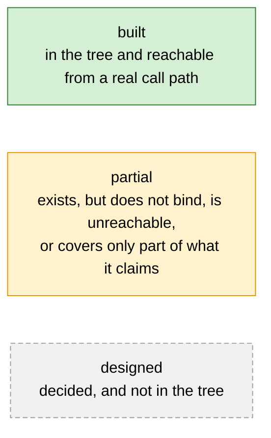
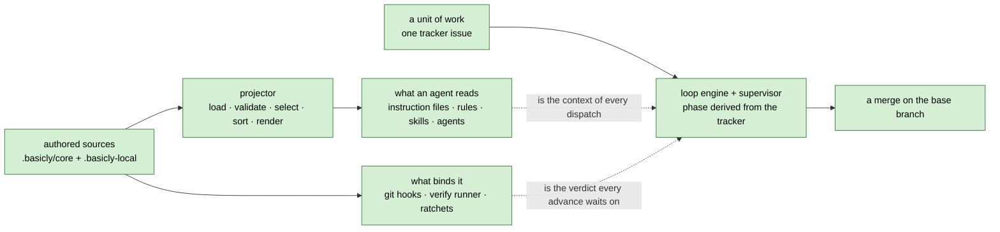
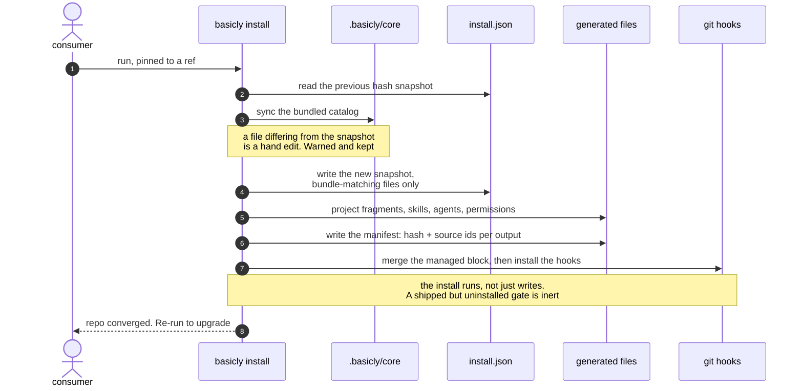
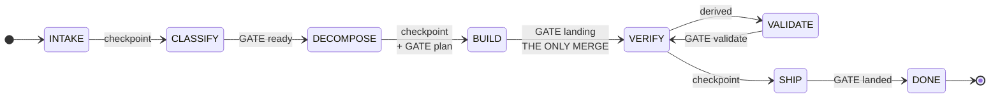
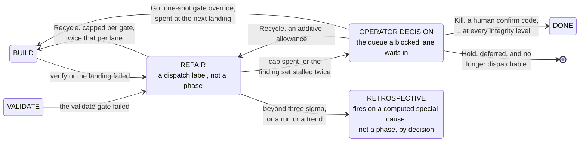
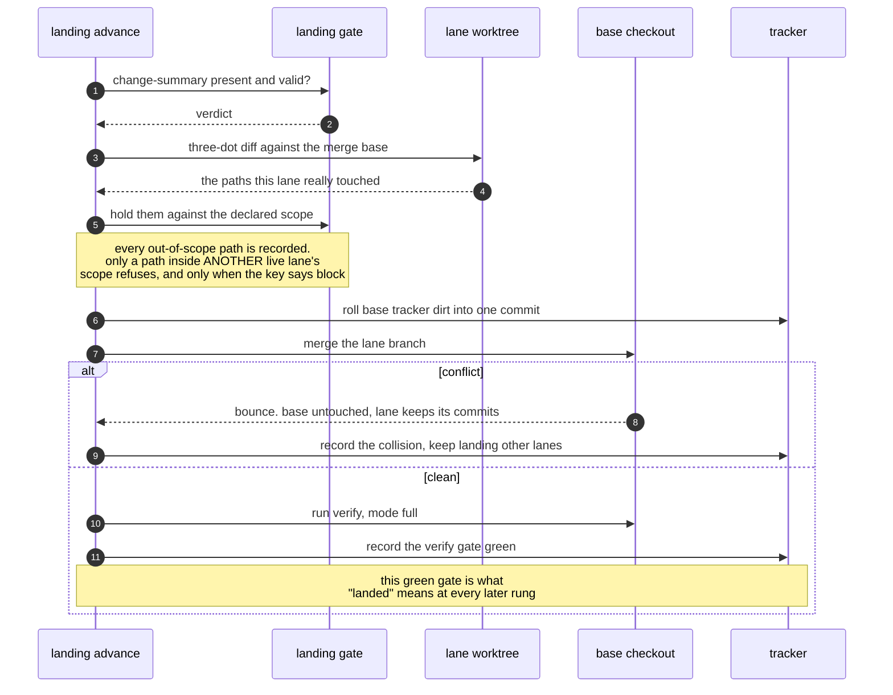
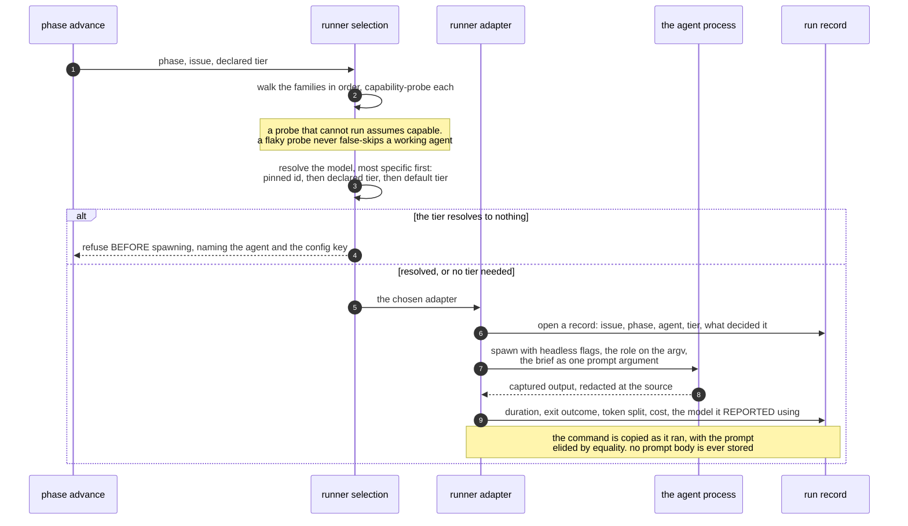
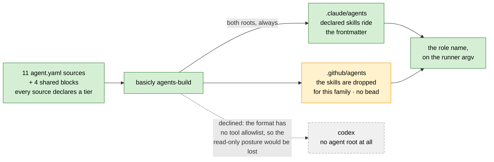
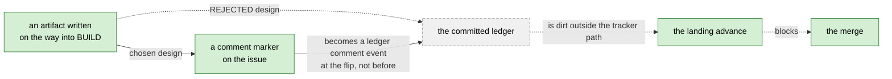
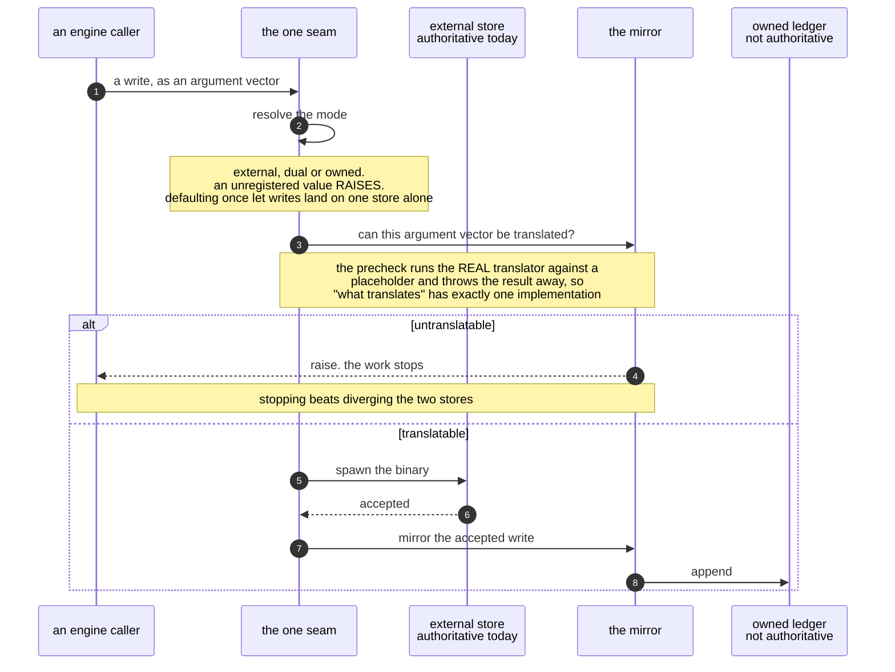

# basicly Architecture

`basicly` **ships a development process to coding agents and then enforces it.** A
repository installs it and gets three things it did not have.

1. Guidance projected into the file each coding agent reads.
2. Deterministic gates that block bad work whether or not a model read the guidance.
3. A workflow engine that drives a unit of work from an idea to a merge, over a tracked
   graph of state.

This file is the authority on the **design**. Read it first.

## Authority and conventions

**The survival rule.** This file must stand alone if the code and every other document
disappears. It must be enough to rebuild the system from scratch. A decision and its
reason stay. An invariant, a constraint and a data shape stay. Everything else is a
candidate for deletion.

**Authority order, when two sources disagree.**

1. **The code wins.** It is the only thing that runs. Where a number is cheap to
   re-derive, this document gives the command instead of the number. A copied figure
   goes stale in silence.
2. **This file wins over every other document.** That covers the requirements
   documents, the implementation plan, the README, the landing page, the tutorial and
   the how-to pages.
3. **A claim about an external interface is never settled from recall.** That covers a
   command-line flag, a model id and a vendor limit. Read this repository's own adapter
   first. Then fetch the vendor's live documentation.

Every measured figure carries the date and, where one exists, the command that
re-derives it.

### Diagram convention

Every diagram uses three node colours. Every node carries exactly one.



**`built` is the strongest claim in the vocabulary, and it is still narrow.** It means
code exists and a call path reaches it. It does not mean a gate binds. A closed work
item proves that code exists. Only a run of the gate on a real input proves that the
gate refuses anything.

A node that reads **`no bead`** marks a gap that nothing tracks.

**Mermaid is the diagram language** [verified 2026-08-16]. It reads as text for a coding
agent, it renders on the hosting site, and it needs no build step. No other candidate
holds all three properties. Each diagram stays small, because mermaid gives a flowchart
no layout control. Every `classDef` sets an explicit text colour, because the theme
otherwise follows the reader's colour mode.

**Only three diagram types are used**: `flowchart`, `sequenceDiagram` and
`stateDiagram-v2`. All three are long-stable. `C4Context`, `block-beta` and
`architecture-beta` are declined. Each one is experimental, so an upstream syntax change
would break a committed block.

## Contents

- [The problem](#the-problem)
- [Core invariants](#core-invariants)
- [Autonomy and integrity](#autonomy-and-integrity)
- [System overview](#system-overview)
- [The distribution model](#the-distribution-model)
- [The fragment model](#the-fragment-model)
- [Skills](#skills)
- [Subagent definitions](#subagent-definitions)
- [Hooks](#hooks)
- [Model tiers](#model-tiers)
- [Configuration](#configuration)
- [Catalog verification](#catalog-verification)
- [The always-on files](#the-always-on-files)
- [Installation and upgrade](#installation-and-upgrade)
- [The CLI surface](#the-cli-surface)
- [The loop](#the-loop)
- [Work isolation and merging](#work-isolation-and-merging)
- [Parallel lanes and the supervisor](#parallel-lanes-and-the-supervisor)
- [Dispatch and the agent-agnostic runner](#dispatch-and-the-agent-agnostic-runner)
- [Cost, forecasting and autonomy](#cost-forecasting-and-autonomy)
- [Roles at dispatch](#roles-at-dispatch)
- [Handoff artifacts](#handoff-artifacts)
- [Gates and enforcement](#gates-and-enforcement)
- [The work tracker](#the-work-tracker)
- [Status: built, partial, designed](#status-built-partial-designed)
- [Decisions and their reasoning](#decisions-and-their-reasoning)
- [Non-goals](#non-goals)
- [Backlog](#backlog)
- [The documentation set](#the-documentation-set)

## The problem

A coding agent is a capable worker with two defects. It does not remember the last
session. It does not know this repository's rules.

Four failures follow. Each needs a different remedy. No remedy substitutes for another.

| Failure | Why it happens | Remedy | State |
| --- | --- | --- | --- |
| The agent does not know the local rules | Every repository has conventions a model cannot infer. Each agent family reads a different file | Write the rule once. Project it into every file an agent reads | built |
| The agent ignores a rule it read | Guidance is a suggestion | A gate. A script that runs whether or not anyone asked, and refuses | built |
| A session ends and work is redone | A crash, a compaction, a rate limit or a change of agent family loses the thread | Derive the current position from durable state. Resuming is a read | built |
| Nobody knows whether any of it works | A rule the model ignores and a skill that never fires both cost context and return nothing | Measure it | barely started |

Guidance and gating are the classic bargain. Most tools of this kind stop there. Rows
three and four are the difference. This project owns the process and the state, and
enforces both in code.

## Core invariants

These hold everywhere. A change that violates one is wrong even if every gate passes.

**The engine disposes. Agents propose.** No model holds authority over the tracker, the
schedule or a required gate. This holds at every autonomy level. An agent's output is a
proposal. Engine code validates it against policy before it becomes state.

**State is derived, never remembered.** The loop phase is a pure function of tracker
state. The engine keeps no durable side-state of its own. A crashed, compacted or
swapped session resumes by re-reading the tracker. Re-dispatching completed work is
therefore structurally impossible rather than merely unlikely.

**Enforcement is code, not a request.** Where a hook can enforce a rule, the rule is a
hook. The prose only points at it. A model that chooses to run a formatter is not the
same thing as a formatter that runs.

**Deterministic first, judged second.** Only a deterministic check may pass a required
gate. Judged output is advisory, or it routes a decision to a human. It is never a green
light.

**Every deterministic step is one command.** An agent that must perform a *sequence* of
mechanical steps proves the engine is missing a command. The tokens, the latency and the
chance of a mechanical mistake are all waste.

**Nothing generated is ever hand-edited. Nothing authored is ever generated.** Users edit
catalog sources. The projector writes outputs. A tool-time guard and a commit-time
backstop defend the one-way street. Convention does not.

**Extension is addition or explicit override, never silent replacement.** There is no
third mechanism and no last-one-wins. An unexplained conflict is an error.

**No committed artifact carries a machine-specific path, username or hostname.**
Redaction runs at the write seam of both stores. A pre-commit hook is the floor under it.

**Evidence over assertion.** A claim in a specification, in a release note or on a README
is backed by something a reader can re-run. An unmeasured claim about behaviour buys
confidence nobody earned.

## Autonomy and integrity

The system assigns two independent levels to a unit of work. Autonomy bounds what the
engine may approve. Integrity bounds how much verification the change must pass.

| Level | Question it answers | Set by | Values |
| --- | --- | --- | --- |
| Autonomy | How much may the engine approve while no human watches? | A human, at grant time | 4 |
| Integrity | How far does a defect in this change reach? | A deterministic rule over declared paths | 3 |

The two are independent. A typo fix in the tutorial, run under a grant that needs no
human, is `docs-and-tests` integrity at `unattended` autonomy.

Both scales once used the letter `L`. Autonomy ran `L0` to `L3` and integrity ran `L1`
to `L3`, so a bare `L2` named neither one. Each level now has a name. The `Code today`
column below carries the identifier the engine still writes.

### Autonomy: how much the engine may approve alone

| Name | Code today | The engine may approve | A human must still approve |
| --- | --- | --- | --- |
| `attended` | `L0` | nothing | classify, decompose, ship |
| `assisted` | `L1` | decompose | classify, ship |
| `supervised` | `L2` | classify, decompose | ship |
| `unattended` | `L3` | classify, decompose, ship | a kill, at every level |

Source: `policy.GRANT_COVERAGE`.

**Originating a proposal is one level stricter than approving one.** Only `supervised`
and above may originate a work type or a child set. Source:
`policy.PROPOSAL_COVERAGE`.

**`attended` is the default.** A repository that configures nothing cannot run an
unattended pass at all. Raising the ceiling is an edit to `basicly.toml`, so opting in
leaves a diff.

**The names describe how much a human watches.** They do not reuse a phase name, a
command name or a gate name, because a level named `ship` and a phase named `ship` would
be one word with two meanings.

### Integrity: how far a defect reaches

| Name | Code today | Paths it claims | Verify mode | Extra gates | Model tier | Rework | Ship |
| --- | --- | --- | --- | --- | --- | --- | --- |
| `docs-and-tests` | `L1` | documentation, tests, the site, changelog fragments, every `.md` file | fast | — | medium | 1 | may be delegated |
| `engine` | `L2` | engine code, the scripts, and every path no clause claims | full | — | high | 2 | may be delegated |
| `consumer-surface` | `L3` | the five frozen consumer surfaces | full | validate-as-consumer, evidence-binding | maximum | 2 | human only |

Sources: `integrity.LEVELS`, `integrity._RULES`, `integrity._SELECTIONS`.

**Each name is the rule clause that assigns the level.** The code already calls them
`docs-and-tests`, `engine-internal` and the five `*-surface` clauses. The names are read
off the tree rather than invented, so a verdict a reader sees printed and a name they
read here are the same word.

**The three names widen outward.** A `docs-and-tests` defect stops inside this
repository. An `engine` defect changes how the tool behaves. A `consumer-surface` defect
breaks something a consumer's own code or configuration is pinned to.

**Four name sets were rejected, each because it makes one word mean two things.**

| Rejected | For which level | Why |
| --- | --- | --- |
| `none` / `decompose` / `classify` / `ship` | autonomy | Every name after the first already names a loop phase |
| `low` / `medium` / `high` | both | An ordinal with a new spelling. The reader still needs a lookup table |
| `fast` / `full` / `full-plus` | integrity | Those are the three verify **mode** names |
| `local` / `engine` / `contract` | integrity | `local` already names the per-machine overlay, `.basicly-local` and `basicly.local.toml` |

**The engine still writes `L0` to `L3`** in the classification marker, in the plan
gate's vocabulary check, in `basicly.toml` and in every `--autonomy` flag value. Those
spellings are a frozen consumer surface, so a rename needs a deprecation window.

## System overview

The system has two planes.

| Plane | Turns | Into |
| --- | --- | --- |
| Distribution | authored catalog sources | the files agents read, and the hooks that bind them |
| Execution | a unit of work | a merge, over a tracked graph of state |

They meet at two points and nowhere else.

1. The loop dispatches an agent whose context is the projected guidance.
2. The loop's verify step runs the same checks the git hooks run.



**Three roles. One repository may hold all three, as this one does.**

| Role | Where it lives | What it is |
| --- | --- | --- |
| engine | `src/basicly/` | normal installable Python |
| catalog | `.basicly/core/` | data, never code |
| consumer | any repository that ran the install | the tree everything is projected into |

Neither tree depends on the other's location. `.basicly/` never holds engine code.
`src/basicly/` never holds catalog data.

### The engine's real dependency direction

The engine is 98 modules in 36 tiers [measured 2026-08-16, `.importlinter`]. A higher
tier may import a lower one. The reverse breaks the build and names both modules. Two
siblings inside one tier may not import each other. That last rule is what makes a tier
a tier and not a bucket.

The contract is **exhaustive**. A new module joins the package only when a maintainer
places it in a tier.

The 36 tiers group into nine bands. Every band may import every band below it, and
nothing above it.

| Band | Modules | Examples |
| --- | --- | --- |
| 1 · entry | 1 | `cli` |
| 2 · drivers | 4 | `supervise`, `loop`, `release`, `usage_report` |
| 3 · loop mechanics | 29 | `merge`, `decompose`, `policy`, `verify`, `decisions`, `handoff`, `plan_gate` |
| 4 · configuration and isolation | 2 | `config`, `worktree` |
| 5 · agent runtime | 5 | `runner`, `lane_log`, `lane_split`, `context_window`, `claude_settings` |
| 6 · projection | 12 | `loader`, `planner`, `renderers`, `skills`, `agents`, `hooks`, `permissions` |
| 7 · records and telemetry | 11 | `run_record`, `artifact_record`, `lens_review`, `spend_calibration` |
| 8 · tracker seam | 7 | `br`, `mirror`, `owned_store`, `br_argv`, `dispatch_phase` |
| 9 · leaf data and pure helpers | 27 | `integrity`, `schema`, `redact`, `roles`, `read_cost`, `ui`, `stemmer` |

`integrity` sits in the bottom band on purpose. It imports nothing from `basicly`. It
therefore stays testable with no repository, no tracker and no configuration file, and
every band above it can reach it.

Two cycles survive as function-level imports. They are `loop` to `supervise`, and
`policy` to `decisions`. The contract declares both as exemptions. When one cycle goes,
the contract turns red until the exemption goes with it.

## The distribution model

Everything a coding agent or a human reads is **generated**. Everything a user edits is a
**source**. Three trees each have one write-owner. The separation is a mechanism, not a
convention.

| Tree | Who writes here |
| --- | --- |
| `src/basicly/` — engine: loader, planner, renderers, CLI, loop | basicly maintainers; ships with the tool |
| `.basicly/core/` — managed catalog: fragments, skills, agents, hooks, targets, templates, schemas, models, permissions, kit | `basicly install` only |
| `.basicly/state/install.json` — install provenance: version, timestamp, per-file hashes | `basicly install` only |
| `.basicly-local/` — user overlay, path-configurable | the consumer repo's users |
| `basicly.toml`, `basicly.d/*.toml`, `basicly.local.toml` — configuration | the consumer repo |
| Generated artifacts: `AGENTS.md`, `.claude/CLAUDE.md`, `.github/copilot-instructions.md`, scoped rules, skill and agent roots | `basicly build` and its siblings only |
| `.basicly/generated-manifest.json` | `basicly build` only |

### The catalog

```text
.basicly/
  core/
    fragments/<category>/<id>.fragment.yaml
    skills/<skill-name>/skill.yaml        # plus references/, scripts/, assets/
    agents/<slug>/agent.yaml              # plus agents/blocks/<id>.block.yaml
    hooks/*.py + hooks.yaml               # git-stage and agent hook scripts, and their manifest
    models/{anchors.yaml,model-map.json,model-map.schema.json}
    permissions/permissions.yaml
    rubrics/*.rubric.yaml
    schemas/*.schema.json
    targets/{claude,copilot,codex}.yaml
    templates/{claude,copilot,codex}/*.j2
    kit/{tracker,tier}/*.py               # portable modules deployed into a consumer
  generated-manifest.json
```

**Every catalog source is YAML and deliberately not Markdown.** Some coding agents
discover a skill by a broad scan for `SKILL.md`. A `SKILL.md` *source* would let an agent
load the catalog copy and the projected copy at once. Fragments follow the same rule.
YAML beats Python here for two reasons. It needs no code execution, and a block scalar
keeps prose lossless. `basicly catalog lint` refuses a Markdown-named source. It also
refuses a second YAML extension.

### The projection pipeline


**Determinism is a property, not an accident.** The sort is total. It orders by priority
descending, then by category, then by id. Two builds on identical sources produce
byte-identical output. A diff therefore only ever shows a real change.

**Selection has exactly four axes.** Every output declares which of them it uses.

| Axis | Declared on | Effect |
| --- | --- | --- |
| `applies_to` | the fragment | names the target families it is for, or `all` |
| `filter.applies_to` | the output | names which of those values the output accepts |
| `has_scope` / `exclude_scoped` | the output | restricts an output to path-scoped fragments, or drops them from a baseline |
| `technologies` | the source | gates the whole source on the consumer's declared stack |

The third axis is why one fragment set yields both an always-on file and a set of
path-gated rules. For a target that scopes, no fragment appears in both.

**The manifest is the memory of the projection.** It records a content hash and the
ordered fragment ids per output. Three things read it.

1. `basicly check` recomputes it to detect a hand edit.
2. The sweep deletes an output that dropped out of the plan. That is how a retired output
   reaches a consumer.
3. The generated-file commit hook uses it to decide whether a staged generated file still
   matches its sources.

**Path interpolation is checked, not trusted.** An output path that resolves outside the
repository root is refused. A fragment id holding a path separator or a pure-dot value is
refused before it can reach a path template.

### Targets

Three targets ship, all enabled.

| Target | Output | Filter | Soft cap |
| --- | --- | --- | --- |
| claude | `.claude/CLAUDE.md` | `all` plus `claude`, scoped excluded | 9000 chars |
| claude | `.claude/rules/<id>.md`, one per scoped fragment, carrying a `paths:` frontmatter key | `all` plus `claude`, scoped only | — |
| codex | `AGENTS.md` | `all`, scoped **inlined** | 16000 chars |
| copilot | `.github/copilot-instructions.md` | `all` plus `copilot`, scoped excluded | 9000 chars |

**Codex inlines a scoped fragment because it has nowhere to put one.** Codex is not short
of steering files. It supports a nested `AGENTS.md`, an override file, fallback
filenames, repository-checked-in skills, project subagents and a sandbox policy. What it
lacks is a **type**. Codex has no glob-based or pattern-based instruction scoping in its
discovery, in its configuration reference or in its skill frontmatter. Directory
placement is its only scoping axis. This project's scopes are globs.

Codex also **never loads a nested `AGENTS.md` below the current directory**. It walks
from the project root down to the current directory and stops. A file at
`src/foo/AGENTS.md` therefore contributes nothing when Codex runs from the repository
root. Inlining preserves correctness. A nested file is rejected, not deferred.

**Two names on the Codex surface mislead a reader.** Codex "Rules" (`.codex/rules/`) is
a sandbox command-execution policy, not an instruction rule. A file-based custom prompt
is deprecated in favour of a skill, and it is user-scope only, so a repository cannot
ship one.

**Copilot gets no path-scoped twin, by decision.** One editor loads the Claude rules root
and the Copilot instructions root together, with no deduplication. A twin therefore
double-loaded every path-scoped rule for every consumer of that editor. A scoped rule is
single-sourced to the Claude rules root instead. The accepted cost falls on the
server-side Copilot surfaces. Pull-request review and the cloud agent keep only the root
instructions file.

## The fragment model

One fragment is one policy, practice or decision: a YAML source with a body written as a
block scalar, projected to Markdown.

| Field | Required | Values | Notes |
| --- | --- | --- | --- |
| `id` | yes | kebab-case, unique | a duplicate across core and overlay is a hard error |
| `description` | yes | one line | |
| `category` | yes | `boundaries`, `code-style`, `commands`, `decisions`, `design`, `hooks`, `project`, `security`, `skills`, `testing`, `tools`, `ci-cd`, `quirks` | a closed vocabulary; unknown values are refused at load |
| `applies_to` | yes | target names or `all` | |
| `priority` | no | `critical` (4), `high` (3), `medium` (2, default), `low` (1) | sorts descending |
| `scope.paths` | no | glob list, default `["**"]` | a non-default value makes the fragment scoped |
| `status` | no | `active` (default), `draft`, `deprecated` | only `active` is projected |
| `technologies` | no | controlled list | untagged means universal |
| `source` | no | `core` (default) or `user` | inferred from the load root when omitted |
| `override` | no | bool, default false | must be true to replace a core fragment |
| `replaces` | no | list of fragment ids | those core fragments are removed when this one is active |
| `extends` | no | list of fragment ids | declared and validated; nothing consumes it today |
| `enforced_by` | no | list of commands | each must be cited in the body, see below |

**The extension mechanism is two rules and no exceptions.**

1. The planner removes every core fragment named in an active user fragment's `replaces`.
2. The loader raises on every load when any of three conditions fails. A fragment that
   declares `replaces` must set `override: true`. Every replaced id must exist in the
   merged set. Two user fragments may not replace each other.

**`enforced_by` closes the loop on the context-minimalism rule.** A fragment that claims
a command enforces its rule must cite that command in its body. `catalog lint` refuses a
fragment that does not. The rule "point at enforcement instead of restating it" is
therefore a check and not advice.

**On disk today** [measured 2026-08-16, `basicly catalog list fragment`]:

| Measure | Count |
| --- | --- |
| core fragments | 21 |
| overlay fragments | 3 |
| category directories in use, of 13 declared | 8 |
| path-scoped fragments, each becoming its own rules file | 4 |
| target-specific defaults, one per family that takes them | 2 |

**The category `hooks` labels a fragment that *describes* hook usage.** It is not the
mechanism that ships a hook script. [Hooks](#hooks) is that mechanism.

## Skills

A skill is on-demand guidance. It is a directory the agent loads when it decides the skill
is relevant, or when a path glob triggers it. Until then it costs only the line that
advertises it.

**Two projection roots. Both mandatory. Both always written.**

| Root | Who reads it |
| --- | --- |
| `.claude/skills/` | one family's only project skill root |
| `.agents/skills/` | the open-standard root the other families discover |

Neither root is optional. A root that only some commands write is how a second root
drifts unnoticed.

**A skill source directory projects whole.** A skill may bundle references, scripts and
assets beside `skill.yaml`. The projector renders the discoverable `SKILL.md` with a
generated marker. It copies every other file verbatim, bytes and mode. A skill can
therefore ship a long reference guide or a fixer script.

**The invocation axis is declared, not inferred.** It is required, and it is one of two
values.

| Value | Carries a description | Costs context | When it loads |
| --- | --- | --- | --- |
| model-invoked | yes | on every turn, in the listing | when the model judges it relevant |
| user-invoked | no, and lint enforces the empty pairing | nothing | when a human types its name |

The axis is declared and never guessed. "Does this entry route correctly" is not a
well-posed question until the entry says whether routing applies to it. The axis is
therefore a prerequisite for the routing evals, and not bookkeeping.

**One root requires a description and the other does not.** A user-invoked skill
therefore emits a synthesized description on the standard root. That family rejects a
file with no description.

**The projected directory is mirrored and the root itself is owned.** A rebuild prunes a
resource the source dropped. Deselection of a technology prunes the whole directory. The
check also reports any entry in the root that no source accounts for. That covers a
hand-authored skill file, a loose README and a projection whose source was deleted.
Without the report, a skill the projector never knew about passes every gate and reaches
only one agent. The check reports such an entry and never prunes it, because the
projected copy is the only copy there is.

**Technology scoping is the core-versus-optional axis.** An untagged skill is universal
and always ships. A tagged skill ships only when the consumer selects that tag in
configuration. Technology-specific and situational guidance belongs in an optional skill
and never in an always-on file. Enforcement stays in the deterministic hooks. A skill
carries the judgment and the pointers a linter cannot.

**A skill is not free, and the cost sits in the listing rather than the body.** The whole
skill listing is budgeted against a fraction of the context window. On overflow the host
drops descriptions **starting with the least-invoked skills**. That is a feedback loop
and not a flat cost. The host truncates a rarely-invoked skill first, which makes that
skill harder to invoke. Both the per-entry cap and the listing budget are gated.

**A skill's frontmatter can take a path glob.** The glob limits the skill, and it also
triggers automatic activation. It buys always-loads-on-a-matching-file behaviour at
**zero** always-on characters. The key is not in the portable subset. It is therefore
declared under a per-target vendor fence, and emitted only into the root that
understands it. The general rule this settles is that a host-specific capability is
expressible without the portable artifact absorbing it.

**Skill scope precedence is the inverse of agent scope precedence.** For a distribution
tool that asymmetry is load-bearing.

| Artifact | Precedence, strongest first | Where `basicly install` writes |
| --- | --- | --- |
| agents | managed → project → user | project, the middle scope |
| skills | enterprise → **personal** → **project** | project, the **weakest** writable scope |

A developer's personal skill of the same name therefore overrides a shipped skill in
silence. An identically named agent would not. Nothing in the projection makes that
visible to the consumer.

**Lint enforces the specification's naming rules.** The name must match the directory. It
must be 1 to 64 lowercase alphanumeric-or-hyphen characters, with no leading, trailing or
consecutive hyphen. Lint warns when a body runs long. It also warns when a file reference
reaches more than one level deep. Both warnings follow the specification's
progressive-disclosure guidance.

**On disk today** [measured 2026-08-16]:

| Measure | Count |
| --- | --- |
| skill sources | 41 |
| projected into each of the two roots, after the technology filter | 36 |

## Subagent definitions

Subagent definition files are the fourth catalog kind. They are generated and never
hand-edited.

**Composition.** Every agent fills five ordered body slots. They are role, startup,
process, output contract and constraints. Each slot holds a list of references to shared
building blocks, or inline Markdown. Four shared blocks exist, under a reserved slug.

**The description is authored as four fields.** They are purpose, triggers, returns and
posture. The projector joins them, so no part of a delegation-quality description can be
forgotten.

**The tool list is a mandatory explicit allowlist.** An agent never inherits every tool
in silence. A posture that declares read-only may not grant a write tool. Lint refuses a
source that does.

**Tool names are not translated.** The second family's published alias table accepts the
first family's PascalCase names as first-class, and it matches without regard to case.
One declared name therefore resolves on both families. The table is pinned as reviewed
data for two reasons. It drives the read-only posture check. It also lets lint refuse a
name that resolves to nothing. That refusal matters, because one family drops an
unrecognised entry with no error, and the other refuses to launch and says so. An
unrecognised entry therefore fails **safe**. The residual risk is a useless agent, not a
lost guarantee.

**A tier names a portable model tier.** The four values are low, medium, high and
maximum. The engine single-sources them into an enum on the agent schema. A tripwire test
keeps the two in step. Lint refuses a source that declares no tier.

**No projected agent file carries a provider model id.** That is a decision, and it rests
on two independent reasons.

1. A provider id is not portable across agent families. Two surfaces spell the same model
   differently.
2. The tier-injection mechanism leaves a definition that pins its own model alone. A
   projected model line would therefore **disable** tier injection rather than implement
   it.

The schema keeps the old key as a deprecated property, so lint owns the actionable
message. Without it the schema emits a bare "additional properties are not allowed". The
key also stays on the reserved-frontmatter list, so the per-family passthrough cannot
smuggle an id back in.

**Two roots are written and both are checked**, one per family that has an agent root.
The second root exists for two reasons. That family's *cloud* agent reads only its own
root, and its command-line tool discovers the first root through an undocumented path.
Its custom agents also support a tool allowlist, so the read-only posture survives the
crossing.

Double loading does not happen. The deduplication key is the file name without its
extension, so the two files collapse to one agent. Only the first root receives the
per-family passthrough.

**A third native root is declined, not overlooked.** The Codex subagent format has no
tool allowlist. A Codex copy would therefore drop the mandatory allowlist that the
read-only posture check depends on. That is a lost guarantee and not a format cost. It
would also fork the renderer, the drift check and the generated marker. Codex receives
the same guidance through `AGENTS.md` and the standard skills root.

**No agent root costs always-on budget, and the saving is structural.** Four facts hold,
each verified against a live host rather than taken from vendor guidance.

1. Only an agent's name and description load at session start.
2. The body never enters the parent's context.
3. Only the final message returns.
4. A subagent runs in an isolated context window. A dispatch's working set is therefore
   never charged to the session that spawned it.

**A projected agent definition does not reach a running session's subagent registry**
[measured 2026-08-16]. The measurement gave a role write tools in the catalog, ran
`basicly agents-build` over both roots, and then dispatched that role. The dispatch
reported its live tools as the pre-change set. A definition change therefore takes effect
at the next process start. A consumer reaches for a conversation reset first, and that is
the wrong lever.

**On disk today** [measured 2026-08-16]:

| Measure | Count |
| --- | --- |
| agent sources | 11 |
| shared blocks | 4 |
| files projected into each root | 11 |

## Hooks

Hook scripts are first-class catalog artifacts. They are the deterministic, gating
counterpart to fragments and skills. A manifest describes each one tool-agnostically.
Every script is standalone Python with no runner interface, so the manifest could drive a
different runner without a script changing.

**Each entry declares** an id, a script and a stage. It may also declare whether filenames
are passed, whether it always runs, its technologies, a matcher and a manager. The manager
routes the hook to one of three surfaces.

| Manager | Surface it writes | Stages in use | Hooks today |
| --- | --- | --- | --- |
| git | a managed local block in the pre-commit configuration, foreign hooks preserved | pre-commit, commit-msg, pre-push | 11 |
| claude | the agent-hook section of that family's settings file | pre-tool-use, post-tool-use | 3 |
| copilot | one managed JSON file per hook under that family's hooks directory | pre-tool-use, post-tool-use | 1 |

**What ships today** [measured 2026-08-16, `.basicly/core/hooks/hooks.yaml`]: 15 declared
specs.

| Stage | Count | Hooks |
| --- | --- | --- |
| pre-commit | 8 | identity guard · fast-check runner · catalog lint · secret scanner · tracker path scanner · internal-info scanner · kit boundary check · generated-file backstop |
| commit-msg | 2 | conventional-commit check · tracker-id check |
| pre-push | 1 | full-check runner |
| pre-tool-use | 2 | generated-file guard · shell-footgun guard |
| post-tool-use | 2 | tool-usage counter, which rides both agent managers |

**A gate that is shipped but never installed is inert.** That is the exact failure that
once let unguarded commits through. So `basicly hooks-build` projects the manifest **and
then runs the installer** for every managed stage. It does not only write the
configuration.

**Three hooks carry reasoning a reader cannot recover from the script.**

The secret scanner blocks a commit whose staged added lines carry a likely credential. An
inline allowlist escapes a reviewed false positive.

Its sibling scans for an internal-only identifier. That covers a company domain, an
internal host, a machine username and a private repository name. Each one publishes in
silence, because it reads as ordinary text to anyone outside. **Its denylist is
deliberately not in the script.** A gate that hard-codes the strings it suppresses would
publish them into this repository, and into every consumer that installs the catalog.
Pre-commit also runs in a continuous-integration job whose logs are public. The tokens
therefore live in the gitignored per-machine configuration as named rules, and the report
prints only the rule name. The scanner is inert until a consumer configures it, so no
consumer is blocked by a list they did not write.

**The identity guard blocks a commit whose git identity is unset or a hostname fallback.**
It is generic and holds no personal data. It validates the **effective** identity that git
will stamp. It resolves author and committer with the environment above the
configuration, because a runner may overlay an identity environment variable. A check on
the configuration alone would miss that override.

**The tool-usage counter is token-free telemetry.** It tallies the pipeline head of every
shell command into a self-ignored file. It resolves the head *past* a wrapper. A wrapper
here is the runner, the package executor or the environment setter, together with their
subcommands, flags, flag values and variable prefixes. The counter therefore credits the
wrapped tool and not only the wrapper. The file is the input for a cull of idle tools and
skills from the catalog.

**Why pre-commit and not a compiled runner.** The hooks are already runner-agnostic, so
the projection layer holds the only runner-specific code. The decisive fact is that
**every projected hook shells out to the Python runtime**. A committer needs that runtime
whatever orchestrates the hooks. A static binary's headline advantage is that it needs no
runtime, and that advantage buys this project nothing. It would add a
binary-acquisition problem with no native answer.

Four triggers reopen the decision.

1. Consumers stop reliably having the runtime on `PATH`.
2. The project drops the runtime requirement for the checks themselves.
3. Hook execution speed becomes a **measured** complaint that parallelism would fix.
4. The provisioning seam regresses beyond what the fallback covers.

The manager field and the interface-free scripts keep the decision cheap to reopen.

**A consumer's own hooks survive.** The projector merges its managed block into an
existing configuration. It preserves a foreign repository and a foreign hook, and the
merge is idempotent. This repository dogfoods the catalog directly, so its own pre-commit
configuration points straight at the catalog scripts. One hook in it is the Markdown
linter. That one is a hand-maintained consumer block the projector preserves and does not
own.

## Model tiers

A catalog source declares a **portable tier**. The engine resolves a concrete model id at
dispatch, from committed data.

An anchors file is the reviewed input. It holds one anchor model per tier and vendor,
plus a surface table and a capability rule. A generator resolves it into a committed map.
A published schema validates that map.

**The map is indexed on three axes, because all three change the answer.**

| Axis | Why it is separate |
| --- | --- |
| tier | the whole point of the abstraction |
| vendor | each vendor names and prices its own models |
| surface | the same model can cost several times more through one surface than another, and one surface may cap a model's input where the vendor's own publishes no cap |

**An unavailable cell records a status and a reason, and deliberately carries no model
key.** A consumer that reads the cell therefore fails loudly. Nothing demotes it onto
another tier's model in silence. Resolution refuses the dispatch and never substitutes.

**Two constraints keep the whole mechanism offline.**

1. The generator fetches upstream data at authoring time and at check time only. It never
   fetches in the dispatch path, and it has no verify-check entry. No agent dispatch
   depends on the network.
2. The drift check **reports** and never writes. A community-contributed upstream edit
   must surface as a red check. It must never change which model runs someone's code.

A test gates the committed map's shape offline.

**Two independent resolvers exist, and the difference is deliberate.**

| Resolver | On an unavailable cell | Why |
| --- | --- | --- |
| in-harness | raises | a dispatch that cannot honour its tier is a bug |
| portable kit — no dependencies, no imports, no `PATH`, no network, no subprocess | fails closed and quiet, leaving the spawn untouched | it runs on machines that may hold no map at all |

**The tier reaches no spawn today.** Nothing projects a model id, by decision. The
injection that would resolve one at spawn is a hook. That hook exists in the kit and is
not installed. The tier is therefore declared, gated by lint, and inert.

On one family the installer **declines with a nonzero exit**. Across repeated probes no
tool-boundary hook fired for an agent spawn on that family. The documented contract for
such a hook is approve-or-deny, not rewrite.

## Configuration

Three files, layered lowest to highest, with a fourth layer for the current process.

| File | Committed | What belongs here |
| --- | --- | --- |
| `basicly.toml` | yes | the repository's declaration; the **only** source for projection config |
| `basicly.d/<id>.toml` | yes | one lane's additions, so two lanes never write one file |
| `basicly.local.toml` | no, gitignored | per-machine harness choices, and the internal-identifier denylist |
| session overrides | no | this process only |

**The merge is a key-level shallow replace, with exactly one exception.** A key set in a
later layer replaces the earlier value whole. A per-machine list is therefore taken as it
stands, and never concatenated. The machine says *instead*.

The one exception is the verify check list. The drop-in layer **appends** to it in
filename order, because a drop-in fragment is one lane's *addition*. The per-machine layer
still replaces the whole list.

**Projection configuration is repository-level only.** The path and catalog sections shape
repository-committed outputs. They are read from the committed file alone, never from the
per-machine overlay.

**Every ratchet number in a drop-in is a delta, never a total.** Two lanes that each add
one suppression would both record the same total, while the merged tree holds one more.
Addition composes in any landing order. A total does not. A delta that raises a frozen
baseline is refused. The escape is an explicit rebaseline key with a non-empty reason.
The engine counts and prints every such escape.

**Both files are schema-checked on every load. The schema is an allowlist over the whole
configuration surface.** An unrecognised section or key raises. The message names the
file, the containing section, what that section accepts, and which sections accept a
similar name.

A key the engine ignores leaves the file stating one behaviour and the engine performing
another. A gitignored overlay has no diff to review and no other gate. The only symptom
is the default the key was written to replace. The allowlist therefore covers the whole
surface rather than this module's readers. Two declared entries have no reader in the
configuration loader at all.

**The tree decides which schema does the checking, not the process.** A repository that
ships its own engine source is checked against the schema declared in *that* source. The
reader parses it statically on every validation. This repository is such a tree, and so
is each of its lane worktrees.

Without that rule a landing could not admit a lane that adds a key. The landing runs from
the base checkout, so the engine that validates the lane's configuration is the pre-merge
one. It refused a name the lane's own code introduces one commit later.

The static read is deliberate. The tree under test has not merged. An import would run a
second engine inside the process that lands it, and the question is a set of names rather
than a behaviour. It fails closed. A schema the reader cannot model falls back to the
running engine's schema, and the refusal then names the ordering rule instead of reading
as a typo.

**The refusal is unconditional. Forward compatibility is the accepted cost.** There is no
warn-then-error staging, and no narrowing to a near-miss of a known key. A repository
pinned to an older engine, whose configuration carries a newer key, fails until it
upgrades or removes the key.

| Softer option | Why it was rejected |
| --- | --- |
| warn, then error in a later release | The engine ships from the trunk, so a warn phase has no graduation point. It would also go unread |
| refuse only a near-miss of a known key | A genuinely novel key stays silent. That is the same hole, one generation on |

The message bounds the cost. It names the engine's version, and it says that an upgrade is
one of the two fixes.

## Catalog verification

Two layers, deterministic always first.

| Check | Where it runs |
| --- | --- |
| Required fields, known category, priority, status and target; extension-field types | the loader, on every list, build and check |
| Duplicate fragment id across every root | the loader, on every load |
| Replacement integrity: the target exists, the override flag is set, no mutual user-to-user replace | the loader, on every list, build and check |
| Source format: schema validity, no Markdown-named source, a single YAML extension | `basicly catalog lint`, wired as a pre-commit hook and a CI step |
| Composition rules: block references resolve, every tool resolves, a read-only posture grants no write tool, the composed body stays under the strictest reader's prompt ceiling | `basicly catalog lint` |
| Routing: positive top-k, pairwise negatives, a description-collision ceiling, a ratcheting rank-1 floor | `basicly catalog lint` |
| Duplicate or near-duplicate bodies, contradictions from a curated pair dictionary, vague phrases, scope overlaps | `basicly catalog verify` |
| Semantic review: an agent reads the rendered files for contradiction and ambiguity | `basicly catalog review`, advisory, always exits zero |

**A deterministic check catches a large class cheaply.** That class is a duplicate id, a
missing field and an unknown vocabulary value. A semantic problem needs a capable reader.
An example is a contradiction that parses fine and reads badly to a model. Both layers run
against the same merged fragment set. The judged layer is never a merge gate.

**The routing gate is the deterministic, lexical, free tier of the evidence layer.** Its
assertion is that the declared owner must **outrank** the entry. A bare "must not rank
first" passes vacuously on a prompt that matches nothing. The gate reports a rank-1 rate
against a floor that ratchets and cannot be lowered.

## The always-on files

`AGENTS.md`, `.claude/CLAUDE.md` and `.github/copilot-instructions.md` are the foundation
every other artifact builds on. A noisy or ambiguous baseline passes that failure to
everything downstream.

**Six properties they must keep.**

1. **Point at enforcement. Do not restate it.** Where a rule is mechanically enforced, the
   always-on file names the command that enforces it. Prose is reserved for what a linter
   cannot check. That means a judgment call, an escalation policy, and when to ask instead
   of guess. A restatement of what a linter already enforces measurably hurts agent task
   success and inflates cost.
2. **An enforced rule is one line. A judgment rule is prose.** The judgment section is the
   shorter of the two.
3. **No duplication across the three files.** The shared always-applicable set feeds all
   three. Each family's file adds only content that differs.
4. **Each file is self-contained.** Two of the three families do not reliably import a
   shared file, so each file inlines the shared content. An agent never needs a second
   file to understand the baseline.
5. **A scoped fragment stays out of the baseline** for the two families that can scope. A
   language-specific rule then costs no context budget on an unrelated task.
6. **Stable ordering**, so a diff stays minimal.

**The caps are a discipline choice, not a platform limit.** One host's own degradation
warning is far above these numbers. One vendor removed its former hard character limit
and now only advises a shorter file. The third reads its file up to a configurable byte
cap. **A cap warning means split into a scoped rule. It does not mean shrink the prose.**
The cap counts **characters**, not bytes, so a byte count overstates a UTF-8 baseline by
its multi-byte characters.

Measured from the projected files, and regenerated and gated on every commit:

<!-- docs-claims:begin always-on-sizes -->

| Surface | chars | cap | headroom |
| --- | --- | --- | --- |
| `.claude/CLAUDE.md` (claude) | 8895 | 9000 | 105 |
| `AGENTS.md` (codex) | 14343 | 16000 | 1657 |
| `.github/copilot-instructions.md` (copilot) | 8994 | 9000 | 6 |

<!-- docs-claims:end always-on-sizes -->

**Which surface binds depends on the tier.** The tightest always-on surface binds for an
always-on fragment. `AGENTS.md` binds for the **path-scoped** tier, because a scoped
fragment costs it around a thousand characters and costs the other two nothing.

**The cost effect of scoping is asymmetric.** It removes a fragment from the two
baselines that can scope, and it **adds** that fragment to the one that inlines. The codex
cap was raised rather than lowered, because an audit of an overrun found that the excess
*was* the scoped tier. Eviction of always-on lines would have charged all three families
to fix one, and it would have left the cause standing. The trade gave up one thing. The
old cap also stood proxy for the vendor's claim that adherence degrades with length, and
this repository has never measured that claim.

**What is known and what is not.** Both families that were tested reproduce the great
majority of their baseline's rules when asked, against a small no-guidance control. The
"cliff already crossed" reading is therefore **refuted**. The content is not invisible at
this size. That does **not** settle the operational question. Nothing measures which
baseline rules *bind* while an agent works. Recall under a direct cue is an upper bound,
and it confirms the mechanism only. The cap policy is therefore asymmetric. **A lower cap
is ordinary housekeeping. A higher cap still has no evidence behind it.**

## Installation and upgrade

**`install` and `uninstall` are ordinary command-line verbs** [measured 2026-08-16,
`basicly --help`]. They are not special bootstrap commands. `uvx` is only how a consumer
reaches a `basicly` executable when the machine has none. It is not part of the verb.

Three ways reach the same two verbs.

| How a consumer invokes it | When to use it |
| --- | --- |
| `uvx --from git+https://github.com/niksavis/basicly@<ref> basicly install` | first install, and every upgrade of a pinned ref. Nothing is added to `PATH` |
| `uv run basicly install` | inside a checkout of this repository, where `basicly` is the project |
| `basicly install` | when a `basicly` executable is already on `PATH` |

**`basicly install` does not put `basicly` on `PATH`.** It syncs the catalog into the
repository and projects every artifact. Nothing in it installs the Python package. A bare
`basicly install` therefore works only after the consumer makes the executable reachable,
for example with `uv tool install`.

**Uninstall follows the same rule.** `basicly uninstall` and `uvx ... basicly uninstall`
are one verb reached two ways.

**One idempotent converge command.** An earlier design staged an init, then a build, then
each projector, and a separate update command. Init was never a technical prerequisite,
because everything it does is idempotent and skips what exists. One command therefore
serves both the first install and every upgrade.

Its contract, in order:

1. Materialize or sync the bundled core.
2. Migrate and prune legacy layouts.
3. Scaffold the overlay and the configuration, **only if missing**.
4. Keep the authoring-repository guard.
5. Rebuild every artifact and install the hooks.

**The catalog is versioned as a whole and pinned as a whole.** A hook configuration pins a
revision the same way. A re-run of the install from a newer pinned ref is the only action
that moves a consumer to a newer catalog version. That action is explicit and reviewable.

**Provenance is what makes an upgrade safe.** Install records a per-file hash snapshot of
the core as materialized. A later install overwrites a changed file and deletes an
upstream-removed one. The snapshot distinguishes an upstream change from a user's hand
edit.

| File state | What the sync does |
| --- | --- |
| matches the snapshot | upstream-owned. Overwritten |
| differs from the snapshot | a hand edit. Warned and kept, unless `--force` |
| unknown to both bundle and snapshot | always kept |

The post-sync snapshot records only bundle-matching files, so a kept edit stays protected on
the next run.

**Install writes the managed core and the state only.** It creates the overlay directory
when missing, and never writes fragment content there. It never overwrites an existing
configuration file. When an existing file lacks a section the shipped default now carries,
install names the section in a hint instead of editing.

**An install into a consumer repository, drawn in order.**



**Uninstall removes everything managed.** That covers the core, the state, every
manifest-listed generated file, every projected skill and agent that carries the generated
marker, and the managed hook block. When nothing managed remains, uninstall deletes the
configuration and removes the git hooks. It preserves the overlay and the configuration
unless the consumer purges. It refuses to run in the authoring repository, where the core
*is* the catalog source.

**Technology scoping applies at projection time, not at sync time.** The core sync stays
full, which keeps provenance simple. The projectors and their checks skip a source that
does not overlap the selection. A narrower selection converges on rebuild and strands
nothing. Fragment outputs recompose, and the manifest sweeps the rest. An excluded skill
or agent is pruned when it carries the generated marker. An excluded managed hook is
stripped from the configuration files.

**The managed catalog ships inside the distribution.** The build projects the dogfooded
source tree into the wheel, and the source distribution carries it, so a direct-from-git
install resolves it. The locator prefers a source checkout and falls back to the packaged
copy.

**A bootstrap shim exists for a consumer with no runtime.** It is a POSIX shell script and
a PowerShell script. Each installs the runtime from its vendor when the runtime is absent,
then runs the same pinned install in the current repository. Both fail fast outside a git
repository.

**Everything lives in plain, git-tracked files.** No daemon, no hidden state, no network calls
at build time. `git diff` and `git blame` are the audit trail, and `basicly check` is the
offline staleness gate.

## The CLI surface

**28 top-level commands. Nine of them are subcommand groups** [measured 2026-08-16, count
`subparsers(cli._build_parser()).choices`].

They fall into three surfaces.

| Surface | For | Commands |
| --- | --- | --- |
| lifecycle | a consumer repository | install, uninstall, status, health, brief |
| catalog | an author of catalog sources | build, check, the four build/check pairs, usage, catalog, rubric |
| harness | the development loop, in either repository | worktree, verify, policy, decompose, loop, commit, runner, tracker, board, release |

**Lifecycle.**

| Command | Behaviour |
| --- | --- |
| `basicly install` | Idempotent converge: materialize or sync the core, migrate legacy layouts, scaffold overlay and config without overwriting, then build, skills-build across all default roots, agents-build, hooks-build with activation. First install and every upgrade |
| `basicly uninstall [--purge]` | Remove everything managed, preserve the overlay and config unless purging, refuse in the authoring repo |
| `basicly status [--json] [--fleet]` | Read-only snapshot: installed catalog version against running engine version, drift summary, per-manager hook state, technology selection, overlay counts. Never writes, always exits zero. The fleet flag rolls it across the housed repositories as one JSON payload |
| `basicly health [--json] [--window N] [--fleet]` | Read-only per-agent health scoring and behavioural drift from the run-record log: dispatch failure rate, a rework signal, a bounded score, and a rolling-baseline drift flag. Never writes, always exits zero |
| `basicly brief <issue-id>` | Print the brief the loop would dispatch for one issue, without dispatching it. Shares the dispatch renderer rather than re-rendering, because a preview that differs from the dispatch is worse than none |

**Catalog.**

| Command | Behaviour |
| --- | --- |
| `basicly build [--target NAME] [--verify]` | Render enabled targets, write only changed bytes, update the manifest, warn on cap overrun. The verify flag runs the content checks first and writes nothing on failure |
| `basicly check` | Byte-for-byte staleness check of generated files and the manifest; exit 1 on mismatch, no auto-fix |
| `basicly skills-build [--root ...\|--all-default-roots]` / `skills-check` | The same build and check contract for the skill catalog, mirrored per root |
| `basicly agents-build` / `agents-check` | The same contract for the agent catalog, always both roots, with no root-selection flag |
| `basicly hooks-build [--no-install]` / `hooks-check` | Materialize hook scripts, merge a managed block into the hook config preserving foreign hooks, then install the git hooks so the gates are active. The check reports projection drift and warns when the git hooks are not installed |
| `basicly permissions-build` / `permissions-check` | Project the agent-permissions deny-list into the co-owned settings file: ensure-present, consumer entries preserved, nothing pruned, with a semantic subset drift check |
| `basicly usage report` | The tool and skill counts the telemetry hook recorded, and the catalog skills never used: the culling input |
| `basicly usage forecast` | Forecast error per dispatch, over local run records and committed markers. Refuses to compute an error for a record missing either half and reports those as unpaired, so an empty report explains itself |
| `basicly usage tuning` | Advise every governed factory parameter from the recorded dispatches: the value in force, the outcome distribution under it, and a recommendation labelled measured or seeded. Advisory only; it writes nothing |
| `basicly usage lane-split` | Split each persisted lane transcript into a context-acquisition share and an implementation share |
| `basicly usage outcomes` | How every recorded dispatch ended, with the failure share as an explicit rate |
| `basicly usage tracker [--promote] [--refresh-surface] [--as-json]` | The measured external-tracker surface the replacement scope is frozen from |
| `basicly catalog list [fragment\|skill\|agent]` | Table of catalog sources of the given kind |
| `basicly catalog new <fragment\|skill\|agent> NAME [--category C] [--description D]` | Scaffold a new source in the correct format |
| `basicly catalog lint` | Source-format and composition gate; wired as a pre-commit hook and a CI step |
| `basicly catalog verify` | Deterministic content checks beyond the load path: duplicate bodies, contradictions, ambiguity, scope overlaps |
| `basicly catalog review [--runner NAME] [--dry-run]` | Advisory agent-assisted semantic review; always exits zero |
| `basicly rubric eval <issue> [--runner NAME] [--dry-run]` | Evaluate the issue's work-type behavioural rubric: deterministic checks through the verify runner, judged checks through one agent prompt. Reports an advisory gate, promotable by naming it in the required set |

The names above are the whole authoring surface. Two planned reporting views for conflicts
and overrides were cut from scope. The `basicly catalog verify` output covers that need.

**Harness.**

| Command | Behaviour |
| --- | --- |
| `basicly worktree create\|list\|cleanup` | Sibling worktree lifecycle: create provisions dependencies and installs the gates; cleanup removes the worktree and its merged branch |
| `basicly worktree merge\|merge-queue\|bg-isolation` | Land one finished worktree on its base; land several serially in a given topological order; turn off the host's own background isolation so the loop isolates itself |
| `basicly verify [--gate] [--fix]` | Run the consumer's configured checks for a mode and optionally record a tracker gate; the fix flag applies mechanical repairs first |
| `basicly policy dor\|scaffold\|gate\|rework` | Report the definition-of-ready, emit a body with every required heading, and read or record gate and rework state |
| `basicly policy checkpoint\|grant` | Approve a human checkpoint behind a terminal or a one-time confirm code; show, issue or revoke a session autonomy grant |
| `basicly decompose` | Turn a feature into child issues plus a computed dependency graph |
| `basicly loop status\|advance\|run <issue>` | Drive one issue through the loop; a blocked step exits nonzero and names the input it needs |
| `basicly loop preflight\|supervise\|stop` | The multi-lane path: preflight is read-only and reports clean base, live worktrees, runner, grant, budget and a per-lane band table; supervise dispatches ready lanes, routes their outcomes and lands green work; stop asks a running supervisor to finish the round it is in |
| `basicly loop session\|watch\|decisions\|answer\|decide\|kill` | A second session observes a live run and clears what a lane is blocked on. Answer records a human answer, decide invokes the confined decider agent, and kill closes a lane with a recorded reason behind a one-time confirm code that no grant and no terminal substitutes for |
| `basicly loop improve [--dry-run]` | The second loop shape, taking no issue: run the repository's improvement controller, which measures one declared property, selects one target deterministically and files at most one lane |
| `basicly commit <description>` | Assemble the conventional-commit envelope from engine state and commit the staged change. Only the description is authored; the commit-message hooks stay the gate |
| `basicly runner list\|dry-run\|run` | Agent-agnostic headless runner adapters; the dry run prints the exact command an adapter would execute before any live invocation |
| `basicly tracker import\|shadow\|write\|adopt` | The owned-tracker cutover surface: import folds the export into the event log; shadow compares the two stores record by record against the live binary; write puts one human tracker write through the engine seam so both stores move together; adopt reconciles a record that reached the external tracker outside that seam, marked so its own agreement is never counted as evidence |
| `basicly board validate` | Read a board snapshot and say whether this consumer can render it. A major-version mismatch refuses; an unknown key is reported and admitted |
| `basicly release <version> --issue ID [--date D] [--dry-run] [--autonomous --root ID]` | Bump the single-sourced version, regenerate version-stamped projections in a fresh interpreter, rewrite install pins on the consumer surfaces, fold the per-lane changelog fragments into a dated section, commit, and create the annotated tag. **Never pushes** |

**Two properties of the harness surface are decisions.** First, every fully deterministic
step is reachable as **one command** an agent triggers and waits on. Second, a command
that changes the world irreversibly stops for a human even when a grant is live. Three
commands do that. They publish a release, kill a lane and approve a ship.

**The release command regenerates in a fresh interpreter, with the target repository
forced onto the import path.** The command-line entry point binds the version at import,
so a same-process or installed-copy rebuild would stamp the previous version. Release
refuses on a dirty tree, on a version that does not move forward, on an existing tag, and
on a changelog fragment it cannot place. It reports every reason from one run.

## The loop

The loop is the execution plane. It binds work isolation, a workflow and hard gates into
one predictable machine. Any supported agent drives it identically.

**One mechanism carries three names in the tree.** The command-line verb is `basicly
loop`. The tracker markers are spelled `[harness-*]`. The requirements document is named
`factory-loop.md`. The name for it is **the loop**.

Its thesis is **lean over substrate**. It wraps four primitives the work tracker already
has: a gate ledger, a dependency graph, readiness, and a definition-of-ready lint. It
builds only the four mechanics the tracker lacks. Those are the worktree lifecycle, the
landing order, the verify runner and the state machine.

### The work model

A unit of work is classified into a **work class**, which is exactly a tracker issue type.
The class selects a **track**, and tracks nest.

| Work class | Track | Runs |
| --- | --- | --- |
| epic | epic track | feature tracks |
| feature | feature track | task tracks |
| task | task track | leaf work |
| bug | leaf track | leaf work |
| chore | leaf track | leaf work |

There is no separate "node" concept. A decomposed leaf is a child issue linked by a
dependency edge.

The tracker has no rework status. The rework loop is therefore modelled with gate results
and comments instead.

### The state machine

Two kinds of transition exist. A reader who confuses them misreads the whole machine.

| Marker | Who decides | What it takes to pass |
| --- | --- | --- |
| GATE | engine code | a computed verdict. The engine refuses on a red one |
| checkpoint | a human, or a covering autonomy grant | an approval marker exists. Nothing is computed |



**Three properties of the happy path.**

1. **The ladder is not a line.** A green validate gate moves the unit *back* to verify. The
   ship checkpoint is taken at verify. Validate is a detour off verify, and not a rung
   between verify and ship.
2. **Only one advance merges.** That is the build-to-verify landing. Neither the ship
   checkpoint nor the teardown touches git history.
3. **Exactly one transition is derived.** Verify to validate is not an advance. It is the
   phase derivation, which reads an outstanding gate off the tracker.

The failure paths hang off build and validate. They have their own diagram, because a
reader skips this half when both halves share one picture.



Each of the four operator verbs writes. None of them is advice. See
[Rework, escalation, and the four verbs](#rework-escalation-and-the-four-verbs).

### Phase is derived, not stored

The engine keeps no durable phase field anywhere. The phase is a pure function of five
values read from the tracker. They are the issue status, the set of approved checkpoint
markers, the worktree binding, the gate status, and whether the issue has children.

The engine reads the ladder strongest-signal first.

| Rung | Condition |
| --- | --- |
| done | the issue is closed |
| ship | the ship checkpoint is approved, the node has **landed**, and no validate gate is outstanding |
| validate | the node has landed and a validate gate is outstanding |
| verify | the verify gate is green and the node has a worktree binding or children |
| build | a worktree binding exists |
| decompose | the decompose checkpoint is approved, or children exist |
| classify | the classify checkpoint is approved |
| intake | otherwise |

**The word "landed" carries two incidents' worth of reasoning. Do not simplify it.**

| Naive rule | The incident it caused |
| --- | --- |
| ship is reached when the ship checkpoint is approved | A ship approved after a transient failure, before the landing, wedged the phase at ship with no route back to the merge. A bound worktree whose verify gate is red has not merged |
| a missing worktree binding proves the node landed | A leaf that never built has no binding either. Nothing enforces checkpoint ordering, so a ship approval recorded out of order on an unstarted leaf closed an issue with zero work done |

**The green required gate is the discriminator.** The build-to-verify landing records it.
A node that never built has run nothing that records it.

Both rungs read the **verify gate itself**, and not the aggregate can-advance flag. A
demand for a second gate dropped a merged node back to build.

**The phases are therefore engine code and deliberately not configuration.** Most rungs
are mechanical enough to express as data. These two terms are not. A declarative form
turns them into a boolean expression language. The invariant then lives where the type
checker cannot see it, where the test suite cannot easily target it, and where review will
not catch a subtle edit.

The general form applies past this one decision. **Every rule that moves from code to data
leaves the type checker, the test suite and code review.** What a consumer would plausibly
want to vary is already configuration. That covers the required gates, the rework cap, the
verify checks per mode, and the autonomy ceiling.

### Phases, checkpoints and advances

The handler set is exactly intake, classify, decompose, build, verify, validate and ship.
Done is a terminal marker with no handler and no transition out. **Repair and
retrospective are not phases.** They are dispatch labels, for the reason given below.

**An advance re-derives the phase, then runs the one handler for it.** The engine's
invariant is that every advance must either **block** or produce a new tracker signal that
moves the derived phase. It never announces a move it did not make. Two drivers sit above
a single advance. One runs until blocked. The other also resolves a checkpoint block
through the approval path, and it mints at most one confirmation challenge per call.

**Two phases write to the base branch, and an advance for either is refused from a linked
worktree.** Git refuses to update a branch checked out in another worktree. A clean block
beats a stranded commit.

**Three human checkpoints exist.** They are classify, decompose and ship. An approval is a
comment marker on the issue, and it is gated on an interactive terminal. Off a terminal,
which is where any tool-invoked shell runs, the command refuses. It then issues a one-time
confirmation code a human must echo back.

**This mitigates the shared-identity gap. It does not close it.** A fork and its human
share one operating-system identity and one git identity. A process that deliberately
re-runs with the code can still forge the marker. An authenticated marker would be the
real fix. The same acknowledged class covers a forged gate provider.

**The definition-of-ready is emitted rather than discovered.** The required section set is
derivable from the work type. A scaffold command therefore prints a body with every required
heading present and a placeholder under each. Both refusal paths name that command, typed
for this issue, instead of only listing what is missing.

One composer is the single source. The engine composes every child body through it, so a
bug-typed child carries the reproduction section too. The tracker compiles its per-type
templates into its binary, and no read-only command reports them. The engine therefore
states the set, and a test pins that set against the installed binary.

### Rework, escalation, and the four verbs

**Every gate failure funnels through one function.** It runs five steps in this order.

1. Record the attempt.
2. Fire a retrospective, when the ledger shows a special cause.
3. Judge convergence.
4. Check the lane ceiling.
5. Test the cap.

**The cap is per gate.** Verify and validate each get their own cap, which matches what the
counters already record. A **lane-wide ceiling** sits at a multiple of the cap, so a lane
cannot grind by alternating gates.

| Where the lane is | What happens |
| --- | --- |
| below the cap | the loop blocks and writes a **repair brief** into the lane's own worktree, carrying the gate evidence that rejected the work |
| at the cap | the loop escalates into the decision queue |

**Convergence is judged on the finding set, not on the count.** A round whose findings
match the previous round's set is a stall, not progress. The second consecutive stall
escalates and **refunds** the attempt. A grind on an unchanging finding set spends the cap
and changes no variable. A repeated identical merge bounce is stricter, because the first
repeat escalates.

**A sub-task charges its own record.** One bad sub-task therefore cannot spend the whole
lane's budget.

**Four operator verbs exist, and all four write.**

| Verb | What it does | Who may issue it |
| --- | --- | --- |
| Go | a one-shot override of one named gate, spent at the next landing | operator, or a covering grant |
| Recycle | bounded rework in the lane's own worktree, or an additive rework allowance | operator, or a covering grant |
| Hold | defers the lane and records the reason, so the next supervised pass does not dispatch it | operator, or a covering grant |
| Kill | tears the worktree down and closes the issue | **a human, always** |

Hold and Kill were once words an escalation offered that no answer carried out. An
operator who answered "park" changed no status, and the next pass dispatched the lane
again. Both are writes today.

**Kill requires a human at every integrity level.** It is the only verb that removes a
requirement instead of routing work. An agent that can kill what it finds hard has an exit
from every difficulty.

### VALIDATE is a rung, not a lint

The engine gates this phase at `consumer-surface` integrity. It refuses the advance on a
failed or missing consumer gate. It dispatches the validator role. It prices that dispatch
as a **read** and not as a write, so a judge never enters the sample a lane's cost is
calibrated from.

**A reviewer fans out beside the validator, once per lens.** A literal tripwire pins the
lens vocabulary, rather than a length check. Both roles are advisory in one structural
sense. A reviewer records its findings under its own marker, and **the validator owns the
gate**. The no-rerank rule therefore holds by construction, and not by instruction.

**Maintainability is deliberately not a lens.** The linter, the type checker, the dead-code
gate, the layering contract and the size ratchets bound that axis mechanically. A lens that
restates a green check is a paid dispatch on every `consumer-surface` unit.

**The validator's verdict is read off a declared line in its reply, not off its exit
code.** **The engine writes the gate, and the agent never does**, because the gate ledger
authenticates nothing. A reply with no verdict line leaves the unit in validate. The engine
advances it neither way.

### Declared evidence artifacts

A gate records a status and not an artifact. A lane could therefore reach ship with a
passing verify recorded and nothing on disk to point at. A phase may **declare** a file the
engine asserts is present before that phase may report success.

```toml
[policy.evidence]
verify = ".basicly/evidence/verify.log"
```

**The mechanism is opt-in, and it blocks where a consumer declares it.** Nothing is
declared by default. Deletion of the line removes the requirement. A block on every phase
was rejected as too strict, and a record-only form as toothless.

**Presence only.** The engine stats the artifact and never opens it. Anything more would
put a parser, a schema and a verdict about content on the deterministic side of the gate
contract. The corollary is stated rather than hidden. An `echo` satisfies this check,
exactly as a forged provider string satisfies a required gate. What the check buys is that
nobody can claim "verified" with an empty disk behind it. A comparable design elsewhere
lets a model's self-emitted completion signal short-circuit the deterministic half. That
disjunction is rejected. Only the evidence requirement is adopted.

**The check is a precondition on leaving a phase.** The engine decides it before the
handler runs, so a refusal has spent nothing. Build is the exception in placement only. A
lane's sub-task steps stay inside build and are what produce a build artifact, so a check
on entry would deadlock the lane on its own evidence. The build check therefore sits at the
single build-to-verify funnel, before the merge. It resolves the path against the **lane's
worktree**.

**Everything fails closed.** Four inputs refuse rather than degrade to "no requirement".
They are an empty declaration, a path that escapes the checkout, a directory, and a
misspelled phase name. A gate the operator believes is on, and that never fires, is the
exact failure this removes. A typo therefore refuses *every* phase, and it names the key to
fix.

### RETROSPECTIVE fires on a special cause, and is deliberately not a phase

A retrospective reads the gate-failure ledger. It fires only on a **computed** signal. That
signal is a point beyond three sigma, or a non-random run or trend inside the limits. A
single failure inside the limits is common cause and fires nothing. Action on common cause
is tampering, and tampering increases the variation of a stable process. **This is the
first mechanism in the loop that decides to suppress work.**

**It is not a phase, because a state exists to hold three things.** Those are an entry
predicate, an exit gate and a persona. A conditional process over a ledger needs none of
them. A rung that never blocks anything would be ceremony around a function call. The
engine records the dispatch under a retrospective label, for role resolution and cost
attribution only, outside the write-phase set.

**One arithmetic trap is fixed in the implementation, and the naive form looks right.** A
c-chart's control limit falls below one at a low mean failure count. Raw arithmetic
therefore flags every isolated failure, at roughly thirty-six times the rate a three-sigma
tail admits. The limit is floored at two.

**The output contract is not the why-chain.** It is four things.

1. A named control that would have refused the defect.
2. That control's tier: control, warning or documentation.
3. The class of defects it covers.
4. **The branch of the analysis not taken.** Iterated-why yields one causal path, chosen by
   the asker, and no two analysts reproduce it.

A documentation-tier outcome is recorded as a downgrade, with the reason no stronger control
was available.

**A retrospective's output is a diff against catalog YAML, never prose advice.** No autonomy
grant disposes it. An agent that can amend the catalog under a grant widens its own
constraints, and the next session inherits the widening as ground truth.

### The improvement controller

Everything above drives a *requirement* to a landed change. The second loop shape drives a
**property of the codebase** to a set point. It reads one sensor and files one lane. It is
the actuator behind the ratchets. A ratchet bounds a file. It cannot repair one.

Three properties keep the controller inside the engine-disposes rule.

1. The controller is a **repo-declared script** at a fixed path. The engine runs it with
   this process's own interpreter, and without a shell. The engine **refuses by name** a
   repository that declares no script. An absent script otherwise looks the same as a run
   that measured everything and found no work.
2. The exit code passes straight through. A schedule can branch on it.
3. The controller holds a **one-lane bound**. It files one issue. It files no second issue
   until the first lands.

A workflow calls the controller in dry-run mode. The trigger is **manual dispatch only**.
The absent schedule is a decision, not unfinished work. It keeps the wiring non-circular. A
schedule would let a dead-code gate credit the command from the controller's own docstring,
while the command runs the controller.

## Work isolation and merging

**Non-trivial work runs in a sibling git worktree** at `<repo>.worktrees/<name>`, on branch
`harness/<name>`. The worktree is never a directory inside the repository. An in-repository
worktree pollutes the tree walk. It also provisions no dependencies.

Provisioning a worktree installs its toolchain and **installs the gates**. A worktree
without them runs *no* gate. That failure once let unguarded commits through.

Trivial mechanical work goes straight to the source branch. Cleanup runs as soon as a node
lands.

**Zero-touch tracker state.** Every loop-provisioned worktree shares the base checkout's
tracker through a git-ignored redirect file. Provisioning writes that file. A read or a
write from any checkout therefore reaches the one real store, and no divergent copy exists
to reconcile. The commit-message hook follows the redirect too.

A redirect-capable tracker binary is a hard requirement. Provisioning **probes** the new
worktree. It aborts with upgrade guidance when the answer is not the base store. A binary
that ignored the redirect file would run a divergent tracker in silence.

**The engine owns the tracker commits at three points.**

| Point | What it commits | Why |
| --- | --- | --- |
| provisioning | the claim | a teammate who pulls sees the claim from the moment work starts |
| the landing advance | accumulated tracker dirt in base, rolled into one commit before merging | non-tracker dirt still blocks the merge |
| ship | the close | — |

An agent never stages tracker files for loop-tracked work.

**Parallel build, serial merge.** Nodes build concurrently in their worktrees. They land one
at a time, in dependency order. The engine re-verifies after each merge. The decomposer
marks nodes parallel-safe only when it can predict **file-disjoint** scopes. Otherwise it
emits a fixed serial order. The tracker's own three-way merge reconciles tracker state. No
one edits a conflict marker in the export by hand.

**One landing, drawn in order.** Everything below the dashed line is what makes the landing
the only advance that touches git history.



**Two serial landing implementations exist, and they are not the same thing.**

| Implementation | Used by | What it adds |
| --- | --- | --- |
| the supervisor's own landing loop | the multi-lane pass | carried lanes, pre-emption, pause on a non-bounce failure |
| the merge-queue function | epic fan-in over child worktrees, and one CLI verb | snapshots every lane's branch head up front, so a branch that grows a commit mid-pass is refused as stale rather than landed unexamined |

Both order by the same stable topological sort.

### Declared scope is verified at the landing

The disjointness claims above rest on a scope declaration. The decomposer reads that
declaration once, to group and size the plan, and then never reads it again. A wrong or
stale declaration therefore used to surface late and indirectly, as a merge conflict, after
two lanes had already written work that collides.

The build-to-verify funnel now diffs the lane against its merge base. The diff is three-dot,
so it does not count a moved base as the lane's work. The funnel holds the result against
the declaration. Two outcomes follow, and only one refuses.

- The engine records **every** out-of-scope path on the issue, as a scope-violation marker.
  The marker is evidence about the *plan*. It travels with the tracker export, and the
  engine writes it whatever the policy then decides.
- A path that also falls inside **another live lane's** declared scope is the case that
  produces the conflict. A config key decides that case deterministically. `block` is the
  default: it refuses, and names the lane that declared the same ground. `warn` lands on the
  finding.

**A refusal on the non-collision case was rejected.** It would turn every incomplete
agent-authored plan into a rework cycle, and that costs more than the finding is worth.

**"Live" reads the worktree session records on disk, not the tracker export.** The engine
writes the worktree binding to a field that reaches the export only at the next tracker
commit. A freshly provisioned lane is the lane most likely to be mid-edit, and the export
would not show it. Engine-owned tracker paths are never out of scope, because the engine
rewrites them at every landing. An issue with no readable scope section is not checked at
all, because it contradicts no plan.

### Owned versus shared scope

Grouping is the transitive closure of scope overlap. One path that several children declare
therefore made every one of those children overlap every other, and collapsed a fully
parallel plan into one serial chain. The effect is **worst for the most honest plan**. A
careful author is *more* likely to declare the manifest they will touch.

A child may therefore list part of its scope as **shared**. A shared path is a path the
child touches but does not own. An overlap through a path **both** sides declared shared
does not serialize them. A child that *owns* the path still blocks everyone who touches it.

**The exemption is deliberately narrow.** No agent-authored plan may use it to hide a real
collision. Two rules bound it.

1. An entry must appear word for word in the scope declaration. The declaration stays the
   whole truth, for read-cost sizing and for merge attribution.
2. An entry must be **one literal path, never a glob**. No wildcard may exempt a subtree.

**Every decompose surface also names the load-bearing path, whatever the declaration says.**
The engine reports each declared glob whose removal would leave the plan in more groups. It
marks the globs a shared declaration already defused. The original failure was silent, and a
serial chain with no stated reason is why nobody made the one-line fix.

## Parallel lanes and the supervisor

The supervisor runs many lanes and lands their work. It is **code, and it stays unnamed**.
Nobody should treat the part that enforces the rules as a part that can be persuaded.

**A singleton lock reads liveness from a modification time, not from a process id.** The
engine creates the lock file exclusively. The file carries the holder's process id, session
id and root issue. A heartbeat thread refreshes the modification time. A lock older than the
stale bound belongs to a crashed holder. A rename steals it, and exactly one contender wins
that rename. The heartbeat fences on the lock's *content*. A holder that stalled and then
resumed therefore raises an error, instead of beating a lock it already lost.

**Recovery derives state. It does not replay it.** The engine re-adopts a session by reading
the tracker for children of the root that carry a worktree binding.

**Five conditions must all hold before a lane is even a candidate.**

1. It is live and dispatchable.
2. It is not blocked in the dependency graph.
3. It has no pending decision.
4. Its derived phase is build.
5. It has no sub-tasks of its own.

Ready lanes are then ordered by the owned scheduler's rank. Ties break by id.

**Admission is a chain of six gates, checked in this order before anything spawns.**

| Order | Gate | What it bounds |
| --- | --- | --- |
| 1 | readiness | the five conditions above |
| 2 | grant spend status | how much of the budget is left |
| 3 | grant coverage | whether the level delegates what this lane needs |
| 4 | downstream work-in-progress limit | finished-but-unreviewed output |
| 5 | per-lane working-set band | whether this one lane is sizeable |
| 6 | forward spend forecast for the whole pass | whether the pass as a whole fits the budget |

**Each worker re-reads the spend status.** A lane that waited in the pool queue can find the
grant exhausted by the time it starts.

**Nothing interrupts a running dispatch.** A pool shutdown cancels only the lanes that have
not started.

**The downstream limit and the concurrency cap bound different quantities**, and the
difference matters. Concurrency bounds how many lanes run at once. The downstream limit
bounds how much finished work waits for review. A pass can exhaust the downstream limit and
stay well inside the concurrency cap. A lower downstream limit makes review the binding
constraint, instead of slots or tokens.

**One durable decision queue.** An item is a comment marker on the affected issue. Its id is
derived from its content, so a second enqueue of the same item changes nothing.

| Kind | Delegable to the decider agent |
| --- | --- |
| a missing fact | no |
| a rework escalation | no |
| a checkpoint | no |
| a stall | yes |
| a validation question | yes |

Delegation needs two further conditions. The grant must sit at or above a minimum level, and
the budget must not be spent. The decider runs serially, in a confined runner. **The engine
does not dispatch an agent family it cannot confine.** A hard cap bounds delegated
decisions, and the engine re-checks that cap inside the queue lock before it records each
one.

**Landing is serial, and it does not stop at the first failure.** A stable topological sort
over the issues in hand gives the order. Carried lanes go first, so they land ahead of
freshly dispatched lanes at equal rank. A conflicted landing **bounces**. The base stays
untouched, the lane keeps its commits, the engine records the collision, and the pass lands
the remaining green lanes.

**A landing failure that is not a bounce pauses the pass.** The engine holds every later
green lane with the reason, and carries it into the next pass. A landing on top of a broken
base is worse than a wait. The engine pre-empts a lane whose merge a landing *in this pass*
has just broken, before it attempts that landing. The engine attributes couplings and bounce
briefs **after** the pass, so no durable record depends on the landing order inside a pass.

**The supervisor has two bounds: a pass count, and a cooperative stop.** A stop asks a
running supervisor to finish the round it is in. Every dispatched lane lands, and no further
lane is seeded. A stop does not signal the process, because the lanes are that process's own
subprocesses.

## Dispatch and the agent-agnostic runner

Each agent family drives the *same* loop through a thin **runner adapter**. An adapter holds
an invocation command, headless flags, prompt injection and output capture. The loop logic is
agent-neutral. Only the adapter differs.

**Detection walks the families in order and probes the capability of each one.** The engine
selects a binary only when it is on `PATH`, **and** the probe does not positively show that
its assumed headless flag is gone. A dropped or renamed flag therefore no longer gets picked
and then fails at dispatch. The probe is conservative. A probe that cannot run assumes the
binary is capable, so a flaky probe never skips a working agent, and it never gates an
*explicit* choice.

**No cross-agent invocation standard exists, so the engine never guesses an unknown agent's
command.** When nothing matches, selection falls back to a **manual handoff runner**. That
runner shells out to nothing. It prints the exact prompt and the worktree path. It defers to
two things: the loop's block-and-resume contract, and the projected guidance, which is the
one thing every agent family does standardize. Configuration supports any other agent
through an explicit command template.

**Model resolution takes the most specific source first**: a pinned id, then a declared
tier, then a default tier. It **refuses before it spawns** when a tier resolves to nothing,
and names the agent and the config key. A silent run on another tier's model is the failure
the keyless unavailable cells exist to prevent. The engine records a tier aimed at a family
that can pin no model as *not honoured*, never as satisfied.

**The run record keeps provenance, not only an id.** It holds the tier, the input that
decided the tier, and the model the adapter reported it **actually** used. The engine
measures that last field per family. It does not assume it. The families disagree about
where they name the model, and about whether they name it at all. One family names it three
ways. One names it in a session store, and may list several models for one dispatch. One
names it nowhere, and the engine records that case as *unobserved*.

**This is model awareness at the invocation seam. It is not a token-level inference
client.** Per-track model choice stays out of scope.

**One dispatch, drawn in order.** This is the seam where the execution plane meets the
distribution plane. Every cost figure below comes from it.



**Each dispatch writes a metadata-only run record**, keyed by issue. It holds the
wall-clock duration, the exit outcome, the agent, the phase, the model when one was pinned,
and token and cost telemetry. **Only metadata is persisted.** The command is stored with the
prompt argument elided. Neither the prompt body nor the captured output is kept.

**A telemetry flag is opt-in per call site**, because the flag wraps stdout in an envelope.
A consumer that parses the agent's answer reads it back through an inverter. The two
passthrough commands that print a reply for a human stay unflagged. When the output does not
parse, the record falls back to a transcript estimate, and marks it **estimated**, so
calibration can down-weight it.

**One family is metered out of band**, because it reports nothing usable on stdout. Its
per-model token split and credit spend land on the terminating event of its own session
store. A metered dispatch therefore supplies the new session's identifier, and the reader
joins on it. That path measures real tokens **and** leaves stdout as plain text. It is the
one arm that needs no inversion from an answer-parsing consumer.

**The streaming envelope is the default for the family that has one.** It is the only
envelope that carries per-turn usage. The context-occupancy meter reads the last assistant
turn. The terminating result event still supplies the cumulative cost view. A pin to the
non-streaming form keeps exact cost telemetry and leaves the ceiling inert.

**The engine records token counts two ways.** It records the summed total every consumer
already reads. Where an adapter reports one, it also records a provider-neutral split:
input, output, cache-read, cache-write and reasoning. Credits get their own field. They are
never folded into a currency amount.

**Redaction runs at the source, before output enters a result object.** A labelled
placeholder replaces every high-signal secret shape, so no surface leaks a credential an
agent echoed. **This project does not sandbox network egress.** It cannot portably restrict
a generic subprocess. Egress control belongs to the agent-layer sandbox.

**Attribution rides the audit trail.** At the landing, the loop reads the issue's latest run
record. It stamps the dispatched runner into the merge commit as a trailer, with the model
when one was pinned. It also records the agent as the gate result's actor. History and the
gate ledger therefore name which agent produced a landing, instead of collapsing every
landing onto one human identity. The stamp is best-effort and non-fatal.

**A runner may go further and commit as a bot.** An adapter entry may pin a name and an
email. It must carry both keys or neither, and the parser rejects a lone half. The dispatch
seam overlays the pair on the child environment, for the author and for the committer.
**This relaxes no gate.** The identity guard validates the *effective* identity, so a bot
email must satisfy the allowlist exactly as a human's would. Tamper-evidence comes from
layered existing controls, not from new enforcement. The identity guard bounds who a commit
may claim to be. Optional commit signing makes each commit tamper-evident. The permissions
deny-list forbids a bypass of either one. The project does not *force* signing, because key
management is per-machine and out of a portable catalog's reach. It documents how to enable
signing, and it guarantees that no loop path can bypass signing once enabled.

### Block, do not guess

A dispatched headless agent that cannot resolve a required fact writes a small sentinel file
into its worktree. The file is a JSON object. It names the missing fact and what the agent
tried. The agent then stops, **and commits no guess**.

After a clean dispatch the loop reads the sentinel, records a durable marker on the issue,
enqueues a decision, and **does not land**. The loop surfaces the missing fact like any
other block.

**Four properties make the protocol work.**

1. The loop **consumes the sentinel on read**, whether it is valid or malformed. A
   re-dispatch therefore starts clean, and a garbled file cannot fire twice.
2. A **file** carries the signal, not a stdout marker. The signal survives output redaction
   and truncation, and it needs no cross-agent output convention.
3. The file lives under a self-ignored directory. It can never enter a commit.
4. The projection puts the protocol in the dispatch prompt. An agent reads the contract
   instead of inferring it.

The protocol turns a stop-instead-of-guess *policy*, which a model may ignore, into a
first-class loop outcome.

## Cost, forecasting and autonomy

**An autonomy grant is a marker on the session's root issue.** It records a level. Above
`assisted` it also records a token budget, a spend baseline and an unmetered count.

Four rules govern a marker's life.

1. The last grant or revocation marker in comment order wins.
2. A revocation is another marker, not a deletion.
3. A grant whose root issue is closed is not live.
4. A marker at a level that requires a budget, carrying none, does not parse as a grant at
   all. A sloppy hand-written marker must never be more powerful than a correct one.

The four levels and their coverage are in
[Autonomy: how much the engine may approve alone](#autonomy-how-much-the-engine-may-approve-alone).

**What no grant can delegate.** Each is enforced by code, not by policy prose.

| Refusal | Reason |
| --- | --- |
| a checkpoint above the level's coverage | the coverage table is the whole grant |
| a checkpoint on an issue outside the grant's own session tree | the grant root is caller-supplied, so a grant must never authorize an approval on a tree it does not own |
| anything once the token budget is spent | the budget is the ceiling, not a suggestion |
| **ship, whenever any session-wide wrinkle exists** | a required gate not green on the shipping node, an unresolved missing-fact marker, or an unanswered rework escalation, **anywhere in the session** |
| a **kill**, at every level | no grant is consulted. A terminal is no substitute. A one-time confirm code is always required |

**A refusal names its own kind.** A grant that the engine consulted and that declined
threads its reason through the confirmation challenge, the advance and the decision queue.
An operator can therefore tell *no grant* from *a covering grant that refused*. A bare
confirmation request made the two look the same. Five decline reasons carry a message: an
uncovered checkpoint, an issue outside the tree, a spent budget, a ceiling the engine cannot
meter, and a ship whose preconditions do not hold.

### Forecasting spend, and the rules that keep the numbers honest

**A dispatch records its forecast on the same record that its actual lands on.** The
working-set forecast, the task class and the forecast source sit beside the scope read-cost
the issue already froze. Earlier the engine wrote them to disjoint classes of record. The
forecast error is the whole learning signal the calibration feeds on, and it had never once
been computable.

**Eight rules govern the arithmetic. Each one exists because a broken version produced a
false number.**

- **A frozen estimate beats a re-derived one, and the record says which one it used.** An
  estimate frozen for this content is evidence of prediction skill. The same formula applied
  at dispatch is not. The record keeps the distinction instead of averaging it away.
- **An issue with no readable scope gets no forecast.** A forecast against an unknown scope
  is an invented number.
- **The unit is the issue, not the dispatch.** The forecast derives from the issue's scope,
  so every dispatch of one issue records the identical number. Otherwise the engine would
  score each attempt after the first against a forecast that covers work an earlier attempt
  already did. The engine sums the attempts and reports the count. That count is also the
  unit a grant is minted in.
- **The report names a record the band itself would refuse. It does not skip it.** A
  population that a filter quietly shrinks is how this repository once committed a false
  claim.
- **The report keeps both denominations.** It holds forecast working set against measured
  occupancy, and forecast whole-lane spend against measured spend. Each denomination has an
  actual of its own. The ratio between them measures the turn multiplier, which nothing
  models. A mix of the two is the error the report guards against, and it guards by naming
  its units. The accuracy band is one order of magnitude either way. The summary is a
  **median**, because the measured misses span orders of magnitude, and one such sample
  would drag a mean to a value no dispatch has ever reached.
- **One named write-phase set, read by both consumers.** An interactive build and a
  supervised lane are the same kind of work. The unsizeable-lane bound therefore counts a
  write dispatch from either path, and the calibration samples only write dispatches. A
  judge or a decider can never contribute a helper's spend to a lane's ratio. The two
  consumers once filtered in opposite directions, which measured a bound against a fraction
  of the real population. Both exclude a record whose phase was never written. Unknown
  provenance fails closed.
- **Nothing measures a working-set factor, and the record admits it.** The calibration that
  appeared to measure one was measuring whole-lane spend, which is a different quantity. It
  was removed. Every forecast is a declared constant times a scope read-cost. Preflight
  reports whether any factor is more than a seed. An operator who mints a budget therefore
  learns that it rests on a prior **before** the money is granted, and does not have to read
  the source to find out.
- **A forecast with no actual, and an actual with no forecast, are reported as unpaired.
  Neither is scored.** An empty report then states why it is empty, instead of looking like
  a passing calibration.

### Metering honestly, and halting when you cannot

**An estimated sample is good enough to calibrate against. It is not good enough to meter a
grant with.** The engine keeps the two apart.

The fallback estimate counts the captured output alone. It never counts the prompt, the
system prompt, the tool definitions or the cache writes, and nearly all of an agentic
dispatch's tokens are there. The estimate is therefore a **floor far below reality**, not
the conservative over-count a ceiling needs. On a live probe it read more than an order of
magnitude under the real input count. With plain-text output the captured answer was two
characters long. At face value that estimate *bought* budget.

**No honest multiplier can inflate it**, so the ceiling errs the only way a ceiling may. The
engine **halts** a session that took a dispatch its adapter could not meter, and it surfaces
the reason. The remaining budget then reads zero, because what is left is unknown rather
than free. The engine baselines the count of unmeterable dispatches on the grant marker,
exactly as it baselines spend. A new grant clears the halt, and a new grant means a human
saw the reason and accepted it. Any adapter with no usage format inherits the refusal
instead of a silent under-count.

### Tuning: the parameters in force, held against the outcomes they produced

Judgment sets almost every number that governs the factory, and nobody revisits it. The
tuning report reads the dispatch ledger from both corpora: local run records, and committed
markers. It deduplicates them, so a dispatch recorded in both counts once. Per governed
parameter it reports the value in force for the dispatches it summarises, the outcome
distribution under that value, and a recommendation with its sample size.

**Four rules keep the report from becoming another declared number.**

- **The report writes nothing.** A tuner proposes a config change. A human or a gate applies
  it.
- **A seed never reads as a measurement.** At or above the minimum sample count, the
  recommendation is the statistic over the newest window, labelled measured. Below that
  count the **declared prior** stands, labelled seeded, and the row names the in-force value
  the prior would displace. A number fitted to three samples is deliberately not offered. A
  reader takes such a number as a measurement whatever the label says. The report reads the
  prior from the config loader's own fallback rather than from a copy, so the prior cannot
  drift from the value in force.
- **A parameter nothing measures still prints**, with a sample size of zero, no
  recommendation, and the reason it has none. A bound nothing records is a bound nobody can
  tighten. An omitted row makes "no evidence exists" look exactly like "this is fine".
- **A session override forms its own cohort.** An override is the one per-dispatch record of
  a parameter's value. A pool over those dispatches would report outcomes under a value that
  never governed half of them.

**The statistic follows the cost of being wrong.** A **backstop** fires on work already in
progress, and destroys it. The report therefore reads a backstop from the worst observed run
plus headroom, never from a quantile. A timeout calibrated against the work distribution is
what once killed working lanes. A **band** refuses a package, and both of its refusals are
recoverable: merge with a sibling, or split into more packages. The report therefore reads a
band at the quantiles of what really happened.

### The acquisition and implementation split

One claim said the dispatch instruction buys a lane's multi-million-token floor, and the
work does not. That claim had **no instrument behind it**, so nobody could judge its remedy.
The lane-split report is that instrument. Its order is deliberate: record the tools, derive
the split, brief the lane, then measure. Only the last step is a claim.

**The pairing rule is the whole arithmetic, and two naive versions measure the wrong
thing.** A tool-call turn's usage is the cost of the *emitted* call. The tool's result lands
in the **next turn that carries usage**. A sum over the calling turns therefore counts the
request and misses the answer. A pairing against the immediately preceding *line* fails too.
A real transcript forwards the tool result as an event that carries no usage, and that event
sits between the call and its answer. This repository wrote the second version first. It
attributed a real captured lane **entirely to unattributed**, which is a confident figure
that measures nothing. The demonstration caught it. The unit tests did not. The report now
attributes a turn's tokens to the last tools emitted before it. A turn with no such tools is
unattributed, never guessed at.

**The report refuses to guess three things.**

1. A tool that is neither a read nor a write is *unclassified*, not bucketed. A general
   shell tool runs a status command and a move alike, and a majority rule over a mixed turn
   would put a guess inside the number the remedy is judged by.
2. A transcript written before the tool field existed is **unclassifiable**, not fully
   implementation. Absent means unknown. Empty means the turn called nothing.
3. A lane with no transcript is reported as missing, not as a zero split.

**Shares lead, tokens follow, and the report says why.** Per-turn stream usage over-reports
against the run record. A stream-derived absolute therefore sits in a different denomination
from the grant it would be compared against, and that mixture has already cost this
repository a lane. The report also states that it covers one family. No other family emits
the per-tool event it reads.

### Fleet and health

**The fleet rollup** finds installed repositories under a workspace root. Per repository it
rolls the single-repo status snapshot and a run-record summary into one versioned JSON
payload with totals. It is read-only, and resilient by construction. A repository whose
snapshot raises an error becomes an error entry, and does not fail the rollup. The command
always exits zero. Each payload carries its own installed version against the engine
version, so skew across the fleet stays visible. The current engine produces every per-repo
snapshot **in-process**, so the rollup is JSON-first and single-engine. A formatted table
and a subprocess-per-repo model are out of scope.

**Health scoring** turns the run-record log into a per-agent signal and a drift check. The
source is run records *only*, and that is a necessity. A gate result overwrites its
predecessor, so nothing can query pass and fail over time. A failed dispatch is a failed
run, and a rework re-dispatch appends another record for the same issue, so the append-only
log is a durable proxy. **Drift is a rolling baseline read off the log's own timestamps**,
never a stored snapshot. The check compares an agent's most recent window against everything
older. It flags a regression when the recent failure rate exceeds the baseline by a fixed
delta, and when each window holds a minimum sample. The whole path is read-only,
deterministic and advisory. No wall clock enters the payload.

## Roles at dispatch

A phase resolves to a named agent by **table lookup**. The runner puts the role on the
argument vector.

**Which role drives which phase.** One phase has two roles, so the table names both, and
says which one the engine acts on.

| Phase | Drives it, and the engine acts on its reply | Fans out beside it, advisory |
| --- | --- | --- |
| classify | decider, proposing the work type | — |
| decompose | decomposer, cutting the children | — |
| build | implementer | — |
| repair | implementer, in its second mode | — |
| verify | **none, by decision** | — |
| validate | validator, which owns the gate | reviewer, one dispatch per lens |
| ship | curator, writing the release record | — |
| a computed special cause | retrospector | — |

**Four roles are deliberately in no phase table**: architect, researcher, security auditor
and test runner. A human invokes them.

**The supervisor, the merge, the verify step and the ship step are deliberately not
agents.** They are deterministic engine code. A name on any of them would invite a reader to
treat it as persuadable.

**Three properties are decisions rather than implementation detail.**

1. **The map is data, not judgment.** The choice is not gameable, it costs no tokens, and it
   cannot drift between lanes.
2. **A role that is not projected resolves to nothing.** The dispatch then falls back to the
   default runner rather than failing. The check is against the **projected file**, not the
   catalog source, because the projected file is what the host reads. A consumer on an older
   install therefore gets an unspecialised loop instead of a stopped one. Resolution also
   yields nothing for a phase with no persona, and for a family that ships no subagent root.
3. **Repair is the implementer's second state, not a role.** A persona is admitted only when
   it differs in tier, tools or artifact. Repair differs in none of them, only in prompt. It
   therefore maps to the implementer, and the mode travels in the brief, carrying the gate
   evidence that rejected the work.

**How a role source becomes a role on an argument vector.**



**Three things the projection does not deliver, each a partial rather than a gap.**

| What is declared | What reaches a spawn | Why not |
| --- | --- | --- |
| a model tier on every source, enforced by lint | nothing | the injection hook exists in the kit and is not installed |
| the role's skills, on the first root's frontmatter | the prompt, inlined by the engine instead | it reaches all three families that way, at the cost of one instrument |
| a changed agent definition | the *next* process start | a projected definition does not reach a running session's registry · no bead |

**All seven loop roles are reachable from engine code** [verified 2026-08-16]. For two days
the true statement was "the projection works and nothing consumes it". Someone authored the
agent sources, rendered them into both roots and vendored them to consumers, and every
dispatch still ended at a bare prompt. That gap is closed.

**Two caveats, because a reader will otherwise assume more than the evidence supports.**

1. The curator and the retrospector are both inert on the supervised landing pass, which has
   no watchdog and no stream meter of its own. Under the supervisor they run only after the
   ship approval, on the interactive driver.
2. The decider's *other* job, answering a queued decision, is tool-confined but passes no
   role. That path does not load the decider persona. Only the classify proposer does.

**Reachable wiring and observed dispatch are two different claims, and only the first is
green.** The ledger could falsify none of this until the record learned to copy the argument
vector. The record re-derived the command from the specification instead of a copy of what
ran, so it was wrong in **both directions at once**. It dropped the role flag a lane passes.
It added usage flags a decider's command never carried.

A record that can be wrong both ways is not evidence, and the record itself shows neither
error. The record now copies the real command, with the prompt elided by equality. When the
prompt is unknown it records no argument vector at all, instead of a published guess. **That
builds the instrument. It does not supply the reading.** The historical records are
unchanged, so a before-and-after measurement of role injection starts at the next supervised
pass.

**Nothing can now count how many skills ever fire.** The engine inlines a declared skill
into the prompt, so the never-used report cannot tell an injected skill from an invoked one.
That is the price of reaching all three families.

## Handoff artifacts

Eight artifact kinds carry a name. Each one is a schema at a state boundary. A state's exit
criterion is a verifiable condition on a work product, so every work product needs a schema.

**How far each kind actually binds** [measured 2026-08-16]. A status list is not a graph, so
the form below is a table.

| Kind | Producer | Consumer that can refuse | State | Required fields |
| --- | --- | --- | --- | --- |
| implementation-plan | DECOMPOSE | the BUILD fan-out | built | schema version, feature, tasks, groups |
| change-summary | the BUILD landing, every field engine-derived | entry to VERIFY | built | schema version, issue, why, commit, changed, self-check |
| release-record | SHIP, by the curator | none. SHIP has already merged, so there is nothing left to refuse | partial | schema version, issue, claims, unsupported, post-ship action |
| classification | none. CLASSIFY writes a different, unvalidated marker | none | partial · no bead | schema version, issue, level, depth, rule, reason, selects |
| change-shape | none | none | partial · no bead | schema version, issue, call tree, file tree, new public functions |
| verification-evidence | none | none | partial · no bead | schema version, issue, passed, gates, criteria |
| validation-transcript | none. The validator's reply is read as a verdict line | none | partial · no bead | schema version, issue, requirement, environment, steps, verdict |
| solution-design | none | none | designed | six machine-checked markdown sections, not JSON |

**`verification-evidence` is not the verify run artifact.** The evidence gate stats that file
and never opens it. The two are different things with adjacent names.

**A written schema is not a reachable role, and it is not a written artifact either.** Three
kinds have a producer. Two of those three have a consumer that can refuse. Four have a
schema on disk and neither a producer nor a consumer, so their contract can refuse nothing.
**Five of the seven roles therefore carry a contract that nobody can exercise until its
artifact has run on real work.** That debt is named here rather than hidden.

**Every claim in a release record carries its evidence**, typed as a test, a command or a
gate. The curator names and drops every unsupported claim. It never softens one. That is the
whole point of the role.

**`solution-design` is the one kind with no schema.** Its specification is markdown with six
machine-checked sections, not a JSON payload. The six sections are: the problem in the
requester's terms, success as an observable, a consumer transcript, out of scope,
constraints, and open questions.

Structured markdown is the only shape that is both readable and checkable. JSON is
unreadable. Prose is unactionable. **The consumer transcript is this project's translation
of a screen mockup.** The consumer surface here is a command-line tool. The artifact that
settles a design dispute by a *view* of the surface is therefore the command as a consumer
will type it, and the output it will print.

**Two mechanisms carry these artifacts. The second is the one a reader gets wrong.**

1. **The schemas are catalog sources.** A repository that has not installed them runs
   *neither* end of the contract. The producer and the consumer both resolve the schema
   first. That is what keeps a skipped write from becoming a refusal downstream.
2. **The artifacts travel as comment markers on the issue.** They are never an append to the
   committed ledger.

**Why a ledger append would break the landing it precedes.**



The advance sweeps base-checkout dirt only under the tracker path. Any other dirt blocks the
merge. An artifact written into the committed ledger on the way into build would therefore
wedge the landing it gates. Marker storage is idempotent on the whole body, and a read takes
the last matching marker.

**Two relaxations weaken even the wired pair. Both are deliberate, and the code states
both.**

1. **An absent artifact is admitted.** Only a present and invalid artifact refuses. Absence
   is ambiguous between a skipped write and work that predates the rule.
2. **A repository that has not installed the schemas runs neither end.**

**Three handoff files are deliberately not schema-validated.** Each one is a small internal
signal, not a contract between states: the repair brief written into a lane's worktree, the
missing-fact sentinel, and the one-time checkpoint confirmation codes.

## Gates and enforcement

Four layers. Each one runs later than the layer above it, and each one is the backstop for a
layer that can be skipped. The order is strictly linear, so the form below is a table.

| Layer | When it runs | What it is | State |
| --- | --- | --- | --- |
| 1 · tool-call boundary | before a tool runs | the only layer that can refuse an edit before it exists | partial |
| 2 · git hooks | at commit and at push | the deterministic floor, agent-independent | built |
| 3 · the verify runner | at the loop's verify step | one command, recorded as a tracker gate | built |
| 4 · continuous integration | on push and on a tag | the same checks on three platforms, plus a fresh-consumer smoke install at a tag | built |

Layer 3 runs the same checks as layer 2, so a green loop step predicts a green build.

**Layer 1 is the least built**, with three events mapped on one agent family and one on
another. Every gate below it judges an artifact *after* it exists.

The host event vocabulary widens only to an event with a named consumer. **A stage lands with
the catalog source that uses it.** A widening to every documented event was refused, on the
argument this file makes about a dead definition everywhere else. Dozens of stages with no
consumer are a second instance of the same defect, and each stage is one more surface to
keep true against a vendor that moves.

Three further gates hang off layer 3 rather than sitting in the stack.

| Gate | Where it binds | State |
| --- | --- | --- |
| plan gate | entry to BUILD. Refuses a child with no criteria, scope, dependencies, budget, integrity level or demonstration | partial. It never runs the demonstration |
| validate gate | `consumer-surface` integrity only. A consumer-level verdict, recorded by the engine and never by the agent | built |
| ratchets | a frozen baseline that may only fall | built |

### The verify pipeline

**Three modes, and the check counts differ per mode** [measured 2026-08-16,
`config.load_verify_config`]. Re-derive from the assembled configuration rather than by
counting the file, because the drop-in layer contributes.

| Mode | Checks | Where it runs |
| --- | --- | --- |
| fast | 22 | pre-commit |
| full | 26 | pre-push, continuous integration, and the loop's verify step |
| staged | 3 | a staged-files-only subset |

The configuration declares 27 checks in total. They cover lint, format, three
platform-specific type-check passes, a security scan, dead code, a wiring gate, the kit
boundary, the layering contract, the test suite, all five projection drift checks, the
documentation claim gates, and the ratchets.

**A check whose repair is purely mechanical and lossless declares a fix command.** The
pre-commit hook applies that command to the staged files, and re-stages them. The commit
therefore carries the fixed bytes, and no agent cycle repeats a repair a script can make.
The check itself does not change. Unformatted input from outside the loop still fails in
continuous integration, and a non-mechanical failure still blocks.

**The failure semantics make an ambiguous state a failure.**

| Situation | Verdict | Why |
| --- | --- | --- |
| the executable is missing | fail, not skip | a skip reads as a pass |
| a git command cannot answer which files are staged | fail | otherwise the check passes vacuously |
| a check passed | recorded in the usage ledger | that ledger is the sole evidence source for the release-time capability gate |

The capability gate refuses to ship a declared capability that nothing has exercised.

**A narrow forgiveness path exists, and it is deliberately narrow.** A re-run may forgive a
failure only when *every* failing check matches a known dependency-defect signature.

### Gate results and who may write them

A deterministic check reports a **required** gate. A failed required gate blocks the
advance. An AI judgment reports a **non-required** gate. A non-required gate is advisory, and
it never blocks.

**The gate ledger authenticates nothing, and a dispatched lane agent shares the real tracker
through the worktree redirect.** A required gate therefore counts only a result that carries
**the engine's own provider**. The engine surfaces a foreign result on a required gate as
*disregarded*, and does not count it. That makes "a judged verdict is never a green light"
an enforced property, not a matter of agent good behaviour. An advisory gate still accepts
any provider.

**A forged provider string is still possible.** That risk is the same acknowledged class as
a forged grant marker or a forged checkpoint marker. Authenticated gate results are the only
real fix. The limit is stated here rather than covered by an implied guarantee that does not
exist.

### The plan gate, and the hole in it

The plan gate is the entry condition on build. It reports every violation from one run.

| It refuses | Note |
| --- | --- |
| an empty plan | — |
| a duplicated child title | the graph is title-keyed |
| a child missing acceptance criteria, a scope, a dependency declaration, a token budget or an integrity level | five separate fields, each required |
| an integrity level outside the vocabulary | — |
| a non-positive token budget | — |
| a dependency naming a title the plan does not contain | — |
| any cycle in the declared graph | — |

**An empty dependency list passes. An absent one does not.** Declaring "nothing blocks this"
is a statement. Omitting the field is not.

**Every planned child must also name how it is demonstrated end to end.** That is what makes
"every acceptance criterion names its own check at plan time" satisfiable by construction. A
child with no consumer-visible behaviour has no check to derive, and that is the
horizontal-slice failure a scope-glob decomposer produces by default.

**The demonstration check tests the field's form only. It never runs the command** [verified
2026-08-16].

| The check refuses | Why |
| --- | --- |
| an empty value | — |
| a value spanning several lines | the recorded form is one line, and a multi-line value reads back truncated |
| a value naming nothing runnable | detected as the absence of a backticked span |

That is the whole test. **A demonstration that selects zero tests passes.** So does a
demonstration that names a command which always succeeds. The gate's own documentation says
so. The gate is a floor. It asks whether the author could name a demonstration. It is not a
judgment.

### Integrity levels

[Integrity: how far a defect reaches](#integrity-how-far-a-defect-reaches) gives the three
levels, their names and what each one buys. This section covers the rule that assigns a
level, and how much of that assignment anything reads back.

**The rule is deterministic over the declared scope globs.** Nobody judges it, so nobody can
game it, and it costs zero tokens.

Three properties the rule keeps.

1. **The highest level any declared path resolves to wins.** A package that touches one
   consumer surface is a consumer change, whatever else it touches.
2. **An exclusion makes each clause single-valued. The order does not.** The `engine` clause
   names the `consumer-surface` patterns as exclusions. The written order of the clauses is
   therefore presentation, not meaning. A test asserts exactly one match over every tracked
   file.
3. **The rule is total.** Every path resolves, because the fallback is a clause and not an
   absence. An unclassified path resolves to `engine`, deliberately in the middle.
   `docs-and-tests` would fast-gate a path the rule has never been taught.
   `consumer-surface` would demand a human ship for every unrecognised file.

**The rule does not invent the five frozen consumer surfaces.** They are the five things the
release process freezes for semantic versioning, mapped onto the paths that declare each
one.

| Surface | Declared by |
| --- | --- |
| the CLI commands and flags | `cli.py` |
| `basicly.toml` and its overlay | `config.py`, `basicly.toml`, `basicly.local.toml` |
| the catalog source schemas | `schema.py`, `.basicly/core/schemas/**` |
| the generated-file and manifest contract | `projection.py`, the renderers, the templates |
| the owned ledger format | `run_record.py` |

Where a surface has a declaration and an implementation, the *declaration* sits at
`consumer-surface`. `loader.py` parses against the catalog schema, and is ordinary engine
code.

**Only the gate selection is consumed today.** A level also carries a model tier, a rework
allowance and a ship disposition. The engine writes those three into the classification
marker's text, and **reads none of them back**. The rework cap comes from configuration
unconditionally. Tier routing comes from the runner configuration.

**One downgrade is implemented and never invoked.** A `consumer-surface` path whose diff is
small, and which changes no public signature, drops to `engine`, and the engine records the
reason. The classify path supplies no patch, so the downgrade never fires in production. Its
threshold is a seed, and the code says so. The mechanism is fixed. No measurement here has
found where the line belongs.

**One of the three `consumer-surface` gates is promoted into the required set, and only
one.** That is deliberate. The evidence-binding gate is not promoted, because nothing
produces it. A promoted gate that nothing can satisfy would wedge every `consumer-surface`
unit.

### Ratchets

A ratchet freezes a measured baseline that **may only fall**. A property nothing else
measures therefore cannot get worse in silence.

| Gate | Metric | Baseline shape |
| --- | --- | --- |
| module size | module tokens excluding top-level imports, against a per-file cap | a frozen per-file table plus a waiver count |
| comment density | comments plus docstrings as a share of module tokens, against a cap | a frozen per-file table plus a waiver count, with an explicit rebaseline escape carrying a reason |
| suppression debt | count of lint suppressions per rule code | a frozen per-code table that must **equal** the tree, not merely not exceed it |
| corpus drift | unaccounted context bullets per open parent issue | a frozen per-issue count |
| stale citations | `file:line` references in a document that no longer point at what the sentence claims | a frozen per-document count |
| tree growth | net tokens added tree-wide over a rolling window | **none: it reports and never fails** |

**The size ratchet is an agent-context gate, not a code-quality gate.** The distinction
matters, because the quality literature argues the other way. The measured work finds
mid-size components best, and finds smaller modules proportionally *more* defect-prone. The
gate exists here for the working set an agent can hold. That is a plausible mechanism, not a
measurement, and it must be stated that way.

**The two size ratchets pull in opposite directions.** An extraction sheds tokens, and it
raises the prose share of what remains. An extraction therefore satisfies both gates only
when the extracted unit's prose share is *above* the share of its origin. Measure that before
you choose a split.

**A ratchet whose control has never fired correctly becomes observability, not a block.** A
prediction that blocks must be right. A prediction that reports costs nothing when it is
wrong. A demotion is not a deletion. The number stays recorded, surfaced and falsifiable. One
gate here was wrong for months, *and the telemetry already contradicted it*.

**Never propose a change whose stated benefit is a moved number.** A comment deletion is the
cheapest route to size headroom in this tree, and it returns a large share of some modules'
budgets. A function split in two satisfies a complexity gate and makes the code worse.
Extract along a nameable responsibility, or do not extract.

### Documentation gates

Three gate kinds keep this file and its siblings honest. They exist because every human and
every agent that plans from a document reads it as fact.

| Gate kind | What it does | On failure | What binds on this file |
| --- | --- | --- | --- |
| generated block | renders a region wholly from the tree, between paired markers | a fix run repairs the drift | one: the always-on size table |
| assertion | checks a claim it cannot write | names the edit a human must make | three, below |
| citation ratchet | checks every `file:line` in a document | refuses | nothing: this file carries no `file:line` at all |

**Three assertions bind on this file.**

1. Every subcommand the CLI ships must appear in the CLI section's command tables.
2. Every subcommand of a *group* must appear in that group's own rows. This assertion exists
   because a single group row satisfies the first one. That is how several worktree
   subcommands stayed undocumented while every gate passed.
3. A separate test holds the reverse direction. A removed or renamed subcommand must leave
   the tables.

A fourth pair checks the reverse direction on the consumer surfaces. A command shown in the
README or on the landing page must be a command the CLI ships.

**A `file:line` in a document is a claim about the code.** Before the citation gate existed,
nothing checked one. Four such claims once planned a top-priority item against a remedy the
tree had already replaced.

The gate holds two exact rules. A cited line must be live code. It must also fall **inside
the symbol its own sentence names**. The second rule pins a citation to something that stays
stable under an edit. The gate is a ratchet with a closed list, and the list is empty, so no
document may carry one stale citation.

**This file prefers a symbol name or a command to a line number, everywhere.**

### CI

| Workflow | Trigger | What it runs |
| --- | --- | --- |
| projection drift | push and PR on the trunk | the projection staleness check |
| quality gates | push and PR on the trunk, plus manual | first, every commit message in range replayed through both message hooks; then the full check set on three platforms, fail-fast off |
| release | a version tag | lint and both check sets, a **fresh-consumer smoke install** from the tag into an empty repository, then a version-tag match, changelog extraction, a build, and a published release |
| pages | a push touching the site | build and deploy the landing page |
| improvement loop | manual dispatch only | the improvement controller in dry-run mode |

**CI ignores a tracker-only push.** The commit-message hooks are the deterministic floor for
that case.

### Agent permissions

The projection writes a deny-list of semantic rules into the one agent family that has a
config-file deny. The projection is **ensure-present**. It merges the managed patterns in, it
preserves consumer entries, and it **prunes nothing**. A flat deny string carries no
per-entry marker, and an extra deny is fail-safe. Drift is therefore a subset check.

**The limits are stated here, because an absent rule is not a permission.** Only the
file-edit rule form binds file mutation on that family. The permission check ignores the two
write-tool variants a reader would expect. The second family has no config-file deny at all,
so the dispatch injects the deny-list as invocation flags. That family's pattern language
matches by token prefix and has no infix wildcard, so it cannot express the first family's
globs. The third family forbids a project-scope override of its sandbox and approval
settings, so those guardrails are invocation-only. **The list is a partial backstop. It is
never the source of a prohibition.** Several destructive git commands are denied on no
target, and still need a human confirmation.

## The work tracker

**The tracker is not a peripheral integration. It *is* the loop's state.** Every guarantee
in this file is therefore downstream of it. Today the tracker is an unowned external binary
in the critical path.

**The tracker holds** issues typed as work classes, a dependency graph, gate results,
checkpoint markers, evidence markers, and the loop's own artifact and telemetry markers. The
engine derives the phase from it. It stashes an in-flight worktree binding on the issue. A
design constraint rides *down* a dependency tree. **A resume re-reads the tracker.** It reads
the in-progress issues, their bindings, their recorded gate results and the ready set, and
reconciles them against the live worktrees. That is what makes the loop cross-agent. A unit
starts on one family and resumes on another.

### Why own it

**Ownership, not speed.** Re-measured against the live ledger, a single-record in-process
read is about fifteen times cheaper than the median external CLI call. A full fold is about
twice as cheap. Both gains are real and modest, and the fold ratio narrows as the ledger
grows. An earlier claim of a far larger factor compared incomparable operations against a
much smaller ledger, and it was corrected.

**Two constraints are recorded because they are easy to lose.** A **clean-room boundary** applies: the
licence of the binary currently depended on carries a rider restricting a class of users, which is itself
the strongest argument for owning the component. And adopting a versioned database instead is rejected,
because it reintroduces exactly the unowned-binary upgrade surface being removed.

### The target shape

Pure Python inside this package, with an **append-only event log as the truth**. Every other
file is derived and disposable. A record's state is a **fold over its events**, so history
lives in the data. It does not depend on git history surviving a squash or a shallow clone.

**The event record** carries an id, the record it belongs to, a per-record sequence number, a
kind, an actor, a timestamp, a payload, and a carried totals cache. The event kinds are a
creation, a field change, a status change, a comment, a dispatch, a tombstone, a graph edge
and a gate result.

- **The id is a digest over the kind, the payload and the generation. It deliberately
  excludes the timestamp.** A replay of the same logical write is therefore idempotent. The
  trap that buys is documented, not hidden: a re-record of an identical fact is swallowed, so
  a genuine reopen needs a new generation.
- **The sequence number is per record, not per ledger.** Two branches that increment the same
  record fork visibly.
- **Totals are a cache that lives in the log.** The fold is the authority. Spend is carried in
  integer micro-units, so the sum is order-independent, and one accumulator serves the writer
  and the fold alike.
- **The fold sorts into canonical order first.** It is therefore a function of the event
  *set*, not of the file's append order. **An unknown kind is skipped for state, and still
  counted in totals.** An old reader therefore never reports a newer writer's events as a
  false disagreement.

**Append-only is structural, not a convention.** The writer opens for append, and nothing
rewrites a line. A repair is a corrective *append*. The code deliberately runs **no fsync**.
The push is the durability boundary, and the code says so, so that nobody adds one. Rotation
is name-based. A rotation policy creates a later-sorting file, and no wall-clock branch enters
the write path.

**The lock is a file whose existence is the lock.** The kit creates it exclusively, because
the POSIX advisory lock does not exist on one of the three supported platforms. A holder
keeps it for one append. A caller that needs a wider critical section holds the lock and
passes it in. Staleness is measured on a **monotonic** clock with an epoch marker, so a
negative age after a reboot counts as stale, not as freshly taken. Release re-checks the
holder, so it never deletes a lock stolen from it. The liveness probe is injected. It returns
*unknown* on the platform where the obvious probe terminates the process instead of testing
it.

**Deployment has exactly one requirement the kit cannot meet itself, and the kit declares
it.** A checkout must leave the log files with unchanged line endings. Otherwise a checkout
on one platform rewrites the log in place.

**The kit may not import the engine.** A pre-commit hook enforces the one-way boundary. The
engine **injects** the redaction function into the kit. The kit never imports it.

### The seam

One module spawns the external binary. Everything else calls through that module. That is
what makes the replacement a change in one place.

**Behind the seam already:** the engine owns ranking in-process, and it writes and reads the
loop's own comment marker families as ledger events, with no external process spawned at all.

**Ranking is a pure function of the graph.** It takes unblocked issues only, then priority,
then the descending count of still-live blocking dependents, then the id. **It deliberately
drops creation time.** An age-based order makes dispatch order clock-dependent for an
unchanged graph. Ranking emits its own schema name, never the external tool's, so a consumer
that parses it does not parse a foreign contract.

**Still in front of the seam** [measured 2026-08-16]: about 29 spawn sites across 12 engine
modules, concentrated in decompose, the loop, policy, the supervisor and merge, plus one in
the improvement controller. Re-derive the count rather than trust it. It is a moving target,
and a naive search for the wrapper's name undercounts. Most call sites import the wrapper
under an alias, and a second wrapper exists for tolerated failures.

### Dual write, and where it leaks

The repository runs in **dual** mode. Every accepted write also lands in the owned ledger.

**The cutover is five steps. Three have run, and not in order.**

| Step | State | Note |
| --- | --- | --- |
| 1 · import the existing export into the event log | ran, and is re-runnable | refuses a ledger that already holds a post-flip record |
| 2 · the shadow differential | ran, on dual | the declared baseline is empty |
| 3 · dual write | live | — |
| 4 · flip the source of truth | not dispatchable | waits on the remaining bypasses, and on five unported operations |
| 5 · harness markers native to the owned store | landed, ahead of steps 2 to 4 | this is why the differential must run on dual |

**One tracker write, drawn in order.** The order is the design. Two real defects, which were
one mistake, produced it.



**Decide, then spawn, then mirror.** The mirror used to raise *after* the write had already
run. A plural close that the binary accepts, and that the translator refused, therefore
diverged the stores before the guard fired.

**The mirror covers six write surfaces**: close, comment, create, dependency add, gate report
and update. It deliberately does not cover two store-management surfaces. Anything classified
as a read produces no draft. **Anything else raises.** A write surface with no translator must
stop the work rather than diverge the stores.

**The seam is the only place where both stores move together.** A write surface must
therefore route through it, never around it. That is a design invariant, and it is why a
human's tracker write has its own command instead of a call to the raw binary.

A directly spawned binary never enters the mirror. It moves one store and not the other. The
differential then reports a divergence it cannot tell from a mirror failure. `basicly tracker
write` is a thin passthrough on purpose. The two refusals a write can meet, an unknown mode
and an untranslatable argument vector, belong to the seam. A human's write should meet the
same two refusals the engine's own writes meet.

### The shadow differential, and what would license the flip

**The reference is a live read of the external binary, never the JSONL export.** An
upsert-only export cannot express a deletion, so two derivatives of one snapshot agree with
each other and prove nothing. The comparison covers three queries: records with their derived
phase, the ready set, and gate status. The gate side has no export field at all, so a live
read is the only witness.

**The kit audits its own reference.** It calls the views function a second time, with a
synthetic event appended, and refuses a source whose answers move with that event. **It
deliberately does not cache.** A memoised answer would clear the probe by being the same
answer, not by being an independent one.

**Two verdicts, and the exit code needs both.** *Clean* means no in-scope disagreement,
nothing undeclared, and no refused reference. *Conclusive* means the in-scope population is
not empty. A comparison over zero records discriminated nothing, so **an empty scope is
inconclusive, never clean**. Without that rule, a scope could license the flip on a
comparison that measured nothing.

**Two exclusion populations exist, keyed on two different things. A reader gets this part
wrong most often.** A record the *ledger* holds from the import is excused as history, keyed
on a marker the import's own producer writes. A record the *reference* holds and the ledger
does not is excused only by an explicitly declared baseline sidecar. This repository's
declared baseline is **empty**, so nothing on the reference side is excused. A summary that
reads "zero declared" beside a large "excused as history" count is not a contradiction.

**A declared baseline may be written once, and may only shrink.** A re-declaration after the
dual write started would absorb a genuine failure into history, so a widening is never a
repair. The import refuses a ledger that already holds a post-flip record, for the same
reason.

**What the run says today** [measured 2026-08-16, `uv run basicly tracker shadow`]: not
clean, and conclusive. The failures are a small number of records that exist on the external
tracker and are absent from the ledger. **Every one of them is a hand-write that bypassed the
seam**, not a mirror defect. An earlier reading of hundreds of gate disagreements is stale.
Those records carry the import marker, and the run now excuses them as history.

**The flip therefore no longer waits on a one-shot gate dump.** It waits on a closed bypass
route, and on the five operations that have no owned equivalent at all: the
definition-of-ready lint, which means owning the validation rules; dependency-cycle
detection; a label query; id minting; and the gate listing. Each one is a design question,
not a port.

**Two kit modules are built and reached by nothing.** A consistency checker and an
edge-provenance labeller exist, with tests and no engine caller. A positive control verified
that finding: it found the callers of the kit modules that *are* loaded. Consumer surfaces
advertise both modules as shipped capability. **This is the closed-blocker-is-not-a-working-gate
case in its purest form. The code exists, and nothing binds it.**

The design in those two modules is worth keeping, even though nothing runs it. The checker's
contract is that it **repairs only by an append** of a corrective event. It reports a broken
log, and never rewrites one in place. A derived file that disagrees with the log it
summarises is a separate severity with a separate exit code. The labeller's contract is that
every graph edge carries how it got there: extracted from a human or repository fact,
inferred by an agent, or ambiguous. That disposition decides what the edge may do. An
extracted edge **may gate** a landing. An inferred edge **is shown as a proposal**. An
ambiguous edge **routes a decision**. The label rides the event, not the edge. The strongest
label wins. Promotion is monotone, with **no demotion**. An unknown label fails **closed**,
into the least-trusted disposition, because the tolerant direction for a gate is the
restrictive one.

**The whole kit sits outside the scope of any architectural audit until its own promotion
runs.** Its modules landed against reasoning nobody promoted to a design. No frozen surface,
no declared schema and no cache decision exists to judge them against, and an audit needs a
specification. That condition was written as prose. Nothing read it, and an issue that closed
somewhere else discharged it. **A gate written as prose is not a gate.**

### Redaction

**No committed artifact carries a machine-specific path, username or hostname.** Three rule
sets enforce it.

| Rule set | How it is built |
| --- | --- |
| high-signal secret shapes | pattern |
| machine path shapes | pattern |
| the running user's own name | built per run, not pattern-matched, because a username is not a shape. Ignored when it is short enough to shred ordinary prose |

**The composition order is load-bearing, and the code documents it.** The path rules run
first. The identity rule runs second. The path placeholder contains characters the path
rules' tail class excludes, so the reverse order would leave the directory layout
unredacted.

**Redaction covers the whole path, not only the user-identifying head.** The leak that
produced the Windows rule was a directory layout with no username in it at all.

**Redaction binds in two distinct places.** Every owned-ledger append is redacted at the
write. The engine's only tracker-commit path also scrubs both stores immediately after the
flush, and before it stages them.

**The deterministic floor is two pre-commit hooks.** They are standalone standard-library
scripts, copied to consumers, so they **cannot import** the engine's rule sets. The mirror is
real duplication.

| Mirror | Kept in step by |
| --- | --- |
| the path rules | a test asserting the two sets are equal |
| the secret rules | **convention only** |

That asymmetry is a gap, not a design.

### The external binary pin

The tracker binary is an external CLI, not a package dependency. The engine declares a
**floor** on major and minor, and an **exact pinned version**. It warns in **both**
directions from that pin.

**The exact pin has a ceiling for a reason.** A floor alone once let a silent upgrade break a
gate command on one machine while CI stayed green. An upgrade past the pin is not a fix
either. The upstream trunk targets a newer database schema, and its migration accepts only a
narrow range, so a newer binary has no supported forward path from the schema in use here.

**About ten places carry the pin string by hand**: user-facing messages, comments and
consumer documentation. No gate keeps them in step. **The consumer-facing documents call the
pin a floor, and the code treats it as an exact pin.** That is a live contradiction between
this repository's documentation and its code. It is recorded here rather than resolved,
because a resolution is a change to those files. The single authoritative statement is the
constant in the seam module. The installer imports that constant rather than a copy of it,
and that is the one duplicate which cannot drift.

## Status: built, partial, designed

One status view, grouped by the four things the system is. The view is **derived**. A section
above describes every shipped row, and every other row names what is missing. The view
carries **no date**. The project does not run to a schedule, so status is the only honest
axis. The implementation plan holds the **order** in which the unshipped rows get built.

**Five states, and the evidence each one requires.** Optimism cannot promote a row.

| Status | Means | Evidence required to claim it |
| --- | --- | --- |
| shipped | Running code | Exercised on this repository's own development, and described above |
| building | Sequenced into a phase being worked now | An open work package with written exit criteria |
| designed | Settled and sequenced behind a later phase, and **nothing is built** | A decision recorded here. **Not** evidence that anything enforces it |
| researching | The deliverable is a number rather than a capability | A specified measurement whose result is allowed to cancel the work |
| deferred | Deliberately not built | Nobody has asked for it |

### Guidance

| Capability | Status | Note |
| --- | --- | --- |
| One catalog projected to three agent families: instructions, skills, subagents, permissions | shipped | |
| Projection drift gate run by CI | shipped | |
| Path-scoped rules tier | shipped | Engine built; four fragments and one skill glob use it. Cost falls for two families and rises for the one that inlines |
| Invocation axis per entry | shipped | Declared on skill sources; not yet on fragments |
| Deterministic lexical routing evals with a ratcheting rank-1 floor | shipped | |
| An eval case file per catalog entry, enforced as a structural failure | building | Model-invoked skills carry one by convention; fragments carry none |
| Relieve the always-on baseline by scoping what is conditional | building | Authoring work, not engine work |
| Tutorial and how-to layer | shipped | The tutorial was executed end to end on a fresh repository before it was written |
| Whether an individual entry changes behaviour, and which baseline rules bind while an agent works | researching | Recall is measured; adherence is open. **The largest gap in the system** |
| Behavioural efficacy evals with control arms, hidden checks and a safety tier | designed | No arms, no hidden checks, no safety tier exist in code |
| Cursor as a target; a native Codex scoped-rules renderer | deferred | For Codex there is currently no mechanism to project *to* |

### Gates

| Capability | Status | Note |
| --- | --- | --- |
| Git hook floor across three stages | shipped | |
| Agent hooks for two families | shipped | Three events on one family, one on the other |
| Verify pipeline with three modes | shipped | |
| Ratchets: module size, comment density, suppression debt, corpus drift, stale citations | shipped | Tree growth reports rather than blocks, because it has no firing history |
| Severity required on judged output, and a lint refusing a pre-judging reviewer bundle | shipped | |
| Rework convergence detection from the open-finding set rather than the count | shipped | |
| A release gate refusing to ship a declared capability nothing has exercised | shipped | Derives the inventory from the configured checks, and fails closed with no ledger at all |
| Every gate classified by type | building | The gates the engine names by constant are typed; the rest are classified in prose because they have nothing to key on |
| Enforcement at the tool-call boundary, not only at the commit boundary | designed | Engine work before it is catalog work: the host event vocabulary is barely mapped |
| A plan gate that runs the demonstration it admits | designed | Today it checks the field's form and never executes it |
| `basicly install` reporting the capability tier it actually delivered | building | On a host with no plugin tier the projection degrades to advice, and we say so nowhere |

### The loop

| Capability | Status | Note |
| --- | --- | --- |
| Single-track loop driven identically by any supported agent | shipped | |
| Worktree isolation per unit of work | shipped | |
| Parallel lanes: supervisor, lane mini-loop, serial landing | shipped | |
| Autonomy grants with a spend ceiling, decision queue, confined decider | shipped | |
| Release automation up to the annotated tag | shipped | |
| Scope sized by the material a lane actually reads | shipped | |
| Measured context occupancy recorded beside the forecast on every dispatch | shipped | |
| VALIDATE as a rung with its own gate, a validator plus a reviewer per lens | shipped | |
| Hold and Kill as writes an operator's answer actually carries out | shipped | |
| A named role per judgment step | shipped | All seven reachable; **the declared tier is inert at spawn**, and no supervised pass has yet recorded a role on an argv |
| RETROSPECTIVE on a computed special cause | shipped | |
| An improvement controller driving a codebase property to a set point | shipped | Has run live and filed one issue; manual-dispatch caller only, by decision |
| A schema-validated handoff artifact at each state boundary | building | Three of eight kinds have a producer, two of those a consumer. The rest refuse nothing |
| Tier injection, so a declared tier reaches the spawn | building | The hook exists in the kit and is not installed; declined outright on one family |
| Per-model spend and wall-clock forecast enforced at pass admission | building | The current forecast models working set, not turn count, and that is now measured rather than suspected |
| A supervised multi-lane run with zero human interventions caused by an engine defect | building | |
| The judged-output contract: a reviewer structurally incapable of seeing the producer's conclusion, a review base recorded before dispatch, re-review scoped to the fix range, late rounds escalating a tier | designed | **Deterministic engine code, not a persona**, which is why it survived the routing landing |
| Cost per landed package | researching | The instrument the tier claims rest on |

### The work graph

| Capability | Status | Note |
| --- | --- | --- |
| Issues, dependencies, gate results, checkpoints and evidence in a tracked graph | shipped | |
| Phase derived from tracker state, so resume is a read rather than a replay | shipped | |
| Atomic publish of the shared export, and a store error charged to the store rather than to the lane's rework budget | shipped | |
| The scheduler score and rank recorded behind each dispatch | shipped | |
| A pure, age-free ranking function owned in-process | shipped | |
| Harness comment markers native to the owned store | shipped | Landed ahead of the steps before it, which is why the differential must run on dual |
| A repeatable ledger import a fresh consumer can run | shipped | Refuses a post-flip ledger |
| A seam-routed surface for a human tracker write, so both stores move together | shipped | Closes the last bypass route the differential can see |
| No committed artifact carries a host path, username or hostname | shipped | Redaction at both write seams; the secret-rule mirror is kept in step by convention only |
| Owned in-process append-only event log, removing the external binary from the critical path | building | Steps 1 to 3 have run; the flip waits on the remaining bypasses and on five unported operations |
| A consistency check and rebuild, so "the log is the truth" is checkable | partial | **Built with tests and reached by nothing**, while advertised as shipped on two consumer surfaces |
| Provenance on every edge: extracted, inferred, ambiguous | partial | Same: built, no caller, advertised |
| Cross-repo work offers as self-writes in each repository's own ledger | deferred | |

**How the view stays current.** A row changes state in the change that lands the behaviour,
never in a later cleanup pass. The same change updates the two rendered copies, on the README
and on the landing page. **Nothing gates that rule.** A stale row here is therefore possible,
and the sections above stay the place where a shipped claim has to be true.

## Decisions and their reasoning

Every decision the design rests on, with its reason and not the conclusion alone. Each one is
argued where it applies above. This section is the index, and each link goes to the argument.

**Authority is asymmetric. The engine disposes and agents propose.** No model holds authority
over the tracker, the schedule or a required gate, at any level. The rest of the design hangs
from this one decision. Every other refusal below is a consequence of it.
[Core invariants](#core-invariants).

**Phase is derived from tracker state, and the phases are engine code, not configuration.**
Two rungs of the derivation encode invariants that real incidents found. In a declarative
form those rungs become a boolean expression language, and that language lives where the type
checker, the test suite and code review cannot reach. The general rule: a rule that moves
from code to data leaves all three.
[Phase is derived, not stored](#phase-is-derived-not-stored).

**The tracker is an append-only event log, and a record's state is a fold over its events.**
History therefore lives in the data. It does not depend on git history surviving a squash or
a shallow clone, and the truth has one shape a checker can verify.
[The target shape](#the-target-shape).

**Deterministic first, judged second. A judged verdict is never a green light.** A required
gate counts only the engine's own gate provider. That enforces the rule, and it does not ask
an agent to behave. [Gate results and who may write them](#gate-results-and-who-may-write-them).

**Verification and validation are two states, run in sequence.** They are distinct technical
processes in the standards this design borrows from. A parallel run spends judged tokens on
builds that verification will reject.

**A test admits a persona, not a preference.** A persona needs genuine judgment, a checkable
success criterion, *and* a tool policy or tier materially different from its neighbours.
Anything else is a prompt section or a deterministic engine step. Repair fails the test,
because it differs only in prompt, so repair is the implementer's second mode.
[Roles at dispatch](#roles-at-dispatch).

**A retrospective fires on a computed special cause, and it is not a phase.** A state exists
to hold an entry predicate, an exit gate and a persona. A conditional process over a ledger
needs none of the three. An action on a single failure inside the control limits is
tampering.
[In full](#retrospective-fires-on-a-special-cause-and-is-deliberately-not-a-phase).

**Reliability chooses a tier, and the price is per landed package.** The price counts total
tokens, wall clock and human interventions per landed *correct* unit. It never counts the
price of one dispatch. The predicate for "cheap is safe" is **specification completeness**,
not the work's nominal category. A brief that carries the literal code is transcription, and
transcription is mechanically checkable. A dispatch with no resolved tier is a defect, not a
default, because an omitted model silently inherits the session's model.

**A provider model id never appears in an agent file, generated or not.** This is not style.
The injection mechanism leaves a definition that pins its own model alone, so a projected
line would *disable* injection rather than implement it. [In full](#subagent-definitions).

**The catalog defines and the host executes.** Both installed runtimes already ship the
dispatch mechanism an earlier design assumed it had to build. A reimplementation of a shipped
mechanism inverts the reuse-before-reinvention rule. The engine supervises lanes, and owns
the tracker, the gates and the landing.

**An agent may spawn only a role the engine authored.** The original form, "no agent spawns
agents", is unenforceable prose, and both runtimes contradict it by construction. The amended
form is *stronger*. A host hook can intercept a subagent as it finishes, before its results
return to the parent. That is a runtime gate, not a process boundary nobody can check.

**Agent-authored guidance never reaches the shared catalog without a human**, at any grant
level. It is a decision class no autonomy level disposes of on its own, not a rung in the
ladder. The argument is asymmetry, not the risk of a bad suggestion. A wrong implementation
bounces off a gate. A wrong fragment is **absorbed**, and it degrades every later lane in
silence. An agent that can amend the catalog under a grant widens its own constraints.

**A kill always needs a human, at every integrity level.** It is the only verb that removes a
requirement instead of routing work. An agent that can kill what it finds hard has an exit
from every difficulty.

**A deterministic rule over the touched paths assigns the integrity level.** Scope globs are
already declared and gated. A rule over them is not judgeable, so it is not gameable, and it
costs zero tokens. [In full](#integrity-levels).

**Every acceptance criterion names its own check at plan time, and every child names how it
is demonstrated end to end.** That moves judgment to the earliest and cheapest point, and
makes it gateable. A child with no consumer-visible behaviour has no check to derive, and
that is the horizontal-slice failure a scope-glob decomposer produces by default.
[The gap that remains](#the-plan-gate-and-the-hole-in-it).

**An acceptance criterion uses a notation that separates a trigger, a state, a condition, a
feature gate and a ubiquitous requirement.** The notation arrives by ratchet, never by bulk
transformation. That separation is what makes a check derivable.

**The rework allowance is per gate, with a lane-wide ceiling.** It matches what the counters
already record. The ceiling stops a lane that grinds through alternating gates.

**Diff size is a plan-time signal, not a review-time discovery.** It is deliberately not a
human-review requirement. A very large lane is hard to review whether the reader is a human
or the next agent.

**A sizing control with no recorded correct firing becomes observability. A control that has
earned a firing keeps its teeth.** A prediction that blocks must be right. A prediction that
reports costs nothing when it is wrong. [In full](#ratchets).

**Spend caps compose.** The grant ceiling is the outer bound. The host's own cap is the inner
one. The grant ceiling cannot stop a subagent mid-flight. It can only refuse the next
dispatch. At least one host's cap is explicitly soft, so it bounds and does not guarantee.

**Context control is field selection, not encoding.** Project a tracker payload to the fields
a phase needs. Encode only what remains, and only where a bijective codec is safe. Measured
on this repository's own data, selection beats serialisation by orders of magnitude.

**Anything built against the tracker uses this project's own record vocabulary, never the
external tool's payload shape.** A field list that names a foreign tool's keys would need a
rewrite at the flip. A field list that names our own keys survives the flip, and only the
adapter changes.

**The seam is the only place where both stores move together.** A write surface therefore
routes through it, never around it, and that is why a human's tracker write has its own
command. [In full](#dual-write-and-where-it-leaks).

**A skill keeps its path glob. It is not demoted to an always-on fragment.** The glob buys
always-loads-on-a-matching-file behaviour, at zero always-on characters. It does not close
the gap on the family with no glob scoping. There a fragment stays the only mechanism.

**A comment that contradicts the code is a defect, and the code is what ships. A deletion of
the comment is not the fix.** The strong form of that rule, "a comment that describes the
code must not exist", is **rejected** on four independent grounds. Any one of them is enough.

1. Measurement shows it targets an empty set here.
2. It contradicts the style guide this repository already pins.
3. It arms a live gaming path. A comment strip returns a large share of the size ratchet's
   budget.
4. No always-on character budget covers it.

An agent cannot act on the strong form either. It can act on a divergence, because an
observation checks one.

**`docs/` carries only architecture, tutorial, how-to and a contributor guide.** Nobody
creates a new requirement document or plan document as a file. A new requirement enters as a
design artifact on a branch. A path gate makes the rule a free deterministic check, instead
of a disciplinary one.

**Everything is a plain, git-tracked file.** No daemon, no hidden state, and no network at
build time.

## Non-goals

Each refusal has a reason stronger than taste, and comparable projects reached several of
them independently. Each one is permanent, not unscheduled, so an absence here is not an
oversight.

| Refused | Because |
| --- | --- |
| An LLM orchestrator in control of the tracker | Authority must be asymmetric; a persuadable scheduler is not a scheduler |
| Personas spawning personas | The failure it prevents is an agent inventing unmetered helpers. Amended, not dropped: an agent may spawn only a role the engine authored, gated at the runtime boundary |
| An agent-writable catalog | A bad implementation bounces off a gate; a bad fragment is *absorbed* and silently degrades every later lane |
| Bypassing a commit hook to dodge parallel commit contention | The serial landing already solves it without defeating a gate |
| Lossy compaction of the ledger | The fold is the authority, and a lossy fold has no authority |
| A maintained TUI | A maintenance surface with no leverage on any of the four problems |
| An external database or daemon | Reintroduces exactly the unowned-binary upgrade surface being removed |
| A compression proxy in the critical path | Selection beats serialisation by orders of magnitude on measured data |
| A cheap-tier model pre-reader | Its characteristic error is an undetectable omission |
| Agent-to-agent messaging | A real capability, declined because it costs reproducible scheduling and resumability |
| A general-purpose issue tracker | The work graph exists to serve the loop, not to compete with issue trackers |
| Per-track model choice at the token level | Model awareness lives at the invocation seam; this is not an inference client |

### Asserted, not yet earned

Recorded here in the open, so no reader mistakes any of it for established fact.

**Three structural leads are real.**

1. Enforcement is code and hooks rather than prose.
2. State is a graph with dependencies rather than markdown plan files.
3. One catalog is projected to three agent families, and the projection is gated.

**Three headline claims are unmeasured.**

| Claim | Instrument that would falsify it | State of that instrument |
| --- | --- | --- |
| the roster's tiers and lenses pay for themselves | cost per landed package | not built. It gates several downstream decisions |
| the always-on baseline is effective at its current size | a measurement of which rules bind while an agent works | not built. Recall under a direct cue is measured, and it is only an upper bound |
| an individual catalog entry changes behaviour | behavioural efficacy evals with control arms | not built |

**A fourth claim was removed rather than softened** [checked 2026-08-16]. It said the field
had converged on "harness engineering" as the name for this repository, and asked only
whether *this* harness is better than the others. Two problems.

1. The claim's own source graded itself "practitioner synthesis" and cited no definition.
2. Against the published definitions listed under
   [External references](#external-references), this repository is not a harness. It fails
   two of the four conditions those definitions set.

The honest open question is narrower and harder: **nothing here has measured whether the
factory pays for itself against a competent human running the same three coding tools by
hand.**

## Backlog

A defect found here and filed nowhere spends the reader's attention for free. Three items,
in dependency order.

### Backlog: rename the two ladders in code

**Why.** [Autonomy and integrity](#autonomy-and-integrity) gives every level a name that
says what it means. The code still writes `L0` to `L3` for autonomy and `L1` to `L3` for
integrity. Two names for one thing is the defect this file exists to catch, and it now
holds one deliberately.

| Item | Value |
| --- | --- |
| Scope | `src/basicly/integrity.py`, `src/basicly/config.py`, `src/basicly/policy.py`, `src/basicly/cli.py`, `basicly.toml`, `.basicly/core/schemas/**`, `docs/**` |
| Integrity | `consumer-surface`. `basicly.toml` and the CLI flag values are both frozen surfaces |
| Depends on | nothing |
| Acceptance | WHEN a classification is recorded, THE ENGINE SHALL write the new name. WHEN a `basicly.toml` carries an old level value, THE ENGINE SHALL accept it and name the new spelling in a deprecation message. WHEN `--autonomy` is given an old value, THE CLI SHALL accept it for one minor release |
| Demonstrated by | `uv run basicly policy grant --show --root <id>` printing a named level, and `uv run pytest tests/test_integrity.py tests/test_policy_grants.py -q` |
| Cost | a frozen surface changes, so it needs a deprecation window and a changelog fragment |
| Buys | one name per concept, and a level a reader understands without a lookup table |

### Backlog: validate every mermaid block

**Why.** This file carries 11 mermaid blocks and the README carries 1 [measured 2026-08-16,
by a count of the opening mermaid fences in both files]. **Nothing checks that any of them
parses** [measured 2026-08-16:
`rg -i mermaid` over `.scripts/`, `src/` and `.pre-commit-config.yaml` returns nothing,
against a positive control that returns matches for `basicly` in the same files]. A block
with a syntax error renders as a red error box on the hosting site, and no gate here would
stop it landing.

The defect is not hypothetical. One revision of this file named a `sequenceDiagram`
participant `Loop`, which collides with mermaid's `loop` keyword. A parser caught it. Review
did not.

| Item | Value |
| --- | --- |
| Scope | `.scripts/`, `package.json`, `.pre-commit-config.yaml`, `basicly.toml` |
| Integrity | `engine` |
| Depends on | nothing |
| Acceptance | WHEN a tracked markdown file holds an unparseable mermaid block, THE CHECK SHALL exit non-zero and name the file, the line and the parser message. WHEN every block parses, THE CHECK SHALL exit zero and print the block count |
| Demonstrated by | a check that reports 12 blocks and 0 failures on the current tree, and 1 failure after a deliberate typo |
| Cost | **a dependency addition**, and therefore a human decision. It needs node plus `mermaid` and `jsdom`. Measured on this machine: 102 packages, 181 MB, and 426 ms to validate all blocks in two files. `@mermaid-js/mermaid-cli` is not the answer — it declares a `puppeteer` peer dependency, which means a browser download |
| Buys | the only defect class in this document that is invisible to every existing gate and visible to every reader |

### Backlog: the install fact is missing from the consumer surfaces

**Why.** [Installation and upgrade](#installation-and-upgrade) now states that `install` and
`uninstall` are ordinary verbs, and that `uvx` is only how you reach an executable your
machine does not have. **The README, both how-to pages and the tutorial teach only the `uvx`
form** [measured 2026-08-16, `rg 'uvx|basicly install' README.md docs/how-to/ docs/tutorial/`].
A reader concludes the long form is the command.

| Item | Value |
| --- | --- |
| Scope | `README.md`, `docs/how-to/upgrade-and-check-drift.md`, `docs/how-to/customize-the-catalog.md`, `docs/tutorial/first-loop.md`, `site/index.html` |
| Integrity | `docs-and-tests` |
| Depends on | nothing |
| Acceptance | WHEN a consumer reads the install section of any of those surfaces, IT SHALL state that `uvx --from ...` is one of three ways to reach the same verb, and that `basicly install` needs the executable on `PATH` first |
| Demonstrated by | `uv run python .scripts/docs_claims.py --check` staying green, and `rg -c 'on PATH' README.md` returning at least 1 |
| Cost | five files of prose |
| Buys | it removes the reading that `uvx` is part of the command's name |

## The documentation set

This file is the **reference** quadrant and nothing else. A reference answers "what is it,
and how is it specified". It cannot also take a new consumer from install to a first shipped
unit. An attempt to make it both is what left that path missing.

| Quadrant | Where | Job | Written for |
| --- | --- | --- | --- |
| Tutorial | `docs/tutorial/` | one guaranteed-success path, install to shipped unit, no options offered | a consumer on day one |
| How-to | `docs/how-to/` | the recurring operations, one page per task | a consumer with a job to do |
| Reference | this file, plus `CONTRIBUTING.md` | the system as specified | anyone implementing or debugging |
| Explanation | `docs/requirements/`, `docs/research/` | why one question was settled the way it was | anyone changing a decision |
| Order | `docs/plan/` | which unshipped rows get built next, and why in that order | whoever is planning the next release |

**Three rules keep the layer from decaying into a second, competing account of the system.**

1. **Someone runs a tutorial command before they write it.** Every command and every quoted
   output in the tutorial ran against a fresh repository. A walkthrough is the one surface
   where an untested step costs the reader the whole session. The reader has no model yet, so
   they cannot notice the step is wrong.
2. **A how-to states the operation and its failure text, not the design.** Where it needs a
   reason, it links here. A duplicated rationale goes stale first.
3. **Where any of them disagrees with this file, this file wins.** The tutorial, the how-to
   pages, the README and the landing page are consumer-facing renderings, not independent
   sources. The requirements documents are the arguments behind a decision recorded here, and
   each one is archived once absorbed.

### External references

**Interface specifications this project builds against.**

- Agent Skills specification: <https://agentskills.io/specification>
- AGENTS.md specification: <https://agents.md/>
- pre-commit: <https://pre-commit.com/>
- Claude Agent SDK: <https://code.claude.com/docs/en/agent-sdk/overview>
- OpenAI SDKs and CLI: <https://developers.openai.com/api/docs/libraries>
- Codex agent configuration: <https://learn.chatgpt.com/docs/agent-configuration/agents-md>

**Published definitions of "harness" and of "software factory".** Each was fetched on
2026-08-16. They are the sources behind
[Asserted, not yet earned](#asserted-not-yet-earned).

- Claude Code glossary, for "harness": <https://code.claude.com/docs/en/glossary>
- Macedo, *What makes a harness a harness*, arXiv 2606.10106, dated 2026-06-10
- Cusumano, *The Software Factory*, MIT Japan Program MITJP 91-10, quoting Bemer 1969
- Greenfield and Short, *Software Factories*, OOPSLA'03, DOI `10.1145/949344.949348`
- US Department of Defense CIO, *DevSecOps Fundamentals Playbook* v2.0, March 2021
