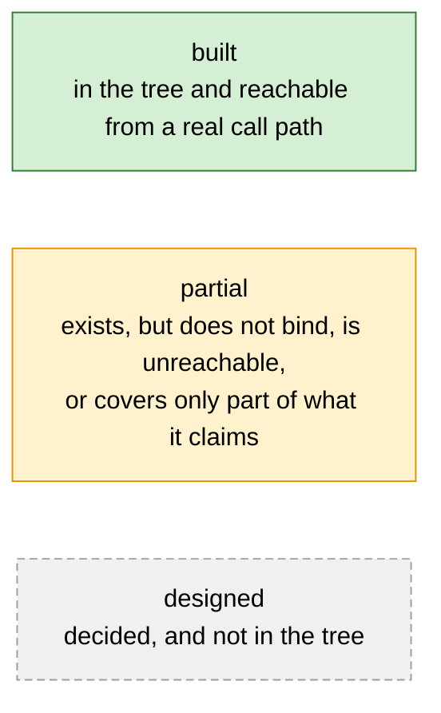
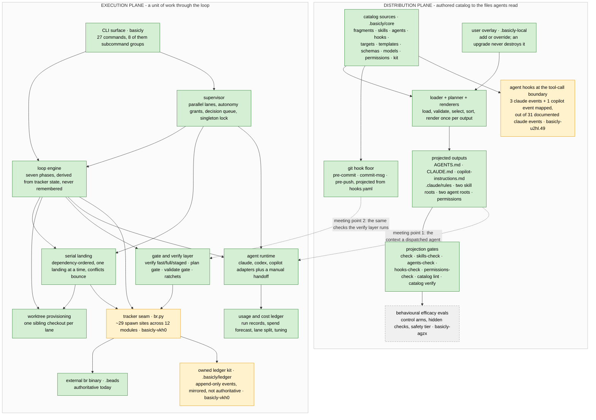
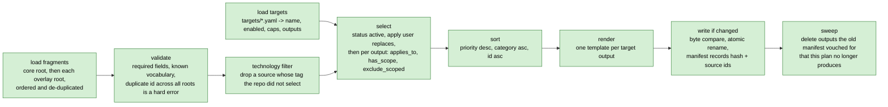
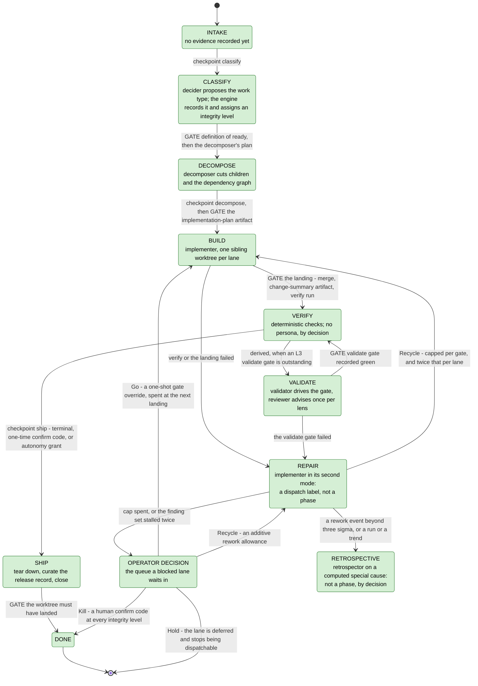
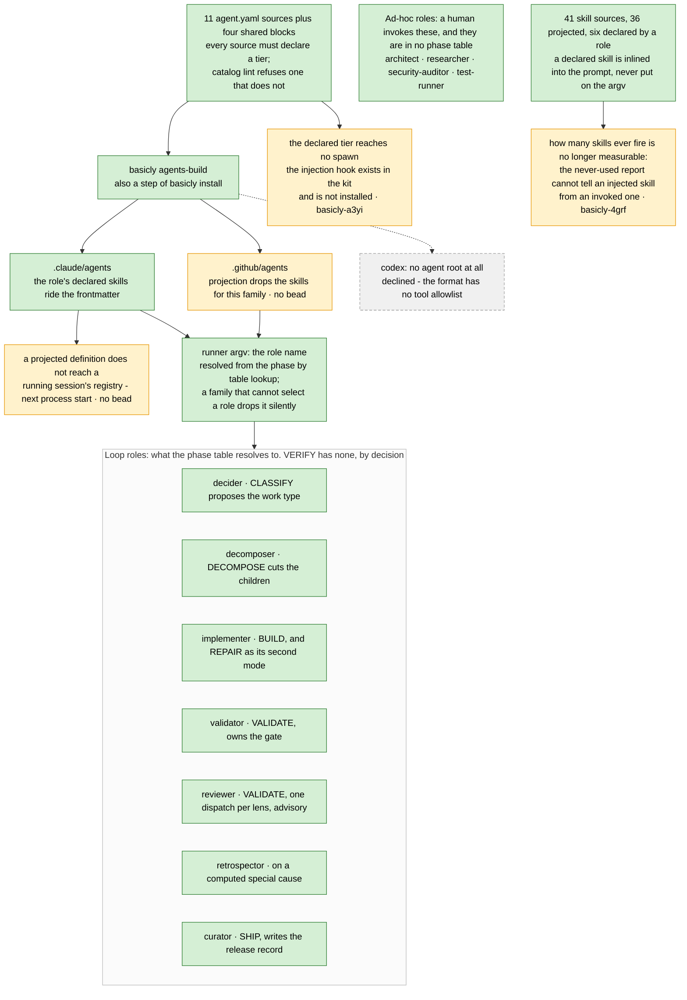
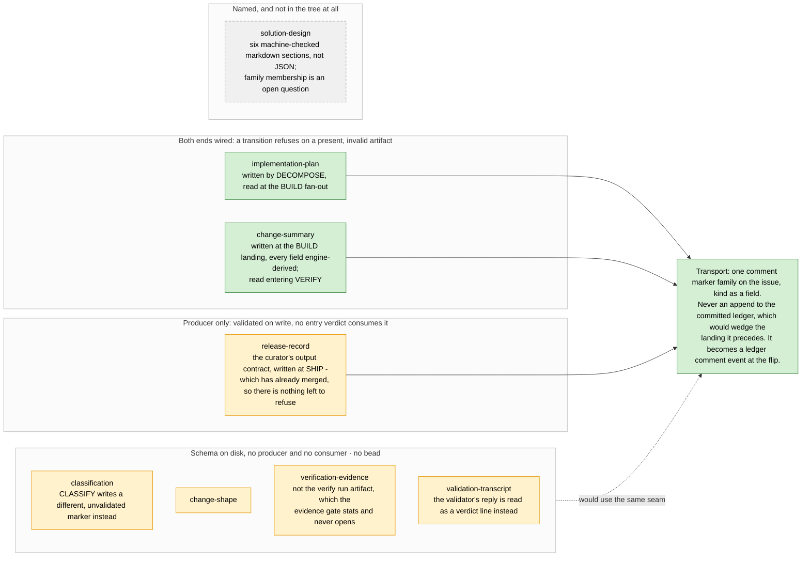
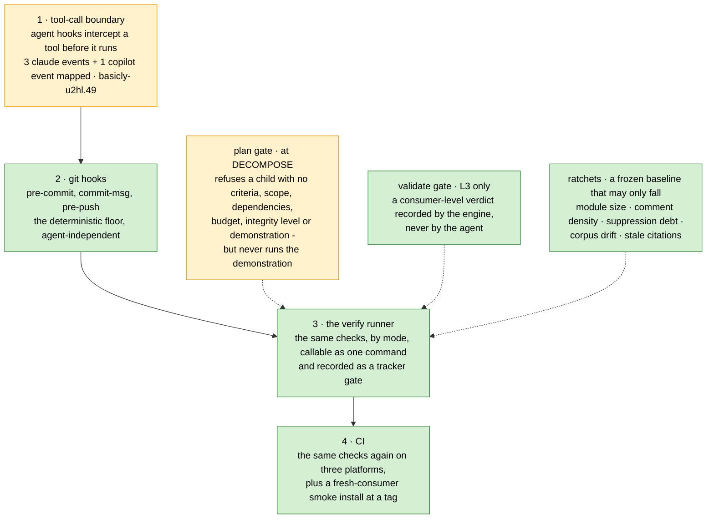
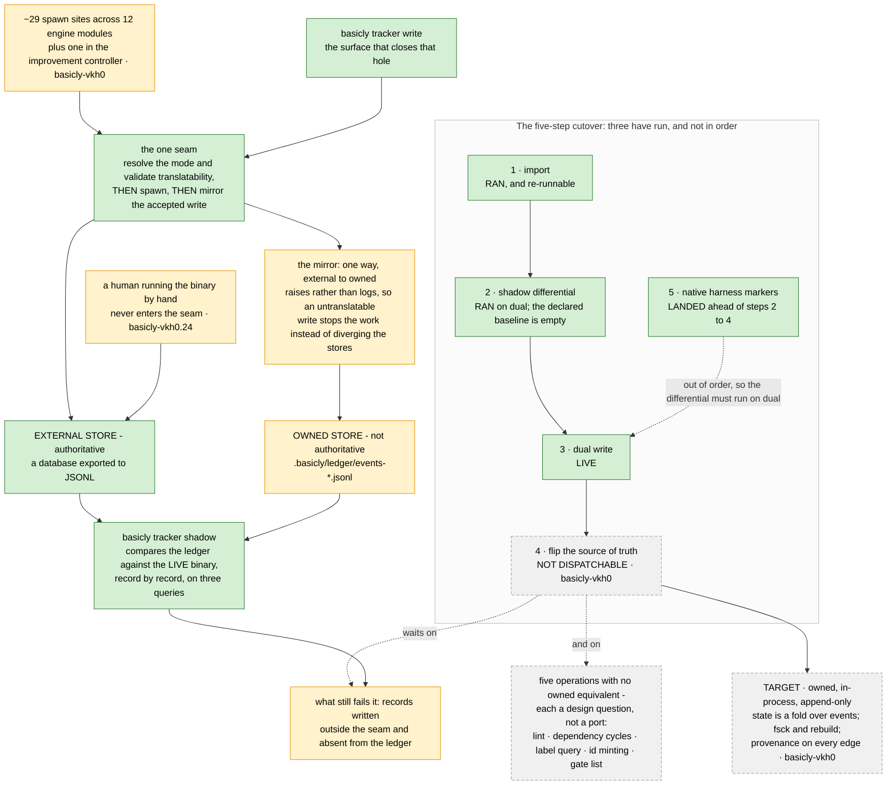

# basicly Architecture

`basicly` is a **harness for coding agents that ships its own development process**. A
repository installs it, and gets three things it did not have: guidance projected into
the files each coding agent actually reads, deterministic gates that block bad work
whether or not a model read the guidance, and a workflow engine that drives a unit of
work from an idea to a merge over a tracked graph of state.

This file is the authority on the **design**. It is the one document to read first.

## How to read this document

**Two audiences, one file.** A human wants to see how the factory, the harness, the
tracker, the state machine, the agents and the skills fit together, and what is built
versus what is only decided. An agent building context at the start of a session wants
the same picture and the invariants it may not violate.

**The survival rule that shaped every editing call here:** this document must stand
alone if the code and every other document disappeared, and be enough to rebuild the
system from scratch. A decision and the reason behind it, an invariant, a constraint, a
data shape: content. A line number, a bead id used as an argument, the status of one
lane last Tuesday: noise, and cut.

**Authority order, when two sources disagree.**

1. **The code wins.** It is the only thing that runs. Every claim here was checked
   against the tree; where a number is cheap to re-derive, the command is given instead
   of the number, because a copied figure goes stale silently.
2. **This document wins over every other document** — the requirements documents, the
   implementation plan, the README, the landing page, the tutorial and the how-tos.
   Those are renderings, arguments or sequences; this is the specification.
3. A claim about an **external interface** (a CLI flag, a model id, a vendor limit) is
   never settled from recall. Grep this repo's own adapter, then fetch the vendor's live
   documentation.

**What this document is not.** It is not the entry point for a consumer running
`basicly install` for the first time — that is the tutorial. It is not the order the
unbuilt parts get built in — that is the implementation plan. It is not a backlog.

**A note on measured numbers.** Where a figure is stated it carries the date it was
measured and, wherever possible, the command that re-derives it. A figure with neither
is a claim nobody can check, and this document has already carried several.

### Legend

Every diagram uses three node colours and every node carries exactly one.



**`built` is the strongest claim in the vocabulary and it is still narrow**: it means
code exists and something calls it. It does not mean the thing has been exercised in
anger, and it does not mean a gate binds. A closed work item proves code exists; only
running the gate on a real input proves the gate refuses anything.

A node reading **`no bead`** is a gap nothing tracks. That is a finding in itself, not
an omission in the drawing.

## Contents

- [The problem](#the-problem)
- [Core invariants](#core-invariants)
- [System overview](#system-overview)
- [The distribution model](#the-distribution-model)
- [The fragment model](#the-fragment-model)
- [Skills](#skills)
- [Subagent definitions](#subagent-definitions)
- [Hooks](#hooks)
- [Model tiers](#model-tiers)
- [Configuration](#configuration)
- [Catalog verification](#catalog-verification)
- [The always-on files](#the-always-on-files)
- [Installation and upgrade](#installation-and-upgrade)
- [The CLI surface](#the-cli-surface)
- [The harness loop](#the-harness-loop)
- [Work isolation and merging](#work-isolation-and-merging)
- [Parallel lanes and the supervisor](#parallel-lanes-and-the-supervisor)
- [Dispatch and the agent-agnostic runner](#dispatch-and-the-agent-agnostic-runner)
- [Cost, forecasting and autonomy](#cost-forecasting-and-autonomy)
- [Roles at dispatch](#roles-at-dispatch)
- [Handoff artifacts](#handoff-artifacts)
- [Gates and enforcement](#gates-and-enforcement)
- [The work tracker](#the-work-tracker)
- [Status: built, partial, designed](#status-built-partial-designed)
- [Decisions and their reasoning](#decisions-and-their-reasoning)
- [Non-goals](#non-goals)
- [The rest of the documentation](#the-rest-of-the-documentation)

## The problem

A coding agent is a capable but unreliable worker with no memory between sessions. Four
things go wrong, and each has a different remedy.

**It does not know the local rules.** Every repository has conventions a model cannot
infer. The remedy is guidance in the files the agent already reads — and each agent
family reads a different file, so the same rule has to be written once and projected
several ways.

**Guidance is a suggestion.** A model may read a rule and not follow it. The remedy is a
gate: a script that runs whether or not anyone asked, and refuses. Guidance without
gating is easily ignored; gating without guidance leaves the agent no idea why a check
exists or how to satisfy it before hitting it.

**A session ends.** A crash, a context compaction, a rate limit, a switch to a different
agent family: any of them loses the thread, and the classic failure is re-doing work
that already landed. The remedy is that the current position is **derived from durable
state** rather than remembered, so resuming is a read.

**Nobody knows whether any of it works.** A rule the model has stopped attending to and
a skill that never fires both cost context on every turn and deliver nothing, and
neither is visible. The remedy is measurement, and this is the least finished of the
four.

The first two are the classic harness bargain, and most harnesses stop there. The last
two are what makes `basicly` an SDLC rather than a guidance bundle: it owns **the
process** and **the state**, and enforces both in code.

## Core invariants

These hold everywhere. A change that violates one is wrong even if it passes.

**The engine disposes; agents propose.** No model holds authority over the tracker, the
schedule, or a required gate, at any autonomy level. An agent's output is a proposal
that engine code validates against policy before it becomes state.

**State is derived, never remembered.** The loop phase is a pure function of tracker
state. The engine keeps no durable side-state of its own, so a crashed, compacted or
swapped session resumes by re-reading the tracker. This makes re-dispatching completed
work structurally impossible rather than merely unlikely.

**Enforcement is code, not a request.** Where a hook can enforce a rule, the rule is a
hook and the prose only points at it. A model choosing to run a formatter is a different
thing from the formatter running automatically.

**Deterministic first, judged second.** A required gate may only ever be passed by a
deterministic check. Judged output is advisory or routes a decision to a human; it is
never a green light.

**Every deterministic step is one command.** If an agent must perform a *sequence* of
mechanical steps, the engine is missing a command, and the tokens, the latency and the
chance of getting a mechanical step wrong are all waste.

**Nothing generated is ever hand-edited, and nothing authored is ever generated.** Users
edit catalog sources; the projector writes outputs. The one-way street is defended by a
tool-time guard and a commit-time backstop, not by convention.

**Extension is addition or explicit override, never silent replacement.** There is no
third mechanism and no last-one-wins. An unexplained conflict is an error.

**No committed artifact carries a machine-specific path, username or hostname.**
Redaction runs at the write seam for both stores, and a pre-commit hook is the floor
under it.

**Evidence over assertion.** A claim in this document, in a release note or on a README
is backed by something a reader can re-run. An unmeasured behavioural claim buys
confidence nobody earned.

## System overview

The system has **two planes**. The **distribution plane** turns authored catalog sources
into the files agents read and the hooks that bind them. The **execution plane** drives a
unit of work through the loop over the tracker.

They meet at exactly two points: the loop dispatches agents whose context is the
projected guidance, and the loop's verify step runs the same checks the git hooks run.



An arrow is a **dependency**, not a data flow: the tail cannot be built or run without
the head. The tier order it draws is enforced mechanically — an import-layer contract
declares an exhaustive set of tiers over every module in the package, so a new module
cannot join without being placed in one.

**Three roles, and one repository can hold all three at once, as this one does.** The
*engine* is normal installable Python at `src/basicly/`. The *catalog* is data at
`.basicly/core/`. The *consumer* is whatever repository installed it. Neither tree
depends on the other's location: `.basicly/` never contains engine code and
`src/basicly/` never contains catalog data.

## The distribution model

Everything a coding agent or a human reads is **generated**. Everything a user edits is a
**source**. Three trees, three write-owners, and the separation is a mechanism rather
than a convention.

| Tree | Who writes here |
| --- | --- |
| `src/basicly/` — engine: loader, planner, renderers, CLI, loop | basicly maintainers; ships with the tool |
| `.basicly/core/` — managed catalog: fragments, skills, agents, hooks, targets, templates, schemas, models, permissions, kit | `basicly install` only |
| `.basicly/state/install.json` — install provenance: version, timestamp, per-file hashes | `basicly install` only |
| `.basicly-local/` — user overlay, path-configurable | the consumer repo's users |
| `basicly.toml`, `basicly.d/*.toml`, `basicly.local.toml` — configuration | the consumer repo |
| Generated artifacts: `AGENTS.md`, `.claude/CLAUDE.md`, `.github/copilot-instructions.md`, scoped rules, skill and agent roots | `basicly build` and its siblings only |
| `.basicly/generated-manifest.json` | `basicly build` only |

### The catalog

```text
.basicly/
  core/
    fragments/<category>/<id>.fragment.yaml
    skills/<skill-name>/skill.yaml        # plus references/, scripts/, assets/
    agents/<slug>/agent.yaml              # plus agents/blocks/<id>.block.yaml
    hooks/*.py + hooks.yaml               # git-stage and agent hook scripts, and their manifest
    models/{anchors.yaml,model-map.json,model-map.schema.json}
    permissions/permissions.yaml
    rubrics/*.rubric.yaml
    schemas/*.schema.json
    targets/{claude,copilot,codex}.yaml
    templates/{claude,copilot,codex}/*.j2
    kit/{tracker,tier}/*.py               # portable modules deployed into a consumer
  generated-manifest.json
```

**Every catalog source is YAML, and deliberately not Markdown.** Some coding agents
auto-discover skills by scanning broadly for `SKILL.md`; a `SKILL.md` *source* would risk
an agent loading both the catalog copy and the projected copy. Fragments follow the same
rule for consistency. YAML over Python because it needs no code execution and keeps prose
lossless in block scalars. `basicly catalog lint` refuses a Markdown-named source and a
second YAML extension.

### The projection pipeline



**Determinism is a property, not an accident.** Sorting is total — priority descending,
then category, then id — so two builds on identical sources produce byte-identical
output and a diff only ever shows a real change.

**Selection has exactly four axes**, and every output declares which it uses:

- `applies_to` on the fragment names the target families it is for, or `all`.
- `filter.applies_to` on the output names which of those values it accepts.
- `has_scope` restricts an output to path-scoped fragments; `exclude_scoped` drops them
  from a baseline. One fragment set therefore yields both an always-on file and a set of
  path-gated rules, with no fragment appearing in both for a target that scopes.
- `technologies` gates a whole source on the consumer's declared stack.

**The manifest is the memory of the projection.** It records, per output, a content hash
and the ordered ids of the fragments that composed it. Three things depend on it:
`basicly check` recomputes it to detect a hand edit; the sweep deletes outputs that
dropped out of the plan, which is how a retired output reaches a consumer; and the
generated-file commit hook uses it as the oracle for whether a staged generated file
still matches its sources.

**Path interpolation is checked, not trusted.** An output path that resolves outside the
repository root is refused, and a fragment id containing a separator or a pure-dot value
is refused before it can reach a path template.

### Targets

Three targets ship, all enabled.

| Target | Output | Filter | Soft cap |
| --- | --- | --- | --- |
| claude | `.claude/CLAUDE.md` | `all` plus `claude`, scoped excluded | 9000 chars |
| claude | `.claude/rules/<id>.md`, one per scoped fragment, carrying a `paths:` frontmatter key | `all` plus `claude`, scoped only | — |
| codex | `AGENTS.md` | `all`, scoped **inlined** | 16000 chars |
| copilot | `.github/copilot-instructions.md` | `all` plus `copilot`, scoped excluded | 9000 chars |

**Codex inlines scoped fragments because it has nowhere to put them.** Codex is not short
of steering files — it supports nested `AGENTS.md`, an override file, fallback filenames,
repo-checked-in Agent Skills, project subagents and a sandbox policy. What it lacks is a
**type**: there is no glob- or pattern-based instruction scoping anywhere in its
discovery, its config reference or its skill frontmatter. Directory placement is the only
scoping axis, and this project's scopes are globs. Worse, a nested `AGENTS.md` **below the
current directory is never loaded** — Codex walks from the project root down to the
current directory and stops, so a file at `src/foo/AGENTS.md` contributes nothing when
Codex runs from the repository root. Inlining is therefore the correctness-preserving
choice, and offloading to nested files is rejected rather than deferred.

**Two naming traps on the Codex surface**, both of which have misled a reader here.
Codex's own feature called "Rules" (`.codex/rules/`, a Starlark prefix rule) is a sandbox
command-execution policy, unrelated to per-file instructions; reading that page and
concluding Codex has no instruction rules is the exact wrong turn. And file-based custom
prompts are deprecated in favour of skills and are user-scope only, so they can never ship
inside a repository.

**Copilot gets no path-scoped twin, by decision.** One editor loads both the Claude rules
root and the Copilot instructions root with no deduplication, so a twin double-loaded every
path-scoped rule for every consumer of that editor. Scoped rules are single-sourced to the
Claude rules root. The accepted cost is that the server-side Copilot surfaces — PR review
and the cloud agent — keep only the root instructions file.

## The fragment model

One fragment is one policy, practice or decision: a YAML source with a body written as a
block scalar, projected to Markdown.

| Field | Required | Values | Notes |
| --- | --- | --- | --- |
| `id` | yes | kebab-case, unique | a duplicate across core and overlay is a hard error |
| `description` | yes | one line | |
| `category` | yes | `boundaries`, `code-style`, `commands`, `decisions`, `design`, `hooks`, `project`, `security`, `skills`, `testing`, `tools`, `ci-cd`, `quirks` | a closed vocabulary; unknown values are refused at load |
| `applies_to` | yes | target names or `all` | |
| `priority` | no | `critical` (4), `high` (3), `medium` (2, default), `low` (1) | sorts descending |
| `scope.paths` | no | glob list, default `["**"]` | a non-default value makes the fragment scoped |
| `status` | no | `active` (default), `draft`, `deprecated` | only `active` is projected |
| `technologies` | no | controlled list | untagged means universal |
| `source` | no | `core` (default) or `user` | inferred from the load root when omitted |
| `override` | no | bool, default false | must be true to replace a core fragment |
| `replaces` | no | list of fragment ids | those core fragments are removed when this one is active |
| `extends` | no | list of fragment ids | declared and validated; nothing consumes it today |
| `enforced_by` | no | list of commands | each must be cited in the body, see below |

**The extension mechanism is two rules and no exceptions.** The planner removes core
fragments named in an active user fragment's `replaces`. The loader enforces the
integrity rules as hard errors on every load: a fragment declaring `replaces` must set
`override: true`, every replaced id must exist in the merged set, and two user fragments
may not replace each other.

**`enforced_by` closes the loop on the context-minimalism rule.** A fragment that claims a
command enforces its rule must cite that command in its body, and `catalog lint` refuses
one that does not. That turns "point at enforcement instead of restating it" from advice
into a check.

**On disk today** [measured 2026-08-16]: 21 core fragments across eight category
directories — `boundaries` 1, `commands` 1, `decisions` 3, `design` 1, `project` 11,
`security` 1, `testing` 1, `tools` 2 — and three overlay fragments. Five of the thirteen
categories (`code-style`, `hooks`, `skills`, `ci-cd`, `quirks`) have no fragment in them
yet. **The category `hooks` labels a fragment that *describes* hook usage; it is not the
mechanism that ships a hook script.**

Four fragments are path-scoped, and each becomes a scoped rules file rather than baseline
text. Two are target-specific defaults, one per family that takes them.

## Skills

A skill is on-demand guidance: a directory the agent loads when it decides the skill is
relevant, or when a path glob triggers it. It costs nothing until then except the line
that advertises it.

**Two projection roots, both mandatory and both always written.** `.claude/skills/` is
one family's only project skill root; `.agents/skills/` is the open-standard root the
other families discover. The split mirrors how each family finds its guidance, and
neither root is optional, because a root only some commands write is how a second root
drifts unnoticed.

**A skill source directory projects whole.** Alongside `skill.yaml` a skill may bundle
references, scripts and assets; the projector renders the discoverable `SKILL.md` with a
generated marker and copies every other file verbatim, bytes and mode. So a skill can
ship a long reference guide or a fixer script.

**The invocation axis is declared, not inferred.** It is required and is either
model-invoked or user-invoked. A **model-invoked** skill keeps its description, is
advertised to the agent, and therefore pays a context load on every turn. A
**user-invoked** skill carries no description at all, costs nothing until a human types
its name, and lint enforces the empty pairing. It is declared because "does this entry
route correctly" is not a well-posed question until the entry says whether routing
applies to it — which makes the axis a prerequisite for the routing evals rather than
bookkeeping.

**One root requires a description and the other does not**, so a user-invoked skill emits
a synthesized one on the standard root, because that family rejects a description-less
file outright.

**The projected directory is mirrored, and the root itself is owned.** A rebuild prunes a
resource dropped from the source; deselecting a technology prunes the whole directory.
The check additionally reports any entry in the root that no source accounts for — a
hand-authored skill file, a loose README, a projection whose source was deleted — because
otherwise a skill the projector never knew about passes every gate while reaching only
one agent. It reports and never prunes those: nothing describes them, and the projected
copy is the only one.

**Technology scoping is the core-versus-optional axis.** An untagged skill is universal
and always ships. A tagged skill ships only when the consumer selects that tag in
configuration. Tech-specific and situational guidance belongs in an optional skill, never
in an always-on file: enforcement stays in the deterministic hooks, and a skill carries
the judgment and pointers a linter cannot.

**A skill is not free, and the cost is in the listing rather than the body.** The whole
skill listing is budgeted against a fraction of the context window, and on overflow the
host drops descriptions **starting with the least-invoked skills** — a feedback loop, not
a flat cost: a rarely-invoked skill is the first to be truncated, which makes it harder to
invoke. Both the per-entry cap and the listing budget are gated.

**A skill's frontmatter can take a path glob that both limits and triggers automatic
activation**, which buys always-loads-on-a-matching-file behaviour at **zero** always-on
characters. The key is not in the portable subset, so it is declared under a per-target
vendor fence and emitted only into the root that understands it. The general rule this
settles: a host-specific capability is expressible without the portable artifact absorbing
it.

**Skill scope precedence is the inverse of agent scope precedence, and for a distribution
tool that asymmetry is load-bearing.** Agents resolve managed over project over user;
skills resolve enterprise over **personal** over **project**. `basicly install` writes a
consumer's *project* skill root, which is the **lowest-priority writable scope** — so a
developer's personal skill of the same name silently overrides one we shipped, while an
identically named agent would not. Nothing we ship makes that visible to the consumer.

**Lint enforces the specification's naming rules** — the name matches the directory, and
is 1 to 64 lowercase alphanumeric-or-hyphen characters with no leading, trailing or
consecutive hyphen — and warns when a body runs long or a file reference reaches more than
one level deep, per the specification's progressive-disclosure guidance.

**On disk today** [measured 2026-08-16]: 41 skill sources, 36 projected into each of the
two roots after the technology filter, split roughly evenly between model-invoked and
user-invoked.

## Subagent definitions

Subagent definition files are the fourth catalog kind, generated and never hand-edited.

**Composition.** Every agent fills five ordered body slots — role, startup, process,
output contract, constraints — each a list of references to shared building blocks or
inline Markdown. The skeleton is the structure that the vendor's own subagent examples and
the best files in a community corpus converge on. Four shared blocks exist, under a
reserved slug.

**The description is authored as four fields** — purpose, triggers, returns, posture —
which the projector joins, so no part of a delegation-quality description can be
forgotten.

**The tool list is a mandatory explicit allowlist.** Agents never silently inherit every
tool. A posture declaring read-only may not grant a write tool, and lint refuses one that
does.

**Tool names are not translated.** The other family's published alias table accepts the
first family's PascalCase names as first-class and matches case-insensitively, so one
declared name resolves on both. The table is pinned as reviewed data for two reasons: it
drives the read-only posture check, and it lets lint refuse a name that resolves to
nothing — because one family drops an unrecognised entry with no error where the other
refuses to launch and says so. An unrecognised entry therefore fails **safe**: the residual
risk is a useless agent, not a lost guarantee.

**A tier names a portable model tier** — low, medium, high, maximum — single-sourced from
the engine into an enum on the agent schema, with a tripwire test keeping the two in step.
Lint refuses a source that declares none.

**No projected agent file carries a provider model id, and that is a decision rather than
an omission.** A provider id is not portable across agent families — the same model is
spelled differently on two surfaces — and, decisively, the tier-injection mechanism leaves
a definition that pins its own model alone, so a projected model line would **disable**
tier injection rather than implement it. The deprecation of the old key is engineered
rather than documented: it is retained as a deprecated property purely so lint owns the
actionable message instead of the schema emitting a bare "additional properties are not
allowed", and it stays on the reserved-frontmatter list so the per-family passthrough
cannot smuggle an id back in.

**Two roots, both written and both checked**, one per family that has an agent root. The
second exists because that family's *cloud* agent reads only its own root while its CLI's
discovery of the first root is real but undocumented, and because its custom agents do
support a tool allowlist, so the read-only posture survives the crossing. Double loading
does not materialise: the deduplication key is the file name minus its extension, so the
two files collapse to one agent. Only the first root receives the per-family passthrough.

**A third native root is declined, not overlooked.** Codex's subagent format has no tool
allowlist equivalent, so a Codex copy would silently drop the mandatory allowlist the
read-only posture check depends on — a lost guarantee, not a format cost — while forking
the renderer, the drift check and the generated marker. Codex receives the same guidance
through `AGENTS.md` and the standard skills root.

**No root costs always-on budget, and the saving is structural.** Only an agent's name and
description load at session start; the body never enters the parent's context; only the
final message returns; and a subagent runs in an **isolated context window**, so a
dispatch's working set is never charged to the session that spawned it. Verified against a
live host rather than taken from vendor guidance.

**A projected agent definition does not reach a running session's subagent registry**
[measured 2026-08-16, in this session]. A role was given write tools in the catalog,
`basicly agents-build` wrote both roots, and a dispatch immediately afterwards reported its
live tools as the pre-change set. A requirements document claims agent definitions
hot-reload, citing an earlier measurement; **that claim does not hold for this path**.
Treat a definition change as taking effect on the next process start, and say so to
consumers, because clearing the conversation is the lever a consumer reaches for first and
it is the wrong one.

**On disk today** [measured 2026-08-16]: 11 agent sources and four shared blocks, projected
to 11 files in each root.

## Hooks

Hook scripts are first-class catalog artifacts: the deterministic, gating counterpart to
fragments and skills. They are described tool-agnostically in a manifest and every one is
standalone Python with no runner API, so the manifest could drive a different runner
without touching a script.

**Each entry declares** an id, a script, a stage, and optionally whether filenames are
passed, whether it always runs, its technologies, a matcher, and a manager. The manager
routes the hook to one of three surfaces.

| Manager | Surface it writes | Stages in use |
| --- | --- | --- |
| git | a managed local block in the pre-commit config, foreign hooks preserved | pre-commit, commit-msg, pre-push |
| claude | the agent-hook section of that family's settings file | pre-tool-use, post-tool-use |
| copilot | one managed JSON file per hook under that family's hooks directory | pre-tool-use, post-tool-use |

**What ships today** [measured 2026-08-16]: 15 declared specs — 11 git-stage, three on one
agent surface, one on the other. The git-stage set is the identity guard, the fast-check
runner, catalog lint, the secret scanner, the tracker path scanner, the internal-info
scanner, the kit boundary check and the generated-file commit backstop at pre-commit; the
conventional-commit and tracker-id checks at commit-msg; and the full-check runner at
pre-push. The agent-side set is the generated-file tool-time guard, a shell-footgun guard,
and the tool-usage counter, which rides both agent managers.

**A gate that is shipped but never installed is inert**, which is the exact failure that
once let unguarded commits through. So `basicly hooks-build` projects the manifest **and
then runs the installer** for every managed stage, rather than only writing the config.

**Two scanners deserve their reasoning stated.** The secret scanner blocks a commit whose
staged added lines carry a likely credential, with an inline allowlist escape for reviewed
false positives. Its sibling scans for internal-only identifiers — a company domain, an
internal host, a machine username, a private repository name — which publish silently
because they read as ordinary text to anyone who does not already know they are internal.
**Its denylist is deliberately not in the script**: a gate hard-coding the strings it
suppresses would publish them into this repository and into every consumer that installs
the catalog, and pre-commit also runs in CI whose logs are public. The tokens live in the
gitignored per-machine config as named rules, and the report prints only the rule name. It
is inert until configured, so a consumer is never blocked by a list they did not write.

**The identity guard blocks a commit whose git identity is unset or a hostname fallback** —
a generic, no-personal-data gate. It validates the **effective** identity git will actually
stamp, resolving author and committer with the environment taking precedence over config,
because a runner may overlay identity environment variables and validating config alone
would miss the override.

**The tool-usage counter is token-free telemetry.** It tallies every shell command's
pipeline head into a self-ignored file, resolving a head *past* a wrapper — the runner, the
package executor, the environment setter, and their subcommands, flags, flag values and
variable prefixes — so the wrapped tool is credited and not only the wrapper. It is the
input for culling idle tools and skills from the catalog with real data.

**Why pre-commit and not a compiled runner.** The hooks are already runner-agnostic, so the
only runner-specific code is the projection layer. The decisive fact is that **every
projected hook shells out to the Python runner**: the runtime is required of a committer
whatever orchestrates the hooks, so a static binary's headline advantage — no runtime
dependency — buys this project nothing while adding a binary-acquisition problem with no
native answer. Reopen the decision only if consumers stop reliably having the runner on
`PATH`, if the project drops the runtime requirement for the checks themselves, if hook
execution speed becomes a **measured** complaint that parallelism would fix, or if the
provisioning seam regresses beyond what the fallback covers. The manager field and the
API-free scripts are kept precisely so this stays cheap to reopen.

**A consumer's own hooks survive.** The projector merges its managed block into an existing
config, preserving foreign repositories and hooks, and the merge is idempotent. This
repository dogfoods the catalog directly: its own pre-commit config points straight at the
catalog scripts, and one hook in it — the Markdown linter — is a hand-maintained consumer
block that the projector preserves rather than owns.

## Model tiers

A catalog source declares a **portable tier**; a concrete model id is resolved at dispatch
from committed data.

An anchors file is the reviewed input: one anchor model per tier and vendor, plus a surface
table and a capability rule. A generator resolves it into a committed map, validated
against a published schema.

**Three axes, because all three change the answer: tier by vendor by surface.** Cost *and*
token limits are recorded per **surface** rather than per vendor because both genuinely
vary there — the same model can cost several times more through one surface than another,
and one surface may cap a model's input where the vendor's own publishes no cap.

**An unavailable cell records a status and a reason and deliberately carries no model
key**, so a consumer reading it fails loudly instead of being silently demoted onto another
tier's model. Resolution refuses the dispatch rather than substituting.

**Two constraints keep the whole mechanism offline.** The generator fetches upstream data
at authoring and check time only, never in the dispatch path, and there is deliberately no
verify-check entry for it, so nothing that dispatches an agent depends on the network. And
the drift check **reports** and never writes, because a community-contributed upstream edit
must surface as a red check rather than as a silent change to which model runs someone's
code. The committed map's shape is gated offline by a test.

**Two independent resolvers exist, and the difference is deliberate.** The in-harness one
raises on an unavailable cell, because a dispatch that cannot honour its tier is a bug. The
portable kit one — zero dependencies, no imports, no PATH, no network, no subprocess —
**fails closed and quiet**, leaving the spawn untouched, because it runs on machines that
may have no map at all.

**The tier reaches no spawn today.** Nothing projects a model id, by decision; the injection
that would resolve one at spawn is a hook that exists in the kit and is not installed. So
the tier is declared, gated by lint, and inert. On one family the installer **declines with
a nonzero exit**, because across repeated probes no tool-boundary hook fired for an agent
spawn there, and even where one does fire the documented contract is approve-or-deny rather
than rewrite.

## Configuration

Three files, layered lowest to highest, with a fourth layer for the current process.

| File | Committed | What belongs here |
| --- | --- | --- |
| `basicly.toml` | yes | the repository's declaration; the **only** source for projection config |
| `basicly.d/<id>.toml` | yes | one lane's additions, so two lanes never write one file |
| `basicly.local.toml` | no, gitignored | per-machine harness choices, and the internal-identifier denylist |
| session overrides | no | this process only |

**The merge is a key-level shallow replace**, with exactly one documented exception. A key
set in a later layer replaces the earlier value wholesale, so a local list is taken as-is
rather than concatenated — that is the machine saying *instead*. The exception is the verify
check list, which the drop-in layer **appends** to in filename order, because a drop-in
fragment is one lane's *addition*. The per-machine layer still replaces the whole list.

**Projection config is repository-level only.** The path and catalog sections shape
repo-committed outputs, so they are read from the committed file alone and never from the
per-machine overlay.

**Every ratchet number in a drop-in is a delta, never a total.** Two lanes each adding one
suppression would both record the same total and the merged tree would hold one more,
whereas addition composes in any landing order. Raising a frozen baseline through a delta is
refused; the escape is an explicit rebaseline key with a non-empty reason, and those are
counted and printed.

**Both files are schema-checked on every load, and the schema is an allowlist over the whole
configuration surface.** An unrecognised section or key raises, naming the file, the
containing section, what that section accepts, and which sections accept a name like it. A
key the engine ignores leaves the file stating one behaviour and the engine performing
another, and in a gitignored overlay there is no diff to review and no other gate — the
symptom is only ever the default the key was written to replace. The allowlist covers the
surface, not this module's readers: two entries have no reader in the config loader at all
and are still declared.

**Which schema does the checking is a property of the tree, not of the process.** A
repository that ships its own engine source — this one, and each of its lane worktrees — is
checked against the schema declared in *that* file, read statically on every validation.
Without this, a landing could not admit a lane that adds a key: the landing runs from the
base checkout, so the engine validating the lane's config is the pre-merge one, and it
refused a name the lane's own code introduces one commit later. Static, because the tree
under test has not merged: importing it would run a second engine inside the process landing
it, and the question is a set of names rather than behaviour. It fails closed — a schema the
reader cannot model falls back to the running engine's, and the refusal then names the
ordering rule instead of reading as a typo.

**The refusal is unconditional, and forward compatibility is the accepted cost.** No
warn-then-error staging, no narrowing to near-misses of a known key, so a repository pinned
to an older engine whose config carries a newer key fails until it upgrades or removes the
key. Staging was rejected as unendable — the engine ships from the trunk, so a warn phase has
no graduation point — and as unread. Near-miss narrowing was rejected because it leaves a
genuinely novel key silent, which is the same hole one generation on. The cost is bounded by
the message, which names the engine's version and says upgrading is one of the two fixes.

## Catalog verification

Two layers, deterministic always first.

| Check | Where it runs |
| --- | --- |
| Required fields, known category, priority, status and target; extension-field types | the loader, on every list, build and check |
| Duplicate fragment id across every root | the loader, on every load |
| Replacement integrity: the target exists, the override flag is set, no mutual user-to-user replace | the loader, on every list, build and check |
| Source format: schema validity, no Markdown-named source, a single YAML extension | `basicly catalog lint`, wired as a pre-commit hook and a CI step |
| Composition rules: block references resolve, every tool resolves, a read-only posture grants no write tool, the composed body stays under the strictest reader's prompt ceiling | `basicly catalog lint` |
| Routing: positive top-k, pairwise negatives, a description-collision ceiling, a ratcheting rank-1 floor | `basicly catalog lint` |
| Duplicate or near-duplicate bodies, contradictions from a curated pair dictionary, vague phrases, scope overlaps | `basicly catalog verify` |
| Semantic review: an agent reads the rendered files for contradiction and ambiguity | `basicly catalog review`, advisory, always exits zero |

**Deterministic checks catch a large class cheaply** — duplicate ids, missing fields,
unknown vocabulary. Semantic problems — a contradiction that parses fine but reads badly to
a model — need a capable reader. Both layers run against the same merged fragment set, and
the judged layer is never a merge gate.

**The routing gate is the deterministic, lexical, free tier of the evidence layer**, and the
reason it works is a detail worth keeping: it asserts that the declared owner must
**outrank** the entry, because a bare "must not rank first" passes vacuously on a prompt
that matches nothing. It reports a rank-1 rate against a floor that ratchets and cannot be
lowered.

## The always-on files

`AGENTS.md`, `.claude/CLAUDE.md` and `.github/copilot-instructions.md` are the foundation
every other artifact builds on. If they are noisy or ambiguous, everything downstream
inherits that failure.

**Six properties they must keep.**

1. **Point at enforcement; do not restate it.** If a rule is mechanically enforced, the
   always-on file references the command that enforces it. Prose is reserved for what a
   linter cannot check: judgment calls, escalation policy, when to ask instead of guess.
   Duplicating what a linter already enforces measurably hurts agent task success and
   inflates cost.
2. **Enforced rules are one line; judgment rules are prose**, and the judgment section
   should be the shorter of the two.
3. **No duplication across the three files.** The shared always-applicable set feeds all
   three; each family's file adds only genuinely different content.
4. **Each file is self-contained.** Two of the three families do not reliably import a
   shared file, so the shared content is inlined into each rather than referenced. An agent
   should never need a second file to understand the baseline.
5. **Scoped fragments stay out of the baseline** for the two families that can scope, so a
   language-specific rule does not cost every task its context budget.
6. **Stable ordering**, so diffs stay minimal.

**The caps are a discipline choice, not a platform limit.** Measured against the vendors:
one host's own degradation warning is far above these numbers, one vendor removed its former
hard character limit and now only advises shortening, and the third reads its file up to a
configurable byte cap. **A cap warning means split into a scoped rule, not shrink the
prose.** The cap counts **characters**, not bytes, so a byte count overstates a UTF-8
baseline by its multi-byte characters.

Measured from the projected files themselves, and regenerated and gated on every commit:

<!-- docs-claims:begin always-on-sizes -->

| Surface | chars | cap | headroom |
| --- | --- | --- | --- |
| `.claude/CLAUDE.md` (claude) | 8895 | 9000 | 105 |
| `AGENTS.md` (codex) | 14343 | 16000 | 1657 |
| `.github/copilot-instructions.md` (copilot) | 8994 | 9000 | 6 |

<!-- docs-claims:end always-on-sizes -->

**Which surface binds depends on the tier.** The tightest always-on surface binds for an
always-on fragment. `AGENTS.md` binds for the **path-scoped** tier, because a scoped
fragment costs it around a thousand characters and costs the other two nothing.

**Scoping's cost effect is asymmetric, not a blanket improvement.** It removes a fragment
from the two baselines that can scope and **adds** it to the one that inlines. The codex cap
was raised rather than lowered after an audit of an overrun found the excess *was* the
scoped tier: evicting always-on lines would have charged all three families to fix one and
left the cause standing. What that trade gave up is stated where it was made — the old cap
also stood proxy for the vendor's claim that adherence degrades with length, which this
repository has never measured.

**What is known and what is not.** Measured against both families that were tested, each
reproduces the overwhelming majority of its baseline's rules when asked, against a small
no-guidance control. So the "cliff already crossed" reading is **refuted**: the content is
not invisible at this size. What that does **not** settle is the operational question —
nothing measures which baseline rules *bind* while an agent works. Recall under a direct cue
is an upper bound and confirms mechanism only. The cap policy is therefore asymmetric:
**lowering it is ordinary housekeeping; raising it still has no evidence behind it.**

## Installation and upgrade

Two commands, one of which does first install and every upgrade.

```sh
uvx --from git+https://github.com/niksavis/basicly@<ref> basicly install
uvx --from git+https://github.com/niksavis/basicly@<ref> basicly uninstall
```

**One idempotent converge command.** An earlier design staged an init, then a build, then
each projector, plus a separate update. The finding that collapsed them: init was never a
technical prerequisite — everything it does is idempotent skip-existing — so a single command
serves both cases. Its contract: materialize or sync the bundled core, migrate and prune
legacy layouts, scaffold the overlay and the config **only if missing**, keep the
authoring-repo guard, then rebuild every artifact and install the hooks.

**The catalog is versioned as a whole and pinned as a whole**, the same way a hook
configuration pins a revision. Re-running the install from a newer pinned ref is the only,
explicit, reviewable action that moves a consumer to a newer catalog version.

**Provenance is what makes an upgrade safe.** Install records a per-file hash snapshot of the
core as materialized. On a later install the sync overwrites changed files and deletes
upstream-removed ones — but the snapshot distinguishes an upstream change from a user's hand
edit: a file matching the snapshot is upstream-owned, one that differs is a hand edit and is
warned and kept unless forced, and a file unknown to both bundle and snapshot is always kept.
The post-sync snapshot records only bundle-matching files, so kept edits stay protected on the
next run.

**Install writes the managed core and state only.** It creates the overlay directory if
missing but never writes fragment content there, and it never overwrites an existing config
file — when an existing file lacks a section the shipped default now carries, it names the
section in a hint instead of editing.

**Uninstall removes everything managed** — core, state, manifest-listed generated files,
projected skills and agents that carry the generated marker, and the managed hook block,
deleting the config and uninstalling the git hooks when nothing else remains. It preserves the
overlay and the config unless purging, and it refuses to run in the authoring repository,
where the core *is* the catalog source.

**Technology scoping applies at projection time, not at sync time.** The core sync stays full,
which keeps provenance simple; the projectors and their checks skip non-overlapping sources.
Narrowing the selection converges on rebuild rather than stranding: fragment outputs recompose
and are swept via the manifest, excluded skills and agents are pruned if they carry the
generated marker, and excluded managed hooks are stripped from the configuration files.

**The managed catalog ships inside the distribution.** The build projects the dogfooded source
tree into the wheel and the source distribution carries it, so a direct-from-git install
resolves it; the locator prefers a source checkout and falls back to the packaged copy.

**A bootstrap shim exists for a consumer with no runtime**: a POSIX shell script and a
PowerShell script that install the runtime from its vendor when absent, then run the same
pinned install in the current repository. Both fail fast outside a git repository.

**Everything lives in plain, git-tracked files.** No daemon, no hidden state, no network calls
at build time. `git diff` and `git blame` are the audit trail, and `basicly check` is the
offline staleness gate.

## The CLI surface

Three surfaces: lifecycle, catalog, and harness. 27 top-level commands, eight of which are
subcommand groups.

**Lifecycle.**

| Command | Behaviour |
| --- | --- |
| `basicly install` | Idempotent converge: materialize or sync the core, migrate legacy layouts, scaffold overlay and config without overwriting, then build, skills-build across all default roots, agents-build, hooks-build with activation. First install and every upgrade |
| `basicly uninstall [--purge]` | Remove everything managed, preserve the overlay and config unless purging, refuse in the authoring repo |
| `basicly status [--json] [--fleet]` | Read-only snapshot: installed catalog version against running engine version, drift summary, per-manager hook state, technology selection, overlay counts. Never writes, always exits zero. The fleet flag rolls it across the housed repositories as one JSON payload |
| `basicly health [--json] [--window N] [--fleet]` | Read-only per-agent health scoring and behavioural drift from the run-record log: dispatch failure rate, a rework signal, a bounded score, and a rolling-baseline drift flag. Never writes, always exits zero |
| `basicly brief <issue-id>` | Print the brief the loop would dispatch for one issue, without dispatching it. Shares the dispatch renderer rather than re-rendering, because a preview that differs from the dispatch is worse than none |

**Catalog.**

| Command | Behaviour |
| --- | --- |
| `basicly build [--target NAME] [--verify]` | Render enabled targets, write only changed bytes, update the manifest, warn on cap overrun. The verify flag runs the content checks first and writes nothing on failure |
| `basicly check` | Byte-for-byte staleness check of generated files and the manifest; exit 1 on mismatch, no auto-fix |
| `basicly skills-build [--root ...\|--all-default-roots]` / `skills-check` | The same build and check contract for the skill catalog, mirrored per root |
| `basicly agents-build` / `agents-check` | The same contract for the agent catalog, always both roots, with no root-selection flag |
| `basicly hooks-build [--no-install]` / `hooks-check` | Materialize hook scripts, merge a managed block into the hook config preserving foreign hooks, then install the git hooks so the gates are active. The check reports projection drift and warns when the git hooks are not installed |
| `basicly permissions-build` / `permissions-check` | Project the agent-permissions deny-list into the co-owned settings file: ensure-present, consumer entries preserved, nothing pruned, with a semantic subset drift check |
| `basicly usage report` | The tool and skill counts the telemetry hook recorded, and the catalog skills never used: the culling input |
| `basicly usage forecast` | Forecast error per dispatch, over local run records and committed markers. Refuses to compute an error for a record missing either half and reports those as unpaired, so an empty report explains itself |
| `basicly usage tuning` | Advise every governed factory parameter from the recorded dispatches: the value in force, the outcome distribution under it, and a recommendation labelled measured or seeded. Advisory only; it writes nothing |
| `basicly usage lane-split` | Split each persisted lane transcript into a context-acquisition share and an implementation share |
| `basicly usage outcomes` | How every recorded dispatch ended, with the failure share as an explicit rate |
| `basicly usage tracker [--promote] [--refresh-surface] [--as-json]` | The measured external-tracker surface the replacement scope is frozen from |
| `basicly catalog list [fragment\|skill\|agent]` | Table of catalog sources of the given kind |
| `basicly catalog new <fragment\|skill\|agent> NAME [--category C] [--description D]` | Scaffold a new source in the correct format |
| `basicly catalog lint` | Source-format and composition gate; wired as a pre-commit hook and a CI step |
| `basicly catalog verify` | Deterministic content checks beyond the load path: duplicate bodies, contradictions, ambiguity, scope overlaps |
| `basicly catalog review [--runner NAME] [--dry-run]` | Advisory agent-assisted semantic review; always exits zero |
| `basicly rubric eval <issue> [--runner NAME] [--dry-run]` | Evaluate the issue's work-type behavioural rubric: deterministic checks through the verify runner, judged checks through one agent prompt. Reports an advisory gate, promotable by naming it in the required set |

The names above are the whole authoring surface. Two formerly planned reporting views for
conflicts and overrides were cut from scope; `basicly catalog verify` output covers the need.

**Harness.**

| Command | Behaviour |
| --- | --- |
| `basicly worktree create\|list\|cleanup` | Sibling worktree lifecycle: create provisions dependencies and installs the gates; cleanup removes the worktree and its merged branch |
| `basicly worktree merge\|merge-queue\|bg-isolation` | Land one finished worktree on its base; land several serially in a given topological order; turn off the host's own background isolation so the harness isolates itself |
| `basicly verify [--gate] [--fix]` | Run the consumer's configured checks for a mode and optionally record a tracker gate; the fix flag applies mechanical repairs first |
| `basicly policy dor\|scaffold\|gate\|rework` | Report the definition-of-ready, emit a body with every required heading, and read or record gate and rework state |
| `basicly policy checkpoint\|grant` | Approve a human checkpoint behind a terminal or a one-time confirm code; show, issue or revoke a session autonomy grant |
| `basicly decompose` | Turn a feature into child issues plus a computed dependency graph |
| `basicly loop status\|advance\|run <issue>` | Drive one issue through the loop; a blocked step exits nonzero and names the input it needs |
| `basicly loop preflight\|supervise\|stop` | The multi-lane path: preflight is read-only and reports clean base, live worktrees, runner, grant, budget and a per-lane band table; supervise dispatches ready lanes, routes their outcomes and lands green work; stop asks a running supervisor to finish the round it is in |
| `basicly loop session\|watch\|decisions\|answer\|decide\|kill` | A second session observes a live run and clears what a lane is blocked on. Answer records a human answer, decide invokes the confined decider agent, and kill closes a lane with a recorded reason behind a one-time confirm code that no grant and no terminal substitutes for |
| `basicly loop improve [--dry-run]` | The second loop shape, taking no issue: run the repository's improvement controller, which measures one declared property, selects one target deterministically and files at most one lane |
| `basicly commit <description>` | Assemble the conventional-commit envelope from engine state and commit the staged change. Only the description is authored; the commit-message hooks stay the gate |
| `basicly runner list\|dry-run\|run` | Agent-agnostic headless runner adapters; the dry run prints the exact command an adapter would execute before any live invocation |
| `basicly tracker import\|shadow\|write` | The owned-tracker cutover surface: import folds the export into the event log; shadow compares the two stores record by record against the live binary; write puts one human tracker write through the engine seam so both stores move together |
| `basicly release <version> --issue ID [--date D] [--dry-run] [--autonomous --root ID]` | Bump the single-sourced version, regenerate version-stamped projections in a fresh interpreter, rewrite install pins on the consumer surfaces, fold the per-lane changelog fragments into a dated section, commit, and create the annotated tag. **Never pushes** |

**Two properties of the harness surface are decisions.** Anything fully deterministic is
reachable as **one command** an agent triggers and waits on. And a command that changes the
world irreversibly — publishing a release, killing a lane, approving a ship — stops for a human
even when a grant is live.

**The release command regenerates in a fresh interpreter with the target repository forced onto
the import path**, because the CLI binds the version at import and a same-process or
installed-copy rebuild would stamp the previous version. It refuses on a dirty tree, a version
that does not move forward, an existing tag, or a changelog fragment it cannot place, reporting
every reason from one run.

## The harness loop

The loop is the SDLC. It is an always-delivered core that binds work isolation, a workflow, and
hard gates into a predictable machine, driven identically by any supported agent.

Its thesis is **lean over substrate**: it wraps a work tracker's existing primitives — a gate
ledger, a dependency graph, readiness, a definition-of-ready lint — and builds only the missing
mechanics: the worktree lifecycle, the landing order, the verify runner and the state machine.

### The work model

A unit of work is classified into a **work class** that is exactly a tracker issue type: bug,
chore, task, feature, epic. The class selects a **track**, and tracks nest: an epic track runs
feature tracks, which run task tracks; bug and chore are leaf tracks. There is no separate
"node" concept — a decomposed leaf is a child issue linked by a dependency edge.

The tracker has no rework status, so the rework loop is modelled with gate results and comments
rather than with a status.

### The state machine



**A transition marked GATE is refused by code that computes a verdict. A transition marked
checkpoint only needs an approval marker to exist, and nothing computes anything.** That
distinction is the difference between a rule the engine enforces and a rule a human is trusted
with, and confusing them is the most expensive misreading of this diagram.

**Three things the picture is drawn to make unmissable.**

- **The ladder is not a line.** A green validate gate moves the unit back to verify, which is
  where the ship checkpoint is taken. Validate is a detour off verify, not a rung between it
  and ship.
- **Only one advance merges** — the build-to-verify landing. Neither the ship checkpoint nor the
  teardown touches git history.
- **There is exactly one derived transition.** Moving from verify to validate is not an advance
  at all; it is the phase derivation reading an outstanding gate off the tracker.

### Phase is derived, not stored

The engine keeps no durable phase field anywhere. The phase is a pure function of five values
read from the tracker: the issue status, the set of approved checkpoint markers, the worktree
binding, the gate status, and whether the issue has children.

The ladder is read strongest-signal-first:

| Rung | Condition |
| --- | --- |
| done | the issue is closed |
| ship | the ship checkpoint is approved, the node has **landed**, and no validate gate is outstanding |
| validate | the node has landed and a validate gate is outstanding |
| verify | the verify gate is green and the node has a worktree binding or children |
| build | a worktree binding exists |
| decompose | the decompose checkpoint is approved, or children exist |
| classify | the classify checkpoint is approved |
| intake | otherwise |

**The two composite terms carry two incidents' worth of reasoning and must not be simplified.**

*Landed* requires the green verify gate, not just an absent binding. Approving ship before the
landing — after a transient failure, say — once wedged the phase at ship with no route back to
the merge, because a bound worktree whose verify gate is not green has not merged. So the ship
rung demands landing rather than only the checkpoint.

*A missing binding alone is not landed evidence.* A leaf that never built has no binding either,
and nothing enforces checkpoint ordering, so a ship approval recorded out of order on an
unstarted leaf once closed an issue with zero work done. **The green required gate is the
discriminator** — the build-to-verify landing records it, and nothing a never-built node has run
does.

Both rungs read the **verify gate itself** rather than the aggregate can-advance flag: requiring
a second gate otherwise dropped a merged node back to build.

**This is exactly why the phases are engine code and deliberately not configuration.** Most rungs
are mechanical enough to express as data; these two terms are not. In a declarative form they
become a boolean expression language, and the invariant then lives where the type checker cannot
see it, the test suite cannot easily target it, and review will not catch a subtle edit. The
general form is worth stating once because it applies past this decision: **every rule that moves
from code to data leaves the type checker, the test suite, and code review.** What a consumer
would plausibly want to vary — required gates, the rework cap, verify checks per mode, autonomy
levels — is already configuration.

### Phases, checkpoints and advances

The handler set is exactly intake, classify, decompose, build, verify, validate, ship. Done is a
terminal marker with no handler and no transition out. **Repair and retrospective are not
phases**; they are dispatch labels, and the reason is given below.

**An advance re-derives the phase, then runs the one handler for it.** The engine's invariant is
that every advance must either **block** or produce a new tracker signal that moves the derived
phase. It never announces a move it did not make. Two drivers sit above a single advance: one
runs until blocked, and one additionally resolves checkpoint blocks through the approval path and
never mints more than one confirmation challenge per call.

**An advance is refused from a linked worktree for the two phases that write to the base branch.**
Git refuses to update a branch checked out in another worktree, so blocking cleanly is better than
stranding a commit.

**Three human checkpoints exist**: classify, decompose, ship. An approval is a comment marker on
the issue, and it is gated on an interactive terminal — off a terminal, as any tool-invoked shell
is, the command refuses and issues a one-time confirmation code a human must echo back. **This
mitigates the shared-identity gap and does not close it**: a fork and its human share one
operating-system and git identity, so a process deliberately re-running with the code can still
forge the marker. Authenticated markers would be the real fix; this is honest mitigation, and the
same acknowledged class covers a forged gate provider.

**The definition-of-ready is emitted rather than discovered.** The required section set is
derivable from the work type, so a scaffold command prints a body with every required heading
present and a placeholder under each, and both refusal paths name that command typed for this
issue instead of only listing what is missing. One composer is the single source, and the engine
composes the bodies of the children it creates through it, so a bug-typed child carries the
reproduction section too. The tracker's per-type templates are compiled into its binary and no
read-only command reports them, so the engine states the set and a test pins it against the
installed binary.

### Rework, escalation, and the four verbs

**Every gate failure funnels through one function**, which records the attempt, may fire a
retrospective, judges convergence, checks the lane ceiling, and only then tests the cap.

**The cap is per gate**, matching what the counters already record — verify and validate each get
their own — with a **lane-wide ceiling** at a multiple of it so a lane cannot grind by alternating
gates. Below the cap, the loop blocks and writes a **repair brief** into the lane's own worktree
carrying the gate evidence that rejected the work. At the cap it escalates into the decision
queue.

**Convergence is judged on the finding set, not the count.** A round whose findings are the same
set as the previous round is a stall, not progress; the second consecutive stall escalates and
**refunds** the attempt, because grinding on an unchanging finding set spends the cap without
changing a variable. A repeated identical merge bounce is stricter — the first repeat escalates.

**A sub-task charges its own record**, so one bad sub-task cannot spend the whole lane's budget.

**Four gate verbs, and all four write.**

| Verb | What it does |
| --- | --- |
| Go | a one-shot override of one named gate, spent at the next landing |
| Recycle | bounded rework in the lane's own worktree, or an additive rework allowance |
| Hold | defers the lane and records the reason, so the next supervised pass does not dispatch it |
| Kill | tears the worktree down and closes the issue behind a one-time confirm code |

Hold and Kill were once words an escalation offered that no answer carried out: an operator who
answered "park" changed no status, and the next pass dispatched the lane again. Both are writes
today. **Kill requires a human at every integrity level**, because it is the only verb that
removes a requirement rather than routing work — an agent that can kill what it finds hard has an
exit from every difficulty.

### VALIDATE is a rung, not a lint

The phase is gated at the recorded L3 integrity level: it refuses its advance on a failed or
missing consumer gate, dispatches the validator role, and prices that dispatch as a **read**
rather than a write, so a judge never enters the sample a lane's cost is calibrated from.

**A reviewer fans out beside it, once per lens**, and the lens vocabulary is pinned by a literal
tripwire rather than by a length check. Both are advisory in a specific structural sense: a
reviewer records findings under its own marker and **the validator owns the gate**, so the
no-rerank rule holds by construction rather than by instruction.

**Maintainability is deliberately not a lens.** The linter, the type checker, the dead-code gate,
the layering contract and the size ratchets bound that axis mechanically, and a lens restating a
green check is a paid dispatch on every L3 unit.

**The validator's verdict is read off a declared line in its reply, not off its exit code**, and
**the engine writes the gate, never the agent** — the gate ledger authenticates nothing. No
verdict line at all leaves the unit in validate rather than advancing it either way.

### Declared evidence artifacts

A gate records a status, not an artifact, so a lane could reach ship having recorded a passing
verify with nothing on disk to point at. A phase may therefore **declare** a file the engine
asserts is present before that phase may report success:

```toml
[policy.evidence]
verify = ".basicly/evidence/verify.log"
```

**Opt-in, blocking where declared.** Nothing is declared by default, so the mechanism is inert
until a consumer writes the table, and deleting the line removes the requirement. Blocking every
phase was rejected as too strict; record-only as toothless.

**Presence only.** The engine stats the artifact and never opens it. Anything more would put a
parser, a schema and a verdict about content on the deterministic side of the gate contract. The
corollary is stated rather than hidden: an `echo` satisfies this, exactly as a forged provider
string satisfies a required gate. What it buys is that "verified" can no longer be claimed with an
empty disk behind it. A comparable design elsewhere lets a model's self-emitted completion signal
short-circuit the deterministic half; that disjunction is rejected and only the evidence
requirement adopted.

**The check is a precondition on leaving a phase**, decided before the handler runs, so a refusal
has spent nothing. Build is the exception in placement only: a lane's sub-task steps stay inside
build and are what produce a build artifact, so checking on entry would deadlock the lane on its
own evidence. Its check sits at the single build-to-verify funnel, before the merge, and resolves
the path against the **lane's worktree**.

**Everything fails closed.** An empty declaration, a path escaping the checkout, a directory, and
a misspelled phase name all refuse rather than degrading to "no requirement" — a gate the operator
believes is on and that never fires is the exact failure this removes, so a typo refuses *every*
phase and names the key to fix.

### RETROSPECTIVE fires on a special cause, and is deliberately not a phase

A retrospective reads the gate-failure ledger and fires only on a **computed** signal: a point
beyond three sigma, or a non-random run or trend within the limits. A single failure inside the
limits is common cause and fires nothing, because acting on it is tampering, which increases the
variation of a stable process. **This is the first mechanism in the harness that decides to
suppress work**, and it is a correction to this repository's own practice of filing an issue off
every single occurrence.

**It is not a phase because a state exists to hold three things** — an entry predicate, an exit
gate and a persona — and a conditional process over a ledger needs none of them. Adding a rung
that never blocks anything would be ceremony around a function call. The dispatch is recorded
under a retrospective label for role resolution and cost attribution only, outside the write-phase
set.

**One arithmetic trap is fixed in the implementation and is worth stating because the naive form
looks right**: a c-chart's control limit falls below one at low mean failure counts, so raw
arithmetic flags every isolated failure, at roughly thirty-six times the rate a three-sigma tail
admits. The limit is floored at two.

**The output contract is not the why-chain.** Three things: a named control that would have
refused the defect, its tier (control, warning or documentation), and the class of defects it
covers — plus **the branch of the analysis not taken**, because iterated-why yields one causal path
chosen by the asker and is not reproducible between analysts. A documentation-tier outcome is
recorded as a downgrade with the reason no stronger control was available. A retrospective's
output is a **diff against catalog YAML**, never prose advice, and no autonomy grant disposes it:
an agent that can amend the catalog under a grant widens its own constraints, and the next session
inherits the widening as ground truth.

### The improvement controller

Everything above drives a *requirement* to a landed change. The second loop shape drives a
**property of the codebase** toward a set point: one sensor reading, one lane. It is the actuator
behind the ratchets, which bound a file and cannot themselves repair one.

Three properties keep it inside the engine-disposes rule. The controller is a **repo-declared
script** at a fixed path, run with this process's own interpreter and without a shell; a
repository that declares none is **refused by name**, because an absent script is the one state
otherwise indistinguishable from a run that measured everything and found nothing to do. Its exit
code passes straight through, so a schedule can branch on it. And it holds a **one-lane bound**: it
files one issue and does not file another until that one lands.

It has a caller — a workflow that runs it in dry-run mode. The trigger is **manual dispatch only**,
and the absence of a schedule is a decision rather than unfinished work: it is what keeps the
wiring non-circular, because a dead-code gate was otherwise crediting the command off the
controller's own docstring while the command ran the controller.

## Work isolation and merging

**Non-trivial work runs in a sibling git worktree** at `<repo>.worktrees/<name>` on branch
`harness/<name>`, never in an in-repository directory, which pollutes the tree walk and provisions
no dependencies. Creating a worktree provisions its toolchain and **installs the gates**: a
worktree without them runs *no* gates, the exact failure that once let unguarded commits through.
Trivial mechanical work goes straight to the source branch. Cleanup runs immediately after a node
lands.

**Zero-touch tracker state.** Every loop-provisioned worktree shares the base checkout's tracker
through a git-ignored redirect file written at provisioning, so reads and writes from any checkout
hit the one real store and there is no divergent copy to reconcile. The commit-message hook follows
the redirect too. A redirect-capable tracker binary is a hard requirement of this design, so
provisioning **probes** the new worktree and aborts with upgrade guidance when the answer is not
the base store — a binary that ignored the file would silently run a divergent tracker.

**The engine owns the tracker commits at three points**: provisioning commits the claim, so
teammates who pull see it from the moment work starts; the landing advance rolls accumulated
tracker dirt in base into one commit before merging, while non-tracker dirt still blocks; and ship
commits the close. Agents never stage tracker files for loop-tracked work.

**Parallel build, serial merge.** Nodes build concurrently in their worktrees and land one at a
time in dependency order, re-verifying after each merge. The decomposer marks nodes parallel-safe
only when it can predict **file-disjoint** scopes; when it cannot, it emits a fixed serial order.
Tracker state is reconciled with the tracker's own three-way merge, never by hand-editing conflict
markers in the export.

**Two serial landing implementations exist and they are not the same thing.** The supervisor's own
landing loop is what the factory uses; a separate merge-queue function handles epic fan-in over
child worktrees and one CLI verb. Both order by the same stable topological sort, but the queue
additionally snapshots every lane's branch head up front, so a branch that grows a commit mid-pass
is refused as stale rather than landed in an unexamined state.

### Declared scope is verified at the landing

The disjointness claims above rest on a scope declaration the decomposer reads once to group and
size the plan and then never looks at again. A wrong or stale declaration therefore used to surface
only later and indirectly, as a merge conflict, after two lanes had already done work that fights.

The build-to-verify funnel now diffs the lane against its merge base — three-dot, so a base that
moved on is not counted as the lane's work — and holds the result against the declaration. Two
outcomes, and only one refuses:

- **Every** out-of-scope path is recorded on the issue as a scope-violation marker: evidence about
  the *plan*, travelling with the tracker export, and written whatever the policy then decides.
- A path that also falls inside **another live lane's** declared scope is the case that actually
  produces the conflict, and a config key decides it deterministically: block, the default, refuses
  and names the lane that declared that ground; warn lands on the finding.

**Blocking the non-collision case too was rejected**, because it would turn every legitimately
incomplete agent-authored plan into a rework cycle, which costs more than the finding is worth.

**"Live" means the worktree session records on disk, not the tracker export.** The worktree binding
is written to a field that is not flushed to the export until the next tracker commit, so a freshly
provisioned lane — the one most likely to be mid-edit — would be invisible there. Engine-owned
tracker paths are never out of scope, because the harness rewrites them on every landing. An issue
with no readable scope section is not checked at all, because it contradicts no plan.

### Owned versus shared scope

Grouping is the transitive closure of scope overlap, so a single path several children declare made
every one of them overlap every other and collapsed a wholly parallel plan into one serial chain —
**worst for the most honest plan**, because a careful author is *more* likely to declare the
manifest they will touch.

A child may therefore list part of its scope as **shared**: paths it touches but does not own.
Overlap through a path **both** sides declared shared does not serialize them; one child *owning*
the path still blocks everyone who touches it.

**The escape hatch is deliberately narrow** so no agent-authored plan can use it to hide a real
collision: an entry must appear verbatim in the scope declaration, which stays the whole truth for
read-cost sizing and merge attribution, and it must be **one literal path, never a glob**, so no
subtree can be exempted behind a wildcard.

**Independently of the declaration, every decompose surface names the load-bearing path**: the
engine reports each declared glob whose removal would leave the plan in more groups, marking the
ones a shared declaration already defused. The original failure was silent, and a serial chain with
no stated reason is why nobody made the one-line fix.

## Parallel lanes and the supervisor

The supervisor runs many lanes and lands their work. It is **code, and it stays unnamed**, precisely
so nobody treats the thing that enforces the rules as something that can be persuaded.

**A singleton lock, and liveness by modification time rather than by probing a process id.** The
lock file is created exclusively and carries the holder's process id, session id and root issue. A
heartbeat thread refreshes its modification time; a lock older than the stale bound is a crashed
holder and is stolen through a rename, which exactly one contender wins. The heartbeat fences on the
lock's *content*, so a stalled-then-resumed holder raises rather than beating a lock it already lost.

**Recovery is derivation, not replay.** A session is re-adopted by reading the tracker for children
of the root carrying a worktree binding.

**A lane is dispatched only if every one of these holds**: it is live and dispatchable, it is not
blocked in the dependency graph, it has no pending decision, its derived phase is build, and it has
no sub-tasks of its own. Ready lanes are ordered by the owned scheduler's rank, ties by id.

**Admission is a chain of gates, checked before anything spawns**: readiness, then the grant spend
status, then grant coverage, then a downstream work-in-progress limit, then a per-lane working-set
band, then a forward spend forecast for the whole pass. Inside each worker the spend status is
**re-read**, because a lane that waited in the pool queue can find the grant exhausted. **A running
dispatch is never interrupted**; shutting the pool down cancels only lanes that have not started.

**The downstream limit bounds finished-but-unreviewed output**, which is a different quantity from
the concurrency cap: concurrency bounds how many lanes run at once, and a pass can exhaust the
downstream limit while well inside the concurrency cap. Lowering it makes review, rather than slots
or tokens, the constraint that binds.

**One durable decision queue.** Items are comment markers on the affected issue with content-derived
ids, so enqueueing is idempotent. Five kinds exist: a missing fact, a rework escalation, a
checkpoint, a stall, and a validation question. **Only two of the five are ever delegable to the
decider agent**, and only above a minimum grant level and while the grant is unspent; the decider
runs serially in a confined runner, and an unconfinable agent family is not dispatched at all. A
hard cap on delegated decisions is re-checked inside the queue lock before each one is recorded.

**Landing is serial and it does not stop at the first failure.** Order comes from a stable
topological sort restricted to the issues in hand, with carried lanes prepended so they land ahead of
freshly dispatched lanes at equal rank. A conflicted landing **bounces**: the base is untouched, the
lane keeps its commits, the collision is recorded, and the pass keeps landing the remaining green
lanes.

**Any landing failure that is not a bounce pauses the pass.** Every later green lane is held with the
reason and carried into the next pass, because landing on top of a broken base is worse than
waiting. A lane whose merge a landing *this pass* just broke is pre-empted before its doomed landing
is attempted. Couplings and bounce briefs are attributed **after** the pass, so no durable record
depends on intra-pass landing order.

**The supervisor's two bounds are a pass count and a cooperative stop.** Stopping asks a running
supervisor to finish the round it is in — every dispatched lane lands, no further lane is seeded —
rather than signalling a process whose lanes are its own subprocesses.

## Dispatch and the agent-agnostic runner

Each agent family drives the *same* loop through a thin **runner adapter**: an invocation command,
headless flags, prompt injection and output capture. The loop logic is agent-neutral; only the
adapter differs.

**Detection walks the families in order and capability-probes each.** A binary is selected only if
it is on `PATH` **and** the probe does not positively show its assumed headless flag is gone — a
dropped or renamed flag no longer gets picked and then fails at dispatch. The probe is conservative:
a probe that cannot run assumes capable, so a flaky probe never false-skips a working agent, and it
never gates an *explicit* choice.

**There is no cross-agent CLI invocation standard, so an unknown agent's command is never guessed.**
When nothing matches, selection falls back to a **manual handoff runner** that shells out to nothing
and instead surfaces the exact prompt and worktree path, deferring to the loop's block-and-resume
contract and to the one thing that *is* standardized across agents: the projected guidance. Any
other agent is supported by an explicit command template in config.

**Model resolution is most-specific-first**: a pinned id, then a declared tier, then a default tier.
It **refuses before spawning** when a tier resolves to nothing, naming the agent and the config key,
because silently running on another tier's model is the failure the keyless unavailable cells exist
to prevent. A tier aimed at a family that cannot pin one at all is recorded as *not honoured* rather
than as satisfied.

**The run record keeps provenance, not just an id**: the tier, which input decided it, and the model
the adapter reported it **actually** used. That last is measured per family rather than assumed,
because the families disagree about where and whether they name it — one names it three ways, one
names it in a session store and may list several for one dispatch, and one names it nowhere and is
therefore recorded as *unobserved* rather than assumed to match.

**This is model awareness at the invocation seam, not a token-level inference client.** Per-track
model choice stays out of scope.

**Each dispatch writes a metadata-only run record** keyed by issue: wall-clock duration, exit
outcome, agent, phase, the model when one was pinned, and token and cost telemetry. **Only metadata
is persisted** — the command is stored with the prompt argument elided, never the prompt body or the
captured output.

**Telemetry flags are opt-in per call site**, because they wrap stdout in an envelope. A consumer
that parses the agent's answer reads it back through an inverter; the two passthrough commands that
print a reply for a human stay unflagged. When the output does not parse, the record falls back to a
transcript estimate **flagged as estimated**, so calibration can down-weight it.

**One family is metered out of band** because it reports nothing usable on stdout: the per-model
token split and credit spend land on the terminating event of its own session store, so a metered
dispatch supplies the new session's identifier and the reader joins on it. That measures real tokens
**and** leaves stdout plain text, so it is the one arm an answer-parsing consumer needs no inversion
on.

**The streaming envelope is the default for the family that has one**, because it is the only one
carrying per-turn usage: the context-occupancy meter reads the last assistant turn, while the
terminating result event still supplies the cumulative cost view. Pinning the non-streaming form
keeps exact cost telemetry and an inert ceiling.

**Token counts are recorded both ways**: the summed total every consumer already reads, and, where
an adapter reports it, a provider-neutral input, output, cache-read, cache-write and reasoning split.
Credits get their own field rather than being folded into a currency amount.

**Output is redacted at the source, before it enters a result object.** High-signal secret shapes
are replaced with a labelled placeholder, so no surface leaks a credential an agent echoed.
**Network egress is not sandboxed by this project** — it cannot portably restrict a generic
subprocess — and is delegated to the agent-layer sandbox.

**Attribution rides the audit trail.** At landing the loop reads the issue's latest run record and
stamps the dispatched runner into the merge commit as a trailer, with the model when one was pinned,
and records the agent as the gate result's actor. So history and the gate ledger distinguish which
agent produced a landing instead of collapsing onto one human identity. It is best-effort and
non-fatal.

**A runner may go further and commit as a bot.** An adapter entry may pin a name and email — both
keys or neither, and the parser rejects a lone half — which the dispatch seam overlays on the child
environment for both author and committer. **This relaxes no gate**: the identity guard validates
the *effective* identity, so a bot email must satisfy the allowlist exactly as a human's would. The
tamper-evidence model is the layering of existing controls rather than new enforcement: the identity
guard bounds who a commit may claim to be, optional commit signing makes each commit tamper-evident,
and the permissions deny-list forbids bypassing either. The project does not *force* signing, because
key management is per-machine and out of a portable catalog's reach; it documents enabling it and
guarantees that once enabled it cannot be bypassed through the harness.

### Block, do not guess

When a dispatched headless agent cannot resolve a required fact it writes a small sentinel file into
its worktree — a JSON object naming the missing fact and what was tried — and stops **without
committing a guess**.

After a clean dispatch the loop reads the sentinel, records a durable marker on the issue, enqueues a
decision, and **does not land**. The missing fact is surfaced like any other block.

**Four properties make this work.** The sentinel is **consumed on read**, valid or malformed, so a
re-dispatch starts clean and a garbled file cannot re-fire. A **file** rather than a stdout marker
carries the signal, so it survives output redaction and truncation and needs no cross-agent output
convention. It lives under a self-ignored directory, so it can never enter a commit. And the protocol
is projected into the dispatch prompt, so agents know the contract rather than inferring it.

This turns a stop-instead-of-guess *policy* the model could ignore into a first-class loop outcome.

## Cost, forecasting and autonomy

**An autonomy grant is a marker on the session's root issue** recording a level, and for the higher
levels a token budget, a baseline and an unmetered count. The last marker in comment order wins; a
revocation is another marker; a grant whose root issue is closed is not live. A marker at a level
requiring a budget that carries none does not parse as a grant at all.

**Four levels, and coverage widens with each.** L0 delegates nothing, so with no configured ceiling
an unattended pass is impossible by construction. L1 covers decompose; L2 adds classify; L3 adds
ship. **Originating a proposal is one level stricter than approving one.**

Note that the autonomy ladder and the **integrity** ladder are different scales that share a letter:
autonomy runs L0 to L3, integrity runs L1 to L3.

**What no grant can delegate**, each enforced by code rather than by policy prose:

- a checkpoint above the level's coverage;
- a checkpoint on an issue outside the grant's own session tree;
- anything once the token budget is spent;
- **ship, whenever any session-wide wrinkle exists** — a required gate not green on the shipping
  node, any unresolved missing-fact marker, any unanswered rework escalation, anywhere in the
  session;
- a **kill**, at every level: no grant is consulted, a terminal is no substitute, and a one-time
  confirm code is always required.

**A refusal says which kind it is.** When a grant *was* consulted and declined — an uncovered
checkpoint, an issue outside the tree, a spent budget, a ceiling that cannot be metered, or a ship
whose preconditions do not hold — the reason rides on the confirmation challenge and is threaded
through the advance and the decision queue, so an operator can tell *no grant* from *a covering grant
that refused*. A bare confirmation request made the two indistinguishable.

### Forecasting spend, and the rules that keep the numbers honest

**A dispatch records its forecast on the same record its actual lands on.** Working-set forecast,
task class and forecast source sit beside the scope read-cost the issue already froze. Before this
they were written to disjoint classes of record, so the forecast error — the entire learning signal
the calibration feeds on — had never once been computable.

**Eight rules govern the arithmetic, and each exists because breaking it produced a false number.**

- **A frozen estimate beats a re-derived one, and the record says which it was.** An estimate frozen
  for this content is evidence of prediction skill; the same formula applied at dispatch is not. The
  distinction is recorded rather than averaged away.
- **An issue with no readable scope gets no forecast**, because a forecast against an unknown scope
  is an invented number.
- **The unit is the issue, not the dispatch.** The forecast derives from the issue's scope, so every
  dispatch of one issue records the identical number, and each attempt after the first would
  otherwise be scored against a forecast covering work an earlier attempt already did. Attempts are
  summed and the count reported — which is also the unit a grant is minted in.
- **A record the band itself would refuse is named, not skipped.** A population quietly shrunk by a
  filter is how this repository once committed a false claim.
- **Both denominations are kept.** Forecast working set against measured occupancy, and forecast
  whole-lane spend against measured spend. Each has an actual of its own, and the turn multiplier —
  which nothing models — is measured from the ratio between them. Mixing them is the error the
  report guards against by naming its units: the accuracy band is one order of magnitude either
  way, and the summary is a **median**, because the measured misses span orders of magnitude and one
  such sample would drag a mean somewhere no dispatch has ever been.
- **One named write-phase set, read by both consumers.** The interactive build and the supervised
  lane are the same kind of work, so the unsizeable-lane bound counts a write dispatch from either
  path and the calibration samples only write dispatches. A judge or a decider can therefore never
  contribute a helper's spend to a lane's ratio. The two filtered oppositely before this, which
  measured a bound against a fraction of the real population. A record whose phase was never
  written is excluded from both: unknown provenance fails closed.
- **Nothing measures a working-set factor, and the record admits it.** The calibration that appeared
  to was measuring whole-lane spend, a different quantity, and was removed. Every forecast is a
  declared constant times a scope read-cost, and preflight reports whether any factor is anything
  but a seed — so an operator minting a budget learns it rests on a prior **before** the money is
  granted, rather than by reading source.
- **A forecast with no actual, or an actual with no forecast, is reported as unpaired rather than
  scored.** An empty report then says why it is empty instead of looking like a passing calibration.

### Metering honestly, and halting when you cannot

**An estimated sample is good enough to calibrate against and not good enough to meter a grant
with**, so the two are kept apart.

The fallback estimate counts the captured output only — never the prompt, the system prompt, the
tool definitions or cache writes, which is where nearly all of an agentic dispatch's tokens are. It
is therefore a **floor far below reality** rather than the conservative over-count a ceiling needs:
on a live probe it read more than an order of magnitude under the real input count, and with
plain-text output the captured answer was two characters. Counted at face value it *bought* budget.

**There is no honest multiplier to inflate it by**, so the ceiling errs the only way a ceiling may:
a session that took a dispatch its adapter could not meter is **halted** with the reason surfaced,
and the remaining budget reads zero because what is left is unknown rather than free. The count of
unmeterable dispatches is baselined on the grant marker exactly as spend is, so re-granting — the
human seeing the reason and accepting it — clears the halt, and any adapter with no usage format
inherits the refusal rather than a silent under-count.

### Tuning: the parameters in force, held against the outcomes they produced

Almost every number governing the factory is set by judgment and then never revisited. The tuning
report reads the dispatch ledger from both corpora — local run records and committed markers,
deduplicated so a dispatch recorded in both is one sample — and reports, per governed parameter, the
value in force for the dispatches it summarises, the outcome distribution under that value, and a
recommendation with its sample size.

**Four rules keep it from becoming another declared number.**

- **It writes nothing.** A tuner proposes a config change and a human or a gate applies it.
- **A seed never reads as a measurement.** At or above the minimum sample count the recommendation
  is the statistic over the newest window, labelled measured. Below it the **declared prior** stands,
  labelled seeded, and the row names the in-force value it would displace — deliberately not a
  number fitted to three samples, which would still be read as a measurement whatever the label
  said. The prior is read from the config loader's own fallback rather than copied, so it cannot
  drift from the value actually in force.
- **A parameter nothing measures still prints**, with a sample size of zero, no recommendation and
  the reason it has none. A bound nothing records is a bound nobody can tighten, and omitting the
  row makes "no evidence exists" look exactly like "this is fine".
- **A session override forms its own cohort.** It is the one per-dispatch record of a parameter's
  value; pooling those dispatches would report outcomes under a value that never governed half of
  them.

**The statistic depends on what being wrong costs.** A **backstop** fires on work already in
progress and destroys it, so it is read from the worst observed run with headroom rather than from a
quantile — calibrating a timeout against the work distribution is what had it killing working lanes.
A **band** refuses a package, and both refusals are recoverable (merge with a sibling, or split into
more packages), so it is read at the quantiles of what really happened.

### The acquisition and implementation split

A claim that a lane's multi-million-token floor is bought by the dispatch instruction rather than by
the work had **no instrument behind it**, so its remedy could not have been judged. The lane-split
report is that instrument, and the ordering is deliberate: record the tools, derive the split, brief
the lane, measure — and only the last is a claim.

**The pairing rule is the whole arithmetic, and two naive versions measure the wrong thing.** A
tool-call turn's usage is the cost of *emitting* the call; the tool's result lands in the **next turn
that carries usage**. So summing tokens on the calling turns counts the request and misses the
answer, and pairing against the immediately preceding *line* fails too, because a real transcript
forwards the tool result as an event carrying no usage, which sits between the call and its answer.
That second version was written first here and attributed a real captured lane **entirely to
unattributed** — a confident figure measuring nothing, caught by the demonstration and not by the
unit tests. A turn's tokens are attributed to the last tools emitted before it, and a turn with none
is unattributed rather than guessed at.

**Three things it refuses to guess.** A tool that is neither read nor write is *unclassified*, not
bucketed, because a general shell tool runs a status command and a move alike and a majority rule
over a mixed turn would put a guess inside the number the remedy is judged by. A transcript written
before the tool field existed is **unclassifiable** rather than fully implementation, because absent
is unknown and empty is "called nothing". And a lane with no transcript is reported as missing
rather than as a zero split.

**Shares lead, tokens follow, and the report says why.** Per-turn stream usage over-reports against
the run record, so a stream-derived absolute is in a different denomination from the grant it would
be compared against — a mixture that has already cost this repository a lane. The report also states
that it is single-family, because no other family emits the per-tool event it reads.

### Fleet and health

**The fleet rollup** discovers installed repositories under a workspace root and rolls up, per
repository, the single-repo status snapshot plus a run-record summary into one versioned JSON payload
with totals. It is read-only and resilient by construction: a repository whose snapshot raises is
captured as an error entry rather than failing the rollup, and the command always exits zero. Each
payload carries its own installed-versus-engine version, so skew across the fleet stays visible. The
per-repo snapshot is produced **in-process** by the current engine, so this is JSON-first and
single-engine; a formatted table and a subprocess-per-repo model are out of scope.

**Health scoring** turns the run-record log into a per-agent signal and a drift check. The source is
run records *only*, by necessity: gate results overwrite, so pass-fail over time is not queryable —
but a failed dispatch is a failed run and a rework re-dispatch appends another record for the same
issue, so the append-only log is a durable proxy. **Drift is a rolling baseline read off the log's own
timestamps**, not a stored snapshot: an agent's most recent window is compared against everything
older, and a regression is flagged when the recent failure rate exceeds the baseline by a fixed delta
with a minimum sample in each window. Everything is read-only, deterministic — no wall clock enters
the payload — and advisory.

## Roles at dispatch

A phase resolves to a named agent by **table lookup**, and the runner puts the role on the argv.

**Three properties are decisions rather than implementation detail.**

- **The map is data, not judgment.** The choice is not gameable, costs no tokens, and cannot drift
  between lanes.
- **A role that is not projected resolves to nothing**, and the dispatch falls back to the default
  runner rather than failing. The check is against the **projected file**, not the catalog source,
  because that is what the host reads — so a consumer on an older install gets an unspecialised loop
  instead of a stopped one. Resolution also yields nothing for a phase with no persona and for a
  family that ships no subagent root.
- **Repair is the implementer's second state, not a role.** A persona is admitted only when it differs
  in tier, tools or artifact; repair differs in none of them, only in prompt. So repair maps to the
  implementer too and the mode travels in the brief, carrying the gate evidence that rejected the work.

**Two tables, because the state table gives one phase two roles**: one names the role that **drives** a
phase — the one whose reply the engine acts on — and one names the role that fans out beside it.



**All seven loop roles are reachable from engine code** [verified 2026-08-16]. For two days this
section could have read "the projection works and nothing consumes it": agent sources were authored,
rendered into both roots and vendored to consumers, and every dispatch ended at a bare prompt. That is
closed.

**Two caveats a reader will otherwise supply generously.** The curator and the retrospector are both
inert on the supervised landing pass, which has no watchdog or stream meter of its own; under the
supervisor they run only after the ship approval, on the interactive driver. And the decider's *other*
job — answering a queued decision — is tool-confined but passes no role, so that path does not load
the decider persona. Only the classify proposer does.

**Reachable wiring and observed dispatch are two different claims, and only the first is green.** The
ledger could not falsify any of this until the record learned to copy the argv: it re-derived the
command from the spec rather than copying what ran, so it was wrong in **both directions at once** —
omitting the role flag a lane passes and appending usage flags a decider's argv never had. A record
that can be wrong both ways is not evidence, and neither error is visible from the record itself. The
record now copies the real command with the prompt elided by equality, recording no argv at all when
the prompt is unknown rather than publishing one. **That builds the instrument; it does not supply the
reading.** The historical records are unchanged, so a before-and-after measurement of role injection
begins with the next supervised pass.

**A role's declared skills do reach the agent dispatched for it**, at a negligible share of a lane, and
reaching all three families rather than the one a vendor mechanism serves. The cost of that is a lost
instrument, named in the diagram: the never-used report can no longer tell an uninvoked skill from an
injected one.

**Four roles are deliberately not in any phase table**: an architect, a researcher, a security auditor
and a test runner. A human invokes them. And **the supervisor, the merge, the verify and the ship steps
are deliberately not agents** — they are deterministic engine code, and naming them would invite
treating them as persuadable.

## Handoff artifacts

Eight artifact kinds are named, and each is a schema at a state boundary: a state's exit criterion is a
verifiable condition on a work product, which requires work products to have schemas.



**Required fields, which are the shapes a reimplementer needs.**

| Kind | Required fields |
| --- | --- |
| implementation-plan | schema version, feature, tasks, groups |
| change-summary | schema version, issue, why, commit, changed, self-check |
| release-record | schema version, issue, claims, unsupported, post-ship action |
| classification | schema version, issue, level, depth, rule, reason, selects |
| change-shape | schema version, issue, call tree, file tree, new public functions |
| verification-evidence | schema version, issue, passed, gates, criteria |
| validation-transcript | schema version, issue, requirement, environment, steps, verdict |

A release record's claims each carry their evidence, typed as a test, a command or a gate, and every
unsupported claim is named and dropped rather than softened — that is the whole point of the role that
writes it.

`solution-design` is the one kind without a schema, because it is specified as **markdown with six
machine-checked sections** rather than a JSON payload — the problem in the requester's terms, success
as an observable, a consumer transcript, out of scope, constraints, and open questions. Structured
markdown is the only shape that is both readable and checkable: JSON is unreadable and prose is
unactionable. **The consumer transcript is this project's translation of a UI mockup**: the consumer
surface here is a CLI, so the artifact that settles a design dispute by *showing* the surface is the
command as it will be typed and what it will print.

**Two mechanisms carry them, and the second is the one a reader gets wrong.**

The schemas are **catalog sources**, so a repository that has not installed them runs *neither* end of
the contract. Both producer and consumer resolve the schema first, which is what keeps a skipped write
from becoming a refusal downstream.

And the artifacts travel as **comment markers on the issue**, not by appending to the committed ledger.
A direct ledger append would refuse the landing it precedes: the advance sweeps base-checkout dirt only
under the tracker path, and anything else blocks the merge, so an artifact written into the committed
ledger on the way into build would wedge the very landing it gates. The marker seam writes on every
rung and *becomes* a ledger comment event at the flip. Storage is idempotent on the whole body, and a
read takes the last matching marker.

**Two ratchets weaken even the wired pair, both deliberate and both stated in the code.** An **absent
artifact is admitted** — only a present and invalid one refuses — because absence is ambiguous between
a skipped write and work that predates the rule. And a repository that has not installed the schemas
runs neither end.

**Schemas written is not roles reachable, and it is not artifacts written either** [measured
2026-08-16]. Three kinds have a producer; two of those have a consumer that can refuse. Four have a
schema on disk and neither, so their contract cannot refuse anything. **Five of the seven roles
therefore carry a contract that cannot be exercised until its artifact has run in anger**, and that is
a debt this section names rather than a gap it hides.

**Three handoff files are deliberately not schema-validated**, because each is a small internal signal
rather than a contract between states: the repair brief written into a lane's worktree, the
missing-fact sentinel, and the one-time checkpoint confirmation codes.

## Gates and enforcement

Four layers, from earliest to latest.



**Layer 1 is the least built.** Every gate below it judges an artifact *after* it exists. The host event
vocabulary widens only to events we can name a consumer for, and **a stage lands with the catalog source
that uses it** — widening to every documented event was refused on the same argument this document makes
about dead definitions everywhere else: dozens of stages with no consumer is a second instance of the
same problem, and each is a surface to keep true against a vendor that moves.

### The verify pipeline

**Three modes.** Fast runs at pre-commit, full at pre-push and in CI and at the loop's verify step, and
staged is a staged-files-only subset.

The check list is assembled from three config layers, with the drop-in layer appending. Today that
composes to 26 checks [measured 2026-08-16; re-derive from the assembled config rather than by counting
the file, because the drop-ins contribute]. They cover linting, formatting, three platform-specific
type-check passes, security scanning, dead code, a wiring gate, the kit boundary, the layering contract,
the test suite, all five projection drift checks, the documentation claim gates, and the ratchets.

**A check whose repair is purely mechanical and lossless declares a fix command.** The pre-commit hook
applies it to the staged files and re-stages them, so the commit carries the fixed bytes and no agent
cycle is ever spent re-running a repair a script can make. The check itself is unchanged, so unformatted
input from outside the harness still fails in CI, and a non-mechanical failure still blocks.

**Failure semantics are chosen so an ambiguous state is a failure.** A missing executable is a failure,
not a skip. A git command that cannot answer which files are staged makes the check fail rather than pass
vacuously. A recorded pass — and only a pass — enters the usage ledger, which is the sole evidence source
for the release-time capability gate that refuses to ship a declared capability nothing has exercised.

**A narrow forgiveness path exists and is deliberately narrow**: a re-run may forgive a failure only when
*every* failing check matches a known dependency-defect signature.

### Gate results and who may write them

Deterministic checks report a **required** gate; a failed required gate blocks the advance. AI judgment
reports a **non-required** gate, which is advisory and never blocking.

**The gate ledger authenticates nothing, and a dispatched lane agent shares the real tracker through the
worktree redirect.** So a required gate counts only results carrying **the engine's own provider**; a
foreign result on a required gate is surfaced as *disregarded* rather than counted. That turns "a judged
verdict is never a green light" into an enforced property rather than agent good behaviour. Advisory
gates still accept any provider.

**Forging one of those provider strings is still possible.** That is the same acknowledged class as grant
and checkpoint marker forgery, and authenticated gate results are the only real fix. This document states
it rather than implying a guarantee that does not exist.

### The plan gate, and the hole in it

The plan gate is the entry condition on build. It refuses, reporting every violation at once: an empty
plan; a duplicated child title, since the graph is title-keyed; a child missing acceptance criteria, a
scope, a dependency declaration, a token budget or an integrity level; an integrity level outside the
vocabulary; a non-positive budget; a dependency naming a title the plan does not contain; and any cycle
in the declared graph. An empty dependency list passes and an absent one does not, because declaring
"nothing blocks this" is a statement and omitting the field is not.

**Every planned child must also name how it is demonstrated end to end**, which is what makes "every
acceptance criterion names its own check at plan time" satisfiable by construction: a child with no
consumer-visible behaviour has no check to derive, and that is the horizontal-slice failure a scope-glob
decomposer produces by default.

**The demonstration check tests the field's form only and never runs the command** [verified 2026-08-16].
It refuses an empty value, a value spanning several lines — the recorded form is one line and a
multi-line value would read back truncated — and a value naming nothing runnable, which it detects as the
absence of a backticked span. That is the entire test. **A demonstration selecting zero tests passes**,
and so does one naming a command that always succeeds. The gate's own documentation is honest about this:
it is a floor, asking whether the author could name one, not a judgement.

### Integrity levels

**Three levels, assigned by a deterministic rule over the declared scope globs.** Not judgeable,
therefore not gameable, and it costs zero tokens. The highest level any path resolves to wins, and the
clauses are single-valued by exclusion rather than by ordering.

| Level | Paths | Gates it requires |
| --- | --- | --- |
| L1 | documentation and tests | the fast check set |
| L2 | engine and scripts, and the fallback for anything unclassified | the full check set |
| L3 | consumer surfaces: the CLI, the config schema, the catalog schemas, the projection layer, the run record | the full set, plus a consumer-level validation gate and an evidence-binding gate |

**Only the gate selection is consumed today.** The level also carries a model tier, a rework allowance
and a ship disposition; those are written into the classification marker's text and **never read back**.
The rework cap comes from config unconditionally, and tier routing comes from the runner configuration.
A designed diff-size downgrade — an L3 path with a small diff and no changed public signature dropping to
L2 — is implemented and **never invoked in production**, because the classify path supplies no patch.

**Only one of the three L3 gates is promoted into the required set**, and deliberately: the
evidence-binding gate is not, because nothing produces it, and promoting a gate nothing can satisfy would
wedge every L3 unit.

### Ratchets

A ratchet freezes a measured baseline that **may only fall**, so a property nothing else measures cannot
silently get worse.

| Gate | Metric | Baseline shape |
| --- | --- | --- |
| module size | module tokens excluding top-level imports, against a per-file cap | a frozen per-file table plus a waiver count |
| comment density | comments plus docstrings as a share of module tokens, against a cap | a frozen per-file table plus a waiver count, with an explicit rebaseline escape carrying a reason |
| suppression debt | count of lint suppressions per rule code | a frozen per-code table that must **equal** the tree, not merely not exceed it |
| corpus drift | unaccounted context bullets per open parent issue | a frozen per-issue count |
| stale citations | `file:line` references in a document that no longer point at what the sentence claims | a frozen per-document count |
| tree growth | net tokens added tree-wide over a rolling window | **none: it reports and never fails** |

**The size ratchet is an agent-context gate, not a code-quality gate**, and the distinction matters
because the quality literature argues the other way: the measured work finds mid-size components best and
smaller modules proportionally *more* defect-prone. The rest here is the working set an agent can hold,
which is a plausible mechanism and not a measurement, and it must be stated that way.

**The two size ratchets pull in opposite directions.** Shedding tokens by extracting code raises the
remaining prose share, so an extraction satisfies both only when the extracted unit's prose share is
*above* its origin's. Measure that before choosing a split.

**A ratchet whose control has never fired correctly becomes observability rather than a block.** A
prediction that blocks must be right; a prediction that reports costs nothing when it is wrong. Demotion
is not deletion: the number stays recorded, surfaced and falsifiable, because one gate here was wrong for
months *with the telemetry already contradicting it*.

**Never propose a change whose stated benefit is the number moving.** Deleting comments is the cheapest
route to size headroom in this tree and returns a large fraction of some modules' budgets, and splitting
a function in two satisfies a complexity gate while making the code worse. Extract along a nameable
responsibility or do not extract.

### Documentation gates

Two gates keep this document and its siblings honest, and both exist because a document is read as fact
by every human and agent that plans from it.

**Generated blocks** are regions rendered wholly from the tree between paired markers, so a fix run
repairs drift. This document carries one: the always-on size table.

**Assertions** are checkable but not writable, so a failure names the edit rather than making it. Two
bind on this document: every subcommand the CLI ships must appear in its command tables, and every
subcommand of a *group* must appear in that group's own rows. The second exists because the first is
satisfied by a single group row, which is how several worktree subcommands stayed undocumented while
every gate passed. A third pair checks the **reverse** direction on the consumer surfaces: a command
shown in the README or on the landing page must be one the CLI actually ships. A separate test holds the
other reverse direction on this file — a removed or renamed subcommand must leave the tables.

**A `file:line` in a document is a claim about the code**, and until the citation gate nothing checked
one — four such claims once planned a priority-zero item against a remedy the tree had already replaced.
Two exact rules: a cited line must be live code, and it must fall **inside the symbol its own sentence
names**. That second rule is what pins a citation to something stable under editing. It is a ratchet with
a closed list: a document absent from the list may not carry a single stale citation. **This document
carries none, and prefers a symbol name or a command over a line number everywhere.**

### CI

| Workflow | Trigger | What it runs |
| --- | --- | --- |
| projection drift | push and PR on the trunk | the projection staleness check |
| quality gates | push and PR on the trunk, plus manual | first, every commit message in range replayed through both message hooks; then the full check set on three platforms, fail-fast off |
| release | a version tag | lint and both check sets, a **fresh-consumer smoke install** from the tag into an empty repository, then a version-tag match, changelog extraction, a build, and a published release |
| pages | a push touching the site | build and deploy the landing page |
| improvement loop | manual dispatch only | the improvement controller in dry-run mode |

**CI ignores tracker-only pushes**, because the commit-message hooks are the deterministic floor for
those.

### Agent permissions

A deny-list of semantic rules is projected into the one agent family that has a config-file deny.
Projection is **ensure-present**: managed patterns are merged in, consumer entries are preserved, and
**nothing is pruned**, because a flat deny string carries no per-entry marker and an extra deny is
fail-safe. Drift is therefore a subset check.

**The limits are stated because absence of a rule is not permission.** Only the file-edit rule form binds
for file mutation on that family, and the two write-tool variants a reader would expect are ignored by
the permission check. The second family has no config-file deny at all, so the deny-list is injected as
invocation flags at dispatch, and its pattern language matches by token prefix with no infix wildcard, so
it cannot express the first family's globs. The third family forbids project-scope override of its
sandbox and approval settings, so those guardrails are invocation-only. **The list is a partial backstop,
never the source of a prohibition** — several destructive git commands are denied on no target and still
require human confirmation.

## The work tracker

**The tracker is not a peripheral integration — it *is* the harness's state**, so every guarantee in this
document is downstream of it. Today it is an unowned external binary in the critical path.

**The tracker holds** issues typed as work classes, a dependency graph, gate results, checkpoint markers,
evidence markers, and the harness's own artifact and telemetry markers. Phase is derived from it;
in-flight worktree bindings are stashed on the issue; design constraints ride *down* a dependency tree.
**Resume is re-reading it**: in-progress issues, their bindings, their recorded gate results and the ready
set, reconciled against live worktrees. That is what makes the loop cross-agent — start on one family,
resume on another.

### Why own it

**Ownership, not speed.** Re-measured against the live ledger, a single-record in-process read is about
fifteen times cheaper than the median external CLI call and a full fold about twice — real but modest, and
the fold ratio narrows as the ledger grows. An earlier claim of a far larger factor compared incomparable
operations against a much smaller ledger and was corrected.

**Two constraints are recorded because they are easy to lose.** A **clean-room boundary** applies: the
licence of the binary currently depended on carries a rider restricting a class of users, which is itself
the strongest argument for owning the component. And adopting a versioned database instead is rejected,
because it reintroduces exactly the unowned-binary upgrade surface being removed.

### The target shape

Pure Python inside this package, with an **append-only event log as the truth** and every other file
derived and disposable. A record's state is a **fold over its events**, so history lives in the data
rather than depending on git history surviving a squash or a shallow clone.

**The event record** carries an id, the record it belongs to, a per-record sequence number, a kind, an
actor, a timestamp, a payload, and a carried totals cache. Event kinds are creation, a field change, a
status change, a comment, a dispatch, a tombstone, a graph edge and a gate result.

- **The id is a digest over kind, payload and generation, deliberately excluding the timestamp**, so
  replaying the same logical write is idempotent. The trap that buys, documented rather than hidden:
  re-recording an identical fact is swallowed, so a genuine reopen needs a new generation.
- **The sequence number is per record, not per ledger.** Two branches incrementing the same record fork
  visibly.
- **Totals are a cache that lives in the log**; the fold is the authority. Spend is carried in integer
  micro-units so the sum is order-independent, and one accumulator serves both the writer and the fold.
- **The fold sorts into canonical order first**, so it is a function of the event *set* and not of the
  file's append order. **An unknown kind is skipped for state but still counted in totals**, so an old
  reader never reports a newer writer's events as a false disagreement.

**Append-only is structural**, not a convention: the writer opens for append and nothing rewrites a line.
Repairs are corrective *appends*. There is deliberately **no fsync** — the push is the durability
boundary, and the code says so explicitly so nobody adds one. Rotation is name-based, so a rotation policy
just creates a later-sorting file and no wall-clock branch enters the write path.

**Locking is a file whose existence is the lock**, created exclusively, because the POSIX advisory lock
does not exist on one of the three supported platforms. It is held for one append; a caller needing a
wider critical section holds it and passes it in. Staleness is measured on a **monotonic** clock with an
epoch marker, so a negative age after a reboot counts as stale rather than as freshly-taken, and release
re-checks the holder so it never deletes a lock stolen from it. Liveness probing is injected and returns
*unknown* on the platform where the obvious probe terminates the process instead of testing it.

**Deployment has exactly one requirement the kit cannot meet itself**, and it is declared: the log files
must be checked out with unchanged line endings, or a checkout on one platform rewrites the log in place.

**The kit may not import the engine.** A pre-commit hook enforces the one-way boundary, and the redaction
function is **injected into the kit** rather than imported by it.

### The seam

One module spawns the external binary. Everything else calls through it, which is what makes the
replacement a change in one place.

**Behind the seam already:** ranking is owned in-process, and the harness's own comment marker families are
written and read as ledger events with no external process spawned at all.

**Ranking is a pure function of the graph**: unblocked only, then priority, then descending count of
still-live blocking dependents, then id. **Creation time is deliberately dropped**, because age-based
ordering makes dispatch order clock-dependent for an unchanged graph. It emits its own schema name rather
than the external tool's, so a consumer parsing it is not parsing a foreign contract.

**Still in front of the seam** [measured 2026-08-16]: about 29 spawn sites across 12 engine modules,
concentrated in decompose, the loop, policy, the supervisor and merge, plus one in the improvement
controller. Re-derive it rather than trusting the number — the count is a moving target, and a naive search
for the wrapper's name undercounts, because most call sites import it under an alias and a second wrapper
exists for tolerated failures.

### Dual write, and where it leaks

The repository runs in **dual** mode: every accepted write also lands in the owned ledger.



**The write order is: decide, then spawn, then mirror.** The mode is resolved and the argv's
translatability validated **before** the external binary is spawned. That ordering is the fix for two real
defects, and both were one mistake: the mirror used to raise *after* the write had already run, so a plural
close the binary accepts and the translator refused diverged the stores before the guard fired.

**An unregistered mode reader raises rather than defaulting.** Defaulting to external let writes land on
one store alone from a code path that reaches the seam without importing the config loader.

**The registered mode set is external, dual, owned**, validated on read: a value outside the set raises
rather than falling back.

**Six write surfaces are mirrored** — close, comment, create, dependency add, gate report, update — and two
store-management surfaces deliberately are not. Anything classified as a read produces no draft. **Anything
else raises**, which is the point: a write surface with no translator must stop the work rather than
diverge the stores.

**The translatability precheck runs the real translator against a placeholder and discards the result**,
deliberately, so "which argvs translate" has exactly one implementation rather than a validator and a
writer that can disagree.

**The seam is the only place both stores move together, so a write surface must route through it rather
than around it.** That is a design invariant, and it is why a human's tracker write has its own command
rather than being left to the raw binary: a directly spawned binary never enters the mirror, so it moves
one store and not the other, and the differential then reports a divergence it cannot tell from a mirror
failure. `basicly tracker write` is a thin passthrough on purpose — the refusals a write can meet, an
unknown mode or an untranslatable argv, belong to the seam and should be the same ones the engine's own
writes meet.

### The shadow differential, and what would license the flip

**The reference is a live read of the external binary, never the JSONL export.** An upsert-only export
cannot express a deletion, so two derivatives of one snapshot agree with each other and prove nothing. The
comparison covers three queries — records and derived phase, the ready set, and gate status — and the gate
side has no export field at all, so live is the only witness.

**The kit audits its own reference**: it calls the views function a second time with a synthetic event
appended and refuses a source whose answers move with it. **It deliberately does not cache**, because a
memoised answer would clear that probe by being the same answer rather than an independent one.

**Two verdicts, and the exit code needs both.** *Clean* means no in-scope disagreement, nothing undeclared,
and no refused reference. *Conclusive* means the in-scope population is non-empty: a comparison over zero
records discriminated nothing, so **an empty scope is inconclusive, never clean**. Without that, scoping
would license the flip on a comparison that measured nothing.

**Two exclusion populations, keyed on two different things, and this is the part most likely to be got
wrong.** A record the *ledger* holds from the import is excused as history, keyed on a marker the import's
own producer writes. A record the *reference* holds and the ledger does not is excused only by an
explicitly declared baseline sidecar. This repository's declared baseline is **empty**, so nothing on the
reference side is excused — a summary reading "zero declared" beside a large "excused as history" count is
not a contradiction.

**The declared baseline may be written once and may only shrink.** Re-declaring after the dual write
started would absorb a genuine failure into history, so widening it is never a repair. Symmetrically, the
import refuses a ledger that already holds a post-flip record.

**What the run says today** [measured 2026-08-16, `uv run basicly tracker shadow`]: not clean, and
conclusive. The failures are a small number of records that exist on the external tracker and are absent
from the ledger, and **every one of them is a hand-write that bypassed the seam** rather than a mirror
defect. An earlier reading of hundreds of gate disagreements is stale: those carry the import marker and
are now correctly excused as history.

**So the flip no longer waits on a one-shot gate dump.** It waits on the bypass route being closed and on
the five operations that have no owned equivalent at all — the definition-of-ready lint, which means owning
the validation rules; dependency-cycle detection; a label query; id minting; and the gate listing. Each is
a design question rather than a port.

**Two kit modules are built and reached by nothing.** A consistency checker and an edge-provenance labeller
exist with tests and no engine caller — verified with a positive control that found the callers of the kit
modules that *are* loaded. Both are advertised on consumer surfaces as shipped capability. **This is the
closed-blocker-is-not-a-working-gate case in its purest form: the code exists, and nothing binds it.**

The design they encode is worth keeping even though nothing runs it. The checker's contract is that it
**repairs only by appending** a corrective event, so a broken log is reported and never rewritten in place,
and a derived file that disagrees with the log it summarises is a separate severity with a separate exit
code. The labeller's contract is that every graph edge carries how it got there — extracted from a human or
repository fact, inferred by an agent, or ambiguous — and that disposition decides what it may do:
extracted **may gate** a landing, inferred is **shown as a proposal**, ambiguous **routes a decision**. The
label rides the event rather than the edge, the strongest label wins, promotion is monotone with **no
demotion**, and an unknown label fails **closed** into the least-trusted disposition, because the tolerant
direction for a gate is the restrictive one.

**The kit as a whole is outside the scope of any architectural audit until its own promotion runs.** Its
modules landed against reasoning that was never promoted to a design, so there is no frozen surface, no
declared schema and no cache decision to judge them against — and an audit needs a specification. That
condition was written as prose, nothing read it, and it was discharged by an issue closing somewhere else.
**A gate written as prose is not a gate.**

### Redaction

**No committed artifact carries a machine-specific path, username or hostname**, and three rule sets
enforce it: high-signal secret shapes, machine path shapes, and the running user's own name — the last built
per run rather than pattern-matched, because a username is not a shape, and ignored when it is short enough
to shred ordinary prose.

**The composition order is load-bearing and documented**: paths first, identity second, because the path
placeholder contains characters the path rules' tail class excludes and the reverse order would strand the
directory layout unredacted. The **whole** path is redacted, not just the user-identifying head — the leak
that motivated the Windows rule was a directory layout with no username in it at all.

**It binds in two distinct places.** Every owned-ledger append is redacted at the write. And the engine's
only tracker-commit path scrubs both stores immediately after the flush and before staging.

**The deterministic floor is two pre-commit hooks**, which are standalone stdlib scripts copied to consumers
and therefore **cannot import** the engine's rule sets. The mirror is real duplication. The path mirror is
gated by a test asserting the two sets are equal; **the secret mirror is kept in step by convention only**,
and that asymmetry is a gap rather than a design.

### The external binary pin

The tracker binary is an external CLI, not a package dependency. The engine declares a **floor** on major
and minor, and an **exact pinned version** that is warned about in **both** directions.

**The exact pin has a ceiling for a reason.** A floor alone once let a silent upgrade break a gate command
on one machine while CI stayed green. Upgrading past the pin is not a fix either: the upstream trunk targets
a newer database schema and its migration accepts only a narrow range, so a newer binary has no supported
forward path from the schema in use here.

**The pin string is duplicated by hand in about ten places** — user-facing messages, comments, consumer
documentation — with no gate keeping them in step, and **the consumer-facing documents call it a floor while
the code treats it as an exact pin**. That is a live contradiction between this repository's documentation
and its code, recorded here rather than resolved, because resolving it is a change to those files. The
single authoritative statement is the constant in the seam module; the installer imports it rather than
copying it, which is the one duplicate that cannot drift.

## Status: built, partial, designed

One status view, grouped by the four things the system is. It is **derived**: a shipped row is described
above, and every other row names what is missing. There are **no dates** — the project does not run to a
schedule, so status is the only honest axis. The **order** the unshipped rows get built in lives in the
implementation plan.

**Five states, each defined by the evidence it requires**, so a row cannot be promoted by optimism.

| Status | Means | Evidence required to claim it |
| --- | --- | --- |
| shipped | Running code | Exercised on this repository's own development, and described above |
| building | Sequenced into a phase being worked now | An open work package with written exit criteria |
| designed | Settled and sequenced behind a later phase, and **nothing is built** | A decision recorded here. **Not** evidence that anything enforces it |
| researching | The deliverable is a number rather than a capability | A specified measurement whose result is allowed to cancel the work |
| deferred | Deliberately not built | Nobody has asked for it |

### Guidance

| Capability | Status | Note |
| --- | --- | --- |
| One catalog projected to three agent families: instructions, skills, subagents, permissions | shipped | |
| Projection drift gate run by CI | shipped | |
| Path-scoped rules tier | shipped | Engine built; four fragments and one skill glob use it. Cost falls for two families and rises for the one that inlines |
| Invocation axis per entry | shipped | Declared on skill sources; not yet on fragments |
| Deterministic lexical routing evals with a ratcheting rank-1 floor | shipped | |
| An eval case file per catalog entry, enforced as a structural failure | building | Model-invoked skills carry one by convention; fragments carry none |
| Relieve the always-on baseline by scoping what is conditional | building | Authoring work, not engine work |
| Tutorial and how-to layer | shipped | The tutorial was executed end to end on a fresh repository before it was written |
| Whether an individual entry changes behaviour, and which baseline rules bind while an agent works | researching | Recall is measured; adherence is open. **The largest gap in the system** |
| Behavioural efficacy evals with control arms, hidden checks and a safety tier | designed | No arms, no hidden checks, no safety tier exist in code |
| Cursor as a target; a native Codex scoped-rules renderer | deferred | For Codex there is currently no mechanism to project *to* |

### Gates

| Capability | Status | Note |
| --- | --- | --- |
| Git hook floor across three stages | shipped | |
| Agent hooks for two families | shipped | Three events on one family, one on the other |
| Verify pipeline with three modes | shipped | |
| Ratchets: module size, comment density, suppression debt, corpus drift, stale citations | shipped | Tree growth reports rather than blocks, because it has no firing history |
| Severity required on judged output, and a lint refusing a pre-judging reviewer bundle | shipped | |
| Rework convergence detection from the open-finding set rather than the count | shipped | |
| A release gate refusing to ship a declared capability nothing has exercised | shipped | Derives the inventory from the configured checks, and fails closed with no ledger at all |
| Every gate classified by type | building | The gates the engine names by constant are typed; the rest are classified in prose because they have nothing to key on |
| Enforcement at the tool-call boundary, not only at the commit boundary | designed | Engine work before it is catalog work: the host event vocabulary is barely mapped |
| A plan gate that runs the demonstration it admits | designed | Today it checks the field's form and never executes it |
| `basicly install` reporting the capability tier it actually delivered | building | On a host with no plugin tier the harness degrades to advice, and we say so nowhere |

### The loop

| Capability | Status | Note |
| --- | --- | --- |
| Single-track loop driven identically by any supported agent | shipped | |
| Worktree isolation per unit of work | shipped | |
| Parallel lanes: supervisor, lane mini-loop, serial landing | shipped | |
| Autonomy grants with a spend ceiling, decision queue, confined decider | shipped | |
| Release automation up to the annotated tag | shipped | |
| Scope sized by the material a lane actually reads | shipped | |
| Measured context occupancy recorded beside the forecast on every dispatch | shipped | |
| VALIDATE as a rung with its own gate, a validator plus a reviewer per lens | shipped | |
| Hold and Kill as writes an operator's answer actually carries out | shipped | |
| A named role per judgment step | shipped | All seven reachable; **the declared tier is inert at spawn**, and no supervised pass has yet recorded a role on an argv |
| RETROSPECTIVE on a computed special cause | shipped | |
| An improvement controller driving a codebase property to a set point | shipped | Has run live and filed one issue; manual-dispatch caller only, by decision |
| A schema-validated handoff artifact at each state boundary | building | Three of eight kinds have a producer, two of those a consumer. The rest refuse nothing |
| Tier injection, so a declared tier reaches the spawn | building | The hook exists in the kit and is not installed; declined outright on one family |
| Per-model spend and wall-clock forecast enforced at pass admission | building | The current forecast models working set, not turn count, and that is now measured rather than suspected |
| A supervised multi-lane run with zero human interventions caused by a harness defect | building | |
| The judged-output contract: a reviewer structurally incapable of seeing the producer's conclusion, a review base recorded before dispatch, re-review scoped to the fix range, late rounds escalating a tier | designed | **Deterministic engine code, not a persona**, which is why it survived the routing landing |
| Cost per landed package | researching | The instrument the tier claims rest on |

### The work graph

| Capability | Status | Note |
| --- | --- | --- |
| Issues, dependencies, gate results, checkpoints and evidence in a tracked graph | shipped | |
| Phase derived from tracker state, so resume is a read rather than a replay | shipped | |
| Atomic publish of the shared export, and a store error charged to the store rather than to the lane's rework budget | shipped | |
| The scheduler score and rank recorded behind each dispatch | shipped | |
| A pure, age-free ranking function owned in-process | shipped | |
| Harness comment markers native to the owned store | shipped | Landed ahead of the steps before it, which is why the differential must run on dual |
| A repeatable ledger import a fresh consumer can run | shipped | Refuses a post-flip ledger |
| A seam-routed surface for a human tracker write, so both stores move together | shipped | Closes the last bypass route the differential can see |
| No committed artifact carries a host path, username or hostname | shipped | Redaction at both write seams; the secret-rule mirror is kept in step by convention only |
| Owned in-process append-only event log, removing the external binary from the critical path | building | Steps 1 to 3 have run; the flip waits on the remaining bypasses and on five unported operations |
| A consistency check and rebuild, so "the log is the truth" is checkable | partial | **Built with tests and reached by nothing**, while advertised as shipped on two consumer surfaces |
| Provenance on every edge: extracted, inferred, ambiguous | partial | Same: built, no caller, advertised |
| Cross-repo work offers as self-writes in each repository's own ledger | deferred | |

**How this stays current.** A row changes state in the change that lands the behaviour, not in a later
cleanup pass, and the same change updates the two rendered copies on the README and the landing page.
**Nothing gates that**, so the honest consequence is that a stale row here is possible, and the sections
above remain the place a shipped claim has to be true.

## Decisions and their reasoning

Every decision the design rests on, with the reason rather than the conclusion alone. Each is argued
where it applies above; this is the index, and the link goes to the argument.

**Authority is asymmetric: the engine disposes and agents propose.** No model holds authority over
the tracker, the schedule or a required gate, at any level. This is the single decision the rest of
the design hangs from — every other refusal below is a consequence of it.
[Core invariants](#core-invariants).

**Phase is derived from tracker state, and the phases are engine code rather than configuration.**
Two rungs of the derivation encode invariants found by real incidents; in a declarative form they
become a boolean expression language living where the type checker, the test suite and code review
cannot reach. The general rule: every rule that moves from code to data leaves all three.
[Phase is derived, not stored](#phase-is-derived-not-stored).

**The tracker is an append-only event log and a record's state is a fold over its events**, so
history lives in the data rather than depending on git history surviving a squash or a shallow
clone, and the truth has one shape a checker can verify. [The target shape](#the-target-shape).

**Deterministic first, judged second: a judged verdict is never a green light.** Enforced by
counting only the engine's own gate provider on a required gate, rather than by asking agents to
behave. [Gate results and who may write them](#gate-results-and-who-may-write-them).

**Verification and validation are two states run sequentially.** They are distinct technical
processes in the standards this borrows from, and running them in parallel spends judged tokens
validating builds that verification will reject.

**A persona is admitted by a test, not a preference**: genuine judgment, a checkable success
criterion, *and* a materially different tool policy or tier than its neighbours. Otherwise it is a
prompt section or a deterministic engine step. Repair fails the test — it differs only in prompt —
so it is the implementer's second mode. [Roles at dispatch](#roles-at-dispatch).

**A retrospective fires on a computed special cause and is not a phase.** A state exists to hold an
entry predicate, an exit gate and a persona, and a conditional process over a ledger needs none of
the three. Acting on a single failure inside the control limits is tampering.
[In full](#retrospective-fires-on-a-special-cause-and-is-deliberately-not-a-phase).

**A tier is chosen by reliability and priced per landed package** — total tokens, wall clock and
human interventions per landed *correct* unit, never the price of one dispatch. The predicate for
"cheap is safe" is **specification completeness**, not the work's nominal category: a brief carrying
the literal code is transcription, which is mechanically checkable. A dispatch with no resolved tier
is a bug, not a default, because an omitted model silently inherits the session's.

**A provider model id never appears in an agent file, generated or not.** Not style: the injection
mechanism leaves a definition that pins its own model alone, so a projected line would *disable*
injection rather than implement it. [In full](#subagent-definitions).

**The catalog defines and the host executes.** Both installed runtimes already ship the dispatch
mechanism an earlier design assumed had to be built; reimplementing a shipped mechanism inverts the
reuse-before-reinventing rule. The engine supervises lanes and owns the tracker, the gates and the
landing.

**An agent may spawn only a role the engine authored.** The original form, "no agent spawns agents",
is unenforceable prose that both runtimes contradict by construction. The amended form is
*stronger*, because a host hook can intercept a subagent finishing before its results return to the
parent — a runtime gate rather than a process boundary we hope holds.

**Agent-authored guidance never reaches the shared catalog without a human**, at any grant level: a
decision class no autonomy level auto-disposes, rather than a rung in the ladder. The argument is
asymmetry, not the risk of a bad suggestion — a wrong implementation bounces off a gate, while a
wrong fragment is **absorbed** and silently degrades every later lane, and an agent that can amend
the catalog under a grant widens its own constraints.

**Kill always requires a human, at every integrity level.** It is the only verb that removes a
requirement rather than routing work, and an agent that can kill what it finds hard has an exit from
every difficulty.

**Integrity level is assigned by a deterministic rule over touched paths.** Scope globs are already
declared and gated, so a rule over them is not judgeable, therefore not gameable, and costs zero
tokens. [In full](#integrity-levels).

**Every acceptance criterion names its own check at plan time, and every child names how it is
demonstrated end to end.** This moves judgment to the earliest, cheapest point and makes it
gateable; a child with no consumer-visible behaviour has no check to derive, which is the
horizontal-slice failure a scope-glob decomposer produces by default.
[The gap that remains](#the-plan-gate-and-the-hole-in-it).

**Acceptance criteria use a notation distinguishing trigger, state, condition, feature-gate and
ubiquitous requirement**, ratcheted rather than bulk-transformed, because that distinction is what
makes a check derivable.

**The rework allowance is per gate, with a lane-wide ceiling.** It matches what the counters already
record, and the ceiling stops a lane grinding by alternating gates.

**Diff size is a plan-time signal, not a review-time discovery**, and deliberately not a human-review
requirement: a very large lane is hard to review whether the reader is a human or the next agent.

**A sizing control with no recorded correct firing becomes observability; one that has earned a
firing keeps its teeth.** A prediction that blocks must be right; a prediction that reports costs
nothing when it is wrong. [In full](#ratchets).

**Spend caps compose**: the grant ceiling is the outer bound and the host's own cap the inner one.
The grant ceiling cannot stop a subagent mid-flight, only refuse the next dispatch — and at least one
host's cap is explicitly soft, so it bounds rather than guarantees.

**Context control is field selection, not encoding.** Project tracker payloads to the fields a phase
needs; encode only what remains, and only where a bijective codec is safe. Measured on this
repository's own data, selection beats serialisation by orders of magnitude.

**Anything built against the tracker uses our own record vocabulary, never the external tool's
payload shape.** A field list naming a foreign tool's keys would have to be rewritten at the flip;
one naming our own survives it, and only the adapter changes.

**The seam is the only place both stores move together**, so a write surface routes through it
rather than around it — which is why a human's tracker write has its own command.
[In full](#dual-write-and-where-it-leaks).

**A skill keeps its path glob rather than being demoted to an always-on fragment.** The glob buys
always-loads-on-a-matching-file behaviour at zero always-on characters. The gap it does not close is
the family with no glob scoping, where a fragment remains the only mechanism.

**A comment that contradicts the code is a defect and the code is what ships; deleting the comment is
not the fix.** The strong form — "comments that describe the code must not exist" — is **rejected** on
four independent grounds, any one sufficient: it targets an empty set here on measurement; it
contradicts the style guide this repository already pins; it arms a live gaming path, since stripping
comments returns a large fraction of the size ratchet's budget; and there is no always-on character
budget for it. It is also not agent-actionable, where divergence is checkable against an observation.

**`docs/` carries only architecture, tutorial, how-to and a contributor guide.** No new requirement
or plan document is ever created as a file; a new requirement enters as a design artifact on a
branch. A path gate makes the rule a free deterministic check instead of a disciplinary one.

**Everything is plain, git-tracked files.** No daemon, no hidden state, no network at build time.

## Non-goals

Each refusal has a reason stronger than taste, and several were reached independently by comparable
projects. These are permanent rather than unscheduled, so absence is not an oversight.

| Refused | Because |
| --- | --- |
| An LLM orchestrator in control of the tracker | Authority must be asymmetric; a persuadable scheduler is not a scheduler |
| Personas spawning personas | The failure it prevents is an agent inventing unmetered helpers. Amended, not dropped: an agent may spawn only a role the engine authored, gated at the runtime boundary |
| An agent-writable catalog | A bad implementation bounces off a gate; a bad fragment is *absorbed* and silently degrades every later lane |
| Bypassing a commit hook to dodge parallel commit contention | The serial landing already solves it without defeating a gate |
| Lossy compaction of the ledger | The fold is the authority, and a lossy fold has no authority |
| A maintained TUI | A maintenance surface with no leverage on any of the four problems |
| An external database or daemon | Reintroduces exactly the unowned-binary upgrade surface being removed |
| A compression proxy in the critical path | Selection beats serialisation by orders of magnitude on measured data |
| A cheap-tier model pre-reader | Its characteristic error is an undetectable omission |
| Agent-to-agent messaging | A real capability, declined because it costs reproducible scheduling and resumability |
| A general-purpose issue tracker | The work graph exists to serve the loop, not to compete with issue trackers |
| Per-track model choice at the token level | Model awareness lives at the invocation seam; this is not an inference client |

### Asserted, not yet earned

Recorded explicitly so it is not mistaken for established fact. **The structural leads are real**:
enforcement is code and hooks rather than prose; state is a graph with dependencies rather than markdown
plan files; one catalog is projected to three agent families and the projection is gated.

**Three headline claims are unmeasured**: that the roster's tiers and lenses pay for themselves, that the
always-on baseline is effective at its current size, and that individual catalog entries change behaviour.
The cost-per-landed-package baseline is the instrument that would make the first falsifiable, and it gates
several downstream decisions.

The field has converged on a name for what this repository is — **harness engineering**, the claim that the
deterministic scaffolding around a model matters more than the model choice. The open question is therefore
not whether the harness approach is right; it is whether *this* harness is measurably better than the others
that also believe it.

## The rest of the documentation

This file is the **reference** quadrant and nothing else. A reference answers "what is it and how is it
specified"; it cannot also be the page that gets a new consumer from install to a first shipped unit, and
trying to make it both is what left that path missing.

| Quadrant | Where | Job | Written for |
| --- | --- | --- | --- |
| Tutorial | `docs/tutorial/` | one guaranteed-success path, install to shipped unit, no options offered | a consumer on day one |
| How-to | `docs/how-to/` | the recurring operations, one page per task | a consumer with a job to do |
| Reference | this file, plus `CONTRIBUTING.md` | the system as specified | anyone implementing or debugging |
| Explanation | `docs/requirements/`, `docs/research/` | why one question was settled the way it was | anyone changing a decision |
| Order | `docs/plan/` | which unshipped rows get built next, and why in that order | whoever is planning the next release |

**Three rules keep the layer from rotting into a second, competing account of the system.**

1. **A tutorial command is executed before it is written.** Every command and every quoted output in the
   tutorial was run against a fresh repository. A walkthrough is the one surface where an untested step costs
   the reader the whole session, because they have no model yet to notice it is wrong.
2. **A how-to states the operation and its failure text, not the design.** Where it needs a reason it links
   here. Duplicated rationale goes stale first.
3. **Where they disagree with this file, this file wins.** The tutorial, the how-tos, the README and the
   landing page are consumer-facing renderings, not independent sources. The requirements documents are the
   arguments behind a decision recorded here, and each is archived once absorbed.

### External references

- Agent Skills specification: <https://agentskills.io/specification>
- AGENTS.md specification: <https://agents.md/>
- pre-commit: <https://pre-commit.com/>
- Claude Agent SDK: <https://code.claude.com/docs/en/agent-sdk/overview>
- OpenAI SDKs and CLI: <https://developers.openai.com/api/docs/libraries>
- Codex agent configuration: <https://learn.chatgpt.com/docs/agent-configuration/agents-md>
- Fowler on reducing friction with AI: <https://martinfowler.com/articles/reduce-friction-ai/>
