# basicly Architecture

`basicly` **ships a development process to coding agents and then enforces it.** A
repository installs it and gets three things it did not have.

1. Guidance projected into the file each coding agent reads.
2. Deterministic gates that block bad work whether or not a model read the guidance.
3. A workflow engine that drives a unit of work from an idea to a merge, over a tracked
   graph of state.

This document specifies that system: its parts, the boundaries between them, the contracts
across those boundaries, the invariants a change may not break, and the decisions that
shaped it. [`conventions.md`](conventions.md) covers how the document itself is written
and kept true.

---

## Contents

**Part I — Orientation.** A reader who finishes this part holds the whole system.

- [1. What this is and what it fixes](#1-what-this-is-and-what-it-fixes)
- [2. Component states](#2-component-states)
- [3. Section numbers are a cited surface](#3-section-numbers-are-a-cited-surface)
- [4. System context](#4-system-context)
- [5. The two planes and the two seams](#5-the-two-planes-and-the-two-seams)

**Part II — Principles, quality attributes and constraints.** What a change may never break, what the system optimises for, and what it refuses.

- [6. Core invariants](#6-core-invariants)
- [7. Quality attributes](#7-quality-attributes)
- [8. Non-goals](#8-non-goals)
- [9. Autonomy and integrity](#9-autonomy-and-integrity)

**Part III — The distribution plane.** Authored catalog sources, and the files and hooks they become.

- [10. The catalog and its write ownership](#10-the-catalog-and-its-write-ownership)
- [11. The projection pipeline](#11-the-projection-pipeline)
- [12. Targets and the always-on files](#12-targets-and-the-always-on-files)
- [13. The fragment model](#13-the-fragment-model)
- [14. Skills](#14-skills)
- [15. Subagent definitions](#15-subagent-definitions)
- [16. Hooks](#16-hooks)
- [17. Model tiers](#17-model-tiers)
- [18. Agent permissions](#18-agent-permissions)
- [19. Catalog verification](#19-catalog-verification)
- [20. Configuration](#20-configuration)
- [21. Installation and upgrade](#21-installation-and-upgrade)
- [22. The CLI surface](#22-the-cli-surface)

**Part IV — The execution plane.** One unit of work, from an idea to a merge.

- [23. The loop and the work model](#23-the-loop-and-the-work-model)
- [24. Phase is derived, not stored](#24-phase-is-derived-not-stored)
- [25. Rework, escalation and the four verbs](#25-rework-escalation-and-the-four-verbs)
- [26. VALIDATE, evidence and RETROSPECTIVE](#26-validate-evidence-and-retrospective)
- [27. Work isolation and one landing](#27-work-isolation-and-one-landing)
- [28. Parallel lanes, admission and the supervisor](#28-parallel-lanes-admission-and-the-supervisor)
- [29. Dispatch and the runner adapters](#29-dispatch-and-the-runner-adapters)
- [30. Roles at dispatch](#30-roles-at-dispatch)
- [31. Cost, grants and metering](#31-cost-grants-and-metering)

**Part V — Information view.** The durable state, its shape, and who may write it.

- [32. The work tracker](#32-the-work-tracker)
- [33. Handoff artifacts and their contracts](#33-handoff-artifacts-and-their-contracts)

**Part VI — Development and deployment view.** How the code is layered, what runs where, what refuses, and the one dependency being removed.

- [34. Module structure and the layering contract](#34-module-structure-and-the-layering-contract)
- [35. Runtime topology](#35-runtime-topology)
- [36. Gates and enforcement](#36-gates-and-enforcement)
- [37. The external tracker binary, and its removal](#37-the-external-tracker-binary-and-its-removal)

**Part VII — Decisions.** One record per decision, each the sole home of its argument.

- [38. Decision records](#38-decision-records)

**Part VIII — Appendices.** Vocabulary, and the sources this design builds on.

- [39. Glossary](#39-glossary)
- [40. External references](#40-external-references)

---

**Part I — Orientation.** A reader who finishes this part holds the whole system, and has met nothing below system level.

## 1. What this is and what it fixes

### 1.1 The four failures

A coding agent is a capable worker with two defects. It does not remember the last
session. It does not know this repository's rules.

Four failures follow. Each needs a different remedy. No remedy substitutes for another.

| Failure | Why it happens | Remedy |
| --- | --- | --- |
| The agent does not know the local rules | Every repository has conventions a model cannot infer. Each agent family reads a different file | Write the rule once. Project it into every file an agent reads |
| The agent ignores a rule it read | Guidance is a suggestion | A gate. A script that runs whether or not anyone asked, and refuses |
| A session ends and work is redone | A crash, a compaction, a rate limit or a change of agent family loses the thread | Derive the current position from durable state. Resuming is a read |
| Nobody knows whether any of it works | A rule the model ignores and a skill that never fires both cost context and return nothing | Measure it |

Guidance and gating are the classic bargain. Most tools of this kind stop there. Rows
three and four are the difference. This project owns the process and the state, and
enforces both in code.

How far each remedy has got is a status, so it is in [`status.md`](status.md) and not here.

### 1.2 The two planes, in three sentences

The **distribution plane** turns authored catalog sources into the files agents read and
the hooks that bind them. The **execution plane** turns one unit of work into a merge,
over a tracked graph of state. They meet at exactly two points, and
[5. The two planes and the two seams](#5-the-two-planes-and-the-two-seams) names both.

## 2. Component states

Every part of this system is in one of six states. **The set is closed.** Nothing in
this document, in [`status.yaml`](status.yaml), in the README or on the landing page may use
a seventh word. Each word names the evidence required to claim it. Optimism cannot promote a part.

| State | Means | Evidence required to claim it |
| --- | --- | --- |
| `shipped` | Running code, and a real call path reaches it | Exercised on this repository's own development, and described in a functional section here |
| `partial` | Code exists and nothing reaches it, or it covers only part of what it claims | A caller search with a positive control behind it |
| `building` | Sequenced into a phase being worked now | An open work package with written exit criteria |
| `designed` | Decided, sequenced behind a later phase, and **nothing is built** | A decision record here. **Not** evidence that anything enforces it |
| `researching` | The deliverable is a number rather than a capability | A specified measurement whose result is allowed to cancel the work |
| `deferred` | Deliberately not built | Nobody has asked for it, and the reason is recorded |

**`shipped` is the strongest claim in the vocabulary, and it is still narrow.** It means
code exists and a call path reaches it. It does not mean a gate binds. A closed work item
proves that code exists. Only a run of the gate on a real input proves that the gate
refuses anything.

A part in a `[TARGET]` passage is a part this document **specifies** and the tree does
not yet have. Everywhere else, read the text as a report on what exists.

**The current state of every capability is deliberately not here.** It changes on every
landing, and a specification must not go stale on a schedule it does not control. It
lives in [`status.md`](status.md).

**Nothing here grades a capability, and a gate holds that rule.** `docs-claims` refuses a
component state in any table column in this document except the one above, which defines
them; the one place a capability is graded is [`status.yaml`](status.yaml), rendered into
`status.md`. What stays here is a **dated measurement** — evidence for an invariant rather
than a grade, and a measurement that carries its date does not become false when the code
moves.

The diagrams below carry three of the six states, plus one class for a counterparty this
project does not own. Every node carries exactly one.

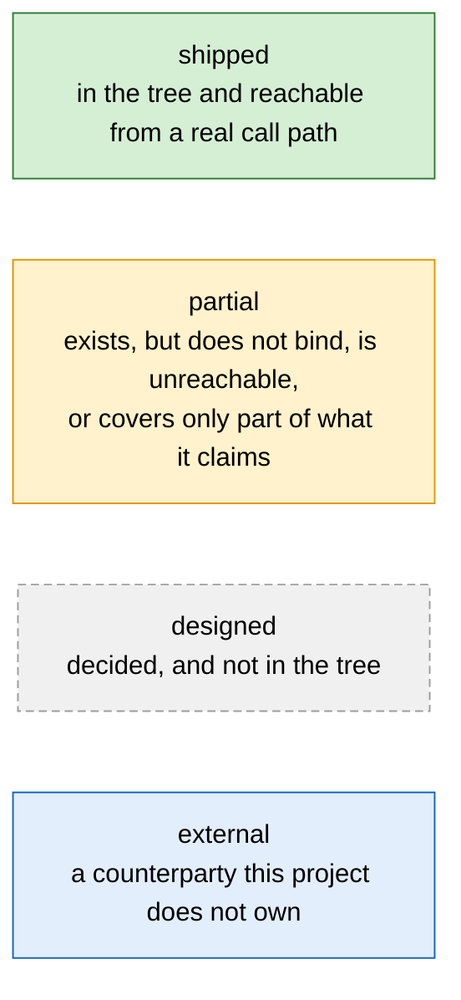

`building`, `researching` and `deferred` never appear on a node. They are schedule
states, and a diagram draws mechanism. A node reading **`no bead`** marks a gap that
nothing tracks.

## 3. Section numbers are a cited surface

**The numbers on the headings in this document are a contract with the code.** Comments
under `src/` and `tests/`, catalog sources and the sibling documents all cite a section of
this document by number. The population moves with every citation added or corrected, so
this document gives the probe and not a frozen count:

```sh
grep -rn 'architecture[^,]\{0,40\}§[0-9]' src/ tests/ .scripts/ .basicly/ docs/ \
  | grep -v '^\.basicly/ledger/'
```

**The second filter is not optional.** The ledger stores prose about this work, the same
pattern matches that prose, and it dominates the raw count. A reader who drops the filter
gets a number that is mostly narration.

A number that moves without the citation moving breaks a claim that resolves to the
wrong text and still reads as correct.

Two terms of that contract.

1. **A section number is stable.** It names one subject for as long as that subject
   exists.
2. **A citation from code names a number this document currently defines.**

**A check holds both terms.** `.scripts/check_docs_citations.py` walks `docs/**/*.md` for
`file:line` references into code and exits non-zero on a stale one; `.scripts/check_code_citations.py`
walks code for `§N` references into this document (`code-citations` in `basicly verify`),
with the unresolved population frozen so it may only fall. Every citation the probe above
returns still has to move in the same change that moves a heading number.

## 4. System context

This system talks to eight counterparties. It owns none of them.

**One further dependency is deliberately absent from this view.** The work tracker is this
project's own code ([32. The work tracker](#32-the-work-tracker)). An external binary carried
part of it until 2026-08-18, as a transitional dependency rather than a counterparty of this
design, and nothing reaches it now.
[37. The external tracker binary, and its removal](#37-the-external-tracker-binary-and-its-removal)
is the whole account of it.

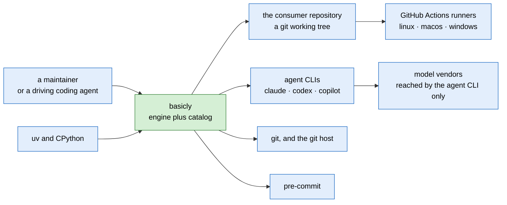

### 4.1 The external dependency register

Every counterparty is named. An anonymous counterparty cannot be implemented against and
cannot be reviewed.

| Counterparty | What we depend on | How the contract is versioned | What happens when it breaks |
| --- | --- | --- | --- |
| `git` | worktrees, three-dot diffs, `core.hooksPath`, a branch checked out in one worktree at a time | none declared. The engine states no git version floor | a git that refuses a worktree operation fails the provisioning loudly |
| the git host | remote push, pull requests, releases | none | the release command never pushes, so a host failure stops at the tag |
| `claude` CLI | headless invocation, an agent root, a settings deny-list, a streaming usage envelope, tool-boundary hook events | none declared by the vendor. A capability probe checks the assumed headless flag at detection | detection skips a binary whose probe positively shows the flag is gone |
| `codex` CLI | headless invocation, `AGENTS.md`, a sandbox and approval policy on the argv | none declared | a rejected argument value kills every dispatch. One such value already did |
| `copilot` CLI | headless invocation, an agent root, per-hook JSON files, a per-session usage store, a `--deny-tool` flag | none declared | a dispatch with no readable usage envelope halts the session rather than under-counting |
| model vendors | model ids, prices, per-surface caps | a committed model map, generated from a reviewed anchors file | the drift check reports and never writes, so an upstream edit can never change which model runs someone's code |
| GitHub Actions | five workflows on three platforms | the workflow files in this repository | CI failing does not block a local landing; the loop's verify step runs the same checks |
| `uv` and CPython | the runtime every projected hook shells out to | `requires-python` in `pyproject.toml` | a consumer without the runtime on `PATH` reaches the bootstrap shim |
| `pre-commit` | the runner that installs and invokes the git-hook floor at three stages | a pinned revision per hook repository in the committed config | a hook the runner cannot resolve fails the commit loudly rather than passing it |
| ~~the external tracker binary~~ | **none. It was removed 2026-08-18 and no code path spawns it** | — | §37 is the closing account of it |

**The projected guidance is the one contract every agent family does standardize.** That
is why the handoff runner in [29.2](#292-detection-model-resolution-and-the-handoff-fallback)
can degrade to printing a prompt and still be correct.

## 5. The two planes and the two seams

| Plane | Turns | Into |
| --- | --- | --- |
| Distribution | authored catalog sources | the files agents read, and the hooks that bind them |
| Execution | a unit of work | a merge, over a tracked graph of state |

They meet at two points and nowhere else.

1. The loop dispatches an agent whose context is the projected guidance.
2. The loop's verify step runs the same checks the git hooks run.

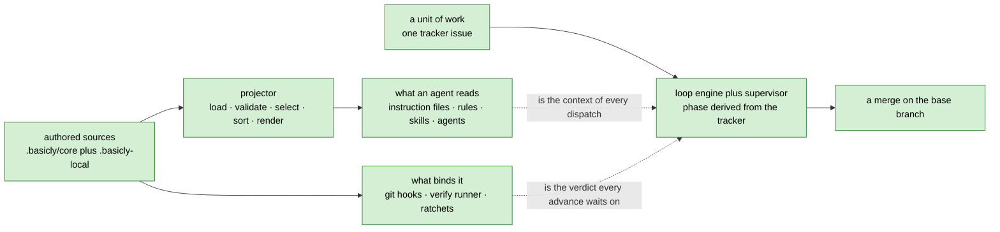

**Three roles. One repository may hold all three, as this one does.**

| Role | Where it lives | What it is |
| --- | --- | --- |
| engine | `src/basicly/` | normal installable Python |
| catalog | `.basicly/core/` | authored data, plus the portable hook and kit scripts; never an engine module |
| consumer | any repository that ran the install | the tree everything is projected into |

Neither tree depends on the other's location. `.basicly/` never holds a `basicly`
engine module: the hook scripts and the deployed kit there are standalone Python that
imports nothing from the engine, and the `kit-boundary` hook is what binds that
direction for the kit tree. `src/basicly/` never holds catalog data.

---

**Part II — Principles, quality attributes and constraints.** What a change may never break, what the system optimises for, and what it refuses.

## 6. Core invariants

These hold everywhere. A change that violates one is wrong even if every gate passes.

**The engine disposes. Agents propose.** No model holds authority over the tracker, the
schedule or a required gate. This holds at every autonomy level. An agent's output is a
proposal. Engine code validates it against policy before it becomes state. See
[D-01](#d-01--authority-is-asymmetric).

**State is derived, never remembered.** The loop phase is a pure function of tracker
state. The engine keeps no durable side-state of its own. A crashed, compacted or
swapped session resumes by re-reading the tracker. Re-dispatching completed work is
therefore structurally impossible rather than merely unlikely. See
[D-02](#d-02--phase-is-derived-and-the-phases-are-code).

**Enforcement is code, not a request.** Where a hook can enforce a rule, the rule is a
hook. The prose only points at it. A model that chooses to run a formatter is not the
same thing as a formatter that runs.

**Deterministic first, judged second.** Only a deterministic check may pass a required
gate. Judged output is advisory, or it routes a decision to a human. It is never a green
light. See [D-04](#d-04--deterministic-first-judged-second).

**Every deterministic step is one command.** An agent that must perform a *sequence* of
mechanical steps proves the engine is missing a command. The tokens, the latency and the
chance of a mechanical mistake are all waste.

**Nothing generated is ever hand-edited. Nothing authored is ever generated.** Users edit
catalog sources. The projector writes outputs. A tool-time guard and a commit-time
backstop defend the one-way street. Convention does not.

**Extension is addition or explicit override, never silent replacement.** There is no
third mechanism and no last-one-wins. An unexplained conflict is an error.

**No committed artifact carries a machine-specific path, username or hostname.**
Redaction runs at the tracker's write seam, which is the only store there is —
`owned_store.TRACKER_MODES` holds one mode. A pre-commit hook is the floor under it.

**Evidence over assertion.** A claim in a specification, in a release note or on a README
is backed by something a reader can re-run. An unmeasured claim about behaviour buys
confidence nobody earned.

## 7. Quality attributes

**What the system optimises for, what it trades away, and the instrument that reads
each.** A row with no instrument says so, and names what would falsify the claim. Nothing
here is inferred from a benchmark this repository has not run.

| Attribute | Target | Traded away for it | Instrument |
| --- | --- | --- | --- |
| **Determinism of projection** | two builds on identical sources produce byte-identical output | ordering freedom. The sort is total, so an author cannot choose emission order | `uv run basicly check` |
| **Resumability** | a crashed, compacted or swapped session resumes by re-reading the tracker | a durable phase field, and every optimisation one would allow | `uv run basicly loop status <issue>` re-derives the phase from the tracker alone. `uv run pytest tests/test_loop_state.py -q` covers the derivation |
| **Offline operation** | no agent dispatch depends on the network | fresh model data. The map is generated at authoring time, and the drift check reports rather than writes | **no standing instrument.** Falsified by any network call on the dispatch path; the model-map generator has deliberately no verify-check entry |
| **Portability** | three platforms, one behaviour | POSIX-only mechanisms. The ledger lock is a file whose existence is the lock, because the POSIX advisory lock is missing on one platform | the quality-gates workflow runs the full check set on linux, macos and windows, fail-fast off |
| **Auditability** | every state change is a plain, git-tracked file | a daemon, a cache and any hidden state | `git diff` and `git blame` are the trail. `uv run basicly check` is the offline staleness gate |
| **Agent working set** | one module fits what an agent can hold | file count. An extraction adds a module rather than shrinking one | `uv run python .scripts/check_module_size.py` and `.scripts/check_comment_density.py`, both frozen per-file ratchets |
| **Security and redaction** | no committed artifact carries a machine-specific path, username or hostname | completeness. The secret-rule mirror between the engine and the copied pre-commit scripts is kept in step by convention only | `uv run pytest tests/test_redact.py -q`, plus two pre-commit hooks. The path-rule mirror has an equality test; the secret-rule mirror does not |
| **Cost per landed unit** | not set | — | **not measured.** [31.2](#312-forecasting-spend) states the arithmetic; nothing scores it against landed work. Falsified by a report pairing total tokens, wall clock and human interventions against landed correct units |
| **Adherence of the always-on baseline** | not set | — | **not measured.** Recall under a direct cue is measured and is only an upper bound. Falsified by a measurement of which baseline rules bind while an agent works |
| **Behavioural effect of one catalog entry** | not set | — | **not measured.** Falsified by an efficacy eval with control arms, hidden checks and a safety tier. None exists |
| **Speed** | **explicitly not a goal** | everything above | re-measured: a single-record in-process read is about fifteen times cheaper than the median external CLI call, and a full fold about twice as cheap [measured, [37.1](#371-why-it-was-adopted-and-why-that-reason-expired)]. The point of owning the tracker is ownership, not speed |

Two of these rows carry an honesty the rest of the document should match, and they are
repeated here rather than paraphrased.

**The size ratchet is an agent-context gate, not a code-quality gate.** The measured
quality literature argues the other way: it finds mid-size components best, and finds
smaller modules proportionally *more* defect-prone. The gate exists here for the working
set an agent can hold. **That is a plausible mechanism, not a measurement, and it must be
stated that way.**

**The performance claim was corrected downward.** An earlier claim of a far larger factor
compared incomparable operations against a much smaller ledger. The corrected figures are
in the table above, and the fold ratio narrows as the ledger grows.

**Three headline claims of this project are unmeasured**, and each names the instrument
that would falsify it.

| Claim | Instrument that would falsify it | State of that instrument |
| --- | --- | --- |
| the roster's tiers and lenses pay for themselves | cost per landed unit | not built. It gates several downstream decisions |
| the always-on baseline is effective at its current size | a measurement of which rules bind while an agent works | not built. Recall under a direct cue is measured, and it is only an upper bound |
| an individual catalog entry changes behaviour | behavioural efficacy evals with control arms | not built |

**A fourth claim was removed rather than softened** [checked 2026-08-16]. It said the
field had converged on "harness engineering" as the name for this repository, and asked
only whether *this* harness is better than the others. Two problems. The claim's own
source graded itself "practitioner synthesis" and cited no definition. And against the
published definitions in [40. External references](#40-external-references), this
repository is not a harness. It fails two of the four conditions those definitions set.

The honest open question is narrower and harder: **nothing here has measured whether the
factory pays for itself against a competent human running the same three coding tools by
hand.**

## 8. Non-goals

Each refusal has a reason stronger than taste, and comparable projects reached several of
them independently. Each one is permanent, not unscheduled, so an absence here is not an
oversight.

| Refused | Because |
| --- | --- |
| An LLM orchestrator in control of the tracker | Authority must be asymmetric; a persuadable scheduler is not a scheduler |
| Personas spawning personas | The failure it prevents is an agent inventing unmetered helpers. Amended, not dropped: an agent may spawn only a role the engine authored, gated at the runtime boundary. See [D-11](#d-11--an-agent-may-spawn-only-a-role-the-engine-authored) |
| An agent-writable catalog | A bad implementation bounces off a gate; a bad fragment is *absorbed* and silently degrades every later lane. See [D-12](#d-12--agent-authored-guidance-never-reaches-the-catalog-without-a-human) |
| Bypassing a commit hook to dodge parallel commit contention | The serial landing already solves it without defeating a gate |
| Lossy compaction of the ledger | The fold is the authority, and a lossy fold has no authority |
| A maintained TUI | A maintenance surface with no leverage on any of the four failures in [1.1](#11-the-four-failures) |
| An external database or daemon | Reintroduces exactly the unowned-binary upgrade surface being removed |
| A compression proxy in the critical path | Selection beats serialisation by orders of magnitude on measured data. See [D-21](#d-21--context-control-is-field-selection-not-encoding) |
| A cheap-tier model pre-reader | Its characteristic error is an undetectable omission |
| Agent-to-agent messaging | A real capability, declined because it costs reproducible scheduling and resumability |
| A general-purpose issue tracker | The work graph exists to serve the loop, not to compete with issue trackers |
| Per-track model choice at the token level | Model awareness lives at the invocation seam; this is not an inference client |

## 9. Autonomy and integrity

The system assigns two independent levels to a unit of work. Autonomy bounds what the
engine may approve. Integrity bounds how much verification the change must pass.

| Ladder | Question it answers | Set by | Values |
| --- | --- | --- | --- |
| Autonomy | How much may the engine approve while no human watches? | A human, at grant time | 4 |
| Integrity | How far does a defect in this change reach? | A deterministic rule over declared paths | 3 |

The two are independent. A typo fix in the tutorial, run under a grant that needs no
human, is `docs-and-tests` integrity at `unattended` autonomy.

Both scales once used the letter `L`. Autonomy ran `L0` to `L3` and integrity ran `L1`
to `L3`, so a bare `L2` named neither one. Each level now has a name. The `Code today`
column below carries the identifier the engine still writes.

### 9.1 Autonomy: how much the engine may approve alone

| Name | Code today | The engine may approve | A human must still approve |
| --- | --- | --- | --- |
| `attended` | `L0` | nothing | classify, decompose, ship |
| `assisted` | `L1` | decompose | classify, ship |
| `supervised` | `L2` | classify, decompose | ship |
| `unattended` | `L3` | classify, decompose, ship | a kill, at every level |

Source: `policy.GRANT_COVERAGE`.

**Originating a proposal is one level stricter than approving one.** Only `supervised`
and above may originate a work type or a child set. Source: `policy.PROPOSAL_COVERAGE`.

**`attended` is the default.** A repository that configures nothing cannot run an
unattended pass at all. Raising the ceiling is an edit to `basicly.toml`, so opting in
leaves a diff.

**The names describe how much a human watches.** They do not reuse a phase name, a
command name or a gate name, because a level named `ship` and a phase named `ship` would
be one word with two meanings. Four rejected name sets are in
[D-31](#d-31--the-two-ladders-are-named-not-lettered).

### 9.2 Integrity: how far a defect reaches

| Name | Code today | Paths it claims | Verify mode | Extra gates | Model tier | Rework | Ship |
| --- | --- | --- | --- | --- | --- | --- | --- |
| `docs-and-tests` | `L1` | documentation, tests, the site, changelog fragments, every `.md` file | fast | — | medium | 1 | may be delegated |
| `engine` | `L2` | engine code, the scripts, and every path no clause claims | full | — | high | 2 | may be delegated |
| `consumer-surface` | `L3` | the five frozen consumer surfaces | full | validate-as-consumer, evidence-binding | maximum | 2 | human only |

Sources: `integrity.LEVELS`, `integrity._RULES`, `integrity._SELECTIONS`.

**Each name is the rule clause that assigns the level.** The code already calls them
`docs-and-tests`, `engine-internal` and the five `*-surface` clauses. The names are read
off the tree rather than invented, so a verdict a reader sees printed and a name they
read here are the same word.

**The three names widen outward.** A `docs-and-tests` defect stops inside this
repository. An `engine` defect changes how the tool behaves. A `consumer-surface` defect
breaks something a consumer's own code or configuration is pinned to.

**The engine still writes `L0` to `L3`** in the classification marker, in the plan
gate's vocabulary check, in `basicly.toml` and in every `--autonomy` flag value. Those
spellings are a frozen consumer surface, so a rename needs a deprecation window. The
rename is filed as basicly-3iaw0x.

[36.5](#365-integrity-assignment) covers the rule that assigns a level and how much of
the assignment anything reads back.

---

**Part III — The distribution plane.** Authored catalog sources, and the files and hooks they become.

## 10. The catalog and its write ownership

### 10.1 Three trees, one write-owner each

Everything a coding agent or a human reads is **generated**. Everything a user edits is a
**source**. The separation is a mechanism, not a convention.

| Tree | Who writes here |
| --- | --- |
| `src/basicly/` — engine: loader, planner, renderers, CLI, loop | basicly maintainers; ships with the tool |
| `.basicly/core/` — managed catalog: fragments, skills, agents, hooks, targets, templates, schemas, models, permissions, kit | `basicly install` only |
| `.basicly/state/install.json` — install provenance: version, timestamp, per-file hashes | `basicly install` only |
| `.basicly-local/` — user overlay, path-configurable | the consumer repo's users |
| `basicly.toml`, `basicly.d/*.toml`, `basicly.local.toml` — configuration | the consumer repo |
| Generated artifacts: `AGENTS.md`, `.claude/CLAUDE.md`, `.github/copilot-instructions.md`, scoped rules, skill and agent roots | `basicly build` and its siblings only |
| `.basicly/generated-manifest.json` | `basicly build` only |

```text
.basicly/
  core/
    fragments/<category>/<id>.fragment.yaml
    skills/<skill-name>/skill.yaml        # plus references/, scripts/, assets/
    agents/<slug>/agent.yaml              # plus agents/blocks/<id>.block.yaml
    hooks/*.py + hooks.yaml               # git-stage and agent hook scripts, and their manifest
    models/{anchors.yaml,model-map.json,model-map.schema.json}
    permissions/permissions.yaml
    rubrics/*.rubric.yaml
    schemas/*.schema.json
    targets/{claude,copilot,codex}.yaml
    templates/{claude,copilot,codex}/*.j2
    kit/{tracker,tier}/*.py               # portable modules deployed into a consumer
  generated-manifest.json
```

### 10.2 Every catalog source is YAML, never Markdown

Some coding agents discover a skill by a broad scan for `SKILL.md`. A `SKILL.md` *source*
would let an agent load the catalog copy and the projected copy at once. Fragments follow
the same rule.

YAML beats Python here for two reasons. It needs no code execution, and a block scalar
keeps prose lossless. `basicly catalog lint` refuses a Markdown-named source. It also
refuses a second YAML extension, so one source can never resolve two ways.

## 11. The projection pipeline

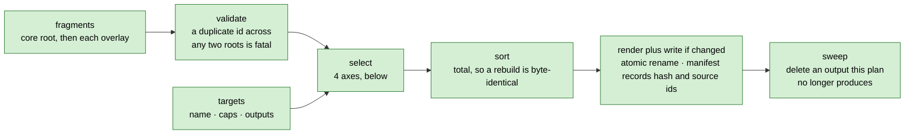

**Determinism is a property, not an accident.** The sort is total. It orders by priority
descending, then by category, then by id. Two builds on identical sources produce
byte-identical output. A diff therefore only ever shows a real change.

**Selection has exactly four axes.** Every output declares which of them it uses.

| Axis | Declared on | Effect |
| --- | --- | --- |
| `applies_to` | the fragment | names the target families it is for, or `all` |
| `filter.applies_to` | the output | names which of those values the output accepts |
| `has_scope` / `exclude_scoped` | the output | restricts an output to path-scoped fragments, or drops them from a baseline |
| `technologies` | the source | gates the whole source on the consumer's declared stack |

The third axis is why one fragment set yields both an always-on file and a set of
path-gated rules. For a target that scopes, no fragment appears in both.

**The manifest is the memory of the projection.** It records a content hash and the
ordered fragment ids per output. Three things read it.

1. `basicly check` recomputes it to detect a hand edit.
2. The sweep deletes an output that dropped out of the plan. That is how a retired output
   reaches a consumer.
3. The generated-file commit hook uses it to decide whether a staged generated file still
   matches its sources.

**Path interpolation is checked, not trusted.** An output path that resolves outside the
repository root is refused. A fragment id holding a path separator or a pure-dot value is
refused before it can reach a path template.

## 12. Targets and the always-on files

### 12.1 Targets

Three targets ship, all enabled.

| Target | Output | Filter | Soft cap |
| --- | --- | --- | --- |
| claude | `.claude/CLAUDE.md` | `all` plus `claude`, scoped excluded | 9000 chars |
| claude | `.claude/rules/<id>.md`, one per scoped fragment, carrying a `paths:` frontmatter key | `all` plus `claude`, scoped only | — |
| codex | `AGENTS.md` | `all`, scoped **inlined** | 16000 chars |
| copilot | `.github/copilot-instructions.md` | `all` plus `copilot`, scoped excluded | 9000 chars |

**Codex inlines a scoped fragment because it has nowhere to put one.** Codex is not short
of steering files. It supports a nested `AGENTS.md`, an override file, fallback filenames,
repository-checked-in skills, project subagents and a sandbox policy. What it lacks is a
**type**. Codex has no glob-based or pattern-based instruction scoping in its discovery,
in its configuration reference or in its skill frontmatter. Directory placement is its
only scoping axis. This project's scopes are globs.

Codex also **never loads a nested `AGENTS.md` below the current directory**. It walks from
the project root down to the current directory and stops. A file at `src/foo/AGENTS.md`
therefore contributes nothing when Codex runs from the repository root. Inlining preserves
correctness. A nested file is rejected, not deferred.

**Two names on the Codex surface mislead a reader.** Codex "Rules" (`.codex/rules/`) is a
sandbox command-execution policy, not an instruction rule. A file-based custom prompt is
deprecated in favour of a skill, and it is user-scope only, so a repository cannot ship
one.

**Copilot gets no path-scoped twin, by decision.** One editor loads the Claude rules root
and the Copilot instructions root together, with no deduplication. A twin therefore
double-loaded every path-scoped rule for every consumer of that editor. A scoped rule is
single-sourced to the Claude rules root instead. The accepted cost falls on the
server-side Copilot surfaces. Pull-request review and the cloud agent keep only the root
instructions file.

### 12.2 The always-on files

`AGENTS.md`, `.claude/CLAUDE.md` and `.github/copilot-instructions.md` are the foundation
every other artifact builds on. A noisy or ambiguous baseline passes that failure to
everything downstream.

**Six properties they must keep.**

1. **Point at enforcement. Do not restate it.** Where a rule is mechanically enforced, the
   always-on file names the command that enforces it. Prose is reserved for what a linter
   cannot check. That means a judgment call, an escalation policy, and when to ask instead
   of guess. A restatement of what a linter already enforces measurably hurts agent task
   success and inflates cost.
2. **An enforced rule is one line. A judgment rule is prose.** The judgment section is the
   shorter of the two.
3. **No duplication across the three files.** The shared always-applicable set feeds all
   three. Each family's file adds only content that differs.
4. **Each file is self-contained.** Two of the three families do not reliably import a
   shared file, so each file inlines the shared content. An agent never needs a second
   file to understand the baseline.
5. **A scoped fragment stays out of the baseline** for the two families that can scope. A
   language-specific rule then costs no context budget on an unrelated task.
6. **Stable ordering**, so a diff stays minimal.

**The caps are a discipline choice, not a platform limit.** Claude's own degradation
warning is far above these numbers. One vendor removed its former hard character limit
and now only advises a shorter file. Codex reads its file up to a configurable byte cap.
**A cap warning means split into a scoped rule. It does not mean shrink the prose.** The
cap counts **characters**, not bytes, so a byte count overstates a UTF-8 baseline by its
multi-byte characters.

Measured from the projected files, and regenerated and gated on every commit:

<!-- docs-claims:begin always-on-sizes -->

| Surface | chars | cap | headroom |
| --- | --- | --- | --- |
| `.claude/CLAUDE.md` (claude) | 8768 | 9000 | 232 |
| `AGENTS.md` (codex) | 15984 | 16000 | 16 |
| `.github/copilot-instructions.md` (copilot) | 8867 | 9000 | 133 |

<!-- docs-claims:end always-on-sizes -->

**Which surface binds depends on the tier.** The tightest always-on surface binds for an
always-on fragment. `AGENTS.md` binds for the **path-scoped** tier, because a scoped
fragment costs it around a thousand characters and costs the other two nothing.

**The cost effect of scoping is asymmetric.** It removes a fragment from the two baselines
that can scope, and it **adds** that fragment to the one that inlines. The codex cap was
raised rather than lowered, because an audit of an overrun found that the excess *was* the
scoped tier. Eviction of always-on lines would have charged all three families to fix one,
and it would have left the cause standing. The old cap also stood proxy for the vendor's
claim that adherence degrades with length, and this repository has never measured that
claim.

**What is known and what is not.** Both families that were tested reproduce the great
majority of their baseline's rules when asked, against a small no-guidance control. The
"cliff already crossed" reading is therefore **refuted**. The content is not invisible at
this size. That does **not** settle the operational question. Nothing measures which
baseline rules *bind* while an agent works. Recall under a direct cue is an upper bound,
and it confirms the mechanism only. The cap policy is therefore asymmetric. **A lower cap
is ordinary housekeeping. A higher cap still has no evidence behind it.**

## 13. The fragment model

One fragment is one policy, practice or decision: a YAML source with a body written as a
block scalar, projected to Markdown. The authoritative shape is
`.basicly/core/schemas/fragment.schema.json`, which sets `additionalProperties: false`.
An unknown key is refused at load.

**The schema requires six keys**: `schema_version`, `id`, `description`, `category`,
`applies_to` and `body`. `schema_version` is a source-file key with no field on the
in-memory `Fragment` record, so it has no row below.

| Field | Required | Values | Notes |
| --- | --- | --- | --- |
| `id` | yes | kebab-case, unique | a duplicate across core and overlay is a hard error |
| `description` | yes | one line | |
| `category` | yes | `boundaries`, `code-style`, `commands`, `decisions`, `design`, `hooks`, `project`, `security`, `skills`, `testing`, `tools`, `ci-cd`, `quirks` | a closed vocabulary; unknown values are refused at load |
| `applies_to` | yes | target names or `all` | |
| `body` | yes | a block scalar | the projected Markdown content |
| `priority` | no | `critical` (4), `high` (3), `medium` (2, default), `low` (1) | sorts descending |
| `scope.paths` | no | glob list, default `["**"]` | a non-default value makes the fragment scoped |
| `status` | no | `active` (default), `draft`, `deprecated` | only `active` is projected |
| `technologies` | no | controlled list | untagged means universal |
| `tags` | no | free list | carried, and no projector selects on it |
| `title` | no | one line | derived from the id when omitted |
| `source` | no | `core` (default) or `user` | inferred from the load root when omitted |
| `override` | no | bool, default false | must be true to replace a core fragment |
| `replaces` | no | list of fragment ids | those core fragments are removed when this one is active |
| `extends` | no | list of fragment ids | declared and validated; nothing consumes it today |
| `enforced_by` | no | list of commands | each must be cited in the body, see below |

**The extension mechanism is two rules and no exceptions.**

1. The planner removes every core fragment named in an active user fragment's `replaces`.
2. The loader raises on every load when any of three conditions fails. A fragment that
   declares `replaces` must set `override: true`. Every replaced id must exist in the
   merged set. Two user fragments may not replace each other.

**`enforced_by` closes the loop on the context-minimalism rule.** A fragment that claims
a command enforces its rule must cite that command in its body. `catalog lint` refuses a
fragment that does not. The rule "point at enforcement instead of restating it" is
therefore a check and not advice.

**What is on disk is not counted here.** `basicly catalog list fragment` prints every
source over core and overlay together, with its category, its `scope.paths` and its
status. A count typed into this document is wrong on the next fragment, and it was: the
rows this paragraph replaces claimed 21 core fragments against 23 sources, 22 of them
active, and 4 path-scoped ones against 6. Each path-scoped fragment becomes its own
rules file for the families that can scope, which [12.2](#122-the-always-on-files)
prices.

**The category `hooks` labels a fragment that *describes* hook usage.** It is not the
mechanism that ships a hook script. [16. Hooks](#16-hooks) is that mechanism.

## 14. Skills

A skill is on-demand guidance. It is a directory the agent loads when it decides the skill
is relevant, or when a path glob triggers it. Until then it costs only the line that
advertises it.

**Two projection roots.**

| Root | Who reads it |
| --- | --- |
| `.claude/skills/` | Claude's only project skill root |
| `.agents/skills/` | the open-standard root the other families discover |

`[TARGET]` **Both roots are mandatory, and every command that writes one writes both.** A
root that only some commands write is how a second root drifts unnoticed. Filed as
basicly-jt0dgi.

The tree does not do this today. `skills.resolve_skill_roots` writes
`DEFAULT_SKILL_ROOTS[0]` alone unless the caller passes `--all-default-roots` or an
explicit `--root`, so a bare `basicly skills-build` or `basicly skills-check` touches one
root [verified 2026-08-16, `uv run basicly skills-check --help`]. `basicly install` passes
`all_default_roots=True`, so an install is correct and a bare check is not. This
repository's own `CLAUDE.md` compensates by prescribing the flag, which is guidance
standing in for a default. The default should change, and the flag should become
redundant. The agent roots already behave this way: `basicly agents-build` and
`agents-check` take no root flag and always write both.

**A skill source directory projects whole.** A skill may bundle references, scripts and
assets beside `skill.yaml`. The projector renders the discoverable `SKILL.md` with a
generated marker. It copies every other file verbatim, bytes and mode. A skill can
therefore ship a long reference guide or a fixer script.

**The invocation axis is declared, not inferred.** It is required, and it is one of two
values.

| Value | Carries a description | Costs context | When it loads |
| --- | --- | --- | --- |
| model-invoked | yes | on every turn, in the listing | when the model judges it relevant |
| user-invoked | no, and lint enforces the empty pairing | nothing | when a human types its name |

The axis is declared and never guessed. "Does this entry route correctly" is not a
well-posed question until the entry says whether routing applies to it. The axis is
therefore a prerequisite for the routing evals, and not bookkeeping.

**One root requires a description and the other does not.** A user-invoked skill
therefore emits a synthesized description on the standard root. That family rejects a
file with no description.

**The projected directory is mirrored and the root itself is owned by the projector.** A
rebuild prunes a resource the source dropped. Deselection of a technology prunes the whole
directory. The check also reports any entry in the root that no source accounts for. That
covers a hand-authored skill file, a loose README and a projection whose source was
deleted. Without the report, a skill the projector never knew about passes every gate and
reaches only one agent. The check reports such an entry and never prunes it, because the
projected copy is the only copy there is.

**Technology scoping is the core-versus-optional axis.** An untagged skill is universal
and always ships. A tagged skill ships only when the consumer selects that tag in
configuration. Technology-specific and situational guidance belongs in an optional skill
and never in an always-on file. Enforcement stays in the deterministic hooks. A skill
carries the judgment and the pointers a linter cannot.

**A skill is not free, and the cost sits in the listing rather than the body.** The whole
skill listing is budgeted against a fraction of the context window. On overflow the host
drops descriptions **starting with the least-invoked skills**. That is a feedback loop and
not a flat cost. The host truncates a rarely-invoked skill first, which makes that skill
harder to invoke. Both the per-entry cap and the listing budget are gated.

**A skill's frontmatter can take a path glob.** The glob limits the skill, and it also
triggers automatic activation. It buys always-loads-on-a-matching-file behaviour at
**zero** always-on characters. The key is not in the portable subset. It is therefore
declared under a per-target vendor fence, and emitted only into the root that understands
it. The general rule this settles is that a host-specific capability is expressible
without the portable artifact absorbing it. See
[D-24](#d-24--a-skill-keeps-its-path-glob).

**Skill scope precedence is the inverse of agent scope precedence.** For a distribution
tool that asymmetry is load-bearing.

| Artifact | Precedence, strongest first | Where `basicly install` writes |
| --- | --- | --- |
| agents | managed → project → user | project, the middle scope |
| skills | enterprise → **personal** → **project** | project, the **weakest** writable scope |

A developer's personal skill of the same name therefore overrides a shipped skill in
silence. An identically named agent would not. Nothing in the projection makes that
visible to the consumer.

**Lint enforces the specification's naming rules.** The name must match the directory. It
must be 1 to 64 lowercase alphanumeric-or-hyphen characters, with no leading, trailing or
consecutive hyphen. Lint warns when a body runs long. It also warns when a file reference
reaches more than one level deep. Both warnings follow the specification's
progressive-disclosure guidance.

**What is on disk is not counted here.** The generated `catalog-skills` block in
`.basicly/core/skills/README.md` carries one row per skill source with its invocation
and its technologies, rendered from the sources and gated by
`.scripts/docs_claims.py`. A source whose technologies no target declares is filtered
out of that target's root, so fewer skills are projected than authored.

## 15. Subagent definitions

Subagent definition files are the third catalog kind. They are generated and never
hand-edited.

**Composition.** Every agent fills five ordered body slots. They are role, startup,
process, output contract and constraints. Each slot holds a list of references to shared
building blocks, or inline Markdown. The shared blocks live under a reserved slug, and
[30. Roles at dispatch](#30-roles-at-dispatch) is where they are counted — from the
catalog, under a tripwire in `tests/test_docs_drift.py`, because the count typed here
said four against a catalog holding five.

**The description is authored as four fields.** They are purpose, triggers, returns and
posture. The projector joins them, so no part of a delegation-quality description can be
forgotten.

**The tool list is a mandatory explicit allowlist.** An agent never inherits every tool in
silence. A posture that declares read-only may not grant a write tool. Lint refuses a
source that does.

**Tool names are not translated.** Copilot's published alias table accepts Claude's
PascalCase names as first-class, and it matches without regard to case. One declared name
therefore resolves on both families. The table is pinned as reviewed data for two reasons.
It drives the read-only posture check. It also lets lint refuse a name that resolves to
nothing. That refusal matters, because one family drops an unrecognised entry with no
error, and the other refuses to launch and says so. An unrecognised entry therefore fails
**safe**. The residual risk is a useless agent, not a lost guarantee.

**A tier names a portable model tier.** The four values are low, medium, high and maximum.
The engine single-sources them into an enum on the agent schema. A tripwire test keeps the
two in step. Lint refuses a source that declares no tier.

**No projected agent file carries a provider model id.** See
[D-09](#d-09--a-provider-model-id-never-appears-in-an-agent-file). The schema keeps the
old key as a deprecated property, so lint owns the actionable message. Without it the
schema emits a bare "additional properties are not allowed". The key also stays on the
reserved-frontmatter list, so the per-family passthrough cannot smuggle an id back in.

**Two roots are written and both are checked**, `.claude/agents/` and `.github/agents/`.
The Copilot root exists for two reasons. Copilot's *cloud* agent reads only its own root,
and its command-line tool discovers the Claude root through an undocumented path. Its
custom agents also support a tool allowlist, so the read-only posture survives the
crossing.

Double loading does not happen. The deduplication key is the file name without its
extension, so the two files collapse to one agent. Only the Claude root receives the
per-family passthrough.

**A third native root for Codex is declined, not overlooked.** The Codex subagent format
has no tool allowlist. A Codex copy would therefore drop the mandatory allowlist that the
read-only posture check depends on. That is a lost guarantee and not a format cost. It
would also fork the renderer, the drift check and the generated marker. Codex receives the
same guidance through `AGENTS.md` and the standard skills root.

**No agent root costs always-on budget, and the saving is structural.** Four facts hold,
each verified against a live host rather than taken from vendor guidance.

1. Only an agent's name and description load at session start.
2. The body never enters the parent's context.
3. Only the final message returns.
4. A subagent runs in an isolated context window. A dispatch's working set is therefore
   never charged to the session that spawned it.

**A projected agent definition does not reach a running session's subagent registry**
[measured 2026-08-16]. The measurement gave a role write tools in the catalog, ran
`basicly agents-build` over both roots, and then dispatched that role. The dispatch
reported its live tools as the pre-change set. A definition change therefore takes effect
at the next process start. A consumer reaches for a conversation reset first, and that is
the wrong lever.

## 16. Hooks

Hook scripts are first-class catalog artifacts. They are the deterministic, gating
counterpart to fragments and skills. A manifest describes each one tool-agnostically.
Every script is standalone Python with no runner interface, so the manifest could drive a
different runner without a script changing.

**Each entry declares** an id, a script and a stage. It may also declare whether filenames
are passed, whether it always runs, its technologies, a matcher and a manager. The manager
routes the hook to one of three surfaces.

| Manager | Surface it writes | Stages in use |
| --- | --- | --- |
| git | a managed local block in the pre-commit configuration, foreign hooks preserved | pre-commit, commit-msg, pre-push |
| claude | the agent-hook section of `.claude/settings.json` | pre-tool-use, post-tool-use, session-start |
| copilot | one managed JSON file per hook under Copilot's hooks directory | post-tool-use, session-start |

**What ships is not counted here.** The generated `catalog-hooks` block in
`.basicly/core/hooks/README.md` carries one row per declared spec — its id, stage,
manager, script and the purpose read from the script's own module docstring — rendered
from `hooks.yaml` and gated by `.scripts/docs_claims.py`. The tables this paragraph
replaces carried three numbers that stood wrong from 2026-08-16 until a hand
correction on 2026-08-31, with no gate on any of them.

**A gate that is shipped but never installed is inert.** That is the exact failure that
once let unguarded commits through. So `basicly hooks-build` projects the manifest **and
then runs the installer** for every managed stage. It does not only write the
configuration.

**Three hooks carry reasoning a reader cannot recover from the script.**

The secret scanner blocks a commit whose staged added lines carry a likely credential. An
inline allowlist escapes a reviewed false positive.

Its sibling scans for an internal-only identifier. That covers a company domain, an
internal host, a machine username and a private repository name. Each one publishes in
silence, because it reads as ordinary text to anyone outside. **Its denylist is
deliberately not in the script.** A gate that hard-codes the strings it suppresses would
publish them into this repository, and into every consumer that installs the catalog.
Pre-commit also runs in a continuous-integration job whose logs are public. The tokens
therefore live in the gitignored per-machine configuration as named rules, and the report
prints only the rule name. The scanner is inert until a consumer configures it, so no
consumer is blocked by a list they did not write.

**The identity guard blocks a commit whose git identity is unset or a hostname fallback.**
It is generic and holds no personal data. It validates the **effective** identity that git
will stamp. It resolves author and committer with the environment above the configuration,
because a runner may overlay an identity environment variable. A check on the
configuration alone would miss that override.

**The tool-usage counter is token-free telemetry.** It tallies the pipeline head of every
shell command into a self-ignored file. It resolves the head *past* a wrapper. A wrapper
here is the runner, the package executor or the environment setter, together with their
subcommands, flags, flag values and variable prefixes. The counter therefore credits the
wrapped tool and not only the wrapper. The file is the input for a cull of idle tools and
skills from the catalog.

**A consumer's own hooks survive.** The projector merges its managed block into an
existing configuration. It preserves a foreign repository and a foreign hook, and the
merge is idempotent. This repository dogfoods the catalog directly, so its own pre-commit
configuration points straight at the catalog scripts. One hook in it is the Markdown
linter. That one is a hand-maintained consumer block the projector preserves and does not
own.

The choice of pre-commit over a compiled runner, and the four triggers that reopen it, are
in [D-32](#d-32--pre-commit-rather-than-a-compiled-hook-runner).

## 17. Model tiers

A catalog source declares a **portable tier**, never a provider model id. The engine
resolves a concrete id at dispatch, from committed data.

**There are four tiers, and they are a closed set**: `low`, `medium`, `high`, `maximum`.
A source names one of the four and nothing else. The set is closed so that a reader can
hold the whole vocabulary, and so a typo is a refusal rather than a new tier.

**A tier is a statement about the reliability a role needs, not about a price or a
vendor's marketing name.** The same tier resolves to different models for different
vendors, and to different spellings of one model for different surfaces.

The reason a source may not name a model id: one model is spelled `claude-haiku-4-5` by
one vendor and `claude-haiku-4.5` by another surface of the same vendor. A pinned id is
therefore portable to exactly one surface, which is the opposite of what a catalog needs.

An anchors file is the reviewed input. It holds one anchor model per tier and vendor, plus
a surface table and a capability rule. A generator resolves it into a committed map. A
published schema validates that map.

**The map is indexed on three axes, because all three change the answer.**

| Axis | Why it is separate |
| --- | --- |
| tier | the whole point of the abstraction |
| vendor | each vendor names and prices its own models |
| surface | the same model can cost several times more through one surface than another, and one surface may cap a model's input where the vendor's own publishes no cap |

**An unavailable cell records a status and a reason, and deliberately carries no model
key.** A consumer that reads the cell therefore fails loudly. Nothing demotes it onto
another tier's model in silence. Resolution refuses the dispatch and never substitutes.

**Two constraints keep the whole mechanism offline.**

1. The generator fetches upstream data at authoring time and at check time only. It never
   fetches in the dispatch path, and it has no verify-check entry. No agent dispatch
   depends on the network.
2. The drift check **reports** and never writes. A community-contributed upstream edit
   must surface as a red check. It must never change which model runs someone's code.

A test gates the committed map's shape offline.

**Two independent resolvers exist, and the difference is deliberate.**

| Resolver | On an unavailable cell | Why |
| --- | --- | --- |
| in-harness | raises | a dispatch that cannot honour its tier is a bug |
| portable kit — no dependencies, no imports, no `PATH`, no network, no subprocess | fails closed and quiet, leaving the spawn untouched | it runs on machines that may hold no map at all |

**No projected agent file carries a model id, and that is a decision rather than a gap.**
The injection mechanism leaves a definition that pins its own model alone, so a projected
line would *disable* injection rather than implement it. A tier therefore reaches a spawn
through a host hook that rewrites the spawn, or it does not reach one at all.

**That places a hard requirement on the host, and it is the one a reader must take away:**
a host can honour a declared tier only where its hook contract permits a spawn to be
**rewritten**. A contract that is approve-or-deny cannot express "spawn this, but on that
model". Where a host offers no such hook, the tier is declared, validated and unreachable,
and the honest record is that the tier was *not honoured* rather than that it was
satisfied.

Which hosts satisfy that requirement today is a status question.
[`status.md`](status.md) answers it.

## 18. Agent permissions

The projection writes a deny-list of semantic rules into `.claude/settings.json`, the one
agent family with a config-file deny. The projection is **ensure-present**. It merges the
managed patterns in, it preserves consumer entries, and it **prunes nothing**. A flat deny
string carries no per-entry marker, and an extra deny is fail-safe. Drift is therefore a
subset check.

**The limits are stated here, because an absent rule is not a permission.**

| Family | What binds | What does not |
| --- | --- | --- |
| claude | the file-edit rule form | the two write-tool variants a reader would expect. The permission check ignores both |
| copilot | invocation flags injected at dispatch, because there is no config-file deny | an infix wildcard. That pattern language matches by token prefix, so it cannot express Claude's globs |
| codex | invocation-only guardrails: a sandbox mode and an approval policy on the argv | a project-scope override. Codex forbids setting either at repository scope |

**The list is a partial backstop. It is never the source of a prohibition.** Several
destructive git commands are denied on no target, and still need a human confirmation.

## 19. Catalog verification

Two layers, deterministic always first.

| Check | Where it runs |
| --- | --- |
| Required fields, known category, priority, status and target; extension-field types | the loader, on every list, build and check |
| Duplicate fragment id across every root | the loader, on every load |
| Replacement integrity: the target exists, the override flag is set, no mutual user-to-user replace | the loader, on every list, build and check |
| Source format: schema validity, no Markdown-named source, a single YAML extension | `basicly catalog lint`, wired as a pre-commit hook and a CI step |
| Composition rules: block references resolve, every tool resolves, a read-only posture grants no write tool, the composed body stays under the strictest reader's prompt ceiling | `basicly catalog lint` |
| Routing: positive top-k, pairwise negatives, a description-collision ceiling, a ratcheting rank-1 floor | `basicly catalog lint` |
| Duplicate or near-duplicate bodies, contradictions from a curated pair dictionary, vague phrases, scope overlaps | `basicly catalog verify` |
| Semantic review: an agent reads the rendered files for contradiction and ambiguity | `basicly catalog review`, advisory, always exits zero |

**A deterministic check catches a large class cheaply.** That class is a duplicate id, a
missing field and an unknown vocabulary value. A semantic problem needs a capable reader.
An example is a contradiction that parses fine and reads badly to a model. Both layers run
against the same merged fragment set. The judged layer is never a merge gate.

**The routing gate is the deterministic, lexical, free tier of the evidence layer.** Its
assertion is that the declared owner must **outrank** the entry. A bare "must not rank
first" passes vacuously on a prompt that matches nothing. The gate reports a rank-1 rate
against a floor that ratchets and cannot be lowered.

## 20. Configuration

Three files, layered lowest to highest, with a fourth layer for the current process.

| File | Committed | What belongs here |
| --- | --- | --- |
| `basicly.toml` | yes | the repository's declaration; the **only** source for projection config |
| `basicly.d/<id>.toml` | yes | one lane's additions, so two lanes never write one file |
| `basicly.local.toml` | no, gitignored | per-machine harness choices, and the internal-identifier denylist |
| session overrides | no | this process only |

**The merge is a key-level shallow replace, with exactly one exception.** A key set in a
later layer replaces the earlier value whole. A per-machine list is therefore taken as it
stands, and never concatenated. The machine says *instead*.

The one exception is the verify check list. The drop-in layer **appends** to it in
filename order, because a drop-in fragment is one lane's *addition*. The per-machine layer
still replaces the whole list.

**Projection configuration is repository-level only.** The path and catalog sections shape
repository-committed outputs. They are read from the committed file alone, never from the
per-machine overlay.

**Every ratchet number in a drop-in is a delta, never a total.** Two lanes that each add
one suppression would both record the same total, while the merged tree holds one more.
Addition composes in any landing order. A total does not. A delta that raises a frozen
baseline is refused. The escape is an explicit rebaseline key with a non-empty reason.
The engine counts and prints every such escape.

**Both files are schema-checked on every load. The schema is an allowlist over the whole
configuration surface.** An unrecognised section or key raises. The message names the
file, the containing section, what that section accepts, and which sections accept a
similar name.

A key the engine ignores leaves the file stating one behaviour and the engine performing
another. A gitignored overlay has no diff to review and no other gate. The only symptom is
the default the key was written to replace. The allowlist therefore covers the whole
surface rather than this module's readers. Two declared entries have no reader in the
configuration loader at all.

**The tree decides which schema does the checking, not the process.** A repository that
ships its own engine source is checked against the schema declared in *that* source. The
reader parses it statically on every validation. This repository is such a tree, and so is
each of its lane worktrees.

Without that rule a landing could not admit a lane that adds a key. The landing runs from
the base checkout, so the engine that validates the lane's configuration is the pre-merge
one. It refused a name the lane's own code introduces one commit later.

The static read is deliberate. The tree under test has not merged. An import would run a
second engine inside the process that lands it, and the question is a set of names rather
than a behaviour. It fails closed. A schema the reader cannot model falls back to the
running engine's schema, and the refusal then names the ordering rule instead of reading
as a typo.

**The refusal is unconditional. Forward compatibility is the accepted cost.** There is no
warn-then-error staging, and no narrowing to a near-miss of a known key. A repository
pinned to an older engine, whose configuration carries a newer key, fails until it
upgrades or removes the key. The two softer options rejected are in
[D-33](#d-33--an-unknown-configuration-key-is-refused-unconditionally). The message bounds
the cost. It names the engine's version, and it says that an upgrade is one of the two
fixes.

## 21. Installation and upgrade

**`install` and `uninstall` are ordinary command-line verbs** [measured 2026-08-16,
`basicly --help`]. They are not special bootstrap commands. `uvx` is only how a consumer
reaches a `basicly` executable when the machine has none. It is not part of the verb.

Three ways reach the same two verbs.

| How a consumer invokes it | When to use it |
| --- | --- |
| `uvx --from git+https://github.com/niksavis/basicly@<ref> basicly install` | first install, and every upgrade of a pinned ref. Nothing is added to `PATH` |
| `uv run basicly install` | inside a checkout of this repository, where `basicly` is the project |
| `basicly install` | when a `basicly` executable is already on `PATH` |

**`basicly install` does not put `basicly` on `PATH`.** It syncs the catalog into the
repository and projects every artifact. Nothing in it installs the Python package. A bare
`basicly install` therefore works only after the consumer makes the executable reachable,
for example with `uv tool install`.

**Uninstall follows the same rule.** `basicly uninstall` and `uvx ... basicly uninstall`
are one verb reached two ways.

**One idempotent converge command.** An earlier design staged an init, then a build, then
each projector, and a separate update command. Init was never a technical prerequisite,
because everything it does is idempotent and skips what exists. One command therefore
serves both the first install and every upgrade.

Its contract, in order:

1. Materialize or sync the bundled core.
2. Migrate and prune legacy layouts.
3. Scaffold the overlay and the configuration, **only if missing**.
4. Keep the authoring-repository guard.
5. Rebuild every artifact and install the hooks.

**The catalog is versioned as a whole and pinned as a whole.** A hook configuration pins a
revision the same way. A re-run of the install from a newer pinned ref is the only action
that moves a consumer to a newer catalog version. That action is explicit and reviewable.

**Provenance is what makes an upgrade safe.** Install records a per-file hash snapshot of
the core as materialized. A later install overwrites a changed file and deletes an
upstream-removed one. The snapshot distinguishes an upstream change from a user's hand
edit.

| File state | What the sync does |
| --- | --- |
| matches the snapshot | upstream-owned. Overwritten |
| differs from the snapshot | a hand edit. Warned and kept, unless `--force` |
| unknown to both bundle and snapshot | always kept |

The post-sync snapshot records only bundle-matching files, so a kept edit stays protected
on the next run.

**Install writes the managed core and the state only.** It creates the overlay directory
when missing, and never writes fragment content there. It never overwrites an existing
configuration file. When an existing file lacks a section the shipped default now carries,
install names the section in a hint instead of editing.

**An install into a consumer repository, drawn in order.**


**Uninstall removes everything managed.** That covers the core, the state, every
manifest-listed generated file, every projected skill and agent that carries the generated
marker, and the managed hook block. When nothing managed remains, uninstall deletes the
configuration and removes the git hooks. It preserves the overlay and the configuration
unless the consumer purges. It refuses to run in the authoring repository, where the core
*is* the catalog source.

**Technology scoping applies at projection time, not at sync time.** The core sync stays
full, which keeps provenance simple. The projectors and their checks skip a source that
does not overlap the selection. A narrower selection converges on rebuild and strands
nothing. Fragment outputs recompose, and the manifest sweeps the rest. An excluded skill
or agent is pruned when it carries the generated marker. An excluded managed hook is
stripped from the configuration files.

**The managed catalog ships inside the distribution.** The build projects the dogfooded
source tree into the wheel, and the source distribution carries it, so a direct-from-git
install resolves it. The locator prefers a source checkout and falls back to the packaged
copy.

**A bootstrap shim exists for a consumer with no runtime.** It is a POSIX shell script and
a PowerShell script, `.scripts/bootstrap.sh` and `.scripts/bootstrap.ps1`. Each installs
the runtime from its vendor when the runtime is absent, then runs the same pinned install
in the current repository. Both fail fast outside a git repository.

**Everything lives in plain, git-tracked files.** No daemon, no hidden state, no network
calls at build time. `git diff` and `git blame` are the audit trail, and `basicly check`
is the offline staleness gate.

## 22. The CLI surface

`[TARGET]` **This section belongs in a CLI reference, not in an architecture document**
(basicly-mfavrh).
It is the largest single section here, it is a per-command behaviour table, and it goes
stale on every landing. It stays only because two `docs_claims` assertions
(`cli-commands`, `cli-subcommands`) and two of the four `tests/test_docs_drift.py`
tripwires bind on this section. Moving the section means retargeting all four in the same
change. The other two tripwires bind on the fragment field table in
[13. The fragment model](#13-the-fragment-model), and
[`conventions.md`](conventions.md) §7 records which gate binds where. Until the move
lands, this section is a reference the gates keep true, in the wrong document.

**29 top-level commands. Ten of them are subcommand groups** [measured 2026-08-28, count
`subparsers(cli._build_parser()).choices`].

They fall into three surfaces.

| Surface | For | Commands |
| --- | --- | --- |
| lifecycle | a consumer repository | install, uninstall, status, health, brief |
| catalog | an author of catalog sources | build, check, the four build/check pairs, usage, catalog, rubric |
| harness | the development loop, in either repository | session, worktree, verify, policy, decompose, loop, commit, runner, tracker, board, release |

**Lifecycle.**

| Command | Behaviour |
| --- | --- |
| `basicly install` | Idempotent converge: materialize or sync the core, migrate legacy layouts, scaffold overlay and config without overwriting, then build, skills-build across all default roots, agents-build, hooks-build with activation. First install and every upgrade |
| `basicly uninstall [--purge]` | Remove everything managed, preserve the overlay and config unless purging, refuse in the authoring repo |
| `basicly status [--json] [--fleet]` | Read-only snapshot: installed catalog version against running engine version, drift summary, per-manager hook state, technology selection, overlay counts. Never writes, always exits zero. The fleet flag rolls it across the housed repositories as one JSON payload |
| `basicly health [--json] [--window N] [--fleet]` | Read-only per-agent health scoring and behavioural drift from the run-record log: dispatch failure rate, a rework signal, a bounded score, and a rolling-baseline drift flag. Never writes, always exits zero |
| `basicly brief <issue-id>` | Print the brief the loop would dispatch for one issue, without dispatching it. Shares the dispatch renderer rather than re-rendering, because a preview that differs from the dispatch is worse than none |

**Catalog.**

| Command | Behaviour |
| --- | --- |
| `basicly build [--target NAME] [--verify]` | Render enabled targets, write only changed bytes, update the manifest, warn on cap overrun. The verify flag runs the content checks first and writes nothing on failure |
| `basicly check` | Byte-for-byte staleness check of generated files and the manifest; exit 1 on mismatch, no auto-fix |
| `basicly skills-build [--root ...\|--all-default-roots]` / `skills-check` | The same build and check contract for the skill catalog, mirrored per root. Without a flag it writes one root only, which [14. Skills](#14-skills) marks as a target to fix |
| `basicly agents-build` / `agents-check` | The same contract for the agent catalog, always both roots, with no root-selection flag |
| `basicly hooks-build [--no-install]` / `hooks-check` | Materialize hook scripts, merge a managed block into the hook config preserving foreign hooks, then install the git hooks so the gates are active. The check reports projection drift and warns when the git hooks are not installed |
| `basicly permissions-build` / `permissions-check` | Project the agent-permissions deny-list into the co-owned settings file: ensure-present, consumer entries preserved, nothing pruned, with a semantic subset drift check |
| `basicly usage report` | The tool and skill counts the telemetry hook recorded, and the catalog skills never used: the culling input |
| `basicly usage forecast` | Forecast error per dispatch, over local run records and committed markers. Refuses to compute an error for a record missing either half and reports those as unpaired, so an empty report explains itself |
| `basicly usage tuning` | Advise every governed factory parameter from the recorded dispatches: the value in force, the outcome distribution under it, and a recommendation labelled measured or seeded. Advisory only; it writes nothing |
| `basicly usage lane-split` | Split each persisted lane transcript into a context-acquisition share and an implementation share |
| `basicly usage outcomes` | How every recorded dispatch ended, with the failure share as an explicit rate |
| `basicly usage tracker [--promote] [--refresh-surface] [--as-json]` | The measured external-tracker surface the replacement scope is frozen from |
| `basicly catalog list [fragment\|skill\|agent]` | Table of catalog sources of the given kind |
| `basicly catalog new <fragment\|skill\|agent> NAME [--category C] [--description D]` | Scaffold a new source in the correct format |
| `basicly catalog lint` | Source-format and composition gate; wired as a pre-commit hook and a CI step |
| `basicly catalog verify` | Deterministic content checks beyond the load path: duplicate bodies, contradictions, ambiguity, scope overlaps |
| `basicly catalog review [--runner NAME] [--dry-run]` | Advisory agent-assisted semantic review; always exits zero |
| `basicly catalog dump` | The composed selection the build would make: the technology axis and every fragment root in load order, each overlay-over-core override beside the core source it shadows, then every planned output with the axes it declares and every item it selected with that item's own origin |
| `basicly rubric eval <issue> [--runner NAME] [--dry-run]` | Evaluate the issue's work-type behavioural rubric: deterministic checks through the verify runner, judged checks through one agent prompt. Reports an advisory gate, promotable by naming it in the required set |

The names above are the whole authoring surface. Of the two planned reporting views, the conflict
one was cut from scope and the `basicly catalog verify` output covers that need; the override one
is `basicly catalog dump`.

**Harness.**

| Command | Behaviour |
| --- | --- |
| `basicly session start [--json] [--rows N]` | Read-only orientation for a session, with every line derived and none authored: the newest note tagged `[session handover <date>]` on whichever record carries it (where the last session stopped, or that no session said), the ranked ready set carrying the ranking policy that produced it, what is blocked and by what, every live grant with what is left of it where this checkout can see the spend, and the decision records whose status in [38. Decision records](#38-decision-records) is not `accepted`. An empty ledger says so rather than drawing an empty frame. Never writes, always exits zero |
| `basicly worktree create\|list\|cleanup` | Sibling worktree lifecycle: create provisions dependencies and installs the gates; cleanup removes the worktree and its merged branch |
| `basicly worktree merge\|merge-queue\|bg-isolation` | Land one finished worktree on its base; land several serially in a given topological order; turn off the host's own background isolation so the loop isolates itself |
| `basicly verify [--mode fast\|full\|staged] [--issue ID] [--gate NAME] [--fix]` | Run the consumer's configured checks for a mode and optionally record a tracker gate; the fix flag applies mechanical repairs first |
| `basicly policy dor\|scaffold\|gate\|rework` | Report the definition-of-ready, emit a body with every required heading, and read or record gate and rework state |
| `basicly policy checkpoint\|grant` | Approve a human checkpoint behind a terminal or a one-time confirm code; show, issue or revoke a session autonomy grant |
| `basicly decompose` | Turn a feature into child issues plus a computed dependency graph |
| `basicly loop status\|advance\|run <issue>` | Drive one issue through the loop; a blocked step exits nonzero and names the input it needs |
| `basicly loop preflight\|supervise\|stop` | The multi-lane path: preflight is read-only and reports clean base, live worktrees, runner, grant, budget and a per-lane band table; supervise dispatches ready lanes, routes their outcomes and lands green work; stop asks a running supervisor to finish the round it is in |
| `basicly loop session\|watch\|decisions\|answer\|decide\|kill` | A second session observes a live run and clears what a lane is blocked on. Answer records a human answer, decide invokes the confined decider agent, and kill closes a lane with a recorded reason behind a one-time confirm code that no grant and no terminal substitutes for |
| `basicly loop improve [--dry-run]` | The second loop shape, taking no issue: run the repository's improvement controller, which measures one declared property, selects one target deterministically and files at most one lane |
| `basicly commit <description>` | Assemble the conventional-commit envelope from engine state and commit the staged change. Only the description is authored; the commit-message hooks stay the gate |
| `basicly runner list\|dry-run\|run` | Agent-agnostic headless runner adapters; the dry run prints the exact command an adapter would execute before any live invocation |
| `basicly tracker ready\|blocked\|stats\|show\|list` | The backlog, read out of the owned ledger: ready is the ranked set that can be worked now, blocked names what holds each record that is not ready, stats totals the graph by status, and show and list read one record and the set. The engine resolves the ledger's location, so a consumer never retypes it |
| `basicly tracker write` | One human tracker write through the engine seam, so it lands on the store the engine reads rather than beside it |
| `basicly board --out FILE` | Write the harness board as one self-contained HTML page, with the `harness-board/v1` snapshot beside it as `board-snapshot.json`. The page references no external origin and every panel carries the snapshot's age, so a value is never drawn without it |
| `basicly board validate` | Read a board snapshot and say whether this consumer can render it. A major-version mismatch refuses; an unknown key is reported and admitted |
| `basicly board serve [--port N] [--bind ADDR] [--refresh S] [--no-actions]` | Serve the board for a wall display. GET reads; **one POST route** runs a `basicly` command an operator submitted, behind a one-time confirm code the operator types and this server never holds. `--no-actions` registers no action route and every POST is then 405 — the recommended flag for an unattended wall. `--bind` takes a literal IPv4 interface address, refusing a wildcard or a hostname, and defaults to the loopback. While a supervisor lock is fresh it serves that producer's snapshot bytes and folds nothing; otherwise it folds for itself on `--refresh` and keeps the result in memory. It takes no lock and writes no file, so it blocks no gate |
| `basicly release <version> --issue ID [--date D] [--dry-run] [--autonomous --root ID]` | Bump the single-sourced version, regenerate version-stamped projections in a fresh interpreter, rewrite install pins on the consumer surfaces, fold the per-lane changelog fragments into a dated section, commit, and create the annotated tag. **Never pushes** |

**Two properties of the harness surface are decisions.** First, every fully deterministic
step is reachable as **one command** an agent triggers and waits on. Second, a command
that changes the world irreversibly stops for a human even when a grant is live. Three
commands do that. They publish a release, kill a lane and approve a ship.

**The release command regenerates in a fresh interpreter, with the target repository
forced onto the import path.** The command-line entry point binds the version at import,
so a same-process or installed-copy rebuild would stamp the previous version. Release
refuses on a dirty tree, on a version that does not move forward, on an existing tag, and
on a changelog fragment it cannot place. It reports every reason from one run.

---

**Part IV — The execution plane.** One unit of work, from an idea to a merge.

## 23. The loop and the work model

The loop is the execution plane. It binds work isolation, a workflow and hard gates into
one predictable machine. Any supported agent drives it identically.

**One mechanism carries three names in the tree.** The command-line verb is `basicly
loop`. The tracker markers are spelled `[harness-*]`. The requirements document that
first specified it was absorbed into this document and deleted. The name for it is
**the loop**.

Its thesis is **lean over substrate**. It wraps four primitives the work tracker already
has: a gate ledger, a dependency graph, readiness, and a definition-of-ready lint. It
builds only the four mechanics the tracker lacks. Those are the worktree lifecycle, the
landing order, the verify runner and the state machine.

### 23.1 Work classes and tracks

A unit of work is classified into a **work class**, which is exactly a tracker issue type.
The class selects a **track**, and tracks nest.

| Work class | Track | Runs |
| --- | --- | --- |
| epic | epic track | feature tracks |
| feature | feature track | task tracks |
| task | task track | leaf work |
| bug | leaf track | leaf work |
| chore | leaf track | leaf work |

A decomposed leaf is a child issue linked by a dependency edge. There is no separate
record type for it. [39. Glossary](#39-glossary) fixes which noun names which referent.

The tracker has no rework status. The rework loop is therefore modelled with gate results
and comments instead.

### 23.2 The state machine

Two kinds of transition exist. A reader who confuses them misreads the whole machine.

| Marker | Who decides | What it takes to pass |
| --- | --- | --- |
| GATE | engine code | a computed verdict. The engine refuses on a red one |
| checkpoint | a human, or a covering autonomy grant | an approval marker exists. Nothing is computed |

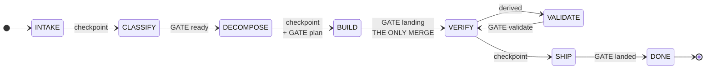

**Three properties of the happy path.**

1. **The ladder is not a line.** A green validate gate moves the unit *back* to verify. The
   ship checkpoint is taken at verify. Validate is a detour off verify, and not a rung
   between verify and ship.
2. **Only one advance merges.** That is the build-to-verify landing. Neither the ship
   checkpoint nor the teardown touches git history.
3. **Exactly one transition is derived.** Verify to validate is not an advance. It is the
   phase derivation, which reads an outstanding gate off the tracker.

The failure paths hang off build and validate. They have their own diagram, because a
reader skips this half when both halves share one picture.

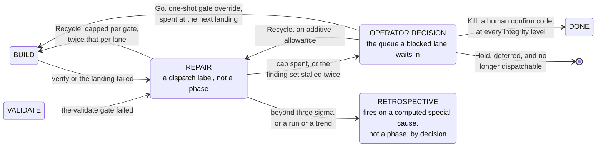

Each of the four operator verbs writes. None of them is advice. See
[25. Rework, escalation and the four verbs](#25-rework-escalation-and-the-four-verbs).

### 23.3 Phases, checkpoints and advances

The handler set is exactly intake, classify, decompose, build, verify, validate and ship.
Done is a terminal marker with no handler and no transition out. **Repair and
retrospective are not phases.** They are dispatch labels. See
[D-06](#d-06--a-test-admits-a-persona-not-a-preference) and
[D-07](#d-07--retrospective-fires-on-a-computed-special-cause-and-is-not-a-phase).

**An advance re-derives the phase, then runs the one handler for it.** The engine's
invariant is that every advance must either **block** or produce a new tracker signal that
moves the derived phase. It never announces a move it did not make. Two drivers sit above
a single advance. One runs until blocked. The other also resolves a checkpoint block
through the approval path, and it mints at most one confirmation challenge per call.

**Two phases write to the base branch, and an advance for either is refused from a linked
worktree.** Git refuses to update a branch checked out in another worktree. A clean block
beats a stranded commit.

**Three human checkpoints exist.** They are classify, decompose and ship. An approval is a
comment marker on the issue, and it is gated on an interactive terminal. Off a terminal,
which is where any tool-invoked shell runs, the command refuses. It then issues a one-time
confirmation code a human must echo back.

**This mitigates the shared-identity gap. It does not close it.** A fork and its human
share one operating-system identity and one git identity. A process that deliberately
re-runs with the code can still forge the marker. An authenticated marker would be the
real fix. The same acknowledged class covers a forged gate provider.

**The definition-of-ready is emitted rather than discovered.** The required section set is
derivable from the work type. A scaffold command therefore prints a body with every
required heading present and a placeholder under each. Both refusal paths name that
command, typed for this issue, instead of only listing what is missing.

One composer is the single source. The engine composes every child body through it, so a
bug-typed child carries the reproduction section too. **The per-type set is configuration.**
`[policy.type_sections]` declares what each work type owes beyond the acceptance criteria
every bead owes whatever its type, and `config.load_type_sections` reads it — falling back to
the engine's `DEFAULT_TYPE_SECTIONS` and saying so, because a default nobody was told about
is indistinguishable from a declaration the engine failed to read. A type the table omits
owes nothing extra, so an empty table is a real answer. `tests/test_config.py` pins both
halves.

## 24. Phase is derived, not stored

The engine keeps no durable phase field anywhere, and no durable side-state of its own.
The phase is a pure function of five values read from the tracker. They are the issue
status, the set of approved checkpoint markers, the worktree binding, the gate status, and
whether the issue has children.

The engine reads the ladder strongest-signal first.

| Rung | Condition |
| --- | --- |
| done | the issue is closed |
| ship | the ship checkpoint is approved, the issue has **landed**, and no validate gate is outstanding |
| validate | the issue has landed and a validate gate is outstanding |
| verify | the verify gate is green and the issue has a worktree binding or children |
| build | a worktree binding exists |
| decompose | the decompose checkpoint is approved, or children exist |
| classify | the classify checkpoint is approved |
| intake | otherwise |

**The word "landed" carries two incidents' worth of reasoning. Do not simplify it.**

| Naive rule | The incident it caused |
| --- | --- |
| ship is reached when the ship checkpoint is approved | A ship approved after a transient failure, before the landing, wedged the phase at ship with no route back to the merge. A bound worktree whose verify gate is red has not merged |
| a missing worktree binding proves the issue landed | A leaf that never built has no binding either. Nothing enforces checkpoint ordering, so a ship approval recorded out of order on an unstarted leaf closed an issue with zero work done |

**The green required gate is the discriminator.** The build-to-verify landing records it.
An issue that never built has run nothing that records it.

Both rungs read the **verify gate itself**, and not the aggregate can-advance flag. A
demand for a second gate dropped a merged issue back to build.

**The phases are therefore engine code and deliberately not configuration.** The argument
is [D-02](#d-02--phase-is-derived-and-the-phases-are-code). What a consumer would plausibly
want to vary is already configuration. That covers the required gates, the rework cap, the
verify checks per mode, and the autonomy ceiling.

## 25. Rework, escalation and the four verbs

**Every gate failure funnels through one function.** It runs five steps in this order.

1. Record the attempt.
2. Fire a retrospective, when the ledger shows a special cause.
3. Judge convergence.
4. Check the lane ceiling.
5. Test the cap.

**The cap is per gate.** Verify and validate each get their own cap, which matches what the
counters already record. A **lane-wide ceiling** sits at a multiple of the cap, so a lane
cannot grind by alternating gates. See
[D-17](#d-17--the-rework-allowance-is-per-gate-with-a-lane-wide-ceiling).

| Where the lane is | What happens |
| --- | --- |
| below the cap | the loop blocks and writes a **repair brief** into the lane's own worktree, carrying the gate evidence that rejected the work |
| at the cap | the loop escalates into the decision queue |

**Convergence is judged on the finding set, not on the count.** A round whose findings
match the previous round's set is a stall, not progress. The second consecutive stall
escalates and **refunds** the attempt. A grind on an unchanging finding set spends the cap
and changes no variable. A repeated identical merge bounce is stricter, because the first
repeat escalates.

**A sub-task charges its own record.** One bad sub-task therefore cannot spend the whole
lane's budget.

**Four operator verbs exist, and all four write.**

| Verb | What it does | Who may issue it |
| --- | --- | --- |
| Go | a one-shot override of one named gate, spent at the next landing | operator, or a covering grant |
| Recycle | bounded rework in the lane's own worktree, or an additive rework allowance | operator, or a covering grant |
| Hold | defers the lane and records the reason, so the next supervised pass does not dispatch it | operator, or a covering grant |
| Kill | tears the worktree down and closes the issue | **a human, always** |

Hold and Kill were once words an escalation offered that no answer carried out. An
operator who answered "park" changed no status, and the next pass dispatched the lane
again. Both are writes today.

**Kill requires a human at every integrity level.** See
[D-13](#d-13--a-kill-always-needs-a-human).

## 26. VALIDATE, evidence and RETROSPECTIVE

Three mechanisms hang off the ladder without being rungs of it.

### 26.1 VALIDATE is a rung, not a lint

The engine gates this phase at `consumer-surface` integrity. It refuses the advance on a
failed or missing consumer gate. It dispatches the validator role. It prices that dispatch
as a **read** and not as a write, so a judge never enters the sample a lane's cost is
calibrated from.

**A reviewer fans out beside the validator, once per lens.**

**There are two lenses, and the set is closed: `correctness` and `security`.** A change can
pass one axis and fail the other, so each lens records its findings under its own name.
Findings from two lenses are never merged, and never ranked against each other. A literal
tripwire pins that vocabulary, rather than a length check.

Both roles are advisory in one structural sense. A reviewer records its findings under its
own marker, and **the validator owns the gate**. The no-rerank rule therefore holds by
construction, and not by instruction.

**Maintainability is deliberately not a lens.** The linter, the type checker, the dead-code
gate, the layering contract and the size ratchets bound that axis mechanically. A lens that
restates a green check is a paid dispatch on every `consumer-surface` unit.

**The validator's verdict is read off a declared line in its reply, not off its exit
code.** **The engine writes the gate, and the agent never does**, because the gate ledger
authenticates nothing. A reply with no verdict line leaves the unit in validate. The engine
advances it neither way.

### 26.2 Declared evidence artifacts

A gate records a status and not an artifact. A lane could therefore reach ship with a
passing verify recorded and nothing on disk to point at. A phase may **declare** a file the
engine asserts is present before that phase may report success.

```toml
[policy.evidence]
verify = ".basicly/evidence/verify.log"
```

**The mechanism is opt-in, and it blocks where a consumer declares it.** Nothing is
declared by default. Deletion of the line removes the requirement. A block on every phase
was rejected as too strict, and a record-only form as toothless.

**Presence only.** The engine stats the artifact and never opens it. Anything more would
put a parser, a schema and a verdict about content on the deterministic side of the gate
contract. The corollary is stated rather than hidden. An `echo` satisfies this check,
exactly as a forged provider string satisfies a required gate. What the check buys is that
nobody can claim "verified" with an empty disk behind it. A comparable design elsewhere
lets a model's self-emitted completion signal short-circuit the deterministic half. That
disjunction is rejected. Only the evidence requirement is adopted.

**The check is a precondition on leaving a phase.** The engine decides it before the
handler runs, so a refusal has spent nothing. Build is the exception in placement only. A
lane's sub-task steps stay inside build and are what produce a build artifact, so a check
on entry would deadlock the lane on its own evidence. The build check therefore sits at the
single build-to-verify funnel, before the merge. It resolves the path against the **lane's
worktree**.

**Everything fails closed.** Four inputs refuse rather than degrade to "no requirement".
They are an empty declaration, a path that escapes the checkout, a directory, and a
misspelled phase name. A gate the operator believes is on, and that never fires, is the
exact failure this removes. A typo therefore refuses *every* phase, and it names the key to
fix.

### 26.3 RETROSPECTIVE fires on a special cause

A retrospective reads the gate-failure ledger. It fires only on a **computed** signal. That
signal is a point beyond three sigma, or a non-random run or trend inside the limits. A
single failure inside the limits is common cause and fires nothing. Action on common cause
is tampering, and tampering increases the variation of a stable process. **This is the
first mechanism in the loop that decides to suppress work.**

**One arithmetic trap is fixed in the implementation, and the naive form looks right.** A
c-chart's control limit falls below one at a low mean failure count. Raw arithmetic
therefore flags every isolated failure, at roughly thirty-six times the rate a three-sigma
tail admits. So a point carrying fewer than two failures can never signal, whatever
the limit says (`retrospective.MIN_SPECIAL_COUNT`). The limit itself carries no floor:
`retrospective.chart` returns `centre + 3 * sqrt(centre)` as it stands.

**The output contract is not the why-chain.** It is four things.

1. A named control that would have refused the defect.
2. That control's tier: control, warning or documentation.
3. The class of defects it covers.
4. **The branch of the analysis not taken.** Iterated-why yields one causal path, chosen by
   the asker, and no two analysts reproduce it.

A documentation-tier outcome is recorded as a downgrade, with the reason no stronger control
was available.

**A retrospective's output is a diff against catalog YAML, never prose advice.** No autonomy
grant disposes it. See
[D-12](#d-12--agent-authored-guidance-never-reaches-the-catalog-without-a-human).

### 26.4 The improvement controller

Everything above drives a *requirement* to a landed change. The second loop shape drives a
**property of the codebase** to a set point. It reads one sensor and files one lane. It is
the actuator behind the ratchets. A ratchet bounds a file. It cannot repair one.

Three properties keep the controller inside the engine-disposes rule.

1. The controller is a **repo-declared script** at a fixed path. The engine runs it with
   this process's own interpreter, and without a shell. The engine **refuses by name** a
   repository that declares no script. An absent script otherwise looks the same as a run
   that measured everything and found no work.
2. The exit code passes straight through. A schedule can branch on it.
3. The controller holds a **one-lane bound**. It files one issue. It files no second issue
   until the first lands.

A workflow calls the controller in dry-run mode. The trigger is **manual dispatch only**.
The absent schedule is a decision, not unfinished work. It keeps the wiring non-circular. A
schedule would let a dead-code gate credit the command from the controller's own docstring,
while the command runs the controller.

## 27. Work isolation and one landing

### 27.1 The worktree

**Non-trivial work runs in a sibling git worktree** at `<repo>.worktrees/<name>`, on branch
`harness/<name>`. The worktree is never a directory inside the repository. An in-repository
worktree pollutes the tree walk. It also provisions no dependencies.

Provisioning a worktree installs its toolchain and **installs the gates**. A worktree
without them runs *no* gate. That failure once let unguarded commits through.

Trivial mechanical work goes straight to the source branch. Cleanup runs as soon as a lane
lands.

**Zero-touch tracker state.** A lane worktree holds no tracker store of its own. Every
read and every write from any checkout reaches the base checkout's one store, so no
divergent copy exists to reconcile. Provisioning establishes that, and the commit-message
hook follows the same route.

**Provisioning probes the new worktree rather than trusting it.** It aborts with guidance
when the answer is not the base store. A checkout that silently ran its own store would
diverge the loop's state from the branch it is landing onto. The mechanism is a git-ignored
`redirect` file that provisioning writes into the new worktree's ledger directory, naming the
base checkout. `tracker_paths.tracker_root` is the single resolver every reader and writer
goes through, and it honours the file only when the directory it names exists — an absent or
empty redirect resolves to the checkout itself rather than to nothing.

**The engine owns the tracker commits at three points.**

| Point | What it commits | Why |
| --- | --- | --- |
| provisioning | the claim | a teammate who pulls sees the claim from the moment work starts |
| the landing advance | accumulated tracker dirt in base, rolled into one commit before merging | non-tracker dirt still blocks the merge |
| ship | the close | — |

An agent never stages tracker files for loop-tracked work.

**Parallel build, serial merge.** Lanes build concurrently in their worktrees. They land one
at a time, in dependency order. The engine re-verifies after each merge. The decomposer
marks lanes parallel-safe only when it can predict **file-disjoint** scopes. Otherwise it
emits a fixed serial order.

### 27.2 One landing, drawn in order

Everything below is what makes the landing the only advance that touches git history.

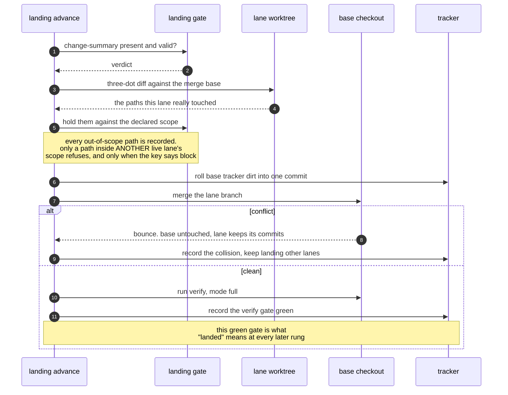

**Two serial landing implementations exist, and they are not the same thing.**

| Implementation | Used by | What it adds |
| --- | --- | --- |
| the supervisor's own landing loop | the multi-lane pass | carried lanes, pre-emption, pause on a non-bounce failure |
| the merge-queue function | epic fan-in over child worktrees, and one CLI verb | snapshots every lane's branch head up front, so a branch that grows a commit mid-pass is refused as stale rather than landed unexamined |

Both order by the same stable topological sort.

### 27.3 Declared scope is verified at the landing

The disjointness claims above rest on a scope declaration. The decomposer reads that
declaration once, to group and size the plan, and then never reads it again. A wrong or
stale declaration therefore used to surface late and indirectly, as a merge conflict, after
two lanes had already written work that collides.

The build-to-verify funnel now diffs the lane against its merge base. The diff is three-dot,
so it does not count a moved base as the lane's work. The funnel holds the result against
the declaration. Two outcomes follow, and only one refuses.

- The engine records **every** out-of-scope path on the issue, as a scope-violation marker.
  The marker is evidence about the *plan*. It travels with the tracker export, and the
  engine writes it whatever the policy then decides.
- A path that also falls inside **another live lane's** declared scope is the case that
  produces the conflict. A config key decides that case deterministically. `block` is the
  default: it refuses, and names the lane that declared the same ground. `warn` lands on the
  finding.

**A refusal on the non-collision case was rejected.** It would turn every incomplete
agent-authored plan into a rework cycle, and that costs more than the finding is worth.

**"Live" reads the worktree session records on disk, not the tracker export.** The engine
writes the worktree binding to a field that reaches the export only at the next tracker
commit. A freshly provisioned lane is the lane most likely to be mid-edit, and the export
would not show it. Engine-owned tracker paths are never out of scope, because the engine
rewrites them at every landing. An issue with no readable scope section is not checked at
all, because it contradicts no plan.

### 27.4 Owned versus shared scope

Grouping is the transitive closure of scope overlap. One path that several children declare
therefore made every one of those children overlap every other, and collapsed a fully
parallel plan into one serial chain. The effect is **worst for the most honest plan**. A
careful author is *more* likely to declare the manifest they will touch.

A child may therefore list part of its scope as **shared**. A shared path is a path the
child touches but does not own. An overlap through a path **both** sides declared shared
does not serialize them. A child that *owns* the path still blocks everyone who touches it.

**The exemption is deliberately narrow.** No agent-authored plan may use it to hide a real
collision. Two rules bound it.

1. An entry must appear word for word in the scope declaration. The declaration stays the
   whole truth, for read-cost sizing and for merge attribution.
2. An entry must be **one literal path, never a glob**. No wildcard may exempt a subtree.

**Every decompose surface also names the load-bearing path, whatever the declaration says.**
The engine reports each declared glob whose removal would leave the plan in more groups. It
marks the globs a shared declaration already defused. The original failure was silent, and a
serial chain with no stated reason is why nobody made the one-line fix.

## 28. Parallel lanes, admission and the supervisor

The supervisor runs many lanes and lands their work. It is **code, and it stays unnamed**.
Nobody should treat the part that enforces the rules as a part that can be persuaded.

### 28.1 The singleton lock and recovery

**A singleton lock reads liveness from a modification time, not from a process id.** The
engine creates `.basicly/usage/supervisor.lock` exclusively. The file carries the holder's
process id, session id and root issue. A heartbeat thread refreshes the modification time.
A lock older than the stale bound belongs to a crashed holder. A rename steals it, and
exactly one contender wins that rename. The heartbeat fences on the lock's *content*. A
holder that stalled and then resumed therefore raises an error, instead of beating a lock
it already lost.

**Recovery derives state. It does not replay it.** The engine re-adopts a session by reading
the tracker for children of the root that carry a worktree binding.

### 28.2 Admission: five conditions and six gates

**Five conditions must all hold before a lane is even a candidate.**

1. It is live and dispatchable.
2. It is not blocked in the dependency graph.
3. It has no pending decision.
4. Its derived phase is build.
5. It has no sub-tasks of its own.

Ready lanes are then ordered by the owned scheduler's rank. Ties break by id.

**Admission is a chain of six gates, checked in this order before anything spawns.** Each
one refuses on its own, and the refusal names the gate.

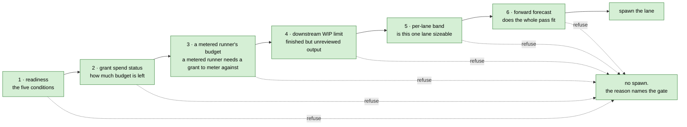

**Each worker re-reads the spend status.** A lane that waited in the pool queue can find the
grant exhausted by the time it starts.

**Nothing interrupts a running dispatch.** A pool shutdown cancels only the lanes that have
not started.

**The downstream limit and the concurrency cap bound different quantities**, and the
difference matters. Concurrency bounds how many lanes run at once. The downstream limit
bounds how much finished work waits for review. A pass can exhaust the downstream limit and
stay well inside the concurrency cap. A lower downstream limit makes review the binding
constraint, instead of slots or tokens.

**Gate 3 asks for a budget, not for delegation coverage.** It refuses a pass whose configured
runner meters spend while the session's grant carries no token budget, because both halves of
the spend ceiling are keyed on that budget and with none there is no bound at all. Whether the
grant's *level* delegates a given decision is asked at checkpoint approval and at decider
delegation, never here. Sources: `supervise.metered_without_a_budget` against
`policy.GRANT_COVERAGE` [verified 2026-08-31].

**Gate 4 counts work that already stands downstream, not the pass's own admissions.** Below
the limit, every ready lane is admitted and the concurrency cap decides how many run at
once. At the limit or above, the gate admits nothing and every held lane names the limit.
Sources: `wip.admit` and `[policy] max_downstream_wip` [verified 2026-08-27].

### 28.3 The decision queue

**One durable decision queue.** An item is a comment marker on the affected issue. Its id is
derived from its content, so a second enqueue of the same item changes nothing.

**Five kinds exist, and exactly two may be delegated to the confined decider agent.**
Sources: `decision_marker.KINDS`, `supervise.DELEGABLE_KINDS`, and the filter at
`supervise.delegate_decisions` [verified 2026-08-16].

| Kind | Delegable to the decider agent | Why |
| --- | --- | --- |
| `needs-input` — a missing fact | **yes** | the intake corpus can answer a fact question |
| `escalation` — a rework escalation | **yes** | triage of a rework escalation is the decider's stated job |
| `checkpoint` | no | the delegable-checkpoint path is the grant approval itself, and it already ran and refused before the item was enqueued. Answering the item would clear the hold without the checkpoint ever being approved |
| `validate` | no | a judged NO re-judged by another agent is the consensus-voting shape this design rejects by name. A human decides an unmet acceptance criterion |
| `stall` | no | a hard-killed runner is an operational fact about a process, not a question a corpus can answer |

Delegation needs two further conditions. The grant must sit at `supervised` or above, and
the budget must not be spent. The decider runs serially, in a confined runner. **The engine
does not dispatch an agent family it cannot confine.** A hard cap bounds delegated
decisions, and the engine re-checks that cap inside the queue lock before it records each
one.

### 28.4 Serial landing and pre-emption

**Landing is serial, and it does not stop at the first failure.** A stable topological sort
over the issues in hand gives the order. Carried lanes go first, so they land ahead of
freshly dispatched lanes at equal rank. A conflicted landing **bounces**. The base stays
untouched, the lane keeps its commits, the engine records the collision, and the pass lands
the remaining green lanes.

**A landing failure that is not a bounce pauses the pass.** The engine holds every later
green lane with the reason, and carries it into the next pass. A landing on top of a broken
base is worse than a wait. The engine pre-empts a lane whose merge a landing *in this pass*
has just broken, before it attempts that landing. The engine attributes couplings and bounce
briefs **after** the pass, so no durable record depends on the landing order inside a pass.

**The supervisor has two bounds: a pass count, and a cooperative stop.** A stop asks a
running supervisor to finish the round it is in. Every dispatched lane lands, and no further
lane is seeded. A stop does not signal the process, because the lanes are that process's own
subprocesses.

## 29. Dispatch and the runner adapters

Each agent family drives the *same* loop through a thin **runner adapter**. The loop logic
is agent-neutral. Only the adapter differs.

### 29.1 The adapter contract

An adapter is one `RunnerSpec` record. The table below is the whole contract. The three
built-in adapters are constructed in code and carry every field.

`[TARGET]` **A consumer adds a fourth agent family from configuration alone, without a
code change** (basicly-uhfmcq). Configuration does not reach that yet. A `[[runner.agents]]` entry accepts
thirteen of these keys, and [20. Configuration](#20-configuration) refuses an
unrecognised key outright, so a consumer who copies a field the entry does not accept
loses the whole file. The **From** column says which is which
[verified 2026-08-16, `config._RUNNER_AGENT_TABLE` and `config._parse_runner_agent`].
**Required** means an entry must declare it.

| Field | Required | From | What it declares |
| --- | --- | --- | --- |
| `name` | yes | an entry | the adapter's own name, and the binary looked up on `PATH` |
| `kind` | — | code only | `headless` or `handoff`. The parser sets `headless` unconditionally, so a configured family is never a handoff |
| `command` | yes | an entry | the argv template. With `prompt_via: arg` it holds exactly one prompt placeholder. Required unconditionally, because a configured family is always headless |
| `prompt_via` | no | an entry | `arg` or stdin. It defaults to `arg` |
| `model` | no | an entry | a pinned provider id. A `{model}` placeholder is substituted, otherwise the flag is injected after the binary |
| `tier`, `vendor` | no | an entry | the portable tier, and which vendor it resolves against. An explicit `model` wins over a tier |
| `tier_source` | — | derived | what decided the tier. The parser sets it when the entry declares one, and never reads it |
| `deny_style` | no | an entry | this family's tool-deny wire form. `None` means the family has no tool-deny flag |
| `deny_tools` | — | code only | the denials themselves. The loader injects them into the built-in Copilot adapter from the catalog deny-list |
| `agent_style` | — | code only | how this family selects a projected role, or `None` when it cannot |
| `sandbox`, `approval` | no | an entry | invocation-time guardrails, for a family that forbids them at repository scope |
| `git_name`, `git_email` | no | an entry | an opt-in bot identity. **Both keys or neither**; the parser rejects a lone half |
| `usage_format` | no | an entry | which envelope carries token telemetry. `None` falls back to a transcript estimate |
| `session_store` | — | code only | the base directory of a family's own per-session usage store. `[runner] copilot_session_store` sets it, in a different section, on the built-in Copilot adapter only |
| `context_window` | no | an entry | the model's window in tokens |
| `context_window_source` | — | derived | which input decided the window. A window nobody chose is the defect this field exists to make visible |

**What a consumer can do today.** They declare a headless family with its own command,
prompt style, model or tier, guardrails, deny wire form, bot identity, usage format and
context window. They cannot declare a handoff. They cannot declare `agent_style`, and
that one costs the most. `agent_style` is the field the role resolver reads first, and it
returns nothing for a family that has none. **A family added from configuration is
therefore dispatched with a bare prompt and never with a projected role**, whatever
[30. Roles at dispatch](#30-roles-at-dispatch) grades for the three built-ins. The
asymmetry is visible in the parser itself: it carries `deny_style` as an explicit escape
hatch for a custom agent wrapping one of the three, and carries no such hatch beside it
for `agent_style`.

`deny_style` and `agent_style` are independent on purpose. Codex denies tools and cannot
select a role.

### 29.2 Detection, model resolution and the handoff fallback

**Detection walks the families in order and probes the capability of each one.** The engine
selects a binary only when it is on `PATH`, **and** the probe does not positively show that
its assumed headless flag is gone. A dropped or renamed flag therefore no longer gets picked
and then fails at dispatch. The probe is conservative. A probe that cannot run assumes the
binary is capable, so a flaky probe never skips a working agent, and it never gates an
*explicit* choice.

**No cross-agent invocation standard exists, so the engine never guesses an unknown agent's
command.** When nothing matches, selection falls back to a **manual handoff runner**. That
runner shells out to nothing. It prints the exact prompt and the worktree path. It defers to
two things: the loop's block-and-resume contract, and the projected guidance, which is the
one thing every agent family does standardize. Configuration supports any other headless
agent through the explicit entry in [29.1](#291-the-adapter-contract).

**Model resolution takes the most specific source first**: a pinned id, then a declared
tier, then a default tier. It **refuses before it spawns** when a tier resolves to nothing,
and names the agent and the config key. A silent run on another tier's model is the failure
the keyless unavailable cells exist to prevent. The engine records a tier aimed at a family
that can pin no model as *not honoured*, never as satisfied.

### 29.3 One dispatch, drawn in order

This is the seam where the execution plane meets the distribution plane. Every cost figure
in [31. Cost, grants and metering](#31-cost-grants-and-metering) comes from it.

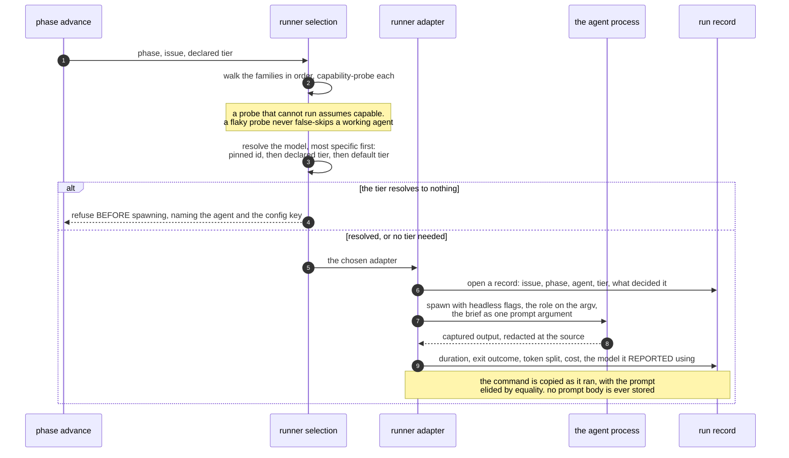

### 29.4 The run record and metering at the seam

**The run record keeps provenance, not only an id.** It holds the tier, the input that
decided the tier, and the model the adapter reported it **actually** used. The engine
measures that last field per family. It does not assume it. The families disagree about
where they name the model, and about whether they name it at all. One family names it three
ways. One names it in a session store, and may list several models for one dispatch. One
names it nowhere, and the engine records that case as *unobserved*.

**This is model awareness at the invocation seam. It is not a token-level inference
client.** Per-track model choice stays out of scope.

**Each dispatch writes a metadata-only run record**, keyed by issue. It holds the
wall-clock duration, the exit outcome, the agent, the phase, the model when one was pinned,
and token and cost telemetry. **Only metadata is persisted.** The command is stored with the
prompt argument elided. Neither the prompt body nor the captured output is kept.

**A telemetry flag is opt-in per call site**, because the flag wraps stdout in an envelope.
A consumer that parses the agent's answer reads it back through an inverter. The two
passthrough commands that print a reply for a human stay unflagged. When the output does not
parse, the record falls back to a transcript estimate, and marks it **estimated**, so
calibration can down-weight it.

**Copilot is metered out of band**, because it reports nothing usable on stdout. Its
per-model token split and credit spend land on the terminating event of its own session
store. A metered dispatch therefore supplies the new session's identifier, and the reader
joins on it. That path measures real tokens **and** leaves stdout as plain text. It is the
one arm that needs no inversion from an answer-parsing consumer.

**The streaming envelope is the default for Claude, the family that has one.** It is the
only envelope that carries per-turn usage. The context-occupancy meter reads the last
assistant turn. The terminating result event still supplies the cumulative cost view. A pin
to the non-streaming form keeps exact cost telemetry and leaves the ceiling inert.

**The engine records token counts two ways.** It records the summed total every consumer
already reads. Where an adapter reports one, it also records a provider-neutral split:
input, output, cache-read, cache-write and reasoning. Credits get their own field. They are
never folded into a currency amount.

**Redaction runs at the source, before output enters a result object.** A labelled
placeholder replaces every high-signal secret shape, so no surface leaks a credential an
agent echoed. **This project does not sandbox network egress.** It cannot portably restrict
a generic subprocess. Egress control belongs to the agent-layer sandbox.

**Attribution rides the audit trail.** At the landing, the loop reads the issue's latest run
record. It stamps the dispatched runner into the merge commit as a trailer, with the model
when one was pinned. It also records the agent as the gate result's actor. History and the
gate ledger therefore name which agent produced a landing, instead of collapsing every
landing onto one human identity. The stamp is best-effort and non-fatal.

**A runner may go further and commit as a bot.** The dispatch seam overlays `git_name` and
`git_email` on the child environment, for the author and for the committer. **This relaxes
no gate.** The identity guard validates the *effective* identity, so a bot email must
satisfy the allowlist exactly as a human's would. Tamper-evidence comes from layered
existing controls, not from new enforcement. The identity guard bounds who a commit may
claim to be. Optional commit signing makes each commit tamper-evident. The permissions
deny-list forbids a bypass of either one. The project does not *force* signing, because key
management is per-machine and out of a portable catalog's reach. It documents how to enable
signing, and it guarantees that no loop path can bypass signing once enabled.

### 29.5 Block, do not guess

A dispatched headless agent that cannot resolve a required fact writes a small sentinel file
into its worktree. The file is a JSON object. It names the missing fact and what the agent
tried. The agent then stops, **and commits no guess**.

After a clean dispatch the loop reads the sentinel, records a durable marker on the issue,
enqueues a decision, and **does not land**. The loop surfaces the missing fact like any
other block.

**Four properties make the protocol work.**

1. The loop **consumes the sentinel on read**, whether it is valid or malformed. A
   re-dispatch therefore starts clean, and a garbled file cannot fire twice.
2. A **file** carries the signal, not a stdout marker. The signal survives output redaction
   and truncation, and it needs no cross-agent output convention.
3. The file lives under a self-ignored directory. It can never enter a commit.
4. The projection puts the protocol in the dispatch prompt. An agent reads the contract
   instead of inferring it.

The protocol turns a stop-instead-of-guess *policy*, which a model may ignore, into a
first-class loop outcome.

## 30. Roles at dispatch

A phase resolves to a named agent by **table lookup**. The runner puts the role on the
argument vector.

**Which role drives which phase.** One phase has two roles, so the table names both, and
says which one the engine acts on.

| Phase | Drives it, and the engine acts on its reply | Fans out beside it, advisory |
| --- | --- | --- |
| classify | decider, proposing the work type | — |
| decompose | decomposer, cutting the children | — |
| build | implementer | — |
| repair | implementer, in its second mode | — |
| verify | **none, by decision** | — |
| validate | validator, which owns the gate | reviewer, one dispatch per lens |
| ship | curator, writing the release record | — |
| a computed special cause | retrospector | — |

**Four roles are deliberately in no phase table**: architect, researcher, security auditor
and test runner. A human invokes them.

**The supervisor, the merge, the verify step and the ship step are deliberately not
agents.** They are deterministic engine code. A name on any of them would invite a reader to
treat it as persuadable.

**Three properties are decisions rather than implementation detail.**

1. **The map is data, not judgment.** The choice is not gameable, it costs no tokens, and it
   cannot drift between lanes.
2. **A role that is not projected resolves to nothing.** The dispatch then falls back to the
   default runner rather than failing. The check is against the **projected file**, not the
   catalog source, because the projected file is what the host reads. A consumer on an older
   install therefore gets an unspecialised loop instead of a stopped one. Resolution also
   yields nothing for a phase with no persona, and for a family that ships no subagent root.
3. **Repair is the implementer's second state, not a role.** See
   [D-06](#d-06--a-test-admits-a-persona-not-a-preference).

**How a role source becomes a role on an argument vector.**


**Three things the projection does not deliver, each a partial rather than a gap.**

| What is declared | What reaches a spawn | Why not |
| --- | --- | --- |
| a model tier on every source, enforced by lint | nothing | the injection hook exists in the kit and is not installed |
| the role's skills, on the Claude root's frontmatter | the prompt, inlined by the engine instead | it reaches all three families that way, at the cost of one instrument |
| a changed agent definition | the *next* process start | a projected definition does not reach a running session's registry · no bead |

**All seven loop roles are reachable from engine code** [verified 2026-08-16]. For two days
the true statement was "the projection works and nothing consumes it". Someone authored the
agent sources, rendered them into both roots and vendored them to consumers, and every
dispatch still ended at a bare prompt. That gap is closed.

**Two caveats, because a reader will otherwise assume more than the evidence supports.**

1. The curator and the retrospector are both inert on the supervised landing pass, which has
   no watchdog and no stream meter of its own. Under the supervisor they run only after the
   ship approval, on the interactive driver.
2. The decider's *other* job, answering a queued decision, is tool-confined but passes no
   role. That path does not load the decider persona. Only the classify proposer does.

**Reachable wiring and observed dispatch are two different claims, and only the first is
green.** The ledger could falsify none of this until the record learned to copy the argument
vector. The record re-derived the command from the specification instead of a copy of what
ran, so it was wrong in **both directions at once**. It dropped the role flag a lane passes.
It added usage flags a decider's command never carried.

A record that can be wrong both ways is not evidence, and the record itself shows neither
error. The record now copies the real command, with the prompt elided by equality. When the
prompt is unknown it records no argument vector at all, instead of a published guess. **That
builds the instrument. It does not supply the reading.** The historical records are
unchanged, so a before-and-after measurement of role injection starts at the next supervised
pass.

**Nothing can now count how many skills ever fire.** The engine inlines a declared skill
into the prompt, so the never-used report cannot tell an injected skill from an invoked one.
That is the price of reaching all three families.

## 31. Cost, grants and metering

### 31.1 The grant lifecycle

**An autonomy grant is a marker on the session's root issue.** It records a level. Above
`assisted` it also records a token budget, a spend baseline and an unmetered count.

Four rules govern a marker's life.

1. The last grant or revocation marker in comment order wins.
2. A revocation is another marker, not a deletion.
3. A grant whose root issue is closed is not live.
4. A marker at a level that requires a budget, carrying none, does not parse as a grant at
   all. A sloppy hand-written marker must never be more powerful than a correct one.

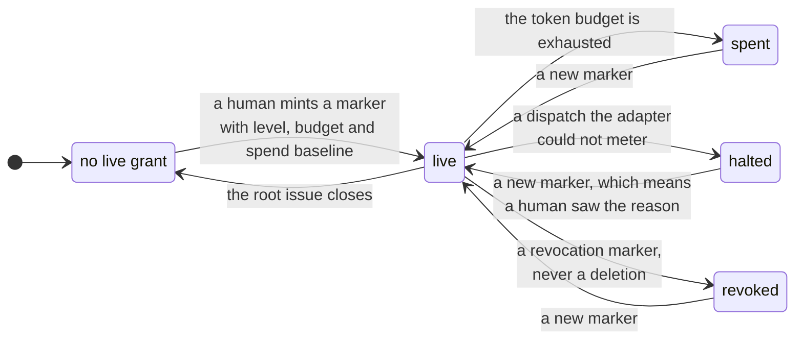

The four levels and their coverage are in
[9.1 Autonomy](#91-autonomy-how-much-the-engine-may-approve-alone).

**What no grant can delegate.** Each is enforced by code, not by policy prose.

| Refusal | Reason |
| --- | --- |
| a checkpoint above the level's coverage | the coverage table is the whole grant |
| a checkpoint on an issue outside the grant's own session tree | the grant root is caller-supplied, so a grant must never authorize an approval on a tree it does not own |
| anything once the token budget is spent | the budget is the ceiling, not a suggestion |
| **ship, whenever any session-wide wrinkle exists** | a required gate not green on the shipping issue, an unresolved missing-fact marker, or an unanswered rework escalation, **anywhere in the session** |
| a **kill**, at every level | no grant is consulted. A terminal is no substitute. A one-time confirm code is always required |

**A refusal names its own kind.** A grant that the engine consulted and that declined
threads its reason through the confirmation challenge, the advance and the decision queue.
An operator can therefore tell *no grant* from *a covering grant that refused*. A bare
confirmation request made the two look the same. Five decline reasons carry a message: an
uncovered checkpoint, an issue outside the tree, a spent budget, a ceiling the engine cannot
meter, and a ship whose preconditions do not hold.

### 31.2 Forecasting spend

**A dispatch records its forecast on the same record that its actual lands on.** The
working-set forecast, the task class and the forecast source sit beside the scope read-cost
the issue already froze. Earlier the engine wrote them to disjoint classes of record. The
forecast error is the whole learning signal the calibration feeds on, and it had never once
been computable.

**Eight rules govern the arithmetic. Each one exists because a broken version produced a
false number.**

- **A frozen estimate beats a re-derived one, and the record says which one it used.** An
  estimate frozen for this content is evidence of prediction skill. The same formula applied
  at dispatch is not. The record keeps the distinction instead of averaging it away.
- **An issue with no readable scope gets no forecast.** A forecast against an unknown scope
  is an invented number.
- **The unit is the issue, not the dispatch.** The forecast derives from the issue's scope,
  so every dispatch of one issue records the identical number. Otherwise the engine would
  score each attempt after the first against a forecast that covers work an earlier attempt
  already did. The engine sums the attempts and reports the count. That count is also the
  unit a grant is minted in.
- **The report names a record the band itself would refuse. It does not skip it.** A
  population that a filter quietly shrinks is how this repository once committed a false
  claim.
- **The report keeps both denominations.** It holds forecast working set against measured
  occupancy, and forecast whole-lane spend against measured spend. Each denomination has an
  actual of its own. The ratio between them measures the turn multiplier, which nothing
  models. A mix of the two is the error the report guards against, and it guards by naming
  its units. The accuracy band is one order of magnitude either way. The summary is a
  **median**, because the measured misses span orders of magnitude, and one such sample
  would drag a mean to a value no dispatch has ever reached.
- **One named write-phase set, read by both consumers.** An interactive build and a
  supervised lane are the same kind of work. The unsizeable-lane bound therefore counts a
  write dispatch from either path, and the calibration samples only write dispatches. A
  judge or a decider can never contribute a helper's spend to a lane's ratio. The two
  consumers once filtered in opposite directions, which measured a bound against a fraction
  of the real population. Both exclude a record whose phase was never written. Unknown
  provenance fails closed.
- **Nothing measures a working-set factor, and the record admits it.** The calibration that
  appeared to measure one was measuring whole-lane spend, which is a different quantity. It
  was removed. Every forecast is a declared constant times a scope read-cost. Preflight
  reports whether any factor is more than a seed. An operator who mints a budget therefore
  learns that it rests on a prior **before** the money is granted, and does not have to read
  the source to find out.
- **A forecast with no actual, and an actual with no forecast, are reported as unpaired.
  Neither is scored.** An empty report then states why it is empty, instead of looking like
  a passing calibration.

### 31.3 Metering honestly, and halting when you cannot

**An estimated sample is good enough to calibrate against. It is not good enough to meter a
grant with.** The engine keeps the two apart.

The fallback estimate counts the captured output alone. It never counts the prompt, the
system prompt, the tool definitions or the cache writes, and nearly all of an agentic
dispatch's tokens are there. The estimate is therefore a **floor far below reality**, not
the conservative over-count a ceiling needs. On a live probe it read more than an order of
magnitude under the real input count. With plain-text output the captured answer was two
characters long. At face value that estimate *bought* budget.

**No honest multiplier can inflate it**, so the ceiling errs the only way a ceiling may. The
engine **halts** a session that took a dispatch its adapter could not meter, and it surfaces
the reason. The remaining budget then reads zero, because what is left is unknown rather
than free. The engine baselines the count of unmeterable dispatches on the grant marker,
exactly as it baselines spend. A new grant clears the halt, and a new grant means a human
saw the reason and accepted it. Any adapter with no usage format inherits the refusal
instead of a silent under-count.

### 31.4 Tuning: the parameters in force, held against the outcomes

Judgment sets almost every number that governs the factory, and nobody revisits it. The
tuning report reads the dispatch ledger from both corpora: local run records, and committed
markers. It deduplicates them, so a dispatch recorded in both counts once. Per governed
parameter it reports the value in force for the dispatches it summarises, the outcome
distribution under that value, and a recommendation with its sample size.

**Four rules keep the report from becoming another declared number.**

- **The report writes nothing.** A tuner proposes a config change. A human or a gate applies
  it.
- **A seed never reads as a measurement.** At or above the minimum sample count, the
  recommendation is the statistic over the newest window, labelled measured. Below that
  count the **declared prior** stands, labelled seeded, and the row names the in-force value
  the prior would displace. A number fitted to three samples is deliberately not offered. A
  reader takes such a number as a measurement whatever the label says. The report reads the
  prior from the config loader's own fallback rather than from a copy, so the prior cannot
  drift from the value in force.
- **A parameter nothing measures still prints**, with a sample size of zero, no
  recommendation, and the reason it has none. A bound nothing records is a bound nobody can
  tighten. An omitted row makes "no evidence exists" look exactly like "this is fine".
- **A session override forms its own cohort.** An override is the one per-dispatch record of
  a parameter's value. A pool over those dispatches would report outcomes under a value that
  never governed half of them.

**The statistic follows the cost of being wrong.** A **backstop** fires on work already in
progress, and destroys it. The report therefore reads a backstop from the worst observed run
plus headroom, never from a quantile. A timeout calibrated against the work distribution is
what once killed working lanes. A **band** refuses a lane, and both of its refusals are
recoverable: merge with a sibling, or split into more lanes. The report therefore reads a
band at the quantiles of what really happened.

### 31.5 The acquisition and implementation split

One claim said the dispatch instruction buys a lane's multi-million-token floor, and the
work does not. That claim had **no instrument behind it**, so nobody could judge its remedy.
The lane-split report is that instrument. Its order is deliberate: record the tools, derive
the split, brief the lane, then measure. Only the last step is a claim.

**The pairing rule is the whole arithmetic, and two naive versions measure the wrong
thing.** A tool-call turn's usage is the cost of the *emitted* call. The tool's result lands
in the **next turn that carries usage**. A sum over the calling turns therefore counts the
request and misses the answer. A pairing against the immediately preceding *line* fails too.
A real transcript forwards the tool result as an event that carries no usage, and that event
sits between the call and its answer. This repository wrote the second version first. It
attributed a real captured lane **entirely to unattributed**, which is a confident figure
that measures nothing. The demonstration caught it. The unit tests did not. The report now
attributes a turn's tokens to the last tools emitted before it. A turn with no such tools is
unattributed, never guessed at.

**The report refuses to guess three things.**

1. A tool that is neither a read nor a write is *unclassified*, not bucketed. A general
   shell tool runs a status command and a move alike, and a majority rule over a mixed turn
   would put a guess inside the number the remedy is judged by.
2. A transcript written before the tool field existed is **unclassifiable**, not fully
   implementation. Absent means unknown. Empty means the turn called nothing.
3. A lane with no transcript is reported as missing, not as a zero split.

**Shares lead, tokens follow, and the report says why.** Per-turn stream usage over-reports
against the run record. A stream-derived absolute therefore sits in a different denomination
from the grant it would be compared against, and that mixture has already cost this
repository a lane. The report also states that it covers Claude only. No other family emits
the per-tool event it reads.

### 31.6 Fleet and health

**The fleet rollup** finds installed repositories under a workspace root. Per repository it
rolls the single-repo status snapshot and a run-record summary into one versioned JSON
payload with totals. It is read-only, and resilient by construction. A repository whose
snapshot raises an error becomes an error entry, and does not fail the rollup. The command
always exits zero. Each payload carries its own installed version against the engine
version, so skew across the fleet stays visible. The current engine produces every per-repo
snapshot **in-process**, so the rollup is JSON-first and single-engine. A formatted table
and a subprocess-per-repo model are out of scope.

**Health scoring** turns the run-record log into a per-agent signal and a drift check. The
source is run records *only*, and that is a necessity. A gate result overwrites its
predecessor, so nothing can query pass and fail over time. A failed dispatch is a failed
run, and a rework re-dispatch appends another record for the same issue, so the append-only
log is a durable proxy. **Drift is a rolling baseline read off the log's own timestamps**,
never a stored snapshot. The check compares an agent's most recent window against everything
older. It flags a regression when the recent failure rate exceeds the baseline by a fixed
delta, and when each window holds a minimum sample. The whole path is read-only,
deterministic and advisory. No wall clock enters the payload.

---

**Part V — Information view.** The durable state, its shape, and who may write it.

## 32. The work tracker

**The work tracker is not a peripheral integration. It *is* the loop's state**, and it is
this project's own code. Every guarantee in this document is downstream of it.

It is a **kit**: `.basicly/core/kit/tracker/`, a set of portable modules with no
dependency on the engine. An append-only event log holds the truth. A fold over the
events derives every view the loop reads.

**The tracker holds** work items typed as work classes, a dependency graph, gate results,
checkpoint markers, evidence markers, and the loop's own artifact and telemetry markers.
The engine derives the phase from it. It stashes an in-flight worktree binding on the
item. A design constraint rides *down* a dependency tree. **A resume re-reads the
tracker.** It reads the in-progress items, their bindings, their recorded gate results and
the ready set, and reconciles them against the live worktrees. That is what makes the loop
cross-agent. A unit starts on one family and resumes on another.

**This section reports rather than specifies.** The kit exists, with tests, and the engine
reaches this state through no external process:
[37. The external tracker binary, and its removal](#37-the-external-tracker-binary-and-its-removal)
is the closing account of the binary that used to carry it. Nothing else in this document
treats the external binary as part of the design.

### 32.1 The kit is standalone

**A repository that copies the kit and never installs the engine must be able to create,
read and query a work item with it.** That is the acceptance condition on the whole
component, and it is why the kit is a kit and not a package of engine modules.

Three rules hold it.

1. **The kit may not import the engine.** A pre-commit hook enforces the one-way
   boundary. Where the kit needs engine behaviour, the engine **injects** it: redaction is
   passed in as a function, and the kit never imports it.
2. **No dependency outside the standard library**, no `PATH` lookup, no network and no
   subprocess. The portable model-tier resolver already follows the same rule, and for the
   same reason: the kit runs on machines that hold nothing else.
3. **Every failure is closed and quiet.** A kit component that cannot answer leaves the
   caller's state untouched rather than guessing.

`[TARGET]` **Every kit module carries a declared surface, and the kit is inside the scope
of this specification** (basicly-pohtvt). The tree exempts it today. That exemption was written as prose,
nothing read it, and an issue that closed somewhere else discharged it. **A gate written
as prose is not a gate.** Audit scheduling and specification coverage are different
things, and a specification may not exempt part of the system from being specified.

### 32.2 The event log and the fold

The truth is an append-only event log. A record's state is a **fold over its events**, so
history lives in the data. It does not depend on git history surviving a squash or a
shallow clone. See [D-03](#d-03--the-tracker-is-an-append-only-event-log).

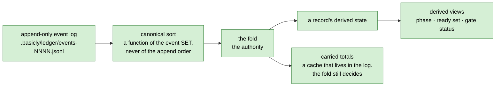

**The event record** carries an id, the record it belongs to, a per-record sequence
number, a kind, an actor, a timestamp, a payload, and a carried totals cache.

- **The id is a digest over the kind, the payload and the generation. It deliberately
  excludes the timestamp.** A replay of the same logical write is therefore idempotent. The
  trap that buys is documented, not hidden: a re-record of an identical fact is swallowed, so
  a genuine reopen needs a new generation.
- **The sequence number is per record, not per ledger.** Two branches that increment the same
  record fork visibly.
- **Totals are a cache that lives in the log.** The fold is the authority. Spend is carried in
  integer micro-units, so the sum is order-independent, and one accumulator serves the writer
  and the fold alike.
- **The fold sorts into canonical order first.** It is therefore a function of the event
  *set*, not of the file's append order. **An unknown kind is skipped for state, and still
  counted in totals.** An old reader therefore never reports a newer writer's events as a
  false disagreement.

### 32.3 The event vocabulary

**An event kind names what happened, and the fold reads it by name.** The vocabulary is
this project's own, never a foreign tool's payload shape. See
[D-22](#d-22--the-tracker-vocabulary-is-this-projects-own).

`[TARGET]` **The vocabulary below is the specification, and the tree holds ten of its eighteen kinds** (basicly-q7etjd builds the rest). `note`, `checkpoint` and `artifact` landed with `basicly-vkh0.30`, which also made `comment` a permanent alias of `note`; `decision`, `scope`, `binding`, `wait`, `grant`, `rework`, `sizing` and `classification` are unbuilt, and the marker-body alias of [32.3.2](#3232-the-readers-alias-table-and-the-marker-family-it-must-not-derive) is a reader change nothing has made.

**One kind per consumer that selects on it.** That is the rule which closes the set, and it
is the rule that decides every argument about whether two markers are one kind. Two markers
read by the same consumer, which refuses on the same contract, are one kind with a typed
field inside it. Two markers read by different consumers are two kinds, however similar
their payloads look. Applying the rule to the measured population in
[32.3.1](#3231-the-measured-partition-of-the-comment-kind) yields eighteen kinds, and the
five beyond the thirteen this table first carried are the ones the measurement forced.

| Kind | Carries | Read by | Prose or machine state |
| --- | --- | --- | --- |
| `created` | a new work item and its authored fields | the fold, for existence and type | machine |
| `field` | one field change | the fold | machine |
| `status` | a status change | the fold, and the phase derivation | machine |
| `edge` | one dependency edge, with its provenance label | the graph, readiness, ranking | machine |
| `dispatch` | one agent dispatch and its telemetry | cost, calibration, health | machine |
| `gate` | one gate verdict, its provider, its actor and any finding set | the phase derivation, and every required-gate refusal | machine |
| `checkpoint` | one approval marker and who approved it | the phase derivation | machine |
| `artifact` | one handoff artifact body, typed by artifact kind | the producer and the consumer that can refuse | machine |
| `decision` | one decision-queue item and its kind | the supervisor, and the decider | machine |
| `scope` | one declared or violated scope | the landing, and the plan evidence | machine |
| `binding` | the worktree an item is bound to | readiness, and the landing | machine |
| `tombstone` | a deletion | the fold | machine |
| `wait` | one wait interval, requested then answered, and by whom | the wait accounting behind `human_wait_s` and `delegated_wait_s` | machine |
| `grant` | one autonomy grant or hold, its level and its budget | the policy layer's autonomy and spend bound | machine |
| `rework` | one rework allowance, spend or convergence refund | the rework bound | machine |
| `sizing` | one working-set estimate, keyed for reuse | the decomposer | machine |
| `classification` | one integrity level and the rule that chose it | the integrity layer, and gate selection | machine |
| `note` | prose a human or an agent wrote | nothing. It is read by people | prose |

**One kind carries prose. Every other kind is machine state the fold reads by name.**

**The five added kinds are not a widening of the design; they are the residue the first
draft of this table could not hold.** Routing the measured population through the original
thirteen leaves 585 of 2,540 rows with nowhere to go — 23% — and a closed set with a 23%
residue is not closed. [32.3.1](#3231-the-measured-partition-of-the-comment-kind) carries
the routing, the counts and the command.

**Why this is a specification and not a description.** Today one kind carries both. The
log is append-only and grows on every session, so this document gives the census and not a
figure:

```sh
python3 -c "import collections, json, pathlib; \
k = collections.Counter(json.loads(l)['kind'] \
for p in sorted(pathlib.Path('.basicly/ledger').glob('events-*.jsonl')) for l in p.open()); \
print(sum(k.values()), k.most_common())"
```

Two facts in its output carry the argument, and neither is a magnitude. **`comment` is the
largest kind and holds close to half of the whole log.** That single kind carries the prose
a human wrote *and* every machine marker the loop derives state from: checkpoints, gate
results, handoff artifacts, decision items, scope violations, telemetry and worktree
bindings. **`gate` is the smallest kind in the log**, even though a gate verdict is the
state the phase derivation reads the word "landed" from.

Three consequences, and the third is the one that costs.

1. **A reader cannot select machine state without parsing prose.** Every consumer greps a
   marker prefix out of a free-text body.
2. **The fold cannot refuse a malformed marker**, because at the kind level it is a
   well-formed comment.
3. **The `gate` kind is nearly empty.** Gate verdicts are real state the phase derivation
   reads, and they are almost entirely inside `comment` bodies rather than in the kind
   built for them.

The overload is inherited. It is the shape of a foreign tool where a comment was the only
extensible field, and [D-22](#d-22--the-tracker-vocabulary-is-this-projects-own) already
says a foreign payload shape may not govern our own record.

**The migration constraint is the hard part, and it is not optional.** An append-only log
is never rewritten, so every `comment` event already on disk stays there exactly as it is,
and the census above counts them. **The reader therefore needs an alias, not the unknown-kind skip path.** A `comment`
event must resolve to the kind its body already announces, and a `comment` with no marker
must resolve to `note`.

The skip path is the failure this rule exists to prevent. Skipping is correct for an
event a *newer writer* produced and an older reader cannot understand. It is catastrophic
for an event an *older writer* produced: a skipped `comment` silently drops checkpoint and
gate state for every work item older than the change, and the phase derivation would then
read those items as never classified, never approved and never landed. **That failure is
silent, and it reads as data loss rather than as a reader defect.** See
[D-34](#d-34--one-kind-for-prose-and-typed-kinds-for-machine-state).

**The rendered view of the `note` kind is the work log.** A reader asking "what happened
on this item" wants the prose and the machine events interleaved in time. `note` is the
kind; the **work log** is the view that folds `note` together with every typed event into
one chronology.

#### 32.3.1 The measured partition of the `comment` kind

**Every `comment` row on disk resolves to exactly one target kind, and the partition is
measured rather than estimated.** The figures below are pinned to a commit, because the log
grows on every session and an unpinned count cannot be checked twice
[measured 2026-08-17 at `fb19039`, the script in the block below].

```sh
git show fb19039:.basicly/ledger/events-0001.jsonl | python3 -c "
import collections, json, re, sys
POLICY = {'checkpoint': 'checkpoint', 'scope-violation': 'scope', 'needs-input': 'decision',
          'gate-unreliable': 'gate', 'finding-set': 'gate', 'rework': 'rework',
          'rework-allowance': 'rework', 'convergence-refund': 'rework', 'grant': 'grant',
          'hold': 'grant'}
FAMILY = {'harness-run': 'dispatch', 'harness-cost': 'dispatch', 'harness-overrun': 'dispatch',
          'harness-decision': 'decision', 'harness-artifact': 'artifact',
          'harness-review': 'artifact', 'harness-retro': 'artifact', 'harness-wait': 'wait',
          'harness-sizing': 'sizing', 'harness-classification': 'classification',
          'harness-info': 'note', 'scope': 'scope', 'decision': 'decision'}
kinds, residue, comments = collections.Counter(), collections.Counter(), 0
for line in sys.stdin:
    e = json.loads(line)
    if e['kind'] != 'comment':
        continue
    comments += 1
    text = e.get('payload', {}).get('text')
    m = re.match(r'\[([a-z0-9_-]+)\]\s*(.*)', text.lstrip(), re.S) if isinstance(text, str) else None
    if m is None:
        kinds['note'] += 1
    elif m.group(1) == 'harness-policy':
        head = re.split(r'[=\s:]', m.group(2), maxsplit=1)[0]
        (kinds if head in POLICY else residue)[POLICY.get(head, head)] += 1
    elif m.group(1) in FAMILY:
        kinds[FAMILY[m.group(1)]] += 1
    else:
        residue[m.group(1)] += 1
print(comments, sorted(kinds.items(), key=lambda kv: -kv[1]), dict(residue))
print('closes:', sum(kinds.values()) + sum(residue.values()) == comments)"
```

| Target kind | Rows | The markers that route to it |
| --- | --- | --- |
| `checkpoint` | 710 | `[harness-policy] checkpoint=` |
| `dispatch` | 567 | `[harness-run]`, `[harness-cost]`, `[harness-overrun]` |
| `note` | 350 | `[harness-info]`, unmarked prose, and five hand-written `[harness-policy]` lines |
| `wait` | 340 | `[harness-wait]` |
| `decision` | 169 | `[harness-decision]`, `[harness-policy] needs-input` |
| `scope` | 110 | `[harness-policy] scope-violation=` |
| `rework` | 101 | `[harness-policy] rework`, `rework-allowance`, `convergence-refund` |
| `grant` | 67 | `[harness-policy] grant`, `hold` |
| `artifact` | 44 | `[harness-artifact]` |
| `sizing` | 35 | `[harness-sizing]` |
| `gate` | 25 | `[harness-policy] finding-set`, `gate-unreliable` |
| `classification` | 17 | `[harness-classification]` |

**The residue is five rows, and every one of them is prose.** They open with
`[harness-policy]` followed by a capitalised word — `CORRECTION`, `RELEASE`, `SCOPE`,
`NARROWED`, `Owner` — which is a human writing a heading, not a marker a producer emits. The
rule that a `comment` with no recognised marker resolves to `note` covers all five, so the
partition is total. **There is no unclassifiable remainder.**

**Two figures in this partition are larger than the kind the target set already had.** `wait`
at 340 rows and `rework` at 101 both exceed `field` at 25 and `gate` at 8. A kind carrying
more of the log than four of the original thirteen is not an edge case, and that is the
evidence for adding it rather than folding it into a neighbour.

#### 32.3.2 The reader's alias table, and the marker family it must not derive

**The alias is permanent and its domain is the log, not the code.** A `comment` event
resolves to the kind its body announces, by the table in
[32.3.1](#3231-the-measured-partition-of-the-comment-kind), and a `comment` with no
recognised marker resolves to `note`.

**The alias table may never be derived from the marker constants the engine currently
declares.** This is the one implementation choice in the migration that looks obviously
right and is wrong, and the log proves it. `[harness-overrun]` carries 12 rows in this
repository's ledger, and no producer for it exists in the tree: the two places the string
survives are *negative* assertions in the suite, `tests/test_loop.py` asserting
`not any(text.startswith("[harness-overrun]") ...)` and `tests/test_supervise.py` asserting
`no [harness-overrun] marker either`. A table derived from the live constants would therefore
omit the family, and those 12 rows would resolve to nothing
[measured 2026-08-17, `git grep -n 'harness-overrun' -- . ':!.beads' ':!.basicly/ledger'`
against the row count in 32.3.1].

**A retired marker family is the normal case, not the exception.** A producer is deleted when
its feature changes; its rows stay on disk for the life of the log, because the log is never
rewritten. So the alias table is a **frozen literal covering every family that has ever been
written**, and adding a family to it is append-only in exactly the way the log is.

**The family list is bound to a gate, after drifting four times while it was prose.** The
frozen literal is `.scripts/check_marker_families.py`, and it refuses a disagreement with
either population it measures: what `src/basicly/` declares, read out of the AST, and what
the two stores hold. The roster is **eleven** declared families and **one** retired, twelve
frozen [measured 2026-08-18, `uv run python .scripts/check_marker_families.py`, which also
prints the row count across both stores]:

`[harness-artifact]`, `[harness-classification]`, `[harness-cost]`, `[harness-decision]`,
`[harness-info]`, `[harness-policy]`, `[harness-retro]`, `[harness-review]`,
`[harness-run]`, `[harness-sizing]` and `[harness-wait]`, plus the retired
`[harness-overrun]`, which has no producer in `src/` and 12 rows in the log.

**The drift history is the argument for the gate, and each correction was wrong in a
different way.** A count read eight while four families had shipped. A correction to ten came
from reading two recent landings rather than the tree. A correction to twelve was wrong in
*both* directions at once: it counted `harness-side`, an unbracketed phrase from a sentence in
`src/basicly/commit.py` reading "the rescue is harness-side because it has to be", and it
omitted the family `src/basicly/retrospective.py` declares.

**This is a prose-read-as-a-declaration defect, and the same class has already cost this
repository once**, in a dead-code gate that counted English in a schema as a field reference
and then advised deleting the baseline entry. **Counting with a command was not enough**: the
command has to discriminate a declaration from prose, which is why the gate reads string
constants out of the AST rather than grepping for the shape.

**The roster above is a gate input rather than explanation, and this document has to say
so.** `check_marker_families.py` reads that paragraph — the two counts and the twelve
family strings — and fails on a disagreement in either direction. It read a requirements
paragraph until 2026-08-18; the document register schedules that document for deletion once
the binary leaves the runtime path, so the roster moved to the section that specifies the
alias table it feeds. A gate whose only input is a document scheduled for deletion is a gate
with an expiry date.

### 32.4 Derived views: phase, the ready set, gate status

**Nothing durable stores a derived view.** Each one is a function of the event set.

| View | Derived from | Consumer |
| --- | --- | --- |
| phase | status, checkpoint, binding, gate and child events | every advance. See [24. Phase is derived, not stored](#24-phase-is-derived-not-stored) |
| the ready set | the edge graph and item status | admission, and the scheduler |
| gate status | `gate` events, filtered on the engine's own provider | every required-gate refusal |
| ranking | the edge graph | dispatch order |

**Ranking is a pure function of the graph, and the engine owns it in-process.** It takes
unblocked items only, then priority, then the descending count of still-live blocking
dependents, then the id. **It deliberately drops creation time.** An age-based order makes
dispatch order clock-dependent for an unchanged graph. Ranking emits its own schema name,
never a foreign tool's, so a consumer that parses it does not parse a foreign contract.

**A gate verdict is counted only when it carries the engine's own provider.** That is what
makes "a judged verdict is never a green light" an enforced property rather than a matter
of agent good behaviour. [36.3](#363-gate-results-and-who-may-write-them) covers the rule;
this section is where the data it reads lives.

### 32.5 The write path, the lock and rotation

**Append-only is structural, not a convention.** The writer opens for append, and nothing
rewrites a line. A repair is a corrective *append*. The code deliberately runs **no
fsync**. The push is the durability boundary, and the code says so, so that nobody adds
one. Rotation is name-based. A rotation policy creates a later-sorting file, and no
wall-clock branch enters the write path.

**The lock is a file whose existence is the lock.** The kit creates it exclusively,
because the POSIX advisory lock does not exist on one of the three supported platforms. A
holder keeps it for one append. A caller that needs a wider critical section holds the
lock and passes it in. Staleness is measured on a **monotonic** clock with an epoch
marker, so a negative age after a reboot counts as stale, not as freshly taken. Release
re-checks the holder, so it never deletes a lock stolen from it. The liveness probe is
injected. It returns *unknown* on the platform where the obvious probe terminates the
process instead of testing it.

**Deployment has exactly one requirement the kit cannot meet itself, and the kit declares
it.** A checkout must leave the log files with unchanged line endings. Otherwise a
checkout on one platform rewrites the log in place.

**One tracker store per repository, never one per worktree.** A lane worktree reads and
writes the base checkout's store. [35. Runtime topology](#35-runtime-topology) draws it.

### 32.6 Consistency and edge provenance

Two kit modules hold contracts worth stating even though nothing calls them yet: built,
with tests, and reached by no engine caller [re-measured 2026-08-17 and recorded in
[`status.md`](status.md), against a positive control that found the callers of the kit
modules that *are* loaded]. **This is the closed-blocker-is-not-a-working-gate case in its
purest form. The code exists, and nothing binds it.**

**The consistency checker repairs only by an append** of a corrective event. It reports a
broken log, and never rewrites one in place. A derived file that disagrees with the log it
summarises is a separate severity with a separate exit code.

**Every graph edge carries how it got there**: extracted from a human or repository fact,
inferred by an agent, or ambiguous. That disposition decides what the edge may do.

| Label | What the edge may do |
| --- | --- |
| extracted | **may gate** a landing |
| inferred | **is shown as a proposal** |
| ambiguous | **routes a decision** |

The label rides the event, not the edge. The strongest label wins. Promotion is monotone,
with **no demotion**. An unknown label fails **closed**, into the least-trusted
disposition, because the tolerant direction for a gate is the restrictive one.

### 32.7 Redaction

`[TARGET]` **No committed artifact carries a machine-specific path, username or hostname.**
Three rule sets enforce it. The identity half does not hold today (basicly-vkh0.44), and
[32.7.1](#3271-the-identity-rule-covers-one-person-and-the-ledger-carries-another) is the
measurement.

| Rule set | How it is built |
| --- | --- |
| high-signal secret shapes | pattern |
| machine path shapes | pattern |
| the running user's own name | built per run, not pattern-matched, because a username is not a shape. Ignored when it is short enough to shred ordinary prose |

**The composition order is load-bearing, and the code documents it.** The path rules run
first. The identity rule runs second. The path placeholder contains characters the path
rules' tail class excludes, so the reverse order would leave the directory layout
unredacted.

**Redaction covers the whole path, not only the user-identifying head.** The leak that
produced the Windows rule was a directory layout with no username in it at all.

**Redaction binds in two distinct places.** Every ledger append is redacted at the write.
The engine's only tracker-commit path also scrubs the store immediately after the flush,
and before it stages it.

**The deterministic floor is two pre-commit hooks.** They are standalone
standard-library scripts, copied to consumers, so they **cannot import** the engine's rule
sets. The mirror is real duplication.

| Mirror | Kept in step by |
| --- | --- |
| the path rules | a test asserting the two sets are equal |
| the secret rules | **convention only** |

That asymmetry is a gap, not a design.

#### 32.7.1 The identity rule covers one person, and the ledger carries another

**The identity rule is built from the running process's own username, so it can only ever
redact the committer who is running.** That is deliberate and it is the right default: a
username is not a shape, and only the running machine knows the string. It is also the
whole extent of the coverage, and the absolute claim above is false while a second person's
identity sits in a store this repository commits. The export half of the measurement below is
now history: `.beads/` is gone with the external dependency, so the live surface is the owned
ledger alone.

| Store | Lines | A second username | An address |
| --- | --- | --- | --- |
| the owned log, `.basicly/ledger/events-0001.jsonl` | 5,616 | 211 | 56 |
| the external export, `.beads/issues.jsonl` | 924 | 83 | 56 |

The counts move with every write, so this document gives the probe rather than trusting
them [measured 2026-08-17; the positive control is the 4,953 log lines that *do* carry the
placeholder, which is what says the redaction path ran and the probe reads the right files]:

```sh
python3 -c "
import collections, json, pathlib
rows = [json.loads(l) for l in pathlib.Path('.beads/issues.jsonl').open() if l.strip()]
print(collections.Counter(r.get('created_by') for r in rows).most_common())
print(collections.Counter(r.get('assignee') for r in rows if r.get('assignee')).most_common())"
```

**Two carriers, and neither is free text.** `created_by` is written on every record the
external binary mints. `assignee` carries an e-mail address on part of the set, which no
username rule would match even if it knew the name.

**The pre-commit floor is green over both files**, and correctly so: it builds its rule from
`getpass.getuser()`, and the identity in the file is not this machine's. **A gate that
cannot see a population is not a gate that says the population is absent.** The mechanism
the floor points at for the rest is the configurable deny list in
[20. Configuration](#20-configuration), and this repository declares no entries in it, so
the hook that would read them is inert.

**The requirement this fails is a property of the format, not of a scrubbing pass.** An
identity field the store mints unasked is the leak; scrubbing it afterwards is the mopping.

**The owned store's live write path is already clean, and that narrows the work to one
cause.** Every identity-carrying event in the log came from the import: 263 of 5,616 lines
carry one, and **all 263 carry the import's own marker** across the `created`, `edge` and
`comment` kinds [measured 2026-08-17, counting `imported_from` in the payload of every line
matching either identity, against a positive control of zero lines without it]. The kit takes
the actor as an argument rather than reading it from the host, so nothing the engine writes
adds to the set. What is left is the field set
[32.8](#328-how-a-kind-rename-lands-on-a-log-nothing-may-rewrite) says nothing may rewrite —
so the remedy is a corrective append or a declared exception, never an edit, and the log's
one prior exception was taken by an explicit owner decision.

### 32.8 How a kind rename lands on a log nothing may rewrite

`[TARGET]` **This subsection specifies the migration. The tree has none of it, and none is
planned: no kind is being renamed. It is the rule the first rename follows, not open work.**

**A rename of an event kind is not a rename.** The log is append-only, it is committed to
git, and a repair is a corrective append
([32.5](#325-the-write-path-the-lock-and-rotation)). So the old spelling is permanent and the
migration is entirely a **reader** change plus a **writer** switch, with no edit to any line
that exists. The log is 5,300,416 bytes over 5,353 lines at `fb19039`, and every byte of it
stays exactly where it is.

**The five moving parts, and the order they must move in.**

| Part | What changes | What must not change |
| --- | --- | --- |
| the writer | `mirror` and every marker producer emit a typed kind instead of `comment` | no existing line is touched |
| the reader | the fold gains the alias of [32.3.2](#3232-the-readers-alias-table-and-the-marker-family-it-must-not-derive) and a handler per new kind | the fold stays a function of the event **set** |
| the derived files | `snapshot.jsonl` and the rotation checkpoints are regenerated | they are derived and ignored, so they carry no migration |
| the JSON surface | the folded record's `comments` key gains a `notes` sibling | the old key keeps answering for a deprecation window |
| the mirror seam | unchanged until the flip | `br`'s own word survives here on purpose |

**The reader change is the one that carries the risk, and the risk is the skip path.**
`events.fold` counts a kind it has no handler for in `FoldResult.unknown_kinds` and applies no
state. That is correct for a *newer* writer's event and catastrophic for an *older* writer's,
which is the whole argument of
[D-34](#d-34--one-kind-for-prose-and-typed-kinds-for-machine-state). The alias must therefore
be installed **before** the writer switches, not with it. A writer that switches first
produces typed events an unaliased reader drops.

**`unknown_kinds` conflated two populations, and no longer does** (`basicly-vkh0.38`).
`events.classify_kind` answers with one of three: a kind the fold **applies** state for, one it
**delegates** to a sibling, and one nothing folds. `DELEGATED_KINDS` names the folding function
per kind — `provenance.fold_edges` for `edge`, `gates.fold_gates` for `gate` — and `fsck` warns
only on the third case. That moved 1,015 events, 18.09% of the log, out of a population that
had been reported as unknown [measured 2026-08-17 over 5,611 events]. The closed set is checked
to be exactly the applied set plus the delegated set, and the two disjoint, so the five kinds
this change adds cannot arrive with nobody to fold them. **A signal that cannot tell a
deliberate delegation from an unreadable event cannot be the migration's safety net**, which is
why this item came first.

**The closed set of kinds has one definition, and that was the precondition for everything
else here** (`basicly-vkh0.36`, `basicly-vkh0.43`). It was **six** partial definitions rather
than the four the table below recorded: `baseline.py` and `provenance.py` were both missing
from it. What stands now is `events.KNOWN_KINDS`, an explicit twelve-member frozenset in the
vocabulary block, with every sibling taking its kind from it rather than respelling one. The
twelve are the ten built kinds of [32.3](#323-the-event-vocabulary) plus two the specification
table does not list: `comment`, which is the permanent alias rather than a target kind, and
`edge_retracted`, which the fold delegates beside `edge`. A member outside the eighteen is not
a widening of the vocabulary — it is the alias and the retraction the log already holds
[measured 2026-08-21, `len(events.KNOWN_KINDS)` against `events.DELEGATED_KINDS`].
`baseline.py` still spells its own `created` kind, deliberately and with the reason at the
declaration — it loads no sibling at all. Two tests bind the arrangement: one folds this
repository's own log and asserts every kind in it is a member, with an event-count floor as the
positive control, and one walks every sibling's AST and requires each alias to be exactly
`events.<same name>`. Both were proven against five mutations. The table below is what it
replaced.

| Where | Declares | Consequence |
| --- | --- | --- |
| `events.py`, `KIND_*` | `created`, `field`, `status`, `comment`, `dispatch`, `tombstone` | the fold's authority, and it omits two live kinds |
| `events.py`, `KNOWN_KINDS` | those six | **nothing reads it** |
| `migrate.py`, `KIND_EDGE` | `edge` | 951 rows the fold calls unknown |
| `gates.py` and `differential.py`, `KIND_GATE` | `gate`, twice | a duplication the module documents at its own top |

`KNOWN_KINDS` is the name a reader reaches for when they want the closed set. It exists, it is
missing two of the six kinds actually in the log, and it has no consumer anywhere including
the suite [measured 2026-08-17, `git grep -n KNOWN_KINDS -- '*.py'` returns its definition and
nothing else, against a positive control of `KIND_COMMENT` which returns six files].
**Adding five kinds to a vocabulary with no single definition is how the sixth and seventh
spellings appear.** The duplication of `KIND_GATE` is already owned by `basicly-vkh0.27` and
is not re-filed here.

**Rotation is the wrong migration boundary, and `rotate()` should not become one.** It is
tempting: `snapshot.rotate` exists, it closes a period and publishes a checkpoint, and no
caller reaches it — nothing in `src/`, and no CLI exposes it, which is why this repository's
log is still at its initial name
[measured 2026-08-17, `snapshot.rotate(` appears only in `tests/`, against a positive control
that the same probe finds `rebuild` called from `fsck`'s own command-line entry point].
Three reasons it must not carry the rename.

1. **A full-history fold is a requirement.** Rotation archives and never prunes, so the alias
   is needed for the archive regardless. A rotation boundary would not remove one reader
   obligation.
2. **It would make the alias look temporary.** The events it covers are permanent, so an alias
   presented as a migration window is a false promise a later reader will act on.
3. **Giving a never-called function its first caller inside a data migration is two untested
   changes in one.** `rotate()` wants a caller for its own reasons — a rotation policy — and
   that is separate work with its own demonstration.

**The `LOG_GLOB` contract is untouched by all of this, and that is worth stating because it
looks like it should change.** `events.LOG_GLOB` is the one spelling `rebuild` and `fsck`
share, `snapshot.py` derives its period and checkpoint names from it rather than from a
literal, and a test asserts the value. A kind rename changes what is *inside* a line and
never the name of the file holding it, so the glob, the archive set and the shared contract
all stay exactly as they are. **A migration that renames the log files would be a second,
unrelated change**, and it would strand every rotated archive.

**The deprecation window belongs to the folded record's `comments` key, not to a loop
surface.** The key is emitted by `snapshot.record_to_dict` as `"comments": list(...)`,
validated on the way back in by `record_from_dict`, persisted into the derived
`snapshot.jsonl`, and surfaced by the kit tracker CLI's `show` and `list`. `loop session
--json` carries no comment-shaped key at all
[measured 2026-08-17, `basicly loop session <root> --json | jq -r 'paths(scalars)'` filtered
for comment, note and log returns nothing, against a positive control of its 21 top-level
keys]. The window is therefore narrow and local: emit `notes` beside `comments`, accept either
on read back, and drop `comments` one release after the flip. Because `snapshot.jsonl` is
derived and ignored, nothing on disk needs to survive the drop.

**`basicly tracker shadow` stays `clean` and `conclusive` by construction, and the reason is
uncomfortable.** The differential already excuses every imported record's `gates` query as
history: the owned fold reports `missing=('verify',)` where `br` reports `passed=('verify',)`,
on record after record, and the baseline excuses all of them. So the shadow's `clean: yes`
today is a statement about the baseline's coverage and not about agreement on gate state.
**A kind split cannot make that verdict worse, and it must not be read as making it better.**
The translator still turns a `comments add` write into a `comment` event
(`basicly-vkh0.27`, `basicly-vkh0.29`), so the external binary's word survives on the
seam by design; the alias makes the owned side derive the same state from those events,
which is precisely the condition for the verdict to stay unchanged. **The check that the
split preserved the fold is a differential against a snapshot taken before it**, not the
`clean` line, which the baseline can hold green through a regression.

### 32.9 The nine properties bought with the external binary's defects

**Nine properties of this component were paid for in sessions spent diagnosing the binary it
replaces, and each is a requirement rather than a lesson learned.** A dependency's defect is
requirements input for our own store, and the proof becomes a committed gate here rather than
a patch applied upstream. The register of what each one cost was the work-tracker
requirements document's §2.1, deleted with that document (basicly-vkh0.42.13) — the
incidents live in the tracker and in `git log`, and this table is the specification they
became.

**Each is pinned by a test named for its id**, in `tests/test_tracker_requirements.py`, and
each test asserts *this* system's defence against the defective input. **The table below is
that module's gate input, not explanation:** it reads the ids out of this section and fails
when one of them has no `test_r<n>_` named for it, so a tenth property added here without a
gate fails at once. Adding a row means adding a test. None asserts that
the binary still misbehaves — a test of a foreign bug breaks on the version that fixes it,
which is the wrong failure. When the flip lands the module runs against the owned store
unchanged, so it is the executable half of the scope contract.

| Id | The property | Where it stands |
| --- | --- | --- |
| R1 | **A timestamp is evidence, never a constraint.** No write is refused on a clock comparison, no derived value is a function of a wall clock, and total order comes from the writer's own sequence numbers | held. [32.2](#322-the-event-log-and-the-fold) keeps the timestamp out of the event id, [32.4](#324-derived-views-phase-the-ready-set-gate-status) drops creation time from ranking, and [32.5](#325-the-write-path-the-lock-and-rotation) keeps every wall-clock branch out of the write path |
| R2 | **Exactly one spelling per field, in every surface that emits it.** The failure this prevents is silent: a reader that guesses between two spellings returns an *empty* graph rather than an error, and an empty graph degrades every landing order without failing anything | held on the owned side. A dependency event names its two endpoints, its type and its provenance under **one** spelling each, with no alias for any of them; the import adds attribution keys beside them and renames nothing |
| R3 | **Validation rules are configuration, not code**, and apply per work type without a rebuild | held for the rule that **judges** a record. `[policy.type_sections]` declares the required-section set per work type, the loader refuses an unknown work type and names it, and an absent table falls back to the built-in set and says so once per process rather than silently. Changing a section set is a configuration edit with no rebuild, demonstrated through `basicly policy dor`. **Open for the rule that writes one:** the scaffold holds no repository root, so a configured heading is judged but never emitted, and the scaffold's own output then fails the gate it exists to satisfy |
| R4 | **A text field accepts newlines**, and every field settable after creation is settable at creation | held. A multi-line value occupies one physical line and round-trips byte-identically through the log and the fold, and the kit's create surface sets an arbitrary named field |
| R5 | **A record id is opaque and is never re-parsed.** A short root plus a dotted child counter, with no separator any consumer has to interpret | held for a newly minted id, and stronger than "collision-checked": the root length is sized from a **declared collision budget** by the birthday bound, and only new ids get longer, because an existing id never changes. The ids inherited from the import predate the budget and sit far outside it, which the kit states rather than implies |
| R6 | **No committed artifact carries a machine-specific path, a username or a hostname**, and portability is a property of the format rather than of a scrubbing pass | **partially held.** [32.7](#327-redaction) is the mechanism and [32.7.1](#3271-the-identity-rule-covers-one-person-and-the-ledger-carries-another) is the measured gap |
| R7 | **N concurrent readers and one writer never corrupt shared state**, and a contention failure that is reported is reported as **retryable**, so the caller backs off | held. Publishing is a rename, the temp name is per-writer, and the give-up error carries retryability as a class attribute rather than as prose |
| R8 | **Contention waits, and a wait that gives up says so.** The lock is scoped to the ledger it protects, never to the machine or a home directory | held. Scope decides who contends: a lock one level too wide makes every unrelated process on the host a competitor for a record it will never touch, and the failure that produces is a *gate* failing rather than a write waiting |
| R9 | **A publish never shrinks the artifact silently.** A write emitting fewer records than the file it overwrites reports the shrink and requires explicit intent | held on the derived snapshot, which is the only store left. `write_snapshot` is the single refusal point every publish path already goes through, it names both counts in the message, and `allow_shrink` is how a caller declares the loss intended. The comparison is on **content, never on timestamps** — a timestamp comparison fires on a healthy checkout whose content is byte-identical, so it cannot be the guard. **One path is exempt by construction:** `fsck.rebuild` unlinks the target before writing, so the guard always meets an absent file and the rebuild that loses records is the one it cannot see |

**Two of the nine are properties of a store under load rather than of a response, and that
changes what can be asserted.** The other seven are answered by a reply, so the defence
against a bad reply is directly testable. Concurrency and lock scope are answered by a store,
and the binary fails both by construction — so their gates are aimed at the store this project
already owns, and one of them found our own instance of the same defect. A scrub truncated the
shared export before rewriting it, and the reader skipped a line it could not parse rather
than raising, so a reader caught in that window received a **partial record set with no error
at all**. That is a silent wrong answer where the binary at least raised. Both halves are
fixed, the write is atomic, and the gate runs real reader processes against a live writer with
no retry anywhere in the path, so it cannot pass by giving a reader a second chance.

**R8's originating incident did not reproduce when it was probed, and it is carried
anyway.** The machine-global lock the incidents were attributed to is not what the binary
does: the whole suite passed under parallel execution while more than a thousand concurrent
external initialisations were driven against the same host [measured 2026-08-01 against the
pinned version; not re-derivable, because it was a one-off adversarial run against a host state
that no longer exists]. The requirement stays
because it is a property wanted from the owned store, not a bug report about a dependency, and
because the containment if the contention returns already exists — a lock-acquisition failure
matches a dependency-defect signature, routes to the unreliable-verify verdict, and is charged
to no lane's rework budget. **A requirement whose incident stopped reproducing is not a
requirement that stopped being wanted.**

### 32.10 The per-event size cap, and honest truncation

**Growth is bounded four ways, and the per-event cap is the one the other three leave out.**
Git compression, the ship-time rollup and a write bounded by the size of the change all assume
bounded events. None of them bounds a single pasted payload, so an agent that pastes a
multi-megabyte log puts it in every clone — compressed, and not removable, because true
removal from an append-only log is the history rewrite
[32.8](#328-how-a-kind-rename-lands-on-a-log-nothing-may-rewrite) forbids.

`[TARGET]` **One payload is now outside all four** (basicly-8lrybo). The first rule below forbids the cap from
cutting a field the fold reads, so once the bound became a property of the kind, `field`.`value`
and every `created` payload key became stored **whole and bounded by nothing** — `value` was cut
at 4096 bytes before, wrongly, and is cut at nothing now. That is exactly the growth this
paragraph opens with, reachable through a description an agent pastes. The cap cannot be the
answer, because cutting a folded field is what the first rule forbids, so the bound has to move
to the **producer** — [D-36](#d-36--a-handoff-artifact-is-a-typed-ledger-event-bounded-by-derivability-rather-than-by-a-byte-cap)'s
derivability argument applied to a field rather than to an artifact. `basicly-u2hl.60` is the
open work. Nothing in the tree refuses such a write today.

**Where a kind declares a bound the cap truncates. It never refuses, and it never conceals that
it truncated.** Those are
the two wrong answers, and each loses something different. Refusing an oversized write loses
the *event* — the fact that a gate ran, along with its output. Clipping quietly makes a cut
payload indistinguishable from a short one, so a reader cannot tell evidence from a fragment.
An oversized payload is therefore stored cut to the cap, carrying a truncation flag and the
original length beside it, and the reader learns both that evidence was dropped and how much.

Four rules make it safe, and the first is what keeps the cap out of the fold.

- **Only free-text payload keys truncate.** Never a field the fold reads — an id, a sequence
  number, a kind, a status, a provenance label or a carried total. Truncating one of those
  would make a derived value depend on the cap, which breaks the determinism
  [32.2](#322-the-event-log-and-the-fold) asserts.
  **The bound is a property of the kind, and the rule it implements is the inverse of the
  key-name allow-list it replaced** (`basicly-vbl35a`, landed 2026-08-19 at `6435977d`).
  `FOLD_READ_KEYS` names the 22 payload keys the fold and its delegates read *by name*, which
  the cap may never cut. `KIND_TEXT_BYTES` declares the bound per kind: twelve kinds are
  declared, ten of them at 4096 bytes, and `created` and `artifact` store their payload whole
  for reasons stated at the declaration [measured 2026-08-21, `events.KIND_TEXT_BYTES`].
  Everything outside the fold-read set is therefore
  **cut by default**, so a new payload key is bounded without anyone remembering to name it,
  and **a kind that declares no bound is refused rather than stored unbounded** — the single
  refusal in a cap whose point is that it does not refuse. That refusal reaches a nested body,
  because an artifact's body is an object.
  **What the key-name allow-list cost while it stood.** The bound came from the payload key's
  *spelling*. `value` was on the list and the fold reads `value`, so `basicly-wpc8`'s
  description is stored cut to 4096 of 4461 bytes in the store of record, and the log carries
  1 `value_truncated` flag against 50 `text_truncated` ones [re-measured 2026-08-19 at
  `4e7dfa3a`, §32.3's census command widened to count keys ending `_truncated`; the flags were
  1 and 47 on 2026-08-18, and the second number grows with the log].
  **The converse cost more, and its 31 records are still on disk.** A key *outside* the list
  was not capped at all, so the bound a new kind got was decided by the word its author picked
  for the payload key rather than by a decision. The same field proved it twice over: a
  description arrived uncapped on a `created` event, under `description`, and cut on a `field`
  event, under `value` — **31 stored whole above 4096 bytes, the largest at 7043**, every one
  of them `created`.`description` [re-measured 2026-08-19 at `4e7dfa3a`; unchanged from the
  2026-08-18 figure, so this one was not stale]. Those 31 are now whole *by decision* rather
  than by accident of spelling, because `created` declares no bound and `_apply_created` folds
  every one of its keys — which is the same exemption `basicly-u2hl.60` above has to bound
  from the producer side.
- **Redact, then truncate, then measure.** Redaction can *lengthen* text, because a matched
  pattern becomes a placeholder, and a cut through the middle of a secret defeats the pattern
  that would have caught it. The recorded length is therefore the length of the **redacted**
  payload, which is the honest number anyway: the raw bytes were never ours to keep.
- **Cut on a character boundary, and name the unit.** A byte-sliced UTF-8 payload stops being
  decodable and takes the whole line down with it. The length is in **bytes** and the field
  name says so; a length whose unit a reader has to guess is worse than no length.
- **A truncatable key must hold a string.** `TRUNCATABLE_KEYS` survives the change above with
  this role and no other: it no longer decides what is *cut*, it decides what shape a key may
  *hold*. A container under one is refused by the *schema* rather than by the cap: the two
  markers say how much was cut from **one** field, and there is nowhere honest to put them for
  a list of ten. This is why `value` stays on the list while never being cut — a string under
  it is a folded field, and a list under it is refused.

**Truncation is a write-time property of the event and nothing revisits it.** That is the whole
difference between this and the lossy compaction [8. Non-goals](#8-non-goals) refuses.
Compaction discards evidence *after* the fact and leaves the record looking whole. Truncation
drops it at the boundary and says on the record that it did, and by how much. "We kept the
first N bytes of a large payload" is a checkable statement that tells a reader the rest exists
somewhere else. "We summarised this" tells them neither.

**The cap is not the concurrency guarantee, and the code says so.** It bounds how far a
buffered writer's chunking can be interleaved, which is a mitigation. The guarantee is the
lock in [32.5](#325-the-write-path-the-lock-and-rotation).

## 33. Handoff artifacts and their contracts

Eight artifact kinds carry a name. Each one is a schema at a state boundary. A state's exit
criterion is a verifiable condition on a work product, so every work product needs a schema.

**How far each kind actually binds** [measured 2026-08-16]. This is the measurement, not the
grade: the grade each row carries is in [`status.md`](status.md), and the four kinds no work
item tracks are named in its note.

| Kind | Producer | Consumer that can refuse | Required fields |
| --- | --- | --- | --- |
| implementation-plan | DECOMPOSE | the BUILD fan-out | schema version, feature, tasks, groups |
| change-summary | the BUILD landing, every field engine-derived | entry to VERIFY | schema version, issue, why, commit, changed count + digest, self-check |
| release-record | SHIP, by the curator | none. SHIP has already merged, so there is nothing left to refuse | schema version, issue, claims, unsupported, post-ship action |
| classification | none. CLASSIFY writes a different, unvalidated marker | none | schema version, issue, level, depth, rule, reason, selects |
| change-shape | none | none | schema version, issue, call tree, file tree, new public functions |
| verification-evidence | none | none | schema version, issue, passed, gates, criteria |
| validation-transcript | none. The validator's reply is read as a verdict line | none | schema version, issue, requirement, environment, steps, verdict |
| solution-design | none | none | six machine-checked markdown sections, not JSON |

Three rows carry both a producer and a schema on disk. This document has not traced the
producer and consumer call paths for `release-record`: it has a producer and no consumer,
which follows from SHIP having already merged.

**`verification-evidence` is not the verify run artifact.** The evidence gate stats that file
and never opens it. The two are different things with adjacent names.

**A written schema is not a reachable role, and it is not a written artifact either.** Three
kinds have a producer. Two of those three have a consumer that can refuse. Four have a
schema on disk and neither a producer nor a consumer, so their contract can refuse nothing.
**Five of the eight kinds therefore carry a contract that nobody can exercise until its
artifact has run on real work.** That debt is named here rather than hidden.

**Every claim in a release record carries its evidence**, typed as a test, a command or a
gate. The curator names and drops every unsupported claim. It never softens one. That is the
whole point of the role.

**`solution-design` is the one kind with no schema.** Its specification is markdown with six
machine-checked sections, not a JSON payload. The six sections are: the problem in the
requester's terms, success as an observable, a consumer transcript, out of scope,
constraints, and open questions.

Structured markdown is the only shape that is both readable and checkable. JSON is
unreadable. Prose is unactionable. **The consumer transcript is this project's translation
of a screen mockup.** The consumer surface here is a command-line tool. The artifact that
settles a design dispute by a *view* of the surface is therefore the command as a consumer
will type it, and the output it will print.

**Two mechanisms carry these artifacts. The second is the one a reader gets wrong.**

1. **The schemas are catalog sources.** A repository that has not installed them runs
   *neither* end of the contract. The producer and the consumer both resolve the schema
   first. That is what keeps a skipped write from becoming a refusal downstream.
2. **The artifacts travel as `artifact` events in the owned ledger**, typed by artifact
   kind and never truncated. The argument is
   [D-36](#d-36--a-handoff-artifact-is-a-typed-ledger-event-bounded-by-derivability-rather-than-by-a-byte-cap).

**The typed transport has landed, and the marker family is now read-only** (`basicly-pp7q4i`,
`basicly-wug2o2`, both closed). An artifact is one `artifact` event whose kind is a typed field
and whose body sits under a payload key `KIND_TEXT_BYTES` declares unbounded, so the per-event
cap of [32.10](#3210-the-per-event-size-cap-and-honest-truncation) cannot reach it. Measured
2026-08-21 over this repository's committed ledger: **10 `"kind":"artifact"` events**, six
`change-summary` and four `release-record`, across six records — against a positive control of
61 `[harness-artifact]` comment markers, so neither number belongs to the probe.

**The historical loss is frozen, not ongoing, and it is the reason this passage stays.** The
old transport was one `[harness-artifact]` comment marker, so its body was a `text` payload key
and the cap applied to it, and a JSON body cut at 4096 bytes stops being JSON. Measured
2026-08-21: **35 of the 61 markers ever written are cut**, and of the 52 distinct
record-and-kind pairs the reader's last-marker-wins rule resolves to, **26 resolve to a
truncated body** — against a control of the 26 intact pairs, every one of them admitted. Those
bodies are unrecoverable: the external store is deleted, and
[32.8](#328-how-a-kind-rename-lands-on-a-log-nothing-may-rewrite) forbids rewriting the log.
`artifact_record.cut_violation` is what a cut pair now refuses through, so
`handoff.entry_verdict` names truncation rather than reporting a schema violation on a
fragment.

**Two counts moved and one did not, which is why the marker figures are re-measured rather
than carried.** The marker population grows only while a producer writes to it, and none does;
the pair count grows with any later read of an old record. Marker storage was idempotent on the
whole body, and a read still takes the last matching marker.

**Two relaxations weaken even the wired pair. Both are deliberate, and the code states
both.**

1. **An absent artifact is admitted.** Only a present and invalid artifact refuses. Absence
   is ambiguous between a skipped write and work that predates the rule.
2. **A repository that has not installed the schemas runs neither end.**

**Three handoff files are deliberately not schema-validated.** Each one is a small internal
signal, not a contract between states: the repair brief written into a lane's worktree, the
missing-fact sentinel, and the one-time checkpoint confirmation codes.

---

**Part VI — Development and deployment view.** How the code is layered, what runs where, what refuses, and the one dependency being removed.

## 34. Module structure and the layering contract

The engine is a layered set of modules, and `.importlinter` is the declaration. A higher tier
may import a lower one. The reverse breaks the build and names both modules. Two siblings
inside one tier may not import each other. That last rule is what makes a tier a tier and
not a bucket.

The contract is **exhaustive**. A new module joins the package only when a maintainer places
it in a tier.

<!-- docs-claims:begin layering-contract -->

The 50 tiers hold 121 modules and group into 9 bands. Every band may import every band below
it, and nothing above it. Every count here is derived from `.importlinter`. The band
*boundaries* are not: 9 bands over the tier stack is an editorial reading the contract does not
carry, so they are declared in `.scripts/docs_claim_layers.py` and the counts are derived
against them.

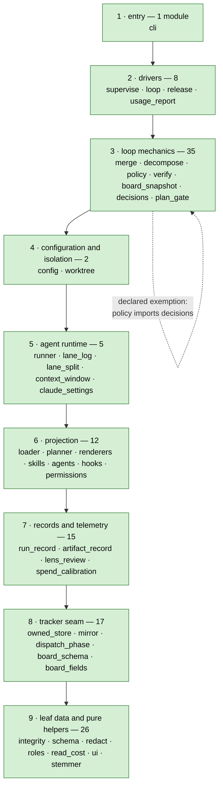

<!-- docs-claims:end layering-contract -->

An arrow reads "may import". A dashed self-edge is the only exception to the sibling
rule: a cycle the contract declares under `ignore_imports`, imported inside a function
rather than at module scope. The diagram draws one edge per declared exemption, so how
many there are is never typed here — the sentence this replaces said two against a
contract declaring one. When a cycle goes, the contract turns red until the exemption
goes with it.

`integrity` sits in the bottom band on purpose. It imports nothing from `basicly`. It
therefore stays testable with no repository, no tracker and no configuration file, and every
band above it can reach it.

### 34.1 Where the seams are, and what forced each one

Five modules were split on 2026-08-20 because each had reached its size ratchet and the next
fix could not be written into it. The seams are recorded here because a seam is a decision, not
a file listing — and because in each case the ratchet named the pressure while a maintainer had
to name the boundary.

| Split | Boundary |
| --- | --- |
| `board_fields` → `board_sections` | what may cross the wire, against which rows a section is |
| `board_snapshot` → `board_usage` | the ledger half and the assembly, against the sections whose source is `.basicly/usage/` |
| `mirror` → `write_verbs` | which verbs have an owned-ledger translation, against what one verb states about a record |
| kit `differential` → `derivation`, `views` | the owned fold and the audit, against a derivation that may read no store, against the shape both sides report in |
| kit `provenance` → `labels` | writing, reading and folding an edge, against what a label means and what it permits |

Two properties hold across all five, and both were checked rather than assumed. **No seam
imports back**: a cross-reference scan established that each moving half took nothing from the
half it left. And **every name a consumer already read is re-exported by alias**, so
`except DifferentialError` and `kit.is_ready` behave exactly as before — one object per name,
never a second class with the same spelling.

The kit splits carry a cost the engine splits do not: the kit is a set of sibling files rather
than a package, so each new module needs a by-path loader caching on a published `sys.modules`
name. Two loads of one file give two `RecordView` classes, and an `isinstance` against the
wrong one is false for the right reason.

**The splits also produced the tree's clearest structural tension, recorded rather than
resolved.** Splitting a module raises the prose share of *both* halves by construction: the code
divides and each half still owes a contract docstring. `board_snapshot` lost 630 tokens of code
and 505 of prose in one edit — it became smaller and denser at the same time, 3980 → 2845 tokens
and 47% → 51.5% prose. Under ruff `D`, which mandates docstrings, that is arithmetic rather
than style. Seven density waivers were taken across the five splits, each with its reason in
`basicly.d/`. The size ratchet and the density ratchet are therefore **jointly unsatisfiable on
the split operation**, and no gate can resolve a genuine conflict between two policies — it can
only price it. What is missing is the pricing: `check_module_size.py` reports only that a module
is *over* its limit, never that it is within N tokens, so 19 modules sit at exactly zero
headroom and none appears in any gate output.

## 35. Runtime topology

Two facts in this section are the two most frequently re-learned facts in this repository.
**Run a landing advance from the base checkout.** **A worktree inside the repository poisons
every whole-tree gate.** Both are topology facts, and neither is recoverable from a prose
search.

**The store drawn below is the owned event log, and it is the whole store.** A second store
sat beside it until 2026-08-18 — the external tracker binary's, authoritative for a work item's
fields and for the gate ledger while the tracker mode was `dual` — and `basicly-vkh0.42.7`
deleted it.
[37. The external tracker binary, and its removal](#37-the-external-tracker-binary-and-its-removal)
is the closing account, and it is the only section that names it. A reader debugging a live run
needs one store.

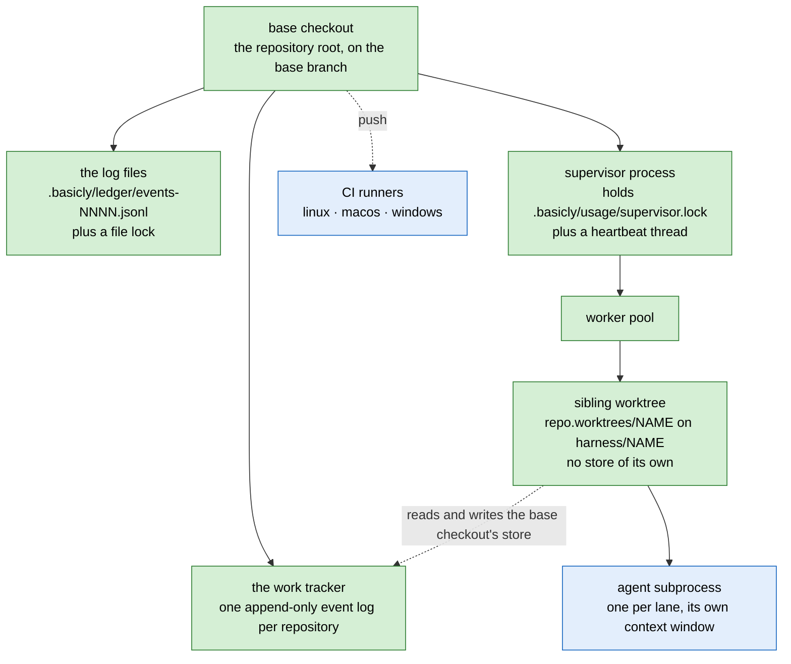

| Thing | Where it lives | Who holds it |
| --- | --- | --- |
| base checkout | the repository root | every advance that writes the base branch, and every landing |
| sibling worktrees | `<repo>.worktrees/<name>`, outside the repository | one lane each, on `harness/<name>` |
| the work tracker | one store, in the base checkout only | every checkout. A lane worktree never holds a store of its own. A git-ignored `redirect` file in the worktree's ledger directory carries that, and §27.1 names it. The store is now **one** store - the flip ran, and §37.3 records it |
| the log files | `.basicly/ledger/` in the base checkout only | one append at a time, behind a file whose existence is the lock |
| the supervisor lock | `.basicly/usage/supervisor.lock` | one supervisor process, refreshed by a heartbeat thread |
| agent processes | subprocesses of the worker pool | one per lane. Nothing interrupts a running one |

**Which checkout a command needs.**

| Command | Checkout |
| --- | --- |
| `basicly loop advance` for a landing or a ship | the **base** checkout. Git refuses to update a branch checked out elsewhere, and the advance blocks rather than stranding a commit |
| `basicly loop supervise` | the base checkout |
| build work inside a lane | that lane's worktree |
| `basicly verify` | either. It reads the tree it runs in |

## 36. Gates and enforcement

### 36.1 The four layers

Each layer runs later than the layer above it, and each one is the backstop for a layer that
can be skipped. The order is strictly linear.

| Layer | When it runs | What it is |
| --- | --- | --- |
| 1 · tool-call boundary | before a tool runs | the only layer that can refuse an edit before it exists |
| 2 · git hooks | at commit and at push | the deterministic floor, agent-independent |
| 3 · the verify runner | at the loop's verify step | one command, recorded as a tracker gate |
| 4 · continuous integration | on push and on a tag | the same checks on three platforms, plus a fresh-consumer smoke install at a tag |

Layer 3 runs the same `full` mode as layer 2's **pre-push** stage, so a green loop step
predicts a green build. Layer 2's **pre-commit** stage runs the narrower `fast` mode, so a
clean commit predicts less than a clean push does. [36.2](#362-the-verify-pipeline) carries
the per-mode counts.

**Layer 1 is structurally different from the three below it, and that is the point.** Every
gate below it judges an artifact *after* it exists. Layer 1 is the only one that can refuse
an edit before there is anything to judge, so it is the only layer whose absence cannot be
compensated for lower down. How much of it any host permits is a status question;
[`status.md`](status.md) answers it.

The host event vocabulary widens only to an event with a named consumer. **A stage lands with
the catalog source that uses it.** A widening to every documented event was refused, on the
argument this design makes against a dead definition everywhere else. Dozens of stages with no
consumer are a second instance of the same defect, and each stage is one more surface to
keep true against a vendor that moves.

The gates below hang off layer 3 rather than sitting in the stack.

| Gate | Where it binds | What it judges |
| --- | --- | --- |
| plan gate | the decompose advance, inside `decompose`, before any child is written | refuses a child with no criteria, scope, dependencies, budget, integrity level or demonstration. It judges the demonstration **field**, deliberately never the command — see [36.4](#364-the-plan-gate-and-the-demonstration) |
| plan-entry ratchet | entry to BUILD | re-reads the recorded plan section and refuses a dispatch missing one of the **five** fields. It never judges the demonstration field, because on that population an absent demonstration is ambiguous between a defect and a record predating the rule |
| demonstration proof | the decompose advance, advisory; and the ship advance, blocking | runs the command the plan gate admitted |
| validate gate | `consumer-surface` integrity only | a consumer-level verdict, recorded by the engine and never by the agent |
| ratchets | every commit | a frozen baseline that may only fall |

### 36.2 The verify pipeline

**Three modes, and the check counts differ per mode** [measured 2026-08-31,
`config.load_verify_config`]. Re-derive from the assembled configuration rather than by
counting the file, because the drop-in layer contributes: a `basicly.d` fragment's entries are
appended to `basicly.toml`'s own list rather than replacing it.

| Mode | Checks | Where it runs |
| --- | --- | --- |
| fast | 35 | pre-commit |
| full | 39 | pre-push, continuous integration, and the loop's verify step |
| staged | 3 | a staged-files-only subset |

The configuration declares 40 checks in total. They cover lint, format, three
platform-specific type-check passes, a security scan, dead code, a wiring gate, the kit
boundary, the layering contract, the test suite, all five projection drift checks, the
documentation claim gates, and the ratchets.

**The four counts above are a tripwire, not a reading.** `tests/test_docs_drift.py` re-derives
them from `config.load_verify_config` and fails when this table drifts from the configuration,
so a check added to `basicly.toml` or to a `basicly.d` fragment moves the table in the same
change.

**A check whose repair is purely mechanical and lossless declares a fix command.** The
pre-commit hook applies that command to the staged files, and re-stages them. The commit
therefore carries the fixed bytes, and no agent cycle repeats a repair a script can make.
The check itself does not change. Unformatted input from outside the loop still fails in
continuous integration, and a non-mechanical failure still blocks.

**The failure semantics make an ambiguous state a failure.**

| Situation | Verdict | Why |
| --- | --- | --- |
| the executable is missing | fail, not skip | a skip reads as a pass |
| a git command cannot answer which files are staged | fail | otherwise the check passes vacuously |
| a check passed | recorded in the usage ledger | that ledger is the sole evidence source for the release-time capability gate |

The capability gate refuses to ship a declared capability that nothing has exercised.

**A narrow forgiveness path exists, and it is deliberately narrow.** A re-run may forgive a
failure only when *every* failing check matches a known dependency-defect signature.

### 36.3 Gate results and who may write them

A deterministic check reports a **required** gate. A failed required gate blocks the
advance. An AI judgment reports a **non-required** gate. A non-required gate is advisory, and
it never blocks.

**The gate ledger authenticates nothing, and a dispatched lane agent shares the real tracker
through the worktree redirect.** A required gate therefore counts only a result that carries
**the engine's own provider**. The engine surfaces a foreign result on a required gate as
*disregarded*, and does not count it. That makes "a judged verdict is never a green light"
an enforced property, not a matter of agent good behaviour. An advisory gate still accepts
any provider. See [D-04](#d-04--deterministic-first-judged-second).

**A forged provider string is still possible.** That risk is the same acknowledged class as
a forged grant marker or a forged checkpoint marker. Authenticated gate results are the only
real fix. The limit is stated here rather than covered by an implied guarantee that does not
exist.

### 36.4 The plan gate and the demonstration

The plan gate runs on the **decompose advance**, inside `decompose`, before a single child
is written. It reports every violation from one run, because a per-child raise would
surface them one dispatch at a time.

| It refuses | Note |
| --- | --- |
| an empty plan | — |
| a duplicated child title | the graph is title-keyed |
| a child missing acceptance criteria, a scope, a dependency declaration, a token budget or an integrity level | five separate fields, each required |
| an integrity level outside the vocabulary | — |
| a non-positive token budget | — |
| a dependency naming a title the plan does not contain | — |
| any cycle in the declared graph | — |

**An empty dependency list passes. An absent one does not.** Declaring "nothing blocks this"
is a statement. Omitting the field is not.

**A second, narrower gate re-reads the plan at entry to BUILD.** `plan_entry` reads the
recorded body and refuses the dispatch when the plan section is missing one of the five
fields. It sits there because inspection belongs before the expensive stage, and BUILD is
where nearly all the tokens go. Three things separate it from the plan gate above, and
each is deliberate. It
ratchets on the `## Plan` heading, so a body written before the gate existed is admitted
rather than refused. It never judges the sixth field, because on that population an
absent demonstration is ambiguous between a defect and a record predating the rule. And
it is inert when the caller named no grant, because it fails closed on an unreadable
record, and running it on the interactive path would turn a tracker that did not answer
into a refusal on a path that never read the tracker.

**Every planned child must also name how it is demonstrated end to end.** That is what makes
"every acceptance criterion names its own check at plan time" satisfiable by construction. A
child with no consumer-visible behaviour has no check to derive, and that is the
horizontal-slice failure a scope-glob decomposer produces by default. See
[D-15](#d-15--every-criterion-names-its-check-and-every-child-names-its-demonstration).

**The plan gate judges the field's form. A separate module runs the command.** The two are
deliberately different mechanisms at different rungs, and a reader who collapses them gets
the design wrong.

| Rung | Mechanism | What it does with a demonstration that selects nothing |
| --- | --- | --- |
| decompose advance, before the children exist | `plan_gate` | never runs it. Refuses an empty value, a multi-line value, and a value naming nothing runnable, detected as the absence of a backticked span |
| decompose advance, once the children exist | `demonstration_proof.plan_notice` | runs it and **reports**. At plan time a demonstration naming a test the child has not written yet is the honest case |
| **ship advance** | `demonstration_proof.unrun_reason` | runs it and **blocks the close**. At close, a demonstration is a claim of completion |

**The ship-rung gate is built, wired and blocking** [verified 2026-08-16,
`loop.py` ship handler, `demonstration_proof.unrun_reason`]. It rebuilds a pytest argv from
an allowlist, shells out with `--collect-only -q -p no:cacheprovider`, and treats pytest's
`EXIT_NOTESTSCOLLECTED` (5) as an answer of zero. Exit codes 2, 3 and 4 mean the collector
failed to answer, and an unanswered question is not a finding. Probed on real input from the
repository root, a zero-selecting demonstration returns `True` and a real selector returns
`False`.

The failure it was built for was measured: five issues closed in one session against a
selector matching nothing, and every one of their real regressions existed under another
name.

`[TARGET]` **The gate is a floor and it is still incomplete, and completing it is deferred**
(`status.yaml`, the plan gate row: running an admitted demonstration is not a bounded read).
A demonstration that names a
non-pytest command is admitted at every rung, because only pytest is rebuilt from the
allowlist. A command that always succeeds therefore still passes. Shelling a free-form
demonstration string is not a bounded read, which is why the current gate refuses to try; the
remedy is a wider allowlist of bounded, no-side-effect probes, not an unrestricted shell.

### 36.5 Integrity assignment

[9.2 Integrity](#92-integrity-how-far-a-defect-reaches) gives the three levels, their names
and what each one buys. This section covers the rule that assigns a level, and how much of
that assignment anything reads back.

**The rule is deterministic over the declared scope globs.** Nobody judges it, so nobody can
game it, and it costs zero tokens. See
[D-14](#d-14--a-deterministic-rule-over-touched-paths-assigns-the-integrity-level).

Three properties the rule keeps.

1. **The highest level any declared path resolves to wins.** A unit that touches one
   consumer surface is a consumer change, whatever else it touches.
2. **An exclusion makes each clause single-valued. The order does not.** The `engine` clause
   names the `consumer-surface` patterns as exclusions. The written order of the clauses is
   therefore presentation, not meaning. A test asserts exactly one match over every tracked
   file.
3. **The rule is total.** Every path resolves, because the fallback is a clause and not an
   absence. An unclassified path resolves to `engine`, deliberately in the middle.
   `docs-and-tests` would fast-gate a path the rule has never been taught.
   `consumer-surface` would demand a human ship for every unrecognised file.

**The rule does not invent the five frozen consumer surfaces.** They are the five things the
release process freezes for semantic versioning, mapped onto the paths that declare each
one.

| Surface | Declared by |
| --- | --- |
| the CLI commands and flags | `cli.py` |
| `basicly.toml` and its overlay | `config.py`, `basicly.toml`, `basicly.local.toml` |
| the catalog source schemas | `schema.py`, `.basicly/core/schemas/**` |
| the generated-file and manifest contract | `projection.py`, the renderers, the templates |
| the owned ledger format | `run_record.py` |

Where a surface has a declaration and an implementation, the *declaration* sits at
`consumer-surface`. `loader.py` parses against the catalog schema, and is ordinary engine
code.

**Only the gate selection is consumed today.** A level also carries a model tier, a rework
allowance and a ship disposition. The engine writes those three into the classification
marker's text, and **reads none of them back**. The rework cap comes from configuration
unconditionally. Tier routing comes from the runner configuration.

**One downgrade is implemented and never invoked.** A `consumer-surface` path whose diff is
small, and which changes no public signature, drops to `engine`, and the engine records the
reason. The classify path supplies no patch, so the downgrade never fires in production. Its
threshold is a seed, and the code says so. The mechanism is fixed. No measurement here has
found where the line belongs.

**One of the three `consumer-surface` gates is promoted into the required set, and only
one.** That is deliberate. The evidence-binding gate is not promoted, because nothing
produces it. A promoted gate that nothing can satisfy would wedge every `consumer-surface`
unit.

### 36.6 Ratchets

A ratchet freezes a measured baseline that **may only fall**. A property nothing else
measures therefore cannot get worse in silence.

| Gate | Metric | Baseline shape |
| --- | --- | --- |
| module size | module tokens excluding top-level imports, against a per-file cap | a frozen per-file table plus a waiver count |
| comment density | comments plus docstrings as a share of module tokens, against a cap | a frozen per-file table plus a waiver count, with an explicit rebaseline escape carrying a reason |
| suppression debt | count of lint suppressions per rule code | a frozen per-code table that must **equal** the tree, not merely not exceed it |
| corpus drift | unaccounted context bullets per open parent issue | a frozen per-issue count |
| stale citations | `file:line` references in a document that no longer point at what the sentence claims | a frozen per-document count |
| unresolved section citations | `§N` references from code into this document that name no heading it defines | a frozen per-module table, closed: a module absent from it may carry none |
| tree growth | net tokens added tree-wide over a rolling window | **none: it reports and never fails** |

**The size ratchet is an agent-context gate, not a code-quality gate.** The distinction
matters, because the quality literature argues the other way. The measured work finds
mid-size components best, and finds smaller modules proportionally *more* defect-prone. The
gate exists here for the working set an agent can hold. That is a plausible mechanism, not a
measurement, and it must be stated that way.

**The two size ratchets pull in opposite directions.** An extraction sheds tokens, and it
raises the prose share of what remains. An extraction therefore satisfies both gates only
when the extracted unit's prose share is *above* the share of its origin. Measure that before
you choose a split.

**A ratchet whose control has never fired correctly becomes observability, not a block.** See
[D-19](#d-19--a-sizing-control-with-no-recorded-firing-becomes-observability).

**Never propose a change whose stated benefit is a moved number.** A comment deletion is the
cheapest route to size headroom in this tree, and it returns a large share of some modules'
budgets. A function split in two satisfies a complexity gate and makes the code worse.
Extract along a nameable responsibility, or do not extract.

### 36.7 Documentation gates

Four gate kinds hold a document to the tree it describes. They exist because every human
and every agent that plans from a document reads it as fact.

| Gate kind | What it does | On failure |
| --- | --- | --- |
| generated block | renders a region wholly from the tree, between paired markers | a fix run repairs the drift |
| assertion | checks a claim it cannot write | names the edit a human must make |
| citation ratchet | checks a document's `file:line` references against the code, and code's `§N` references against this document's headings | refuses |
| pytest tripwire | asserts a documented list against a code constant | fails the suite |

`uv run python .scripts/docs_claims.py --check` reports `5 generated blocks current,
6 assertions current` [verified 2026-08-31]. Which blocks, assertions and tripwires bind on
which document is a fact about the documentation set, and
[`conventions.md`](conventions.md) records it.

**A `file:line` in a document is a claim about the code.** Before the citation gate existed,
nothing checked one. Four such claims once planned a top-priority item against a remedy the
tree had already replaced.

The gate holds two exact rules. A cited line must be live code. It must also fall **inside
the symbol its own sentence names**. The second rule pins a citation to something that stays
stable under an edit. The gate is a ratchet with a closed list, and the list is empty, so no
document may carry one stale citation.

**Both directions run.** `check_docs_citations.py` walks a document's `file:line` references
into the code; `check_code_citations.py` walks code's `§N` references into this document's
headings, wired as the `code-citations` check in `basicly verify`. The second direction is a
ratchet over a frozen per-module population rather than a clean sheet, so the unresolved
citations it inherited may only fall.
[3. Section numbers are a cited surface](#3-section-numbers-are-a-cited-surface) states the
contract both hold.

### 36.8 CI

| Workflow | Trigger | What it runs |
| --- | --- | --- |
| projection drift | push and PR on the trunk | the projection staleness check |
| quality gates | push and PR on the trunk, plus manual | first, every commit message in range replayed through both message hooks; then the full check set on three platforms, fail-fast off |
| release | a version tag | lint and both check sets, a **fresh-consumer smoke install** from the tag into an empty repository, then a version-tag match, changelog extraction, a build, and a published release |
| pages | a push touching the site | build and deploy the landing page |
| improvement loop | manual dispatch only | the improvement controller in dry-run mode |

**CI ignores a tracker-only push.** The commit-message hooks are the deterministic floor for
that case.

## 37. The external tracker binary, and its removal

**This section is the whole account of the external tracker binary, and the dependency is
gone.** It appears nowhere else in this document, because it never was part of this
architecture. It was a transitional dependency, it left, and this section is now the closing
account: why it was taken, what it cost, and the evidence that nothing reaches it. See
[D-35](#d-35--the-external-tracker-binary-is-transitional-not-a-component).

The binary was `br`, an external command-line tool. This is the only section that names it.

**Re-derived 2026-08-19: nothing in this repository spawns it.** The probe in
[37.2](#372-what-still-depends-on-it) returns no sites, the seam module that held the spawn
does not exist, and `[tracker] mode` has one legal value. The tenses below are past on
purpose.

`[TARGET]` **This section is kept at its number rather than deleted.** [3. Section numbers
are a cited surface](#3-section-numbers-are-a-cited-surface) makes a number stable for as
long as its subject exists, and retiring §37 leaves a gap rather than renumbering §38 to §40
— which is the right end state. What blocks it is not this document: `status.md`,
four modules under `src/` cite §37 or
the removed requirements document by name, and the sweep that clears them is
`basicly-vkh0.42.6`'s remainder. Removing the section before them would leave a set of
citations resolving to nothing.

### 37.1 Why it was adopted, and why that reason expired

The loop needed four primitives on day one: a gate ledger, a dependency graph, readiness,
and a definition-of-ready lint. The binary had all four. Building them first would have
delayed every other part of the system, and the thesis was **lean over substrate**.

Three things expired that reason.

1. **The licence carries a rider restricting a class of users.** A clean-room boundary
   therefore applies to any replacement, and the rider is itself the strongest argument for
   owning the component.
2. **The binary is unowned code in the critical path of every guarantee.** The phase
   derivation, the gate ledger and the readiness set all read through it. A defect in it is
   a defect in the loop, and nobody here can fix it.
3. **The cost of a call is measurable and one-sided.** Re-measured against the live ledger,
   a single-record in-process read is about **fifteen times** cheaper than the median
   external CLI call, and a full fold about **twice** as cheap. Both gains are real and
   modest, and the fold ratio narrows as the ledger grows. An earlier claim of a far larger
   factor compared incomparable operations against a much smaller ledger, and it was
   corrected. **Speed is not the reason to remove it. Ownership is.**

Adopting a versioned database instead of owning the store is refused, because it
reintroduces exactly the unowned-binary upgrade surface being removed. See
[8. Non-goals](#8-non-goals).

### 37.2 What still depends on it

**Nothing. Zero spawn sites, re-derived 2026-08-19.** One module used to spawn the binary and
everything else called through it — the invariant that made the replacement a change in one
place, and it held to the end. See
[D-23](#d-23--the-seam-is-the-only-place-where-both-stores-move-together).

The probe below is the one that produced the historical figures, and it covers every
spelling: most call sites imported the wrapper under an alias, and a second wrapper existed
for tolerated failures, so a naive search for the wrapper's name undercounted.

```sh
rg -c '\b(_run_br|_try_run_br|br\.run_br|br\.try_run_br|run_br|try_run_br)\s*\(' src/basicly -g '!br.py'
```

**It now exits non-zero with no output.** The seam module it excludes, `src/basicly/br.py`,
does not exist either, and the string `"br"` appears in no argv construction under `src/`,
`.basicly/core/` or `.scripts/`. The positive control for that zero is that the same tool
over the same tree returns matches for an ordinary pattern — an empty probe is otherwise
ambiguous between *absent* and *wrong probe*. It was 29 sites across 13 engine modules plus
one in the improvement controller script [measured 2026-08-16], and that figure is now
terminal history.

**The guard is a test rather than this paragraph.** `tests/test_engine_without_a_binary.py`
drives the engine's own entry points with the binary absent from `PATH`, and **a spawn fails
the test** — not merely an un-install, because "the binary was absent and the engine
silently degraded to doing nothing" satisfies a weaker assertion and is exactly this
section's failure mode.

**All five operations that had no owned equivalent now have one**, so the design questions
were answered rather than deferred.

| Operation | The owned equivalent |
| --- | --- |
| the definition-of-ready lint | `policy.definition_of_ready`, with the required-section set per work type as configuration; surfaced as `basicly policy dor` |
| dependency-cycle detection | `dependency_graph`, folded from the same edges as the blocking graph |
| a label query | `label_source`, answering a label's members as `{issue_id: status}` |
| id minting | `kit.tracker.ids.mint_root_id`, called by the kit's own CLI and by `owned_write` |
| the gate listing | `gate_source`, folded out of the owned ledger |

**The one path that named the binary's own layout is gone with it.** A lane worktree used to
share the base checkout's store through a git-ignored `.beads/redirect` file that
provisioning wrote, and provisioning probed the new worktree rather than trusting it. That
directory was deleted by `basicly-vkh0.42.7`, and [35. Runtime topology](#35-runtime-topology)
draws the relationship without it.

### 37.3 The cutover, and where it stands

**All five steps ran, and the ladder collapsed to its last rung.** `[tracker] mode` had three
values while a second store existed; `TRACKER_MODES` is now `('owned',)`, because a repository
declaring `external` or `dual` would be naming a behaviour no code performs. The key survives
its ladder on purpose: a consumer's committed `mode = "owned"` must not be refused as an
unknown name, and a value outside the set is refused rather than defaulted.

| Step | State | Note |
| --- | --- | --- |
| 1 · import the existing export into the event log | ran | refused a ledger already holding a post-flip record |
| 2 · the shadow differential | ran, on dual, and came back clean **and** conclusive over a non-empty scope | 64 records, 18 adopted, recorded on `basicly-vkh0.29` |
| 3 · dual write | ran | every accepted write also landed in the owned ledger |
| 4 · flip the source of truth | ran | the ledger became authoritative |
| 5 · owned-store-native markers | landed, ahead of steps 2 to 4 | this is why the differential had to run on dual |

**The machinery is gone with the dependency.** `basicly tracker` carries six read and write
subcommands and no `import`, `shadow` or mirror surface; `basicly-vkh0.42.7` deleted the
external store directory. Nothing below is re-runnable, and it is kept because the ordering
lesson outlives the code that taught it.

**One write under dual mode, drawn in order — the historical design.** The order was the
design. Two real defects, which were one mistake, produced it.

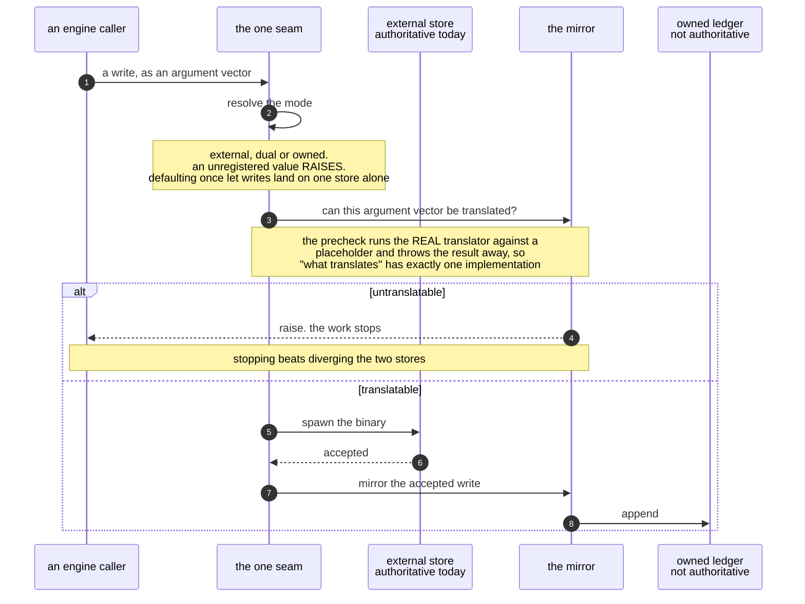

**Decide, then spawn, then mirror.** The mirror used to raise *after* the write had already
run. A plural close that the binary accepts, and that the translator refused, therefore
diverged the stores before the guard fired.

**The mirror covers six write surfaces**: close, comment, create, dependency add, gate
report and update. It deliberately does not cover two store-management surfaces. Anything
classified as a read produces no draft. **Anything else raises.** A write surface with no
translator must stop the work rather than diverge the stores.

A directly spawned binary never enters the mirror. It moves one store and not the other.
The differential then reports a divergence it cannot tell from a mirror failure. A human's
store write therefore has its own command, a thin passthrough on purpose, so it meets the
same two refusals the engine's own writes meet: an unknown mode, and an untranslatable
argument vector.

**The shadow differential is what would license the flip.** Its reference is a live read of
the binary, never the JSONL export. An upsert-only export cannot express a deletion, so two
derivatives of one snapshot agree with each other and prove nothing. The comparison covers
three queries: records with their derived phase, the ready set, and gate status. The gate
side has no export field at all, so a live read is the only witness.

**The kit audits its own reference.** It calls the views function a second time, with a
synthetic event appended, and refuses a source whose answers move with that event. **It
deliberately does not cache.** A memoised answer would clear the probe by being the same
answer, not by being an independent one.

**Two verdicts, and the exit code needs both.** *Clean* means no in-scope disagreement,
nothing undeclared, and no refused reference. *Conclusive* means the in-scope population is
not empty. A comparison over zero records discriminated nothing, so **an empty scope is
inconclusive, never clean**. Without that rule, a scope could license the flip on a
comparison that measured nothing.

**Two exclusion populations exist, keyed on two different things. A reader gets this part
wrong most often.** A record the *ledger* holds from the import is excused as history, keyed
on a marker the import's own producer writes. A record the *reference* holds and the ledger
does not is excused only by an explicitly declared baseline sidecar. This repository's
declared baseline is **empty**, so nothing on the reference side is excused. A summary that
reads "zero declared" beside a large "excused as history" count is not a contradiction.

**A declared baseline may be written once, and may only shrink.** A re-declaration after the
dual write started would absorb a genuine failure into history, so a widening is never a
repair. The import refuses a ledger that already holds a post-flip record, for the same
reason.

**What the run said while it could still be run** [measured 2026-08-16,
`uv run basicly tracker shadow`, a command that no longer exists]: not clean, and conclusive.
It reported **two kinds of failure**, which needed different answers.

1. **Records the external store holds and the ledger does not.** Each is a hand-write that
   bypassed the seam, not a mirror defect. This is the class the closed bypass route
   removes.
2. **Records both stores hold, where the two disagree on the `ready` query.** The owned
   fold calls the record ready and the reference does not. **This document does not know
   the cause**, and the two candidates need different fixes: a dependency edge added by a
   direct spawn never reached the mirror, or the mirror dropped it. What would settle it is
   whether the ledger holds an `edge` event for the disagreeing record's blocker
   [measured 2026-08-16, `grep -h '<the record id>' .basicly/ledger/events-*.jsonl`: one
   `field` event and no `edge`, which fits either candidate].

An earlier reading of hundreds of gate disagreements is stale. Those records carry the
import marker, and the run now excuses them as history.

**The flip waited on a closed bypass route, on the `ready` disagreement above, and on the
five unported operations in [37.2](#372-what-still-depends-on-it). All three were settled, and
the flip ran.** The `ready` disagreement was never attributed to one of its two candidates
from the evidence recorded here, and the reference that would have discriminated them is
deleted, so it is closed as unexplained rather than as diagnosed.

### 37.4 Two defects that make the removal urgent

Both were found on 2026-08-16, and they are why the removal was urgent rather than scheduled.
The second is the severe one. **Neither probe below can be run now**: `basicly-vkh0.42.7`
deleted `.beads/`, so both commands meet an absent file. They are kept as written because the
mechanism each reads off the vendor's own documentation is checkable without them, and because
a probe rewritten to pass is not evidence.

**Defect 1 — the liveness check and the integrity check answer different questions, and
only one of them was read.** The binary's cheap health subcommand reported `db=ok` while
SQLite called the image malformed. The binary's own help text names the mechanism: the
health subcommand is a "Cheap (<200 ms) one-line liveness summary", and the fast diagnostic
path **explicitly skips** `sqlite3.integrity_check` among its slow detectors. A caller who
reads the cheap answer therefore learns that the process can open the file, not that the
file is sound.

*What can and cannot be verified.* The malformed image does not reproduce: `.beads/beads.db`
returns `ok` on `PRAGMA integrity_check` and on `PRAGMA quick_check`
[measured 2026-08-16, read-only SQLite connection]. **The corroborating evidence is gone.**
The recovered image the corruption left behind was a 7.6 MB stray copy, and commit `c351ce0`
deleted it, so the pair of file timestamps that showed a recovery and a rebuild can no
longer be read by anyone. **Treat the disagreement as reported and not reproduced.** The
word "corroborated" was true when it was written and is not checkable now. What is
independently established is the mechanism above, which is read off the vendor's own
documentation.

**Defect 2 — the vendor's repair path destroys the gate ledger.** The binary's repair flag
is documented, in its own help text, as: *"Attempt to repair detected issues (rebuilds DB
from JSONL)."* The JSONL export carries no gate results at all.

| Source | Gate results |
| --- | --- |
| the database, `gate_results` table | hundreds, and it grows on every landing |
| the JSONL export, every record | **0** |

**Zero is the load-bearing figure, and it is the one that cannot drift upward in silence.**
The other side of the table is a moving count, so this document gives the probe:

```sh
python3 -c "import json, pathlib, sqlite3; \
db = sqlite3.connect('file:.beads/beads.db?mode=ro', uri=True); \
r = [json.loads(l) for l in pathlib.Path('.beads/issues.jsonl').open()]; \
k = set().union(*(x.keys() for x in r)); \
print(db.execute('select count(*) from gate_results').fetchone()[0], len(r), \
sorted(x for x in k if 'gate' in x), len(k))"
```

It printed the database count, the export's record count, every export key whose name
contains "gate", and the number of distinct keys. The third value was empty and the fourth was
the positive control that said the parse read something. Both stores it reads are now deleted,
so the figure has **no** live derivation path — one when this was written, after the recovered
image went, and none now. **The zero is terminal history, not a claim to re-check.**

**So the documented recovery path for a corrupted store silently erases every gate verdict
in it.** That is not a peripheral loss. A green required gate is the discriminator the
phase derivation uses for the word "landed"
([24. Phase is derived, not stored](#24-phase-is-derived-not-stored)). Running the repair
would move every landed work item back down the ladder, and nothing would report it as a
loss, because the repaired store is internally consistent.

**Two properties of the owned kit answer both defects directly**, and they are the reason
the removal is the fix rather than a workaround.

| Defect | What the owned kit does instead |
| --- | --- |
| a cheap check that cannot see corruption | the log is plain append-only text, and the consistency checker in [32.6](#326-consistency-and-edge-provenance) reads the same bytes the fold reads. There is no second image to disagree with |
| a repair that rebuilds from a lossy export | **a repair is a corrective append**, never a rebuild. The log is the truth, so there is nothing to rebuild it *from* and nothing to lose |

### 37.5 The pin, until the flip

**The pin left with the binary, and this subsection is the record that it did.** While it
stood, the binary was an external CLI rather than a package dependency: the engine declared a
**floor** on major and minor, and an **exact pinned version**, and warned in **both**
directions from it. Its sources were `br.MIN_VERSION` and `br.PINNED_VERSION` — constants in a
module that no longer exists, so **neither name resolves today**, and no version constraint on
any external tracker is declared anywhere in this repository.

**The exact pin has a ceiling for a reason.** A floor alone once let a silent upgrade break
a gate command on one machine while CI stayed green. An upgrade past the pin is not a fix
either. The upstream trunk targets a newer database schema, and its migration accepts only a
narrow range, so a newer binary has no supported forward path from the schema in use here.

**About ten places carried the pin string by hand**: user-facing messages, comments and
consumer documentation, with no gate keeping them in step. The single authoritative statement
was the constant in the seam module, and the installer imported it rather than a copy, which
was the one duplicate that could not drift. **The hand-carried copies are what outlive a
removed constant**, and clearing the last of them is the sweep this section's own removal
waits on.

**The consumer-facing surfaces no longer discuss a pin at all, and the contradiction this
subsection carried is discharged.** It read `[TARGET]` against `CONTRIBUTING.md` for calling
the pinned version "the known-good floor". Re-measured 2026-08-19: `rg -c 'known-good floor'
CONTRIBUTING.md` returns nothing, and so does `rg -c '0\.2\.16' CONTRIBUTING.md` — **the
control is void as well as the target**, which says the surrounding passage was removed rather
than the wording corrected. That is the stronger outcome and a weaker measurement, and it is
recorded as the second thing rather than the first. `rg -i 'not a floor' README.md docs/`
returns only this document's own siblings describing the old state.

**Every one of these paragraphs was to disappear at the flip.** They are held one release
longer because the citations into this section outlive it, which is the point of confining
them to one section: the sweep has one place to look.

---

**Part VII — Decisions.** One record per decision, each the sole home of its argument.

## 38. Decision records

**A functional section states a rule. A record here holds the argument for it, the
alternative rejected, and the consequence accepted.** Where the reasoning *is* the
mechanism, it stays in the functional section and the record points up at it. The two
"landed" incidents in [24. Phase is derived, not stored](#24-phase-is-derived-not-stored)
are the clearest example: a reader who meets the ladder must meet the incidents at the same
moment.

Every record has a stable id. An id is never reused and never renumbered. A reversed
decision keeps its record and gains a `superseded by` line.

| Id | Title | Status | Governs |
| --- | --- | --- | --- |
| D-01 | Authority is asymmetric | accepted | §6 |
| D-02 | Phase is derived, and the phases are code | accepted | §24 |
| D-03 | The tracker is an append-only event log | accepted | §32.2 |
| D-04 | Deterministic first, judged second | accepted | §36.3 |
| D-05 | Verification and validation are two states | accepted | §23.2 |
| D-06 | A test admits a persona, not a preference | accepted | §30 |
| D-07 | RETROSPECTIVE fires on a computed special cause, and is not a phase | accepted | §26.3 |
| D-08 | Reliability chooses a tier, and the price is per landed unit | accepted | §7, §31 |
| D-09 | A provider model id never appears in an agent file | accepted | §15, §17 |
| D-10 | The catalog defines and the host executes | accepted | §5 |
| D-11 | An agent may spawn only a role the engine authored | **amended**, supersedes "no agent spawns agents" | §8 |
| D-12 | Agent-authored guidance never reaches the catalog without a human | accepted | §8, §26.3 |
| D-13 | A kill always needs a human | accepted | §25 |
| D-14 | A deterministic rule over touched paths assigns the integrity level | accepted | §36.5 |
| D-15 | Every criterion names its check, and every child names its demonstration | accepted | §36.4 |
| D-16 | An acceptance criterion separates its five requirement kinds | accepted | §36.4 |
| D-17 | The rework allowance is per gate, with a lane-wide ceiling | accepted | §25 |
| D-18 | Diff size is a plan-time signal, not a review-time discovery | accepted | §36.4 |
| D-19 | A sizing control with no recorded firing becomes observability | accepted | §36.6 |
| D-20 | Spend caps compose | accepted | §31.1 |
| D-21 | Context control is field selection, not encoding | accepted | §8 |
| D-22 | The tracker vocabulary is this project's own | accepted | §32.3 |
| D-23 | The seam is the only place where both stores move together | **re-taken at the flip**, on a new argument | §32.5 |
| D-24 | A skill keeps its path glob | accepted | §14 |
| D-25 | A comment that contradicts the code is a defect | accepted | §36.6 |
| D-26 | `docs/` carries four kinds of document and no more | accepted | a path gate |
| D-27 | Everything is a plain, git-tracked file | accepted | §21 |
| D-28 | A handoff artifact travels as a comment marker, never as a ledger append | **superseded by D-36** | §33 |
| D-29 | Codex inlines a scoped fragment, and Copilot gets no scoped twin | accepted | §12.1 |
| D-30 | The status view is generated from one source | accepted, one of three surfaces built | §2 |
| D-31 | The two ladders are named, not lettered | accepted | §9 |
| D-32 | Pre-commit rather than a compiled hook runner | accepted, with four reopen triggers | §16 |
| D-33 | An unknown configuration key is refused unconditionally | accepted | §20 |
| D-34 | One kind for prose, and typed kinds for machine state | accepted, ten of eighteen kinds built | §32.3 |
| D-35 | The external tracker binary is transitional, not a component | **discharged** at the flip | §37 |
| D-36 | A handoff artifact is a typed ledger event, bounded by derivability rather than by a byte cap | accepted, supersedes D-28 | §33 |
| D-37 | The factory has a light mode and a dark mode | accepted, light dispatch path unbuilt | §29 |
| D-38 | A ratchet waiver carries a reason at the lower integrity levels and an approval at `consumer-surface` | accepted, approval half unbuilt | §36.6 |
| D-39 | The plugin is a second distribution channel packaging the same projected output | accepted, unbuilt | §21 |
| D-40 | A tier resolves by declared vendor order, verified at install | accepted, partly built | §17 |
| D-41 | The authority order over design documents | **withdrawn** — both ranked documents are deleted | §1 |
| D-42 | A session is prepared by a derived command, and the handover retires | accepted | §22 |
| D-43 | The plugin paradigm: four refusals, one adoption, two lessons | accepted | §6, §19, §31, §34 |
| D-44 | The field review of 2026-07-26: leads kept, one matched, eight gaps placed, rejections recorded | accepted | §7, §8 |

### D-01 · Authority is asymmetric

**Decision.** The engine disposes. Agents propose. No model holds authority over the
tracker, the schedule or a required gate, at any autonomy level.

**Because.** The rest of the design hangs from this one decision. Every other refusal in
this document is a consequence of it. A persuadable scheduler is not a scheduler.

**Consequence.** An agent's output is always a proposal. Engine code validates it against
policy before it becomes state, which costs one validation step on every judged output.

### D-02 · Phase is derived, and the phases are code

**Decision.** The loop phase is a pure function of tracker state, and the derivation lives
in engine code rather than in configuration.

**Because.** Two rungs of the derivation encode invariants that real incidents found. In a
declarative form those rungs become a boolean expression language, and that language lives
where the type checker, the test suite and code review cannot reach. The general rule
follows: **a rule that moves from code to data leaves all three.**

**Rejected.** A declarative phase table. It would let a consumer reorder the ladder, which
nobody asked for, and it would move the two incident-bearing terms out of review.

**Consequence.** A consumer cannot vary the ladder. What a consumer would plausibly want to
vary is already configuration: the required gates, the rework cap, the verify checks per
mode, and the autonomy ceiling.

### D-03 · The tracker is an append-only event log

**Decision.** The truth is an append-only event log. A record's state is a fold over its
events.

**Because.** History then lives in the data. It does not depend on git history surviving a
squash or a shallow clone, and the truth has one shape a checker can verify.

**Consequence.** Nothing may rewrite a line. A repair is a corrective append. A lossy
compaction is a non-goal, because a lossy fold has no authority.

### D-04 · Deterministic first, judged second

**Decision.** Only a deterministic check may pass a required gate. A judged verdict is never
a green light.

**Because.** A required gate counts only a result carrying the engine's own gate provider.
That enforces the rule in code. It does not ask an agent to behave.

**Consequence.** A forged provider string is still possible, and this document says so
rather than implying a guarantee that does not exist. Authenticated gate results are the
only real fix.

### D-05 · Verification and validation are two states

**Decision.** Verification and validation are two states, run in sequence, never in
parallel.

**Because.** They are distinct technical processes in the standards this design borrows
from. A parallel run spends judged tokens on builds that verification will reject.

**Consequence.** A `consumer-surface` unit pays one extra round trip.

### D-06 · A test admits a persona, not a preference

**Decision.** A persona is admitted only when it needs genuine judgment, has a checkable
success criterion, **and** carries a tool policy or a model tier materially different from
its neighbours. Anything else is a prompt section or a deterministic engine step.

**Because.** A role that differs only in prompt costs a dispatch and buys nothing a prompt
section would not.

**Consequence.** Repair fails the test, because it differs only in prompt. Repair is the
implementer's second mode, and the mode travels in the brief, carrying the gate evidence
that rejected the work.

### D-07 · RETROSPECTIVE fires on a computed special cause, and is not a phase

**Decision.** A retrospective fires on a computed signal only, and it is a dispatch label
rather than a rung.

**Because.** A state exists to hold three things: an entry predicate, an exit gate and a
persona. A conditional process over a ledger needs none of the three. A rung that never
blocks anything would be ceremony around a function call. And an action on a single failure
inside the control limits is tampering, which increases the variation of a stable process.

**Consequence.** The engine records the dispatch under a retrospective label, for role
resolution and cost attribution only, outside the write-phase set.

### D-08 · Reliability chooses a tier, and the price is per landed unit

**Decision.** The price of a reliability tier counts total tokens, wall clock and human
interventions per landed *correct* unit. It never counts the price of one dispatch.

**Because.** A cheap dispatch that bounces twice costs more than an expensive one that
lands. The predicate for "cheap is safe" is **specification completeness**, not the work's
nominal category. A brief that carries the literal code is transcription, and transcription
is mechanically checkable.

**Consequence.** A dispatch with no resolved tier is a defect, not a default, because an
omitted model silently inherits the session's model. The instrument that would price this
does not exist; [7. Quality attributes](#7-quality-attributes) records it as unmeasured.

### D-09 · A provider model id never appears in an agent file

**Decision.** No projected agent file carries a provider model id, generated or not.

**Because.** Two independent reasons. A provider id is not portable across agent families,
and two surfaces spell the same model differently. And the tier-injection mechanism leaves a
definition that pins its own model alone, so a projected model line would **disable**
injection rather than implement it.

**Consequence.** The schema keeps the old key as a deprecated property so lint owns the
actionable message, and the key stays on the reserved-frontmatter list so the per-family
passthrough cannot smuggle an id back in.

### D-10 · The catalog defines and the host executes

**Decision.** The catalog declares guidance and roles. The host runtime executes the
dispatch.

**Because.** Both installed runtimes already ship the dispatch mechanism an earlier design
assumed it had to build. A reimplementation of a shipped mechanism inverts the
reuse-before-reinvention rule.

**Consequence.** The engine supervises lanes, and owns the tracker, the gates and the
landing. It does not own agent invocation beyond the adapter.

### D-11 · An agent may spawn only a role the engine authored

**Decision.** An agent may spawn only a role the engine authored, gated at the runtime tool
boundary.

**Supersedes.** "No agent spawns agents."

**Because.** The original form is unenforceable prose, and both runtimes contradict it by
construction. The amended form is *stronger*. A host hook can intercept a subagent as it
finishes, before its results return to the parent. That is a runtime gate, not a process
boundary nobody can check.

**Consequence.** The failure the original prevented — an agent inventing unmetered helpers —
is still prevented, and now by a mechanism.

### D-12 · Agent-authored guidance never reaches the catalog without a human

**Decision.** Agent-authored guidance never lands in the shared catalog without a human, at
any grant level. It is a decision class no autonomy level disposes of, not a rung in the
ladder.

**Because.** The argument is asymmetry, not the risk of a bad suggestion. A wrong
implementation bounces off a gate. A wrong fragment is **absorbed**, and it degrades every
later lane in silence. An agent that can amend the catalog under a grant widens its own
constraints, and the next session inherits the widening as ground truth.

**Consequence.** A retrospective's output is a diff against catalog YAML that a human
approves, never prose advice an agent applies.

### D-13 · A kill always needs a human

**Decision.** Kill requires a human confirm code at every autonomy and integrity level. No
grant is consulted, and a terminal is no substitute.

**Because.** It is the only verb that removes a requirement instead of routing work. An
agent that can kill what it finds hard has an exit from every difficulty.

### D-14 · A deterministic rule over touched paths assigns the integrity level

**Decision.** The integrity level is assigned by a deterministic rule over the declared
scope globs.

**Because.** Scope globs are already declared and gated. A rule over them is not judgeable,
so it is not gameable, and it costs zero tokens.

**Consequence.** An unclassified path resolves to `engine`, deliberately in the middle. The
rule is total, so there is no path it cannot answer for.

### D-15 · Every criterion names its check, and every child names its demonstration

**Decision.** Every acceptance criterion names its own check at plan time, and every planned
child names how it is demonstrated end to end.

**Because.** It moves judgment to the earliest and cheapest point, and makes it gateable. A
child with no consumer-visible behaviour has no check to derive, and that is the
horizontal-slice failure a scope-glob decomposer produces by default.

**Consequence.** The same field is judged at plan time and *run* at ship time, and the two
mean different things. See [36.4](#364-the-plan-gate-and-the-demonstration).

### D-16 · An acceptance criterion separates its five requirement kinds

**Decision.** An acceptance criterion uses a notation that separates a trigger, a state, a
condition, a feature gate and a ubiquitous requirement.

**Because.** That separation is what makes a check derivable. A notation that collapses all
five loses the distinction the check needs.

**Consequence.** The notation arrives by ratchet, never by bulk transformation.

### D-17 · The rework allowance is per gate, with a lane-wide ceiling

**Decision.** The rework cap is per gate. A lane-wide ceiling sits at a multiple of it.

**Because.** The per-gate cap matches what the counters already record. The ceiling stops a
lane that grinds through alternating gates, which a per-gate cap alone cannot.

### D-18 · Diff size is a plan-time signal, not a review-time discovery

**Decision.** A child whose forecast implies a diff far past reviewable is **reported** at
plan time, and never refused. Diff size is deliberately not a human-review requirement.

**Because.** A large diff is sometimes correct — a mechanical rename is one — and the remedy
is the author's call while splitting is still cheap. A very large lane is hard to review
whether the reader is a human or the next agent.

### D-19 · A sizing control with no recorded firing becomes observability

**Decision.** A ratchet whose control has never fired correctly is demoted to a report. A
control that has earned a firing keeps its teeth.

**Because.** A prediction that blocks must be right. A prediction that reports costs nothing
when it is wrong. One gate here was wrong for months, *and the telemetry already
contradicted it*.

**Consequence.** A demotion is not a deletion. The number stays recorded, surfaced and
falsifiable. Tree growth is the current example.

### D-20 · Spend caps compose

**Decision.** The grant ceiling is the outer bound. The host's own cap is the inner one.

**Because.** The grant ceiling cannot stop a subagent mid-flight. It can only refuse the
next dispatch.

**Consequence.** At least one host's cap is explicitly soft, so the composition bounds and
does not guarantee. That limit is stated rather than implied.

### D-21 · Context control is field selection, not encoding

**Decision.** Project a tracker payload to the fields a phase needs. Encode only what
remains, and only where a bijective codec is safe.

**Because.** Measured on this repository's own data, selection beats serialisation by orders
of magnitude.

**Consequence.** A compression proxy in the critical path is a non-goal.

### D-22 · The tracker vocabulary is this project's own

**Decision.** Anything built against the tracker uses this project's own record vocabulary,
never the external tool's payload shape.

**Because.** A field list that names a foreign tool's keys would need a rewrite at the flip.
A field list that names our own keys survives the flip, and only the adapter changes.

### D-23 · The seam is the only place where both stores move together

**Decision.** Every tracker write routes through the one seam module, never around it.

**Re-taken 2026-08-18, at the flip. The rule survives; the argument under it does not.**

**The original Because, now spent.** A directly spawned binary never enters the mirror. It
moves one store and not the other, and the differential then reports a divergence it cannot
tell from a mirror failure. That argument needed two stores, and `db5619d` left one: the
binary is deleted, and there is no second copy to diverge from.

**Because, re-taken.** Three refusals live at the seam and nowhere else, and each of them
is defeated by a write that goes around it. The read-only guard refuses a write while a
read-only section is active, and it has to refuse *there*, because an append-only log
cannot un-record a fact a later gate would have to delete. The argv classification refuses
a surface nobody has classified, on the rule that unknown is not a read — the failure it
exists to stop is a write reclassified as a read, which disables the guard above it by its
own hand. And the translation refuses an argument vector with no owned equivalent, so a
half-stated fact stops the work instead of landing. A direct append to the log meets none
of the three.

**Consequence.** A human's tracker write has its own command, `basicly tracker write`, so it
meets the same refusals the engine's own writes meet. Appending to the log by hand bypasses
every one of them.

**The title is left as it stands.** It names two stores and there is one. An id here is
never renumbered and a record's anchor is a cited surface, so retitling would break the
link this record is reached by from
[37.2](#372-what-still-depends-on-it) — a section `basicly-vkh0.42.6` removes wholesale. The
rename belongs to that change, not to this one.

### D-24 · A skill keeps its path glob

**Decision.** A skill's path glob stays on the skill. It is not demoted to an always-on
fragment.

**Because.** The glob buys always-loads-on-a-matching-file behaviour at zero always-on
characters.

**Consequence.** It does not close the gap on the family with no glob scoping. There a
fragment stays the only mechanism, and that asymmetry is accepted.

### D-25 · A comment that contradicts the code is a defect

**Decision.** A comment that contradicts the code is a defect, and the code is what ships.
Deleting the comment is not the fix. The strong form, "a comment that describes the code
must not exist", is **rejected**.

**Because.** Four independent grounds, and any one of them is enough.

1. Measurement shows the strong form targets an empty set here.
2. It contradicts the style guide this repository already pins.
3. It arms a live gaming path. A comment strip returns a large share of the size ratchet's
   budget.
4. No always-on character budget covers it.

**Consequence.** An agent cannot act on the strong form either. It can act on a divergence,
because an observation checks one.

### D-26 · `docs/` carries four kinds of document and no more

**Decision.** `docs/` carries architecture, tutorial, how-to and a contributor guide. Nobody
creates a new requirement document or plan document as a file.

**Because.** A path gate makes the rule a free deterministic check, instead of a
disciplinary one.

**Superseded in part.** The withdrawn requirements document's D33 named a lane branch as
the home for a new requirement (`01-solution-design.md` on the branch). Measured against
the loop: teardown deletes that branch, observed live on `basicly-vkh0.30`, and the one
requirement that lived on a branch decayed 283 commits behind main before it was rescued
(the harness-board document records its own move). So the branch-home clause is superseded
by measurement, not restated: `docs/requirements/` is deleted as well (basicly-jebd22), a
requirement not yet built is a ledger record, and `basicly-vkh0.42.12` owns its format.

### D-27 · Everything is a plain, git-tracked file

**Decision.** No daemon, no hidden state, and no network at build time.

**Because.** `git diff` and `git blame` are then the whole audit trail, and `basicly check`
is an offline staleness gate.

**Consequence.** An external database or daemon is a non-goal, because it reintroduces
exactly the unowned-binary upgrade surface being removed.

### D-28 · A handoff artifact travels as a comment marker, never as a ledger append

**Decision.** A handoff artifact is a comment marker on the issue. It is never an append to
the committed ledger at the moment it is produced.

**Because.** The landing advance sweeps base-checkout dirt only under the tracker path. Any
other dirt blocks the merge. An artifact written into the committed ledger on the way into
build would therefore wedge the landing it gates.

**Rejected.** Writing the artifact straight to the committed ledger. It is the design that
produced the failure above.

**Consequence.** The marker becomes a ledger comment event at the tracker flip, not before.
Marker storage is idempotent on the whole body, and a read takes the last matching marker.

**Superseded by
[D-36](#d-36--a-handoff-artifact-is-a-typed-ledger-event-bounded-by-derivability-rather-than-by-a-byte-cap),
2026-08-18. The Because above was already false on the day this record was written.** The
landing advance began sweeping the owned ledger on 2026-08-15 at `b20a0b5a`, whose subject
says why — *sweep the owned ledger so a landing under dual write needs no human*. This
record was authored the next day, on 2026-08-16, in `e0b38e7f`. The sentence is not a
mistake of reasoning; it was carried forward verbatim from the requirements document that
first made the argument on 2026-08-08, where it correctly named the **external** store's
directory. The rewrite updated the noun to *the committed ledger* and kept the conclusion,
and nothing re-ran the measurement.

**What the code does instead.** `merge_worktree` calls `commit_tracker_state` *before*
`_assert_base_ready`, so ledger dirt in the base checkout is rolled into a chore commit and
the clean-tree assert that follows never sees it. `ENGINE_TRACKER_PATHS` has one member and
it is the ledger directory; a lane's writes reach it through the worktree redirect, so they
land in base rather than on the branch. A ledger append during a lane cannot wedge the
landing.

**The general defect, which is worth more than this record.** A decision absorbed from an
older document inherits its measurement along with its conclusion, and the measurement is
the half that expires. An absorbed Because is re-run or it is not absorbed.

### D-29 · Codex inlines a scoped fragment, and Copilot gets no scoped twin

**Decision.** A path-scoped fragment is inlined into `AGENTS.md` for Codex, and is
single-sourced to the Claude rules root for Copilot.

**Because.** Codex has no glob-based instruction scoping and never loads a nested
`AGENTS.md` below the current directory, so directory placement is its only scoping axis and
this project's scopes are globs. Copilot's case is the opposite: one editor loads the Claude
rules root and the Copilot instructions root together with no deduplication, so a twin
double-loaded every scoped rule.

**Consequence.** Scoping is asymmetric in cost. It removes a fragment from the two baselines
that can scope and **adds** it to the one that inlines, which is why `AGENTS.md` carries the
larger cap. The accepted Copilot cost falls on the server-side surfaces: pull-request review
and the cloud agent keep only the root instructions file.

### D-30 · The status view is generated from one source

**Status: accepted** 2026-08-17. Landed for one of the three surfaces; the other two are
`[TARGET]` (basicly-abcbng renders the two hand-kept copies).

**Decision.** The capability status view has exactly one source, and a generated block
renders it into every surface that shows it. No other document grades a capability.

**Because.** Three hand-maintained copies existed: [`status.md`](status.md), the README
roadmap and the landing page — and this document was a fourth, which had already diverged.
Three gradings of the tool-call boundary were live at once, one of them `designed` for four
hooks another row called `shipped`. The rule that kept the copies in step was written as
prose, and **nothing gated it**. That is two implementations of one concept, four times
over, in a repository that already owns the mechanism that fixes it.

**How.** [`status.yaml`](status.yaml) is the source. `.scripts/docs_claim_status.py` renders
it into the `status-view` block in `status.md` and refuses a component state anywhere in
this document, and `docs-claims` runs both on every commit. The renderer reads the state
vocabulary out of [2. Component states](#2-component-states) rather than copying it, so the
closed set cannot be extended in one file alone, and it refuses a capability graded by two
rows — the shape of the divergence that forced this decision.

**What is not built.** The README roadmap and the landing page are still hand-maintained, in
a different shape from the view: both group capabilities by pillar and abbreviate every row.
Rendering those two from `status.yaml` is the rest of this decision.

**Consequence until it lands.** A stale status row is possible on those two surfaces and on
neither of the other two. `status.md` cannot disagree with its source, and this document
cannot carry a grade at all.

### D-31 · The two ladders are named, not lettered

**Decision.** Autonomy levels are `attended`, `assisted`, `supervised`, `unattended`.
Integrity levels are `docs-and-tests`, `engine`, `consumer-surface`.

**Because.** Both scales once used the letter `L`, so a bare `L2` named neither one.

**Rejected — four name sets, each because it makes one word mean two things.**

| Rejected | For which ladder | Why |
| --- | --- | --- |
| `none` / `decompose` / `classify` / `ship` | autonomy | Every name after the first already names a loop phase |
| `low` / `medium` / `high` | both | An ordinal with a new spelling. The reader still needs a lookup table |
| `fast` / `full` / `full-plus` | integrity | Those are the three verify **mode** names |
| `local` / `engine` / `contract` | integrity | `local` already names the per-machine overlay, `.basicly-local` and `basicly.local.toml` |

**Consequence.** The engine still writes `L0` to `L3` on a frozen consumer surface, so the
rename in code needs a deprecation window. It is filed as basicly-3iaw0x.

### D-32 · Pre-commit rather than a compiled hook runner

**Decision.** Hooks are orchestrated by pre-commit, not by a compiled runner.

**Because.** The hooks are already runner-agnostic, so the projection layer holds the only
runner-specific code. The decisive fact is that **every projected hook shells out to the
Python runtime**. A committer needs that runtime whatever orchestrates the hooks. A static
binary's headline advantage is that it needs no runtime, and that advantage buys this
project nothing. It would add a binary-acquisition problem with no native answer.

**Four triggers reopen the decision.**

1. Consumers stop reliably having the runtime on `PATH`.
2. The project drops the runtime requirement for the checks themselves.
3. Hook execution speed becomes a **measured** complaint that parallelism would fix.
4. The provisioning seam regresses beyond what the fallback covers.

**Consequence.** The manager field and the interface-free scripts keep the decision cheap to
reopen.

### D-33 · An unknown configuration key is refused unconditionally

**Decision.** An unrecognised configuration section or key raises. There is no warn phase and
no near-miss narrowing.

**Because.** A key the engine ignores leaves the file stating one behaviour and the engine
performing another. A gitignored overlay has no diff to review and no other gate.

**Rejected.**

| Softer option | Why it was rejected |
| --- | --- |
| warn, then error in a later release | The engine ships from the trunk, so a warn phase has no graduation point. It would also go unread |
| refuse only a near-miss of a known key | A genuinely novel key stays silent. That is the same hole, one generation on |

**Consequence.** Forward compatibility is the accepted cost. A repository pinned to an older
engine, whose configuration carries a newer key, fails until it upgrades or removes the key.
The message names the engine's version and says that an upgrade is one of the two fixes.

### D-34 · One kind for prose, and typed kinds for machine state

**Status: accepted; ten of the eighteen kinds are built.** `basicly-vkh0.30` landed `note`,
`checkpoint` and `artifact` and the permanent `comment` alias; basicly-q7etjd builds the rest
and basicly-vkh0.39 retires the folded record's `comments` key.

**Decision.** The event log carries exactly one kind for prose a person wrote, named
`note`, and a first-class typed kind for every machine marker the fold reads by name. The
rendered chronology that interleaves the two is called the **work log**.

**Because.** One kind carries both today. `comment` is the largest kind in this
repository's own ledger and holds close to half of it, and that kind holds checkpoints,
gate results, handoff artifacts, decision items, scope violations, telemetry and worktree
bindings alongside human prose.
[32.3](#323-the-event-vocabulary) carries the census command; the figures move on every
session, so they are not copied here. Three costs follow. A reader cannot select machine
state without parsing prose. The fold cannot refuse a malformed marker, because at the kind
level it is a well-formed comment. And the kind built for gate verdicts is the smallest one
in the log while the verdicts themselves sit inside comment bodies.

The overload is inherited, not chosen. It is the shape of an external tool where a comment
was the only extensible field, and
[D-22](#d-22--the-tracker-vocabulary-is-this-projects-own) already refuses a foreign
payload shape as the governing form of our own record. D-34 is that rule applied to the
kind vocabulary.

**Rejected — the unknown-kind skip path as the migration.** The fold already skips a kind
it does not recognise, which is correct for an event a *newer* writer produced. Reusing it
here would be catastrophic, because these events came from an *older* writer: a skipped
`comment` silently drops checkpoint and gate state for every work item older than the
change, and the phase derivation would then read those items as never classified, never
approved and never landed. The failure is silent and reads as data loss rather than as a
reader defect.

**The migration constraint, which is the load-bearing half.** An append-only log is never
rewritten, so every existing `comment` event stays on disk exactly as it is, and the census
command above says how many that is today. **The reader needs an alias.** A `comment` event resolves to the kind its body already announces,
and a `comment` with no marker resolves to `note`. The alias is permanent, not a migration
window, because the events it covers are permanent.

**Rejected — "work log" as the kind name.** The owner proposed it. It reads as a view of
many events rather than as one event, and every other kind here is a singular noun for one
thing that happened. `note` is the kind; **work log** is the name of the rendered view, and
that is the split recorded here.

**Rejected — `record` as the kind name.** The owner proposed it later, and it is
**unavailable**, not merely less good. `record` already names the *work item* throughout the
kit: it is the field on every event (`"record": "basicly-vkh0.21"` on all 5,353 lines), the
key of the fold's output map, the subject of `snapshot.record_to_dict` and
`record_from_dict`, the first field of `Disagreement`, and the noun `basicly tracker shadow`
counts when it prints `37 record(s) in scope`. Adopting it for an event kind would make
`record` mean both the item and one event about the item, in the same payload, one key apart.
That is the exact failure [39. Glossary](#39-glossary) exists to prevent, and the glossary's
rule is one word, one meaning.

**The set is eighteen kinds, not thirteen, and the measurement decided that.** The first draft
of [32.3](#323-the-event-vocabulary) listed thirteen. Routing the measured population through
those thirteen leaves 585 of 2,540 `comment` rows unplaceable, so `wait`, `grant`, `rework`,
`sizing` and `classification` are first-class kinds.
[32.3.1](#3231-the-measured-partition-of-the-comment-kind) carries the counts and the command.
**A closed set proposed without partitioning the data it must hold is a guess**, and this one
was wrong by 23%.

**Consequence.** Every consumer that greps a marker prefix out of a free-text body becomes
a lookup by kind. The alias is the price, and it is paid once in the reader.

**Consequence, and it is the one that costs.** The alias table is a frozen literal covering
every marker family ever written, including families whose producer has been deleted — the log
holds 12 rows of one such family already. It may not be derived from the constants the engine
declares, and [32.3.2](#3232-the-readers-alias-table-and-the-marker-family-it-must-not-derive)
holds the evidence.

### D-35 · The external tracker binary is transitional, not a component

**Discharged 2026-08-18 at `db5619d`.** The removal this record decided on has happened:
the binary is deleted, `[tracker] mode` has one value and it is `owned`, and the engine
spawns nothing to read or write a work item. The record is kept, because it is the argument
for a removal that is now a fact rather than a plan, and read in the past tense. §37 is its
account and leaves with it under `basicly-vkh0.42.6`; **that section still describes the
binary in the present tense and is stale until then.** Nothing here re-states §37, so this
discharge does not front-run that change.

**Decision.** The external tracker binary is not part of this architecture. It is a
dependency being removed. It appears in exactly one section of this document
([37. The external tracker binary, and its removal](#37-the-external-tracker-binary-and-its-removal)),
whose subject is its removal, and in no diagram node, table header or section title
anywhere else.

**Because.** A specification describes the system it intends. Describing the binary
throughout would make it read as a component, and every later reader would design around
it. The work tracker is this project's own code, and
[32. The work tracker](#32-the-work-tracker) specifies it whether or not the flip has
happened.

**Two defects found on 2026-08-16 moved this from a plan to a priority**, and
[37.4](#374-two-defects-that-make-the-removal-urgent) carries both with their evidence. The
severe one is reproducible: the vendor's documented repair path rebuilds the database from
a JSONL export that carries **zero** gate results against hundreds in the database, so the
recovery path for a corrupted store erases the ledger the phase derivation reads the word
"landed" from.

**Consequence.** Sections that describe behaviour the binary currently provides are marked
`[TARGET]` and specify the owned form. A reader who needs to know what runs today reads
§37. Nothing else in this document owes them that.

### D-36 · A handoff artifact is a typed ledger event, bounded by derivability rather than by a byte cap

**Supersedes [D-28](#d-28--a-handoff-artifact-travels-as-a-comment-marker-never-as-a-ledger-append).**
**Implemented.** `basicly-pp7q4i` writes the typed `artifact` event and `basicly-vbl35a`
discharged the cap's half on 2026-08-19 at `6435977d`; the kind declares that it stores its
payload whole. What remains is [33](#33-handoff-artifacts-and-their-contracts)'s own finding —
five of eight kinds have no consumer that can refuse them — and basicly-mmmrqd owns it.

**Decision.** A handoff artifact is one `artifact` event in the owned ledger, carrying its
kind as a typed field and its body under a payload key the per-event cap does not name. It
is never truncated. Its size is bounded by taking out of the payload whatever the ledger can
already derive, and where nothing is derivable the body is stored whole.

**Because.** Until 2026-08-19 the cap dispatched on the payload key's *name* and never saw the
event's kind — `append` handed `prepare_payload` the draft's payload and not its kind — so it
cut a schema'd JSON body mid-token, and a JSON body cut mid-token is not JSON. `basicly-vbl35a`
fixed the dispatch, and it did not recover a byte: the log is append-only, and the transport is
still the marker seam because the typed writer is unwritten. The producer validates the payload
it composed; the consumer reads the payload that was stored; those are different bytes.
Re-measured 2026-08-19 at `4e7dfa3a` over this repository's own ledger: 34 of 59 artifacts cut,
369,018 bytes gone, and **all 25 truncated record-and-kind pairs refused by their own entry
predicate**, against a control of 25 intact pairs that are admitted.
[33. Handoff artifacts and their contracts](#33-handoff-artifacts-and-their-contracts)
carries the measurement and the dated earlier figures.

**Rejected — D32, a file on the work's own harness branch, deleted at teardown.** Taken by
the owner on 2026-08-09, never implemented, withdrawn here. Its premise was that git is the
only transport this design has, so an artifact that must survive a machine hop has to be
committed. That described a world where the store was an external binary with an exported
file, and the flip ended it: the ledger is git-tracked and committed, and hops machines
exactly as well as a branch does. What D32 uniquely bought was that `main` never carries the
body, and that is a real advantage this decision gives up. It is outweighed by what teardown
deletion does to the audit trail. D32 keeps the kind, a digest and a gate verdict, and
deletes the bytes the digest was taken over; a digest whose preimage is gone proves that
some bytes existed and nothing whatever about what they said. It cannot be checked, it
cannot answer *why did this land*, and it cannot be re-validated when the schema moves.
Against [D-27](#d-27--everything-is-a-plain-git-tracked-file) — `git diff` and `git blame`
are the whole audit trail — that is a straight regression. D32's other consequence, that the
harness branch move to INTAKE, is withdrawn with it, which leaves the two skills
`basicly-u2hl.42` tracks correct as written rather than pending a rewrite.

**Rejected — refuse an oversized artifact instead of storing it.** The intuition is that an
oversized schema'd artifact is a producer defect where an oversized prose paste is a human
pasting a log. It was attacked before it was adopted, and it did not survive, on three
grounds and any one is enough. **It is not a producer defect.** Every `change-summary` field
is engine-derived, and the field that grows is the changed-path list; the artifact is large
because the *diff* is large, which [D-18](#d-18--diff-size-is-a-plan-time-signal-not-a-review-time-discovery)
already rules may legitimately be so — a mechanical rename is the example it gives. **The
refusal arrives too late to be a refusal.** The `change-summary` is composed after the merge
has landed, so refusing it blocks an advance rather than stopping a producer. **And it is
the normal size, not an outlier.** Every `release-record` ever written exceeds the cap, at a
median near thirteen kilobytes, so refusal means SHIP records nothing, ever — for an
artifact [33](#33-handoff-artifacts-and-their-contracts) already notes has no consumer that
could refuse it.

**Why derivability, and not a bigger number.** A cap set anywhere is a guess about a
population, and the three wired kinds have three different shapes. A `change-summary` is
bounded *by construction* once the changed-path list comes out of it, because the commit it
already carries determines that list — `basicly-gvlpxm` makes that cut. An
`implementation-plan` is bounded by its child count and fits a generous per-kind cap that
refuses **at the producer**, where DECOMPOSE can re-slice and nothing has merged. A
`release-record` is agent-authored claims and evidence, with no smaller true form, and is
stored whole. Size is the symptom; derivability is the property that tells the three apart.

**Consequence, and it is the one that costs.** The log is append-only and
[32.8](#328-how-a-kind-rename-lands-on-a-log-nothing-may-rewrite) forbids rewriting it, so
every artifact body ever written sits in every clone forever. Re-measured 2026-08-19 at
`4e7dfa3a`, taking each artifact at its whole length rather than its stored one, because that
is what this decision would store: 523,619 bytes of artifact against a 5.8 MB log, about
**9%** — it was 478,311 bytes and about 8% on 2026-08-18. That is the price of the audit
property, and it is accepted rather than argued away.

**Consequence, discharged 2026-08-19 at `6435977d`.** The cap's exemption had to be made
deliberate before the `artifact` kind shipped, because a body placed under an unnamed key was
exempt by accident of spelling, which is not a decision. `basicly-vbl35a` replaced that with a
bound each kind declares, and `artifact` declares it stores its payload whole on the argument
above; [32.10](#3210-the-per-event-size-cap-and-honest-truncation) carries the mechanism.
**The ordering constraint held rather than being waived:** shipping the writer first would have
bought an unbounded body with no owner, which is the growth failure the cap exists to prevent.
**It was not free.** Exempting every key the fold reads is what left `field`.`value` bounded by
nothing, which [32.10](#3210-the-per-event-size-cap-and-honest-truncation) states and
`basicly-u2hl.60` owns — the same derivability argument, owed now to a field.

### D-37 · The factory has a light mode and a dark mode

**Decision.** Dark mode is the headless dispatch this engine runs: one process per lane, a
pre-approved permission surface, unattended. Light mode is one interactive session using the
host's own subagents, where permission prompts reach the human. INTAKE is inherently light:
without a supplied requirements document it cannot run unattended by definition.

**Because.** The split is capacity of *attention*, not of context. The original argument —
"one shared context window cannot hold many lanes" — was refuted by measurement on
2026-08-15: a host subagent runs in an isolated window and only its final message returns.
What survives is the permissions row, which is measured and unchanged: light mode's prompts
reach a human, so it cannot run unattended, and unattended multi-lane operation is the
factory's exit criterion.

**Consequence.** Light mode as a second dispatch path is unbuilt (`basicly-xjd2` owns the
open question of what else it buys). Nothing in the engine may assume the mode from the
runner name; the discriminator is whether a human receives the prompts.

### D-38 · A ratchet waiver carries a reason at the lower integrity levels and an approval at `consumer-surface`

**Decision.** A module-size or comment-density waiver always carries a one-line reason in
the file. At `docs-and-tests` and `engine` the reason suffices; at `consumer-surface` the
waiver needs an approval, reusing the integrity level the unit already computed.

**Because.** The hole is the self-granted waiver on a consumer surface: the author of the
overrun is the wrong party to excuse it exactly where the blast radius is widest.
[36.6](#366-ratchets) already separates the two waiver kinds the record cannot
otherwise tell apart — bought on cohesion (permanent, owes nothing) and bought on cost
(debt, expires against a named record) — and the `waivers` gate ratchets the count.

**Consequence.** The reason half and the count ratchet are built; the level-gated approval
half is not, and nothing currently refuses a `consumer-surface` waiver with no approval.

### D-39 · The plugin is a second distribution channel packaging the same projected output

**Decision.** A conforming plugin package (Agent Plugins 1.0.0) is emitted from the same
projected output `basicly install` vendors. One source of truth, two delivery shapes.

**Because.** Betting the primary channel on a specification with seven areas still under
`FUTURE_CONSIDERATIONS` would be premature; refusing the channel entirely forfeits the
hosts that only load plugins. The overlap areas the specification has not standardised —
permissions, provenance, audit, testing — are expressed in skill `metadata` or a plugin
`extensions` namespace, never as invented top-level manifest fields, so a later migration
is a rename rather than a redesign.

**Consequence.** Unbuilt; `basicly-u2hl.24` owns it. Until it ships, `basicly install` is
the only channel and the packaging claim may not appear on a consumer surface.

### D-40 · A tier resolves by declared vendor order, verified at install

**Decision.** `anchors.yaml` declares a `vendor_order` per tier; resolution walks it and
takes the first vendor the committed map marks available for the surface in effect.
`basicly install`/`upgrade` probes each chosen model once and records a rejection.

**Because.** The map already refuses to substitute another tier's model, but nothing ranked
vendors *within* a tier, and `status: available` is the generator's claim rather than this
consumer's entitlement. Neither host lists its models non-interactively, so entitlement is
probed once at install rather than queried per dispatch — the dispatch path stays offline
and deterministic.

**Consequence.** Partly built: the map and the cross-tier refusal ship; `vendor_order` and
the install-time probe do not. A dispatch with no resolved tier is a bug, not a default
([17. Model tiers](#17-model-tiers)).

### D-41 · The authority order over design documents — withdrawn

**Decision (withdrawn).** An order once ranked sources of truth: measured evidence in this
repository, then the factory-loop requirements document, then the factory design document.
Both ranked documents are deleted, so the order names nothing and is withdrawn rather than
restated.

**What survives.** The first clause only, and it is already this document's doctrine:
measured evidence in this repository outranks any prose, and this document is the one
permanent design surface ([1. What this is](#1-what-this-is-and-what-it-fixes), D-26).

### D-42 · A session is prepared by a derived command, and the handover retires

**Decision.** A session is prepared by running `basicly session start`, which derives every
line it prints from the ledger, the run records and this document's own §38 index. The
hand-written handover file is retired rather than shrunk, and no gate replaces it.

**Because.** The question this record had to answer first was which parts of a handover are
derivable and which are irreducibly human. The 2026-08-19 handover was classified section by
section against readers that already existed, and the answer is that almost all of it was
derivable and already had one: branch, push state and tree cleanliness from git; record and
event counts, the ranked ready set, the blocked set with its blockers, a parked lane's phase
and its failed gate, and the owner decisions from the ledger; the live grant and its
remaining budget from `policy`; release completeness from the release check.

The section that reads most like human knowledge is the traps, and it is not. Measured over
the 980-record ledger with a mid-frequency control at 95 hits and a negative control at 0,
**seven of the eight traps that handover carried were already filed records**. What was
missing was a query, not knowledge.

**Exactly one class is irreducibly outside the ledger: a trap observed and never filed.** Its
one positive instance — pushing during a landing — returned zero against the same probe and
controls, and is now `basicly-u3b65o`. So the remedy is a rule and not a document section: a
trap worth telling the next session is a trap worth filing. A trap that cannot be filed
cannot be trusted either, because nothing dates it and nothing retires it.

**Rejected — a smaller handover with a freshness gate.** It was the alternative this record
was filed with, and the classification refuted its premise: a gate on a file whose content is
one unfiled trap gates the wrong thing, and the file goes stale between the sessions it is
supposed to serve. Retiring it costs the one class above, and filing that class is cheaper
than keeping a document to hold it.

**Consequence, and the part this decision leaves open.** The command owes one section it does
not have: open defects that sit on the operator's own path. Nothing on a record distinguishes
one from any other bug, and a gate bound on an absent marker cannot tell a defect from a
record that predates the marker — so that query needs a discriminator its own producer
writes, and it is unbuilt until one exists.

### D-43 · The plugin paradigm: four refusals, one adoption, two lessons

**Decision.** Of the five proposals the DeepSeek harness (`dsh`) and the Cordis paradigm put
to this design, one is adopted and four are refused. Adopted: a catalog source declares its
always-on token cost and `basicly catalog lint` fails a declaration that drifts past its
tolerance (P5; built as `catalog_token_cost`, mandatory from 0.11.0 — basicly-e2mz.48.3,
basicly-puohe0). Refused: an effect-inverse or undo layer over git or the filesystem (P1); a
dynamic component runtime mounted from configuration (P2); a `before`-content field on the
change-summary artifact (P3); "no privileged core, every row replaceable from configuration"
(P4). The narrow half of P4 that survives — a command printing the composed catalog selection
with each item's origin, as `dsh --dump-config` prints the tree it boots — is basicly-8kqkxy.

**Because, one measurement per refusal**, taken at `dsh-v0.1.1-rc.2` on 2026-08-22 and
unchanged from rc.8:

- P1: the reference implementation tracks no filesystem effect itself — 0 `.effect(` sites in
  `fs-local` against 91 mutation syscalls, and `backup: null` on the one slot its platform
  offers. The append-only log and the bounce-on-conflict landing ([27](#27-work-isolation-and-one-landing))
  already give what a LIFO inverse gives Cordis, by withholding an irreversible emission
  rather than compensating for it afterwards.
- P2: a plugin is code mounted from configuration, which abandons [5](#5-the-two-planes-and-the-two-seams)'s
  rule that `.basicly/` holds no engine code and breaks [34](#34-module-structure-and-the-layering-contract)'s
  exhaustive layering contract. `vendor/` saw 0 commits in the measured range against 418 in
  `packages/`: the dynamic core is not where the harness itself moves.
- P3: `FsWriteOutcome.before` is presentation-only in `dsh`. A field with no consumer that can
  refuse is the anti-pattern [33](#33-handoff-artifacts-and-their-contracts) names.
- P4: measured false as an absolute — three bootstrap rows are privileged in the industrial
  application.

**Two lessons adopted from the same source.** A budget counter advances only on units
attributable to the automatic work, and is derived from the durable log by validated replay —
sequentiality checked, a malformed record failing rather than repaired — never incremented by
the spender; that is [32](#32-the-work-tracker)'s independent-fold invariant applied to spend,
and basicly-rhzr6d carries it. And every exemption list is machine-validated against the
population it exempts from — an entry naming a member that no longer exists fails, an entry
with a blank justification fails; `.scripts/check_waivers.py` does this for the size waivers
and basicly-3enm1o audits the rest.

**One instrument kept for a proposal not made.** If plugin loading is ever proposed, the
eviction probe is a namespace-sentinel weakref; the two cheaper probes report success while
the evicted module's body keeps executing.

**What the harness does not offer.** It forecasts no cost: it caps a round count, and its
token, currency and wall-time limits are declared deferrals with no consumer. Nothing in it
would have caught this repository's 3-to-11x under-forecast (basicly-yjmxjz).

**Source.** `docs/research/2026-08-17-deepseek-harness.md` at commit `78962968`, deleted by
the absorption this record is (basicly-e2mz.46): `git show
78962968:docs/research/2026-08-17-deepseek-harness.md`. It settled eight open questions over
three passes (2026-08-19, -20, -22) and its figures reproduce from `git archive` of the pinned
tags.

### D-44 · The field review of 2026-07-26: leads kept, one matched, eight gaps placed, rejections recorded

**Decision.** Eleven repositories were read at pinned revisions on 2026-07-26, and every pin
was re-checked on 2026-08-22: eighteen of eighteen reachable, fourteen moved, none
force-pushed, so every finding stays readable at its revision. Four leads are kept as design
commitments, one is retired as matched, the eight ranked gaps each have a place, and the
proposals below are rejected with a reason so they are not re-proposed.

**Leads this design keeps.** Enforcement at commit time — a hook that refuses the commit is a
different guarantee from a check that fails the build afterwards, so the claim is the stage,
not the existence of gates (`oh-my-agent` has gates in CI and no hooks). Phase derived from
the tracker and never remembered — a controller re-dispatching completed work after
compaction, `superpowers`' most expensive observed failure, is structurally impossible here.
The engine disposes and agents propose, autonomy grants included; only `gsd-core` has a
comparable notion. An owned tracker ([32](#32-the-work-tracker), [37](#37-the-external-tracker-binary-and-its-removal)).

**Retired as a lead.** Agent-agnostic projection from one catalog is table stakes:
`oh-my-agent` projects `.agents/` into each runtime's layout with a CI drift check. What
remains ours is narrower and named singly — the invocation axis, the path-scoped rules tier,
and commit-time drift enforcement.

**The eight gaps, and where each stands on 2026-08-29.**

| Gap, review §6 | State |
| --- | --- |
| 6.1 no routing check | built: `catalog lint` routing evals with a rank-1 floor |
| 6.2 always-on baseline past a cliff | measured (basicly-agzx.1): recall 98% claude, 93% copilot against 17% and 6% controls; the cliff is refuted, adherence during work is unmeasured |
| 6.3 no path-scoped tier | built ([12](#12-targets-and-the-always-on-files)) |
| 6.4 stall detection, gate taxonomy, severity | stall watchdog built (basicly-kjc5.25); gate types are a `status.yaml` row; a severity is required on every judged finding |
| 6.5 reviewer and validator prompts not hardened | carried by the role definitions ([30](#30-roles-at-dispatch)) and the eleven records on the FORCE stance and doubt signal |
| 6.6 no trend instrument | basicly-si89mh |
| 6.7 no tutorial or how-to layer | built (basicly-imnu.2) |
| 6.8 smaller | capability tier per family and provenance on edges: `status.yaml` rows; effort per skill: basicly-3j0hv7; prefix-stable dispatch bundles: basicly-ejdm; deliberate-shortcut convention: basicly-u4ifjh; atomic worktree teardown: basicly-vv0ixx; bare ids in human output and a refiner tier: not planned |

**Rejected, beyond the non-goals in [8](#8-non-goals).** `<EXTREMELY-IMPORTANT>` shouting and
"you have no choice" framing — the negation anti-pattern, unnecessary where a hook enforces
the same thing. Adopting Dolt or `beads_rust` as the store — an unowned binary, and a
clean-room boundary on the second. Copying prose or prompts from any reviewed repository —
licence hygiene. The five claims the review made about this tree that the tree later
falsified were retired in its Appendix B and are not carried here.

**Three further research documents were deleted at the same commit**, each absorbed where its
consumer is: the harness-board solution design of 2026-08-14 into basicly-k6tpep's approved
design and the `harness-board/v1` contract in `board_schema`, with its seven open questions as
a note on that record; the archify evaluation of 2026-08-17 as a disposition note on the same
record — rejected for the board, because its JSON IR is a closed schema with no field for a
status, count or state, and adopt-later narrowly for architecture illustration; the
documentation-routes probe of 2026-08-19 into the `interface-facts` skill's route table.

**Source.** `docs/research/2026-07-26-sota-review.md` at commit `78962968`: `git show
78962968:docs/research/2026-07-26-sota-review.md`. Appendix A holds the provenance and licence
of every source, Appendix B the 2026-08-22 re-measurement.

---

**Part VIII — Appendices.** Vocabulary, and the sources this design builds on.

## 39. Glossary

**One word, one meaning.** Where several words circled one referent, this table names the
one that survives and marks the rest as aliases. An alias may appear in prose. It may not
appear in a definition, a table header or a schema field.

| Term | Meaning | Aliases, and where they are still allowed |
| --- | --- | --- |
| **issue** | one record in the work tracker | `child` is an issue seen from its parent. `leaf` is an issue with no children. Both are relations, not types |
| **lane** | one issue being worked in its own worktree, from dispatch to landing | `unit of work` is the same thing before it is dispatched. Prefer `lane` once a worktree exists |
| **work class** | the issue type: epic, feature, task, bug, chore | — |
| **track** | the workflow a work class selects. Tracks nest | — |
| **phase** | one rung of the derived ladder | never `state` in prose about the loop, because `state` also names durable tracker data |
| **advance** | one attempt to move a phase. It blocks, or it produces a tracker signal | — |
| **gate** | a computed verdict the engine refuses on | never a checkpoint |
| **checkpoint** | an approval marker a human or a covering grant writes. Nothing is computed | never a gate |
| **grant** | an autonomy marker on a session's root issue | — |
| **event kind** | one entry in the closed vocabulary of [32.3](#323-the-event-vocabulary). Eighteen of them | never `event type`, and never `record`, which names the work item |
| **note** | the one event kind carrying prose a human or an agent wrote | never `comment`, which is the external binary's word. See the retirement below |
| **work log** | the rendered chronology that interleaves `note` with every typed event on one item | it is a **view**, never a kind. Never `history`, which names git's |
| **the seam** | the one module every tracker write goes through. It spawned the external tracker binary until 2026-08-18 and now spawns nothing | — |
| **the kit** | the portable, dependency-free modules deployed into a consumer under `.basicly/core/kit/` | — |
| **target** | one agent family's projection destination: claude, codex, copilot | never `vendor`, which names a model provider |
| **surface** | either a frozen consumer surface, or a model-access surface. **The two senses are distinct and both are load-bearing.** A sentence must make which one it means unambiguous | — |

**Retired.** `node` is not a term of this system. It once named an issue in a lane while
also naming a diagram element and a JavaScript runtime. Use `issue` or `lane`.

**Retired.** `package` as a synonym for a landed lane. It collided with a Python package.
Use `lane`, or `unit` where the count is what matters.

**Retired.** `comment` as an event kind. It is the external tracker binary's word, adopted
because a comment was the only extensible field that binary offered, and it came to carry both
human prose and every machine marker the loop derives state from. Use `note` for the prose and
the typed kind for the state. **The word remains correct in exactly two places**, and neither
is a definition: the `comments add` write the translator still turns into a `comment`
event — `write_verbs` mints the kind and the flip did not remove it — and the `comment`
events already on disk, which are permanent and which the reader's alias resolves.
See [32.3](#323-the-event-vocabulary) and
[D-34](#d-34--one-kind-for-prose-and-typed-kinds-for-machine-state).

**Retired.** `record` as a candidate name for an event or an event kind. It names the **work
item** and nothing else. D-34 records the rejection.

## 40. External references

**Interface specifications this project builds against.**

- Agent Skills specification: <https://agentskills.io/specification>
- AGENTS.md specification: <https://agents.md/>
- pre-commit: <https://pre-commit.com/>
- Claude Agent SDK: <https://code.claude.com/docs/en/agent-sdk/overview>
- OpenAI SDKs and CLI: <https://developers.openai.com/api/docs/libraries>
- Codex agent configuration: <https://learn.chatgpt.com/docs/agent-configuration/agents-md>

**Published definitions of "harness" and of "software factory".** Each was fetched on
2026-08-16. They are the sources behind the removed fourth claim in
[7. Quality attributes](#7-quality-attributes).

- Claude Code glossary, for "harness": <https://code.claude.com/docs/en/glossary>
- Macedo, *What makes a harness a harness*, arXiv 2606.10106, dated 2026-06-10
- Cusumano, *The Software Factory*, MIT Japan Program MITJP 91-10, quoting Bemer 1969
- Greenfield and Short, *Software Factories*, OOPSLA'03, DOI `10.1145/949344.949348`
- US Department of Defense CIO, *DevSecOps Fundamentals Playbook* v2.0, March 2021
